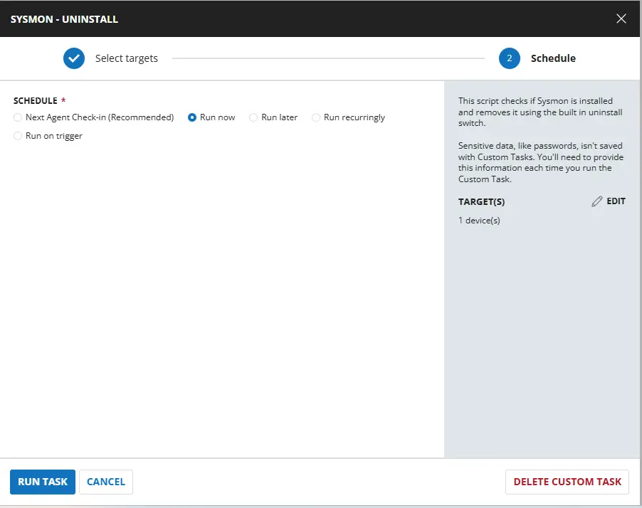
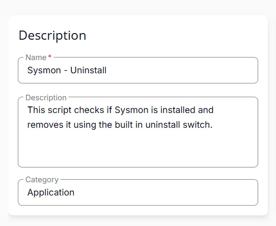
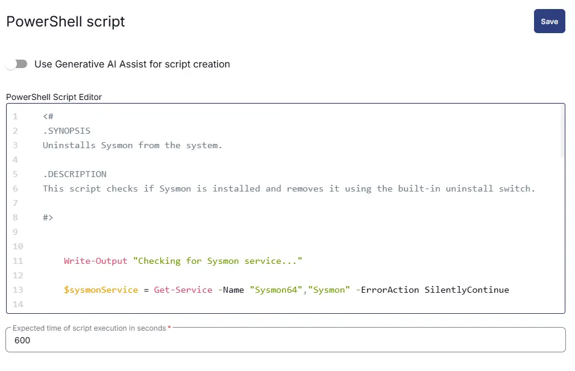
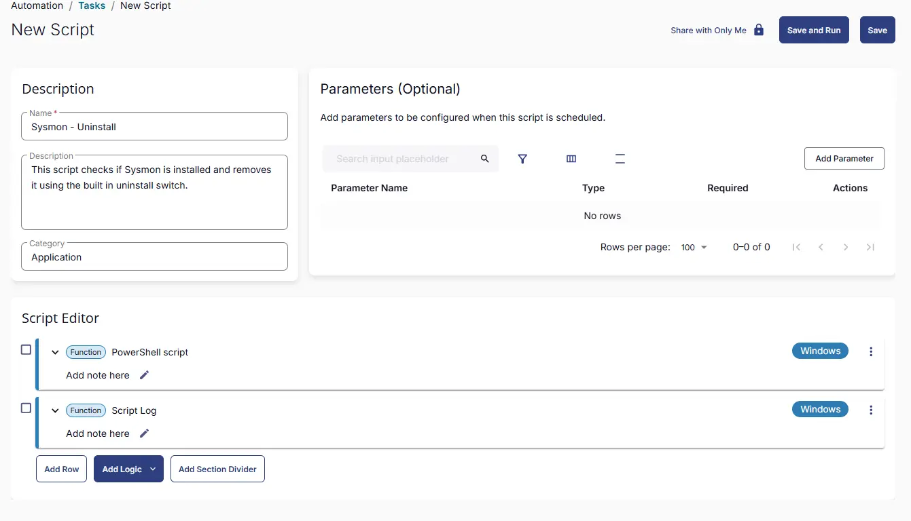

## Summary
This script checks if Sysmon is installed and removes it using the built in uninstall switch.

## Sample Run




## Dependencies

- [Solution - Sysmon Solution ](/docs/2db51f41-1313-46c4-81f1-8c67ed578b73) 


## Task Creation

### Script Details

#### Step 1

Navigate to `Automation` ➞ `Tasks`  


#### Step 2

Create a new `Script Editor` style task by choosing the `Script Editor` option from the `Add` dropdown menu  


The `New Script` page will appear on clicking the `Script Editor` button:  


#### Step 3

Fill in the following details in the `Description` section:  

**Name:** `Sysmon - Uninstall`  
**Description:** `This script checks if Sysmon is installed and removes it using the built in uninstall switch.`  
**Category:** `Application`




### Script Editor

Click the `Add Row` button in the `Script Editor` section to start creating the script  


A blank function will appear:  


#### Row 1 Function: `PowerShell Script`

Search and select the `PowerShell Script` function.  
 
  

The following function will pop up on the screen:  
  

Paste in the following PowerShell script and set the `Expected time of script execution in seconds` to `600` seconds. Click the `Save` button.

```powershell
<#
.SYNOPSIS
Uninstalls Sysmon from the system.

.DESCRIPTION
This script checks if Sysmon is installed and removes it using the built-in uninstall switch.

#>


    Write-Output "Checking for Sysmon service..."

    $sysmonService = Get-Service -Name "Sysmon64","Sysmon" -ErrorAction SilentlyContinue

    if ($sysmonService) {
        Write-Output "Sysmon detected. Attempting uninstall..."

        # Try Sysmon64 first, fallback to Sysmon
        if (((Get-CimInstance Win32_OperatingSystem).OSArchitecture) -match '64') {
            $sysmonExePaths = @(
                "$env:SystemRoot\System32\Sysmon64.exe",
                "$env:SystemRoot\Sysmon64.exe"
            )
        }else {
               $sysmonExePaths = @(
                "$env:SystemRoot\System32\Sysmon.exe",
                "$env:SystemRoot\Sysmon.exe"  
            )
        }

        $found = $false

        foreach ($path in $sysmonExePaths) {
            if (Test-Path $path) {
                Write-Output "Using: $path"
                & $path -u force
                $found = $true
                break
            }
        }

        if (-not $found) {
            Write-Warning "Sysmon executable not found. Attempting service removal..."

            sc.exe stop Sysmon | Out-Null
            sc.exe delete Sysmon | Out-Null
            sc.exe stop Sysmon64 | Out-Null
            sc.exe delete Sysmon64 | Out-Null
        }
    }
    else {
        Write-Output "Sysmon is not installed."
    }

```



### Row 2 Function: Script Log

Add a new row by clicking the `Add Row` button.  
  

A blank function will appear.  
  

Search and select the `Script Log` function.  
  
 

In the script log message, simply type `%output%` and click the `Save` button.  


## Save Task

Click the `Save` button at the top-right corner of the screen to save the script.  


## Completed Task




## Output

- Script Logs

## Changelog

### 2026-03-26

- Initial version of the document