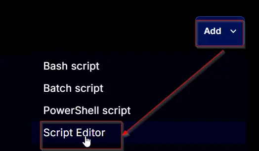

## Summary

This task installs Threatlocker on both Windows and Mac operating systems.

## Sample Run

  


## Dependencies

[CW RMM - Solution - Threatlocker Deployment](/docs/c9969bad-d2da-45ec-90fe-d6be82479ebc)

## Task Creation

Create a new `Script Editor` style script in the system to implement this task.  
  


**Name:** `Threatlocker Deployment`  
**Description:** `This script will check for ThreatLocker and attempt to install it if not present. It matches the organization to the client name; if no match is found, it will create the company for you. By default, servers will be installed into the Servers group, and workstations will be installed into the Workstations group.`  
**Category:** `Custom`  


## Task

Navigate to the Script Editor Section and start by adding a row. You can do this by clicking the `Add Row` button at the bottom of the script page.  


A blank function will appear.  


### Row 1 Function: Set Pre-Defined Variable

- Select `Set Pre-Defined Variable` function  


- Select `Custom Field`
- Input `Organization` as Variable name
- Select `Threatlocker_Organization_Name` custom field from the dropdown
- Click Save
- Limit this step to Windows OS by selecting `Windows` from the `Operating System` dropdown on the left side

### Row 2 Function: Set Pre-Defined Variable

- Select `Set Pre-Defined Variable` function  


- Select `Custom Field`
- Input `ThreatLockerAuthKey` as Variable name
- Select `ThreatLockerAuthKey` custom field from the dropdown
- Click Save
- Limit this step to Windows OS by selecting `Windows` from the `Operating System` dropdown on the left side

### Row 3 Function: PowerShell Script

Search and select the `PowerShell Script` function.  


The following function will pop up on the screen:  


Paste in the following PowerShell script and set the expected time of script execution to `600` seconds. Click the `Save` button.

```powershell
[Net.ServicePointManager]::SecurityProtocol = "Tls12"
$UniqueIdentifier='@ThreatLockerAuthKey@'
$organizationName = '@Organization@'

# Check if ThreatLocker is already installed
$service = Get-Service -Name ThreatLockerService -ErrorAction SilentlyContinue;
if ($service.Name -eq "ThreatLockerService" -and $service.Status -eq "Running") {
    return "Already Installed";
}

# Check if directory exists and create if not
if (!(Test-Path "C:/ProgramData/_automation/script/Threatlocker")) {
    mkdir "C:/ProgramData/_automation/script/Threatlocker";
}

# Check the OS architecture and download the correct installer
try {
    if ([Environment]::Is64BitOperatingSystem) {
        $downloadURL = "https://api.threatlocker.com/updates/installers/threatlockerstubx64.exe";
    } else {
        $downloadURL = "https://api.threatlocker.com/updates/installers/threatlockerstubx86.exe";
    }
    $localInstaller = "C:/ProgramData/_automation/script/Threatlocker/ThreatLockerStub.exe";
    Invoke-WebRequest -Uri $downloadURL -OutFile $localInstaller -UseBasicParsing;
} catch {
    Write-Output "Failed to download the installer";
    return;
}

# Attempt install
try {
    & "C:/ProgramData/_automation/script/Threatlocker/ThreatLockerStub.exe" key=$UniqueIdentifier Company=$organizationName
} catch {
    Write-Output "Installation Failed";
    return
}

# Verify install
$service = Get-Service -Name ThreatLockerService -ErrorAction SilentlyContinue;
if ($service.Name -eq "ThreatLockerService" -and $service.Status -eq "Running") {
    Write-Output "Installation successful";
    return;
} else {
    # Check the OS type
    $osInfo = Get-CimInstance -ClassName Win32_OperatingSystem
    if ($osInfo.ProductType -ne 1) {
        Write-Output "Installation Failed";
        return
    }
}
```

  
Limit this step to `Windows OS` only.

### Row 4: Function: Script Log

In the script log message, simply type `%output%` so that the script will send the results of the PowerShell script above to the output on the Automation tab for the target device.  


Limit this step to `Windows OS` only.

### Row 5 Function: Set Pre-Defined Variable

- Select `Set Pre-Defined Variable` function  


- Select `Custom Field`
- Input `ThreatLockerMacGroupKey` as Variable name
- Select `ThreatLockerMacGroupKey` custom field from the dropdown
- Click Save
- Limit this step to Windows OS by selecting `MacOS` from the `Operating System` dropdown on the left side

### Row 6 Function: Command Prompt (CMD) Script

Search and select the `Command Prompt (CMD) Script` function.  


The following function will pop up on the screen:  


Paste in the following bash script and set the expected time of script execution to `600` seconds. Click the `Save` button.

```bash
#!/bin/bash
GroupKey="@ThreatLockerMacGroupKey@"
#install
if [ ! -d /Applications/Threatlocker.app ]
then
    curl --output-dir "/Applications" -O https://updates.threatlocker.com/repository/mac/1.0/Threatlocker.app.zip
    echo "Downloading Threatlocker"
    open /Applications/Threatlocker.app.zip
    sleep 5
    osascript -e 'quit app "Finder"'
    rm -d /Applications/Threatlocker.app.zip
    if [ ! -d /Applications/Threatlocker.app ]
    then
        echo "Not able to download the file"
        exit 1
    else
        open /Applications/ThreatLocker.app --args -groupKey $GroupKey
        echo "Installing Threatlocker"
        sleep 15
        echo "Verifying Group Key"
        sleep 15
        if [ ! -d /Library/Application/Support/Threatlocker ]
        then
            echo "GroupKey is Invalid"
            exit 1
        else
            echo "Threatlocker Installed"
            exit 0
        fi
    fi
fi
```

  
Limit this step to `Mac OS` only.

### Row 7: Function: Script Log

In the script log message, simply type `%output%` so that the script will send the results of the bash script above to the output on the Automation tab for the target device.  


Limit this step to `Mac OS` only.

## Completed Task


## Implementation

This task has to be scheduled on **`[CW RMM - Dynamic Group - Deploy Threatlocker](/docs/8645a522-a9e3-4755-a498-32c2904e51c6)`** group for auto deployment. The script can also be run manually if required.

Go to Automations > Tasks.  
Search for Threatlocker Deployment.  
Then click on Schedule and provide the parameters detail as necessary for the script completion.  


## Output

Script Log

