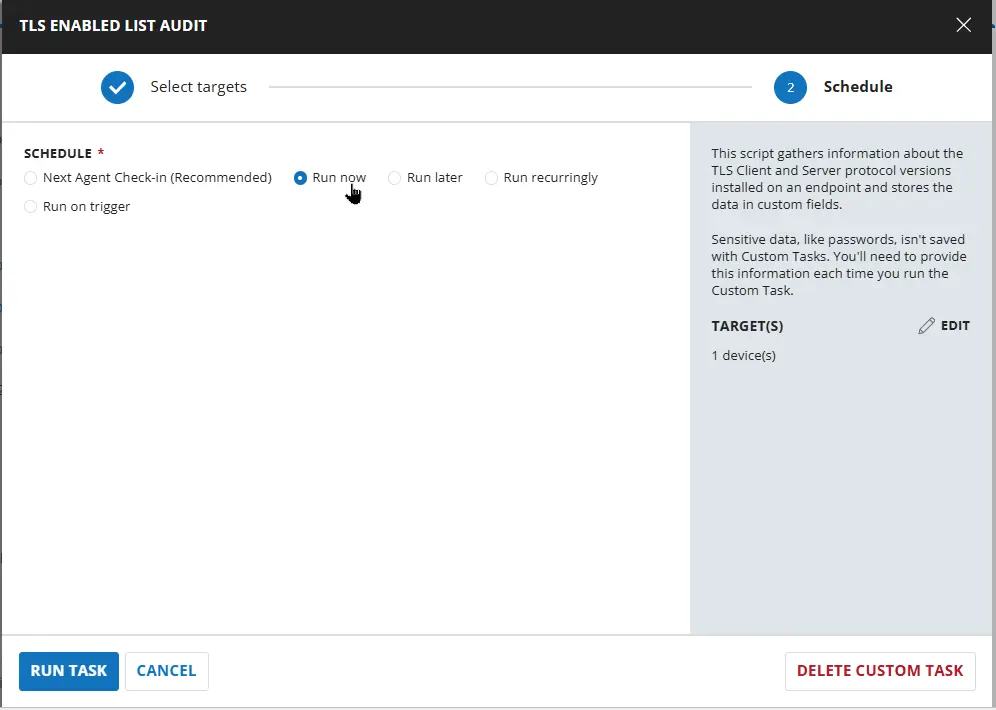
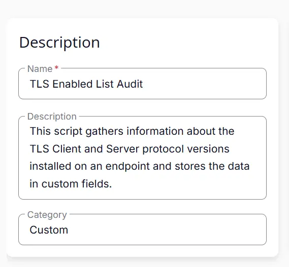
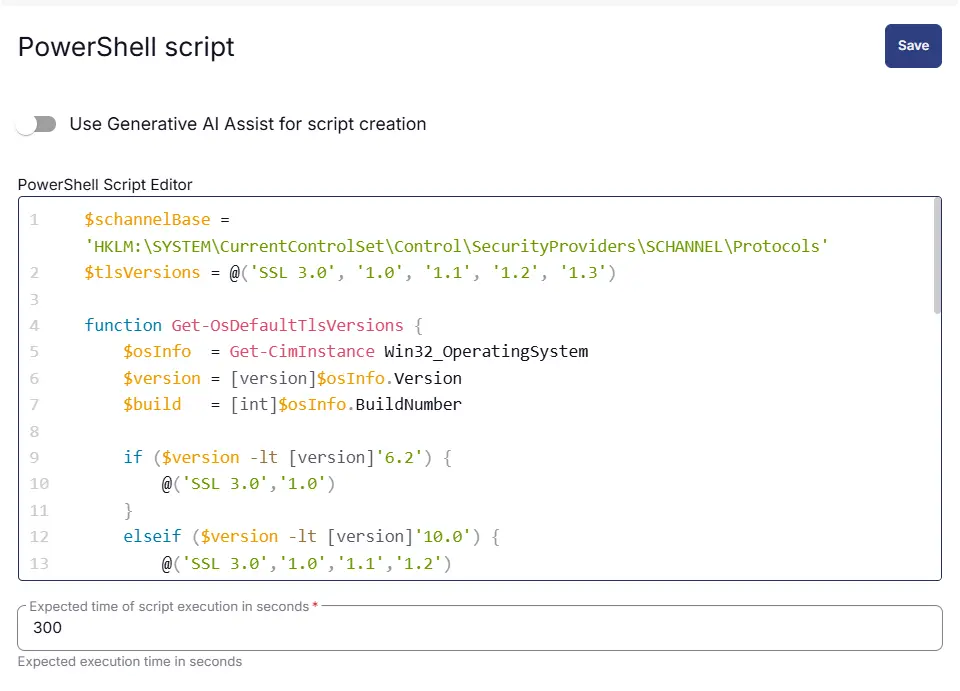
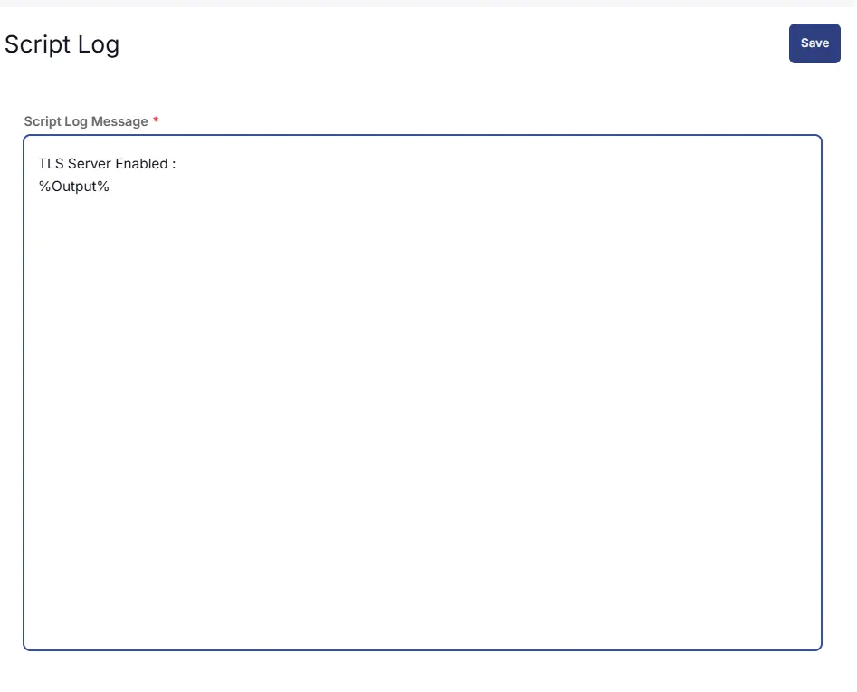
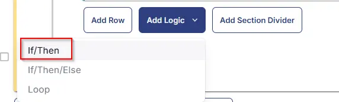
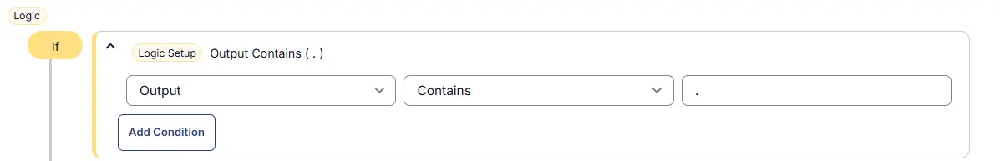
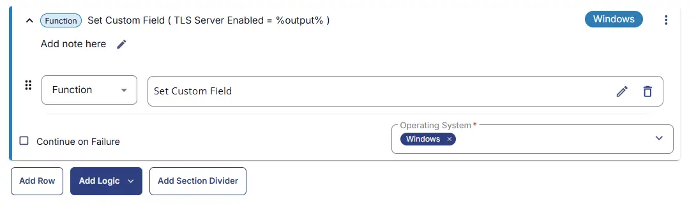
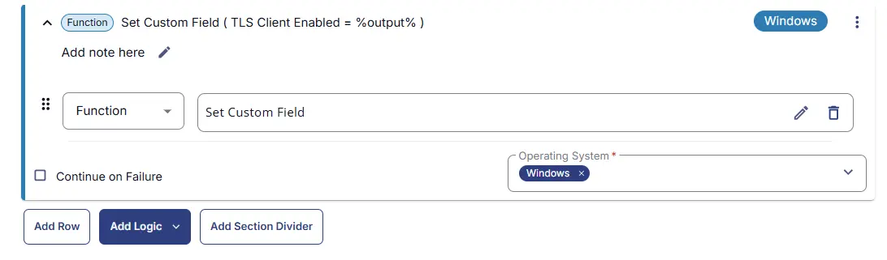
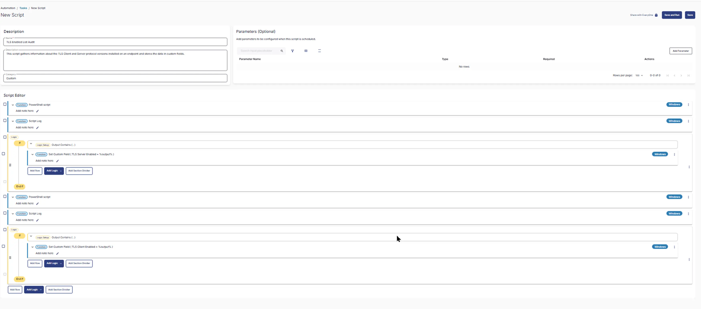
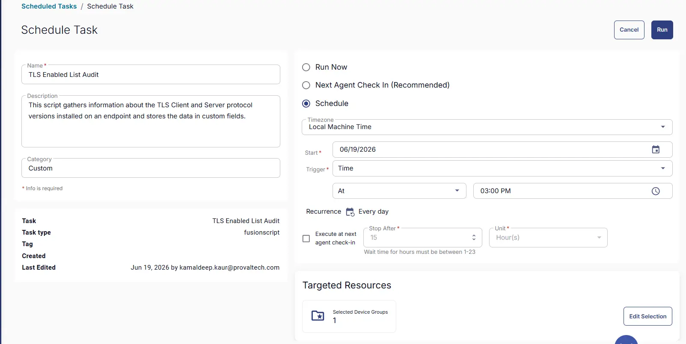

## Summary
This script gathers information about the TLS Client and Server protocol versions installed on an endpoint and stores the data in custom fields.

## Sample Run



## Dependencies


## Task Creation

### Script Details

#### Step 1

Navigate to `Automation` ➞ `Tasks`  


#### Step 2

Create a new `Script Editor` style task by choosing the `Script Editor` option from the `Add` dropdown menu  


The `New Script` page will appear on clicking the `Script Editor` button:  


#### Step 3

Fill in the following details in the `Description` section:  

**Name:** `TLS Enabled List Audit`  
**Description:** `This script gathers information about the TLS Client and Server protocol versions installed on an endpoint and stores the data in custom fields.`  
**Category:** `Custom`



### Script Editor

Click the `Add Row` button in the `Script Editor` section to start creating the script  


A blank function will appear:  


#### Row 1 Function: `PowerShell Script`

Search and select the `PowerShell Script` function.  
 
  

The following function will pop up on the screen:  
  

Paste in the following PowerShell script and set the `Expected time of script execution in seconds` to `300` seconds. Click the `Save` button.

```powershell
$schannelBase = 'HKLM:\SYSTEM\CurrentControlSet\Control\SecurityProviders\SCHANNEL\Protocols'
$tlsVersions = @('SSL 3.0', '1.0', '1.1', '1.2', '1.3')

function Get-OsDefaultTlsVersions {
    $osInfo  = Get-CimInstance Win32_OperatingSystem
    $version = [version]$osInfo.Version
    $build   = [int]$osInfo.BuildNumber

    if ($version -lt [version]'6.2') {
        @('SSL 3.0','1.0')
    }
    elseif ($version -lt [version]'10.0') {
        @('SSL 3.0','1.0','1.1','1.2')
    }
    elseif ($build -ge 20348) {
        @('1.0','1.1','1.2','1.3')
    }
    else {
        @('1.0','1.1','1.2')
    }
}

$osDefaults = Get-OsDefaultTlsVersions

$enabledProtocols = foreach ($version in $tlsVersions) {
    $path = if ($version -eq 'SSL 3.0') {
        "$schannelBase\SSL 3.0\Server"
    }
    else {
        "$schannelBase\TLS $version\Server"
    }

    $reg = Get-ItemProperty -Path $path -ErrorAction SilentlyContinue

    $enabled = if ($null -ne $reg) {
        ($reg.Enabled -ge 1 -or $reg.DisabledByDefault -eq 0)
    }
    else {
        $osDefaults -contains $version
    }

    if ($enabled) { $version }
}

$enabledProtocols -join ', '
```



### Row 2 Function: Script Log

Add a new row by clicking the `Add Row` button.  
  

A blank function will appear.  
  

Search and select the `Script Log` function.  
  
 

In the script log message, simply type `TLS Server Enabled : %Output%` and click the `Save` button.  


#### Row 3 Logic: If/Then

Click Add Logic and select `If/Then`



#### Row 3a Condition: Output Contains

In the IF part, enter `.` in the right box of the "Output Contains" part.



#### Row 3b Function: Set Custom Field

Add a new row by clicking on the Add row button. Set Custom Field 'TLS Server Enabled' to '%output%'.



#### Row 4 Function: `PowerShell Script`

Search and select the `PowerShell Script` function.  
 
  

The following function will pop up on the screen:  
  

Paste in the following PowerShell script and set the `Expected time of script execution in seconds` to `300` seconds. Click the `Save` button.

```powershell
$schannelBase = 'HKLM:\SYSTEM\CurrentControlSet\Control\SecurityProviders\SCHANNEL\Protocols'
$tlsVersions = @('SSL 3.0', '1.0', '1.1', '1.2', '1.3')

function Get-OsDefaultTlsVersions {
    $osInfo  = Get-CimInstance Win32_OperatingSystem
    $version = [version]$osInfo.Version
    $build   = [int]$osInfo.BuildNumber

    if ($version -lt [version]'6.2') {
        @('SSL 3.0','1.0')
    }
    elseif ($version -lt [version]'10.0') {
        @('SSL 3.0','1.0','1.1','1.2')
    }
    elseif ($build -ge 20348) {
        @('1.0','1.1','1.2','1.3')
    }
    else {
        @('1.0','1.1','1.2')
    }
}

$osDefaults = Get-OsDefaultTlsVersions

$enabledProtocols = foreach ($version in $tlsVersions) {
    $path = if ($version -eq 'SSL 3.0') {
        "$schannelBase\SSL 3.0\Client"
    }
    else {
        "$schannelBase\TLS $version\Client"
    }

    $reg = Get-ItemProperty -Path $path -ErrorAction SilentlyContinue

    $enabled = if ($null -ne $reg) {
        ($reg.Enabled -ge 1 -or $reg.DisabledByDefault -eq 0)
    }
    else {
        $osDefaults -contains $version
    }

    if ($enabled) { $version }
}

$enabledProtocols -join ', '
```


### Row 5 Function: Script Log

Add a new row by clicking the `Add Row` button.  
  

A blank function will appear.  
  

Search and select the `Script Log` function.  
  
 

In the script log message, simply type `TLS Client Enabled : %Output%` and click the `Save` button.  


#### Row 6 Logic: If/Then

Click Add Logic and select `If/Then`


#### Row 6a Condition: Output Contains

In the IF part, enter `.` in the right box of the "Output Contains" part.


#### Row 6b Function: Set Custom Field

Add a new row by clicking on the Add row button. Set Custom Field 'TLS Client Enabled' to '%output%'.



## Save Task

Click the `Save` button at the top-right corner of the screen to save the script.  


## Completed Task



## Deployment

This task has to be scheduled on the `Windows Machines` group for auto deployment. The script can also be run manually if required.

Go to Automations > Tasks.  
Search for SentinelOne Deployment.  
Then click on Schedule and provide the parameters detail as necessary for the script completion.



## Output

- Script Log
- Custom Field

## Changelog

### 2026-06-18

- Initial version of the document
