## Summary

This task is to create and manage toast notifications with customizable options, including images, buttons, and scenarios for different use cases. It is CW RMM implementation of the agnostic script [Invoke-ToastNotification.ps1](/docs/426118d9-ff83-444e-9744-30a0e26cb490).

## Sample Run
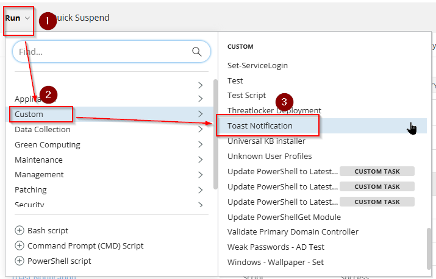
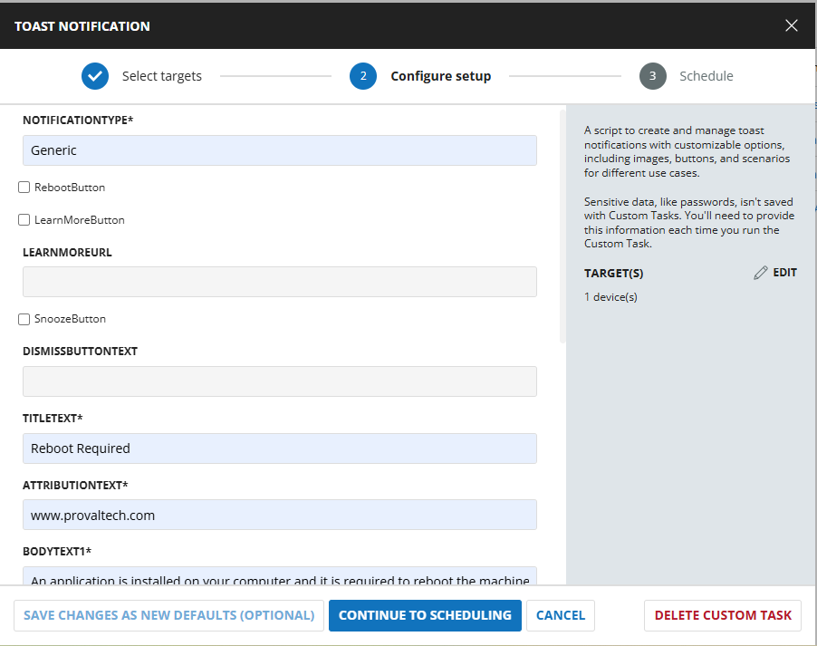

## Dependencies
[Invoke-ToastNotification](/docs/426118d9-ff83-444e-9744-30a0e26cb490)

## User Parameters
| Parameter                  | Example                         | Accepted Values             | Required | Default       | Type        | Description              |
|----------------------------|--------------------------------------------------------------------------------------------------------------|----------------------------------------------------------------------------------------------------------|----------|---------------|-------------|-----------------------------------------------------------------------------------------------------------------------------------------------------------------------------------------------------------------------------------|
| NotificationType           | Generic                         | Generic<br /> PendingRebootUptime<br /> PendingRebootCheck<br /> ADPasswordExpiration                      | True     |               | Text        | The type of notification to send. The accepted values for NotificationType are generic, PendingRebootUptime, PendingRebootCheck, and ADPasswordExpiration. It is a mandatory variable.<br /><br />**Generic**: Enables a static, generic toast notification.<br /><br />**PendingRebootUptime**: Displays a toast notification reminding users to restart their system after exceeding the maximum uptime.<br /><br />**PendingRebootCheck**: Displays a toast notification when a pending reboot is detected through the system registry or WMI.<br /><br />**ADPasswordExpiration**: Sends a toast notification to users when their Active Directory password is nearing expiration. |
| RebootButton               | Unmarked                        |                             | False    | False         | Flag        | Select it to enable the `Reboot` button in the notification. RebootButton is available for `Generic`, `PendingRebootUptime`, and `PendingRebootCheck` notification types.                    |
| LearnMoreButton            | Unmarked                        |                             | False    | False         | Flag        | Select it to enable the `Learn More` button in the notification.                       |
| LearnMoreUrl               | [https://www.provaltech.com](https://www.provaltech.com)                                                     |                             | False    |               | Text        | Set the URL to navigate by clicking the `Learn More` button in the notification. `LearnMoreButton` should be selected to allow the `LearnMoreUrl` parameter.                                |
| SnoozeButton               | Unmarked                        |                             | False    | False         | Flag        | Select it to enable the `Snooze` button in the notification.<br /><br />Note: The `LearnMoreButton` and the `SnoozeButton` cannot be enabled simultaneously.                                    |
| DismissButtonText          | Dismiss                         |                             | False    | Dismiss       | Text        | Customizes the text of the dismiss button. Default is "Dismiss."                       |
| TitleText                  | Reboot Required                 |                             | True     |               | Text        | Sets the title of the notification. It is mandatory to set this parameter.             |
| AttributionText            | [https://www.provaltech.com](https://www.provaltech.com)                                                     |                             | True     |               | Text        | Displays attribution text, such as a company name or website, for authenticity. If left blank, the task will use the client name of the agent in attribution text.                          |
| BodyText1                  | An application is installed on your computer and it is required to reboot the machine ASAP.                   |                             | True     |               | Text        | The main text content of the notification body. It is mandatory to set this parameter.  |
| BodyText2                  | Ignoring the notification is not suggested     |                             | False    |               | Text        | Secondary text content is displayed below BodyText1.                                   |
| LogoImage                  | [https://labtech.provaltech.com/labtech/transfer/images/alogo.jpg](https://labtech.provaltech.com/labtech/transfer/images/alogo.jpg) |                             | False    |               | Text        | Specify the URL or path for the logo image in the notification.                        |
| HeroImage                  | [https://labtech.provaltech.com/labtech/transfer/images/alogo.jpg](https://labtech.provaltech.com/labtech/transfer/images/alogo.jpg) |                             | False    |               | Text        | Specify the URL or path for the hero image displayed at the top of the notification.   |
| Deadline                   | 2025-02-05 08:00:00             | yyyy-MM-dd HH:mm:ss          | False    | Current +14days | Text        | Sets the deadline for the notification. Format: yyyy-MM-dd HH:mm:ss.                   |
| MaxUptimeDays              | 30                              |                             | False    | 30            | NumberValue | Defines the maximum uptime (in days) for the `PendingRebootUptime` NotificationType parameter. Default is 30 days.                                   |
| ADPasswordExpirationDays   | 7                               |                             | False    | 7             | NumberValue | Number of days before password expiration when reminders should start. It is available for the `ADPasswordExpiration` NotificationType parameter. Default is 7 days.   |
| Repeat                     | Once                            | Once, Hourly, XXMinutes, XXHours, Daily, XXDays.                  | False    | Once          | Text        | Specifies how frequently the notification should repeat. Options: Once, Hourly, XXMinutes, XXHours, Daily, XXDays. |
| NotificationAppName        | Connectwise RMM  |  | False    | Windows PowerShell          | Text        | Specifies the name of the application that will display the notification. |


**NOTE: For All String Parameters (Specifically for TitleText, BodyText1, and BodyText2)  
Keep the message under 300 characters.  
Avoid using single quotations within the message. If it's necessary, then escape the quotation with another one.**

**Example:**  
**user's --> Incorrect**  
**user''s --> correct**

## Task Creation

### Script Details

Create a new `Script Editor` style script in the system to implement this Task.

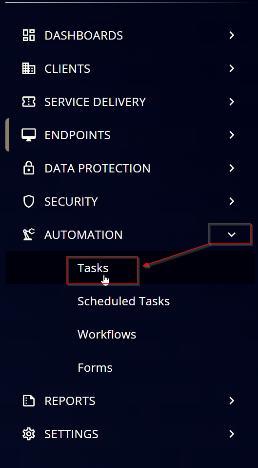


**Name:** `Toast Notification`

**Description:** `A script to create and manage toast notifications with customizable options, including images, buttons, and scenarios for different use cases.`

**Category:** `custom`

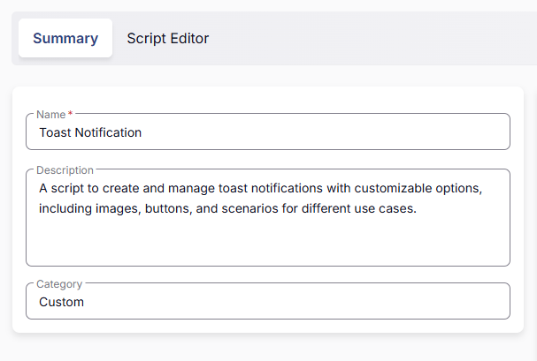

### Parameters

#### NotificationType

Add a new parameter by clicking the `Add Parameter` button present at the top-right corner of the screen.

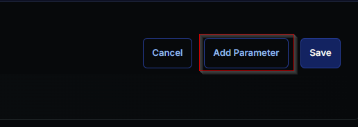

This screen will appear. 


- Set `NotificationType` in the `Parameter Name` field.

- Select `Text String` from the `Parameter Type` dropdown menu.

- Toggle `Required` Field.

- Click the `Save` button.

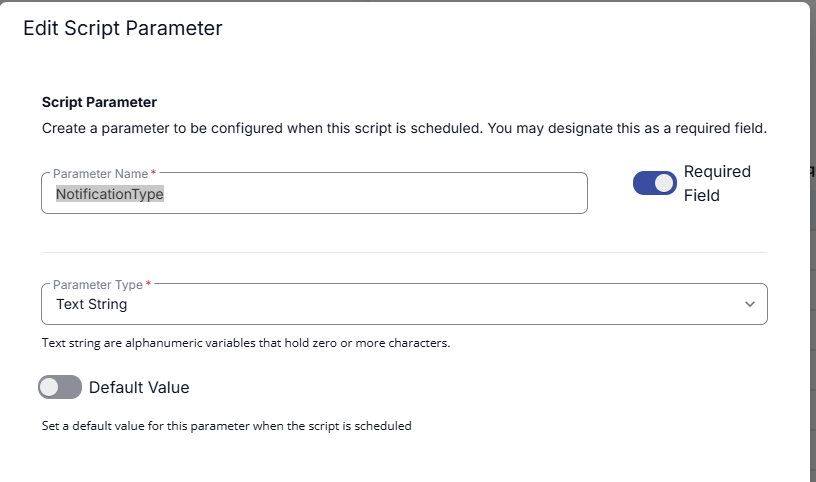

It will ask for the confirmation to proceed. Click the `Confirm` button to create the parameter.


#### RebootButton

Add another parameter by clicking the `Add Parameter` button present at the top-right corner of the screen.


- Set `RebootButton` in the `Parameter Name` field.

- Select `Flag` from the `Parameter Type` dropdown menu.

- Set Default Value as `False`.

- Click the `Save` button.

- Click the `Confirm` button to create the parameter.


#### LearnMoreButton

Add another parameter by clicking the `Add Parameter` button present at the top-right corner of the screen.


- Set `LearnMoreButton` in the `Parameter Name` Field.

- Select `Flag` from the `Parameter Type` dropdown menu.

- Set Default Value as `False`.

- Click the `Save` button.

- Click the `Confirm` button to create the parameter.

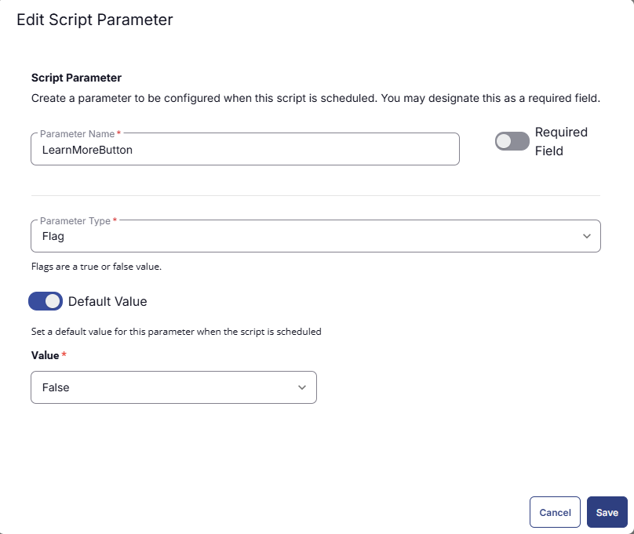

#### LearnMoreUrl

Add another parameter by clicking the `Add Parameter` button present at the top-right corner of the screen.


- Set `LearnMoreUrl` in the `Parameter Name` field.

- Select `Text String` from the `Parameter Type` dropdown menu.

- Click the `Save` button.

- Click the `Confirm` button to create the parameter.


#### SnoozeButton

Add another parameter by clicking the `Add Parameter` button present at the top-right corner of the screen.


- Set `SnoozeButton` in the `Parameter Name` Field.

- Select `Flag` from the `Parameter Type` dropdown menu.

- Set Default Value as `False`.

- Click the `Save` button.

- Click the `Confirm` button to create the parameter.


#### DismissButtonText

Add another parameter by clicking the `Add Parameter` button present at the top-right corner of the screen.


- Set `DismissButtonText` in the `Parameter Name` field.

- Select `Text String` from the `Parameter Type` dropdown menu.

- Click the `Save` button.

- Click the `Confirm` button to create the parameter.


#### TitleText

Add another parameter by clicking the `Add Parameter` button present at the top-right corner of the screen.


- Set `TitleText` in the `Parameter Name` field.

- Select `Text String` from the `Parameter Type` dropdown menu.

- Toggle `Required` Field.

- Click the `Save` button.

- Click the `Confirm` button to create the parameter.


#### AttributionText

Add another parameter by clicking the `Add Parameter` button present at the top-right corner of the screen.


- Set `AttributionText` in the `Parameter Name` field.

- Select `Text String` from the `Parameter Type` dropdown menu.

- Click the `Save` button.

- Click the `Confirm` button to create the parameter.

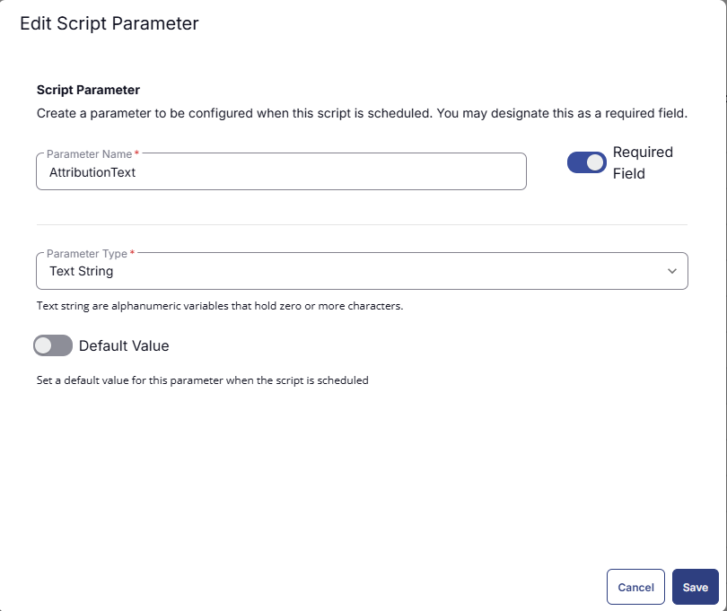

#### BodyText1

Add another parameter by clicking the `Add Parameter` button present at the top-right corner of the screen.


- Set `BodyText1` in the `Parameter Name` field.

- Select `Text String` from the `Parameter Type` dropdown menu.

- Toggle `Required` Field.

- Click the `Save` button.

- Click the `Confirm` button to create the parameter.


#### BodyText2

Add another parameter by clicking the `Add Parameter` button present at the top-right corner of the screen.


- Set `BodyText2` in the `Parameter Name` field.

- Select `Text String` from the `Parameter Type` dropdown menu.

- Click the `Save` button.

- Click the `Confirm` button to create the parameter.


#### LogoImage

Add another parameter by clicking the `Add Parameter` button present at the top-right corner of the screen.


- Set `LogoImage` in the `Parameter Name` field.

- Select `Text String` from the `Parameter Type` dropdown menu.

- Click the `Save` button.

- Click the `Confirm` button to create the parameter.

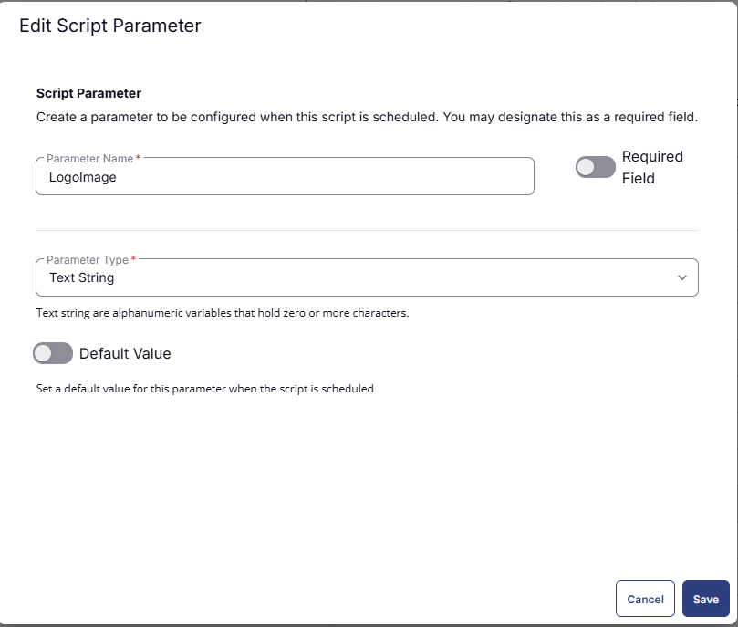

#### HeroImage

Add another parameter by clicking the `Add Parameter` button present at the top-right corner of the screen.


- Set `HeroImage` in the `Parameter Name` field.

- Select `Text String` from the `Parameter Type` dropdown menu.

- Click the `Save` button.

- Click the `Confirm` button to create the parameter.


#### Deadline

Add another parameter by clicking the `Add Parameter` button present at the top-right corner of the screen.


- Set `Deadline` in the `Parameter Name` field.

- Select `Text String` from the `Parameter Type` dropdown menu.

- Click the `Save` button.

- Click the `Confirm` button to create the parameter.


#### MaxUptimeDays

Add another parameter by clicking the `Add Parameter` button present at the top-right corner of the screen.


- Set `MaxUptimeDays` in the `Parameter Name` field.

- Select `Number Value` from the `Parameter Type` dropdown menu.

- Click the `Save` button.

- Click the `Confirm` button to create the parameter.


#### ADPasswordExpirationDays

Add another parameter by clicking the `Add Parameter` button present at the top-right corner of the screen.


- Set `ADPasswordExpirationDays` in the `Parameter Name` field.

- Select `Number Value` from the `Parameter Type` dropdown menu.

- Click the `Save` button.

- Click the `Confirm` button to create the parameter.


#### Repeat

Add another parameter by clicking the `Add Parameter` button present at the top-right corner of the screen.


- Set `Repeat` in the `Parameter Name` field.

- Select `Text String` from the `Parameter Type` dropdown menu.

- Set `Default Value` to `Once`.

- Click the `Save` button.

- Click the `Confirm` button to create the parameter.


#### NotificationAppName

Add another parameter by clicking the `Add Parameter` button present at the top-right corner of the screen.


- Set `NotificationAppName` in the `Parameter Name` field.

- Select `Text String` from the `Parameter Type` dropdown menu.

- Click the `Save` button.

- Click the `Confirm` button to create the parameter.


#### Parameters block: 
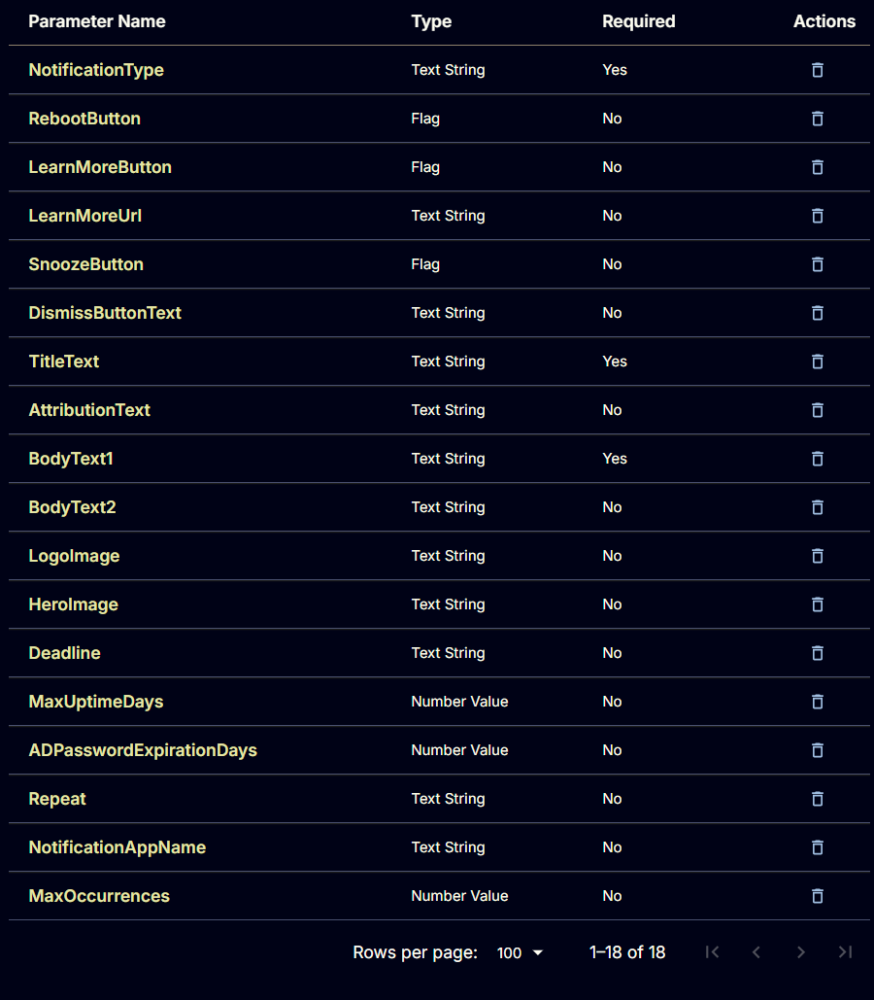

### Task

Navigate to the Script Editor Section and start by adding a row. You can do this by clicking the `Add Row` button at the bottom of the script page.


A blank function will appear.


#### Row 1 Function: PowerShell Script

Search and select the `PowerShell Script` function.

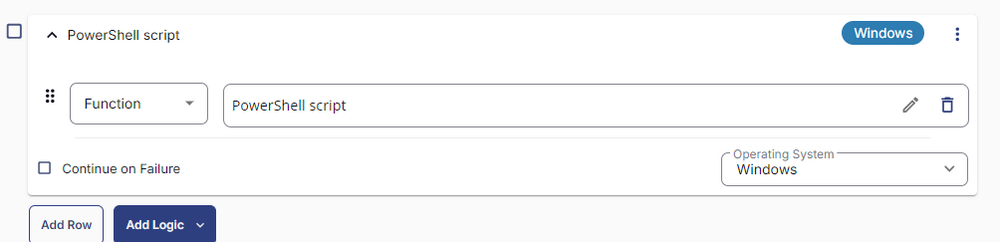

The following function will pop up on the screen: 


Paste in the following PowerShell script and set the expected time of script execution to `900` seconds. Click the `Save` button.

```PowerShell
if ( '@NotificationType@' -notin ('Generic', 'PendingRebootUptime', 'PendingRebootCheck', 'ADPasswordExpiration') ) {
    return "NotificationType can either be 'Generic', 'PendingRebootUptime', 'PendingRebootCheck', 'ADPasswordExpiration'."
} else {
    $NotificationType = '@NotificationType@'
}

if (('@RebootButton@' -match '1|Yes|True|Y') -and ( $NotificationType -in ('Generic', 'PendingRebootUptime', 'PendingRebootCheck'))) {
    $RebootButton = $true
} else {
    $RebootButton = $false
}

if ( '@LearnMoreButton@' -match '1|Yes|True|Y') {
    $LearnMoreButton = $true
} else {
    $LearnMoreButton = $false
}

if (( '@LearnMoreUrl@' -match ('^[hf]t{1,2}ps{0,1}') ) -and ( $LearnMoreButton -eq $true)) {
    $LearnMoreUrl = '@LearnMoreUrl@'
} else {
    $LearnMoreUrl = ''
}

if (( '@SnoozeButton@' -match '1|Yes|True|Y') -and ($LearnMoreButton -eq $False)) {
    $SnoozeButton = $true
} else {
    $SnoozeButton = $false
}

if ((('@DismissButtonText@').length -le 2) -or ('@DismissButtonText@' -match 'DismissButtonText')) {
    $DismissButtonText = ''
} else {
    $DismissButtonText = '@DismissButtonText@'
}

if ( (('@TitleText@').length -le 2 ) -or ('@TitleText@' -match 'TitleText')) {
    return 'TitleText is mandatory to Set the title of the notification'
} else { 
    $TitleText = '@TitleText@'
}

if ( (('@AttributionText@').length -le 2) -or ('@AttributionText@' -match 'AttributionText')) {
    $AttributionText = '%companyname%'
} else {
    $AttributionText = '@AttributionText@'
}

if ((('@BodyText1@').length -le 2 ) -or ('@BodyText1@' -match 'BodyText1')){
    return 'BodyText1 is mandatory to Set the main text content of the notification body'
} else {
    $BodyText1 = '@BodyText1@'
}

if ((('@BodyText2@').length -le 2) -or ('@BodyText2@' -match 'BodyText2')) {
    $BodyText2 = ''
} else {
    $BodyText2 = '@BodyText2@'
}

if ( ('@LogoImage@').length -gt 2) {
    $LogoImage = '@LogoImage@'
} else {
    $LogoImage = ''
}

if ( ('@HeroImage@').length -gt 2) {
    $HeroImage = '@HeroImage@'
} else {
    $HeroImage = ''
}

if ('@Deadline@' -match '\d{4}-\d{2}-\d{2}') {
    $Deadline = [datetime]'@Deadline@'
} else {
    $Deadline = ''
}

if (( '@MaxUptimeDays@' -match '^[0-9]{1,}$' ) -and (('@MaxUptimeDays@').length -gt 2) -and ($NotificationType -match 'PendingRebootUptime')) {
    $MaxUptimeDays = '@MaxUptimeDays@'
} else {
    $MaxUptimeDays = ''
}

if (( '@ADPasswordExpirationDays@' -match '^[0-9]{1,}$' ) -and (('@ADPasswordExpirationDays@').length -gt 2) -and (  $NotificationType -match 'ADPasswordExpiration')) {
    $ADPasswordExpirationDays = '@ADPasswordExpirationDays@'
} else {
    $ADPasswordExpirationDays = ''
}

if (( '@Repeat@' -match '^(Once|Hourly|[0-9]{1,}Minutes|[0-9]{1,}Hours|Daily|[0-9]{1,}Days|Weekly|Monthly|AtLogon)$' ) -and (('@Repeat@').length -gt 2) ) {
    $Repeat = '@Repeat@'
} else {
    $Repeat = 'Once'
}

if ('@NotificationAppName@' -match '[0-9A-z]{1,}' -and (('@NotificationAppName@').length -gt 2) -and ('@NotificationAppName@' -notmatch 'NotificationAppName')) {
    $NotificationAppName = '@NotificationAppName@'
} else {
    $NotificationAppName = ''
}

$Parameters = @{
    TitleText = $TitleText
    BodyText1 = $BodyText1
    Repeat = $Repeat
}

if ($RebootButton -eq $true) { $parameters.Add('RebootButton', $RebootButton) }
if ($LearnMoreButton -eq $true) { $parameters.Add('LearnMoreButton', $LearnMoreButton) }
if ($LearnMoreUrl -ne '') { $parameters.Add('LearnMoreUrl', $LearnMoreUrl) }
if ($SnoozeButton -eq $true) { $parameters.Add('SnoozeButton', $SnoozeButton) }
if ($DismissButtonText -ne '') { $parameters.Add('DismissButtonText', $DismissButtonText) }
if ($AttributionText -ne '') { $parameters.Add('AttributionText', $AttributionText) }
if ($BodyText2 -ne '') { $parameters.Add('BodyText2', $BodyText2) }
if ($LogoImage -ne '') { $parameters.Add('LogoImage', $LogoImage) }
if ($HeroImage -ne '') { $parameters.Add('HeroImage', $HeroImage) }
if ($Deadline -ne '') { $parameters.Add('Deadline', $Deadline) }
if ($MaxUptimeDays -ne '') { $parameters.Add('MaxUptimeDays', $MaxUptimeDays) }
if ($ADPasswordExpirationDays -ne '') { $parameters.Add('ADPasswordExpirationDays', $ADPasswordExpirationDays) }
if ($NotificationAppName -ne '') { $parameters.Add('NotificationAppName', $NotificationAppName) }

#region Setup - Variables
$ProjectName = 'Invoke-ToastNotification'
[Net.ServicePointManager]::SecurityProtocol = [enum]::ToObject([Net.SecurityProtocolType], 3072)
$BaseURL = 'https://file.provaltech.com/repo'
$PS1URL = "$BaseURL/script/$ProjectName.ps1"
$WorkingDirectory = "C:\ProgramData\_automation\script\$ProjectName"
$PS1Path = "$WorkingDirectory\$ProjectName.ps1"
$Workingpath = $WorkingDirectory
$LogPath = "$WorkingDirectory\$ProjectName-log.txt"
$ErrorLogPath = "$WorkingDirectory\$ProjectName-Error.txt"
#endregion

#region Setup - Folder Structure
New-Item -Path $WorkingDirectory -ItemType Directory -ErrorAction SilentlyContinue | Out-Null

if (-not ( ( ( Get-Acl $WorkingDirectory ).Access | Where-Object { $_.IdentityReference -Match 'EveryOne' } ).FileSystemRights -Match 'FullControl' ) ) {
    $Acl = Get-Acl $WorkingDirectory; 
    $AccessRule = New-Object System.Security.AccessControl.FileSystemAccessRule('Everyone', 'FullControl', 'ContainerInherit, ObjectInherit', 'none', 'Allow'); 
    $Acl.AddAccessRule($AccessRule); Set-Acl  $WorkingDirectory $Acl 
}

$response = Invoke-WebRequest -Uri $PS1URL -UseBasicParsing

if (($response.StatusCode -ne 200) -and (!(Test-Path -Path $PS1Path))) {
    return "No pre-downloaded script exists and the script '$PS1URL' failed to download. Exiting."
} elseif ($response.StatusCode -eq 200) {
    Remove-Item -Path $PS1Path -ErrorAction SilentlyContinue
    [System.IO.File]::WriteAllLines($PS1Path, $response.Content)
}

if (!(Test-Path -Path $PS1Path)) {
    return 'An error occurred and the script was unable to be downloaded. Exiting.'
}
#endregionSetup

#region Execution
if ($Parameters) {
    $ScriptCommand = "& $PS1Path -$($NotificationType) @Parameters"
    Invoke-Expression $ScriptCommand
} else {
    & $PS1Path
}
#endregion

if ( !(Test-Path $LogPath) ) {
    return 'PowerShell Failure. A Security application seems to have restricted the execution of the PowerShell Script.'
}
if ( Test-Path $ErrorLogPath ) {
    $ErrorContent = ( Get-Content -Path $ErrorLogPath )
    return $ErrorContent
}
Get-Content -Path $LogPath
```

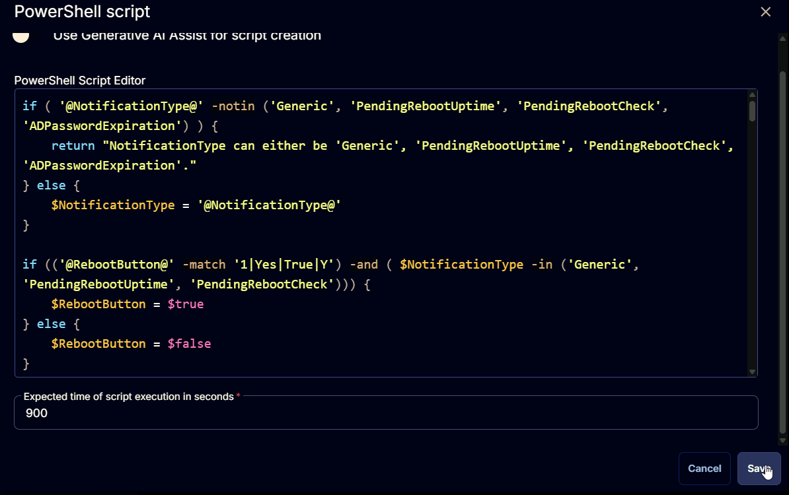

Flag the `Continue on Failure` button.


#### Row 2 Function: Script Log

Insert a new row by clicking the `Add Row` button.

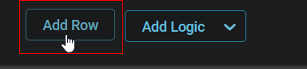

Select the `Script Log` function.

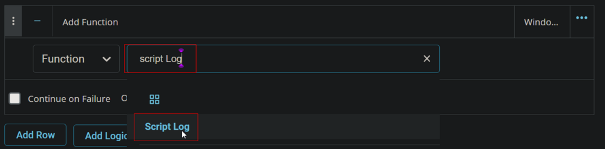


In the script log message, simply type `%output%` so that the script will send the results of the PowerShell script above to the output on the Automation tab for the target device.


## Completed Task

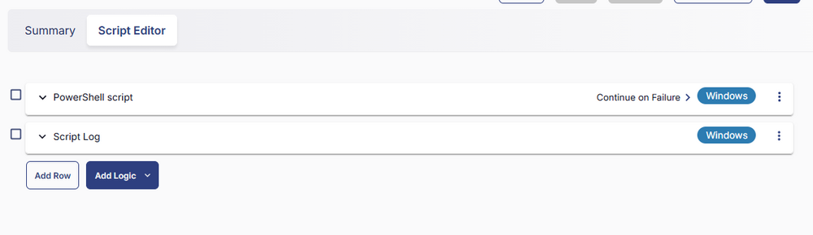

## Output

- Script Logss
