---
id: 'e34e18bc-efe5-4d35-90cc-968ab1bf2912'
slug: /e34e18bc-efe5-4d35-90cc-968ab1bf2912
title: 'Toast Notification'
title_meta: 'Toast Notification'
keywords: ['toast', 'notification', 'reminder', 'reboot', 'template']
description: 'This task is to create and manage toast notifications with customizable options, including images, buttons, and scenarios for different use cases.'
tags: ['reboot', 'windows']
draft: false
unlisted: false
last_update:
  date: 2025-11-27
---

## Summary

This task is to create and manage toast notifications with customizable options, including images, buttons, and scenarios for different use cases. It is CW RMM implementation of the agnostic script [Invoke-ToastNotification.ps1](/docs/426118d9-ff83-444e-9744-30a0e26cb490).

## Update Notice: 2025-07-22

- A script can be triggered via a button click within the notification.  
- The dismiss button is optional and can be excluded.  
- Notifications can be shown with or without buttons.
- New Parameters:  
  - RunScriptButton
  - RunScriptButtonText
  - ScriptPath
  - ScriptContext
  - ScriptStyle
  - HideDismissButton

## Sample Run

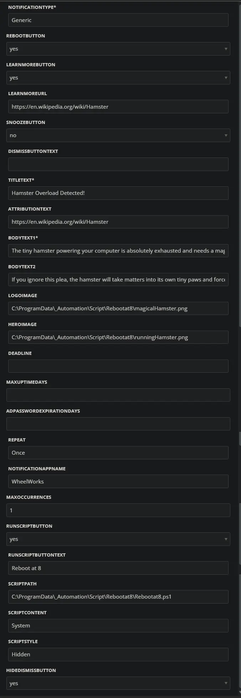

### Parameters

| ID  | Name                     | Value                                                                                                                                               |
|-----|--------------------------|-----------------------------------------------------------------------------------------------------------------------------------------------------|
| 1   | NotificationType         | Generic                                                                                                                                             |
| 2   | RebootButton             | 1                                                                                                                                                   |
| 3   | RunScriptButton          | 1  |
| 4   | RunScriptButtonText      | Reboot at 8 |
| 5   | ScriptPath               | C:\ProgramData\_Automation\Script\Rebootat8\Rebootat8.ps1 |
| 6   | ScriptContext            | System |
| 7   | ScriptStyle              | Hidden |
| 8   | LearnMoreButton          | 1                                                                                                                                                   |
| 9   | LearnMoreUrl             | https://en.wikipedia.org/wiki/Hamster                                                                                          |
| 10  | HideDismissButton        | 1                                                                                                                                             |
| 11   | TitleText                | Hamster Overload Detected!                                                                                                                          |
| 12  | AttributionText          | www.provaltech.com                                                                                                     |
| 13  | BodyText1                | The tiny hamster powering your computer is absolutely exhausted and needs a magical nap to keep things running smoothly! Please be kind, click ''Reboot Now'' to give it a break, or choose ''Reboot at 8'' to let it rest later tonight.   |
| 14  | BodyText2                | If you ignore this plea, the hamster will take matters into its own tiny paws and force a nap at 8 PM anyway. Let''s not push our luck with a tired rodent on a wheel!. |
| 15  | LogoImage                | C:\ProgramData\_Automation\Script\Rebootat8\magicalHamster.png                                                                           |
| 16  | HeroImage                | C:\ProgramData\_Automation\Script\Rebootat8\runningHamster.png                                                                        |
| 17  | NotificationAppName      | WheelWorks                                                                                                                                                |
| 18  | Repeat                   | Once                                                                                                                                           |
| 19  | MaxOccurrences           | 1                                                                                                                  |

### Outcome

#### Notification

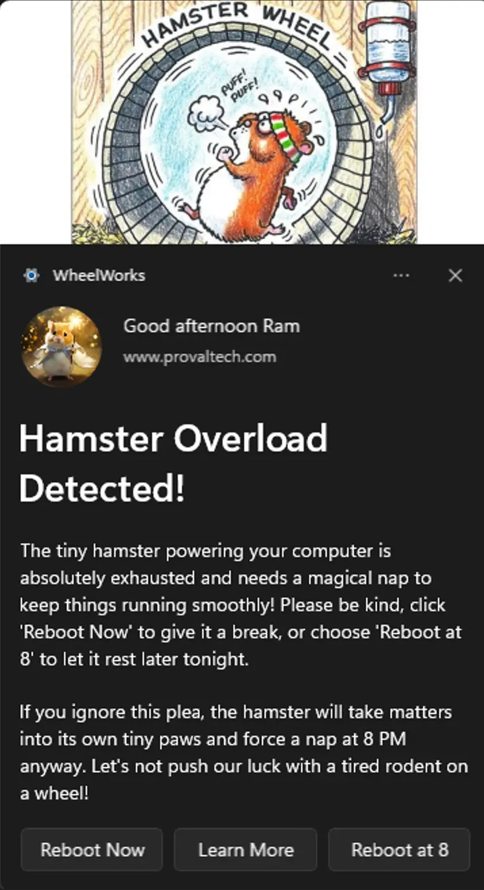

#### Scheduled Task

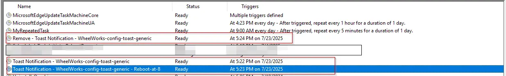

### Reboot at 8

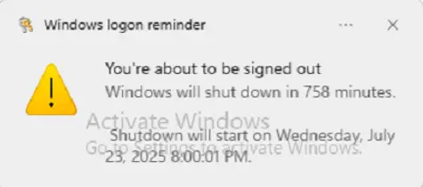

### Affected Areas on Prompt Based on Example Variables

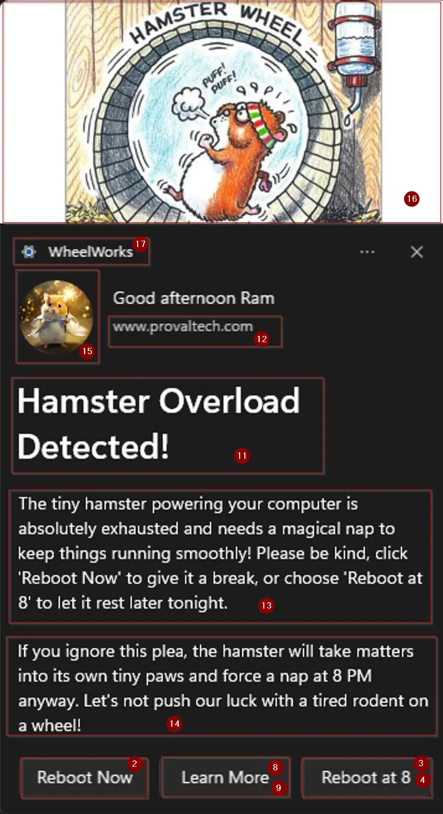

## Dependencies

[Invoke-ToastNotification](/docs/426118d9-ff83-444e-9744-30a0e26cb490)

## User Parameters

| Parameter                  | Example                         | Accepted Values             | Required | Default       | Type        | Description              |
|----------------------------|--------------------------------------------------------------------------------------------------------------|----------------------------------------------------------------------------------------------------------|----------|---------------|-------------|-----------------------------------------------------------------------------------------------------------------------------------------------------------------------------------------------------------------------------------|
| NotificationType           | Generic                         | <ul><li>Generic</li><li>PendingRebootUptime</li><li>PendingRebootCheck</li><li>ADPasswordExpiration</li></ul>                      | True     |               | Text        | The type of notification to send. The accepted values for NotificationType are generic, PendingRebootUptime, PendingRebootCheck, and ADPasswordExpiration. It is a mandatory variable. <ul><li>**Generic:** Enables a static, generic toast notification.</li><li>**PendingRebootUptime:** Displays a toast notification reminding users to restart their system after exceeding the maximum uptime.</li><li>**PendingRebootCheck:** Displays a toast notification when a pending reboot is detected through the system registry or WMI.</li><li>**ADPasswordExpiration:** Sends a toast notification to users when their Active Directory password is nearing expiration.</li></ul> |
| RunScriptButton | Marked |  | False | False | Flag | Set RunScriptButton to 1 to enable the 'Run Script' button in the notification. To disable it, either set the value to 0 or remove the variable. Please note that enabling this button will automatically disable the 'Snooze' button. |
| RunScriptButtonText | Script Name |  | False | RunScript | Text | Set the string in the RunScriptButtonText variable to customize the text of the RunScript button. Delete the variable or leave it blank to fall back to the default value. The default is `RunScript `. `RunScriptButton` should be enabled or set to `1` to enable the `RunScriptButtonText` variable. |
| ScriptPath | C:\Temp\ScriptName.ps1 |  | True (when RunScriptButton is Enabled) |  | Text | ScriptPath specifies the full path to a PowerShell script (.ps1) that will be executed when the 'RunScript' button is clicked. This must be a valid path ending in .ps1. Setting this variable is mandatory if RunScriptButton is enabled. If RebootScriptButton is not enabled, this variable can be omitted by leaving it blank or removing it entirely. |
| ScriptContext | System |  <ul><li>User</li><li>System</li></ul> | False | User | Text | ScriptContext Specifies the context in which the custom script should be executed when triggered from the notification on clicking the 'RunScript' button. Valid values are 'User' (runs in the current user context) or 'System' (runs with elevated/system privileges, if supported). Default is 'User'. `RunScriptButton` should be enabled to use the `ScriptContext` variable. |
| ScriptStyle | Hidden |  <ul><li>Hidden</li><li>Interactive</li></ul> | False | Hidden | Text | ScriptStyle defines how the script should be executed when the 'RunScript' button is clicked. Valid options are 'Interactive' (displays messages or launches installers on the user's desktop) and 'Hidden' (runs silently in the background). The default value is 'Hidden'. This variable is only applicable if RunScriptButton is enabled. |
| RebootButton               | Unmarked                        |                             | False    | False         | Flag        | Select it to enable the `Reboot` button in the notification. RebootButton is available for `Generic `, `PendingRebootUptime `, and `PendingRebootCheck` notification types.                    |
| LearnMoreButton            | Unmarked                        |                             | False    | False         | Flag        | Select it to enable the `Learn More` button in the notification.                       |
| LearnMoreUrl               | [https://www.provaltech.com](https://www.provaltech.com)                                                     |                             | False    |               | Text        | Set the URL to navigate by clicking the `Learn More` button in the notification. `LearnMoreButton` should be selected to allow the `LearnMoreUrl` parameter.                                |
| SnoozeButton               | Unmarked                        |                             | False    | False         | Flag        | Select it to enable the `Snooze` button in the notification.  Note: The `LearnMoreButton` and the `SnoozeButton` cannot be enabled simultaneously.                                    |
| DismissButtonText          | Dismiss                         |                             | False    | Dismiss       | Text        | Customizes the text of the dismiss button. Default is "Dismiss."                       |
| TitleText                  | Reboot Required                 |                             | True     |               | Text        | Sets the title of the notification. It is mandatory to set this parameter.             |
| AttributionText            | [https://www.provaltech.com](https://www.provaltech.com)                                                     |                             | True     |               | Text        | Displays attribution text, such as a company name or website, for authenticity. If left blank, the task will use the client name of the agent in attribution text.                          |
| BodyText1                  | An application is installed on your computer and it is required to reboot the machine ASAP.                   |                             | True     |               | Text        | The main text content of the notification body. It is mandatory to set this parameter.  |
| BodyText2                  | Ignoring the notification is not suggested     |                             | False    |               | Text        | Secondary text content is displayed below BodyText1.                                   |
| LogoImage                  | [https://labtech.provaltech.com/labtech/transfer/images/alogo.jpg](https://labtech.provaltech.com/labtech/transfer/images/alogo.jpg) |                             | False    |               | Text        | Specify the URL or path for the logo image in the notification. For best experience, keep the ratio 1:1 (Horizontal:Vertical) ; Example - 300px:300px (Horizontal:Vertical)                         |
| HeroImage                  | [https://labtech.provaltech.com/labtech/transfer/images/alogo.jpg](https://labtech.provaltech.com/labtech/transfer/images/alogo.jpg) |                             | False    |               | Text        | Specify the URL or path for the hero image displayed at the top of the notification. For best experience, keep the ratio 2:1 (Horizontal:Vertical); Example - 600px:300px (Horizontal:Vertical)     |
| Deadline                   | 2025-02-05 08:00:00             | yyyy-MM-dd HH:mm:ss          | False    | Current +14days | Text        | Sets the deadline for the notification. Format: yyyy-MM-dd HH:mm:ss. Note that RunScriptButton and Deadline cannot be enabled at the same time. Additionally, enabling RunScriptButton will automatically disable Deadline.                   |
| MaxUptimeDays              | 30                              |                             | False    | 30            | NumberValue | Defines the maximum uptime (in days) for the `PendingRebootUptime` NotificationType parameter. Default is 30 days.                                   |
| ADPasswordExpirationDays   | 7                               |                             | False    | 7             | NumberValue | Number of days before password expiration when reminders should start. It is available for the `ADPasswordExpiration` NotificationType parameter. Default is 7 days.   |
| Repeat                     | Once                            | Once, Hourly, XXMinutes, XXHours, Daily, XXDays.                  | False    | Once          | Text        | Specifies how frequently the notification should repeat. Options: Once, Hourly, XXMinutes, XXHours, Daily, XXDays. |
| NotificationAppName        | Connectwise RMM  |  | False    | Windows PowerShell          | Text        | Specifies the name of the application that will display the notification. |
| MaxOccurrences        | 5  |  | False    |  | Number Values   | Specifies the maximum number of notifications to send before the scheduled task is automatically removed. This works in conjunction with the `Repeat` parameter, except when `Repeat` is set to `Once `. |

**NOTE: For All String Parameters (Specifically for TitleText, BodyText1, and BodyText2)  
Keep the message under 300 characters.  
Avoid using single quotations within the message. If it's necessary, then escape the quotation with another one.**

**Example:**  
**user's --> Incorrect**  
**user''s --> correct**

## Task Creation

### Script Details

Create a new `Script Editor` style script in the system to implement this Task.

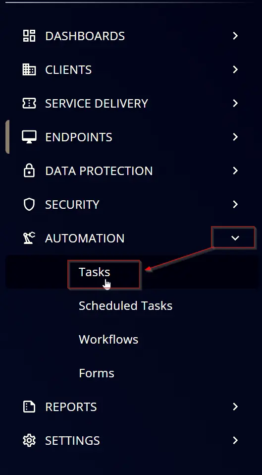

**Name:** `Toast Notification `

**Description:** `A script to create and manage toast notifications with customizable options, including images, buttons, and scenarios for different use cases. `

**Category:** `custom `

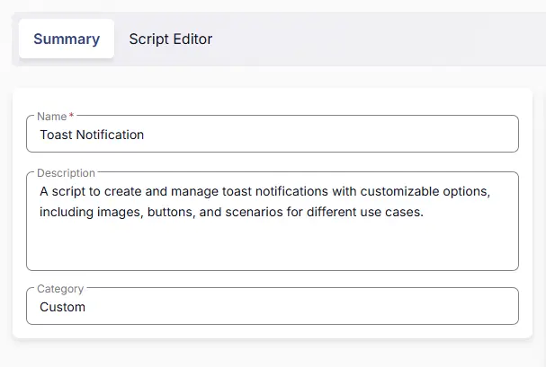

### Parameters

#### NotificationType

Add a new parameter by clicking the `Add Parameter` button present at the top-right corner of the screen.

This screen will appear.

- Set `NotificationType` in the `Parameter Name` field.

- Select `Text String` from the `Parameter Type` dropdown menu.

- Toggle `Required` Field.

- Click the `Save` button.

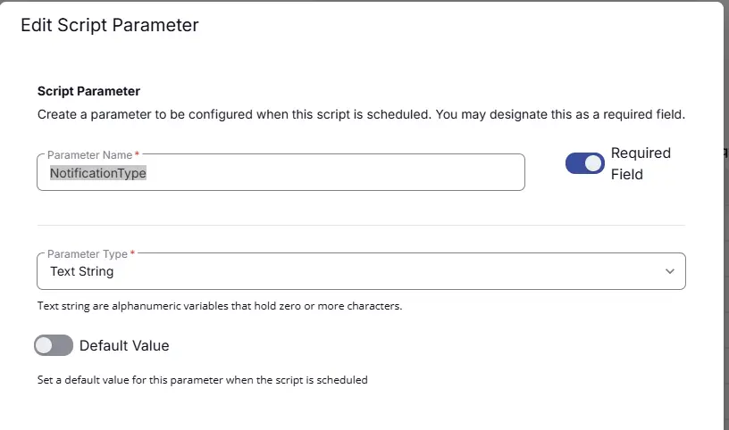

It will ask for the confirmation to proceed. Click the `Confirm` button to create the parameter.

#### RebootButton

Add another parameter by clicking the `Add Parameter` button present at the top-right corner of the screen.

- Set `RebootButton` in the `Parameter Name` field.

- Select `Flag` from the `Parameter Type` dropdown menu.

- Set Default Value as `False `.

- Click the `Save` button.

- Click the `Confirm` button to create the parameter.

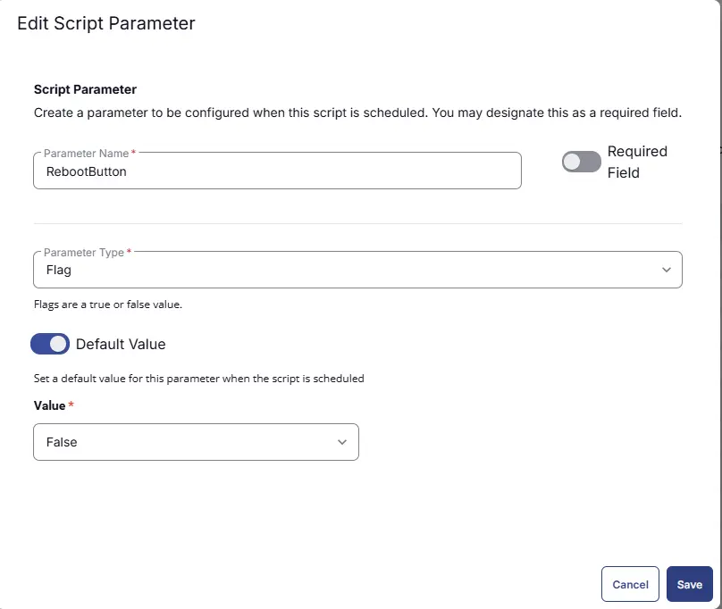

#### LearnMoreButton

Add another parameter by clicking the `Add Parameter` button present at the top-right corner of the screen.

- Set `LearnMoreButton` in the `Parameter Name` Field.

- Select `Flag` from the `Parameter Type` dropdown menu.

- Set Default Value as `False `.

- Click the `Save `button.

- Click the `Confirm` button to create the parameter.

#### LearnMoreUrl

Add another parameter by clicking the `Add Parameter` button present at the top-right corner of the screen.

- Set `LearnMoreUrl` in the `Parameter Name` field.

- Select `Text String` from the `Parameter Type` dropdown menu.

- Click the `Save` button.

- Click the `Confirm` button to create the parameter.

#### SnoozeButton

Add another parameter by clicking the `Add Parameter` button present at the top-right corner of the screen.

- Set `SnoozeButton `in the `Parameter Name` Field.

- Select `Flag` from the `Parameter Type` dropdown menu.

- Set Default Value as `False `.

- Click the `Save `button.

- Click the `Confirm` button to create the parameter.

#### DismissButtonText

Add another parameter by clicking the `Add Parameter` button present at the top-right corner of the screen.

- Set `DismissButtonText` in the `Parameter Name` field.

- Select `Text String` from the `Parameter Type` dropdown menu.

- Click the `Save` button.

- Click the `Confirm` button to create the parameter.

#### TitleText

Add another parameter by clicking the `Add Parameter` button present at the top-right corner of the screen.

- Set `TitleText` in the `Parameter Name` field.

- Select `Text String` from the `Parameter Type` dropdown menu.

- Toggle `Required` Field.

- Click the `Save` button.

- Click the `Confirm` button to create the parameter.

#### AttributionText

Add another parameter by clicking the `Add Parameter` button present at the top-right corner of the screen.

- Set `AttributionText` in the `Parameter Name` field.

- Select `Text String` from the `Parameter Type` dropdown menu.

- Click the `Save` button.

- Click the `Confirm` button to create the parameter.

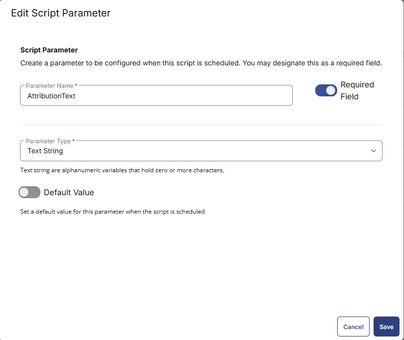

#### BodyText1

Add another parameter by clicking the `Add Parameter` button present at the top-right corner of the screen.

- Set `BodyText1` in the `Parameter Name` field.

- Select `Text String` from the `Parameter Type` dropdown menu.

- Toggle `Required` Field.

- Click the `Save` button.

- Click the `Confirm` button to create the parameter.

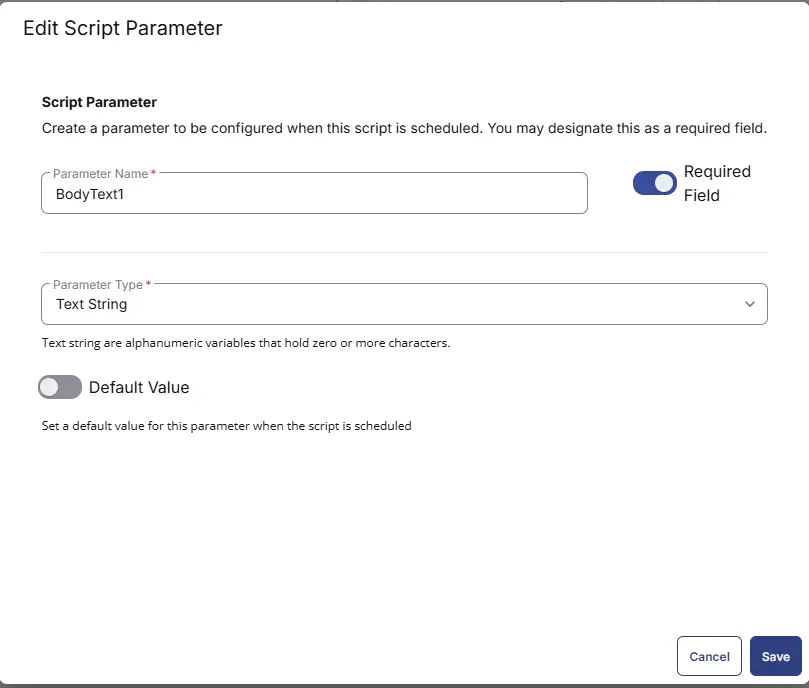

#### BodyText2

Add another parameter by clicking the `Add Parameter` button present at the top-right corner of the screen.

- Set `BodyText2` in the `Parameter Name` field.

- Select `Text String` from the `Parameter Type` dropdown menu.

- Click the `Save` button.

- Click the `Confirm` button to create the parameter.

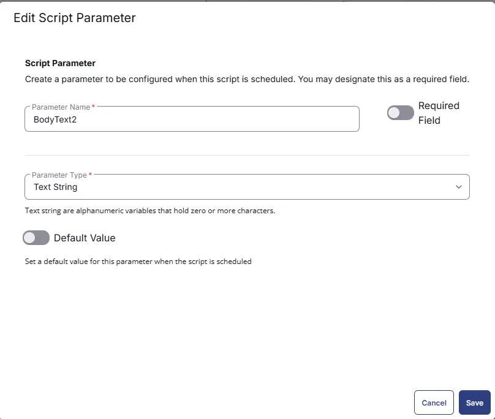

#### LogoImage

Add another parameter by clicking the `Add Parameter` button present at the top-right corner of the screen.

- Set `LogoImage` in the `Parameter Name` field.

- Select `Text String` from the `Parameter Type` dropdown menu.

- Click the `Save` button.

- Click the `Confirm` button to create the parameter.

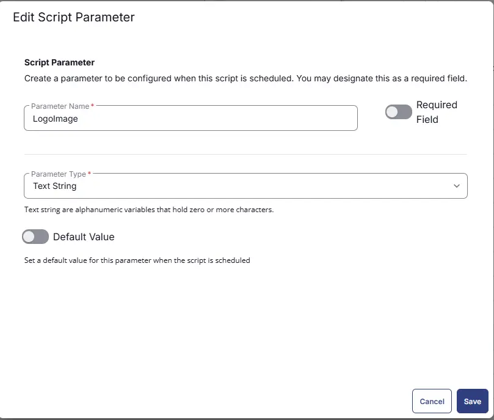

#### HeroImage

Add another parameter by clicking the `Add Parameter` button present at the top-right corner of the screen.

- Set `HeroImage` in the `Parameter Name` field.

- Select `Text String` from the `Parameter Type` dropdown menu.

- Click the `Save` button.

- Click the `Confirm` button to create the parameter.

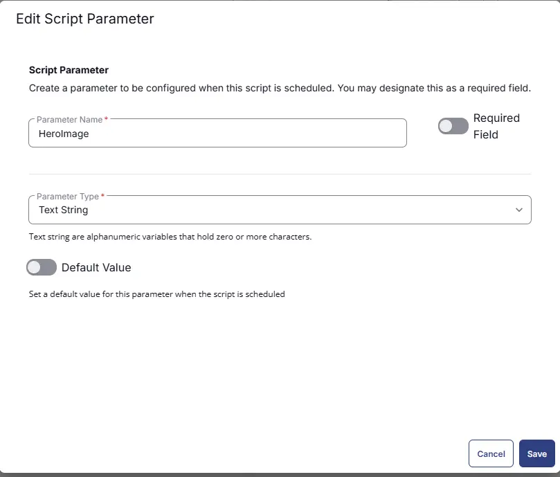

#### Deadline

Add another parameter by clicking the `Add Parameter` button present at the top-right corner of the screen.

- Set `Deadline` in the `Parameter Name` field.

- Select `Text String` from the `Parameter Type` dropdown menu.

- Click the `Save` button.

- Click the `Confirm` button to create the parameter.

#### MaxUptimeDays

Add another parameter by clicking the `Add Parameter` button present at the top-right corner of the screen.

- Set `MaxUptimeDays` in the `Parameter Name` field.

- Select `Number Value` from the `Parameter Type` dropdown menu.

- Click the `Save` button.

- Click the `Confirm` button to create the parameter.

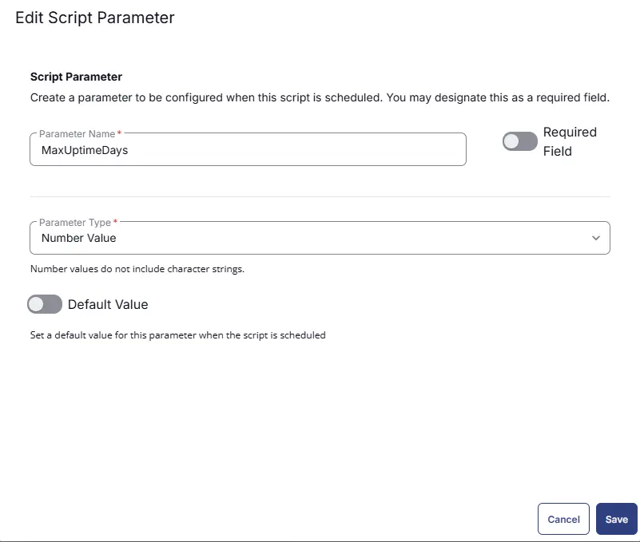

#### ADPasswordExpirationDays

Add another parameter by clicking the `Add Parameter` button present at the top-right corner of the screen.

- Set `ADPasswordExpirationDays` in the `Parameter Name` field.

- Select `Number Value` from the `Parameter Type` dropdown menu.

- Click the `Save` button.

- Click the `Confirm` button to create the parameter.

#### Repeat

Add another parameter by clicking the `Add Parameter` button present at the top-right corner of the screen.

- Set `Repeat` in the `Parameter Name` field.

- Select `Text String` from the `Parameter Type` dropdown menu.

- Set `Default Value` to `Once `.

- Click the `Save` button.

- Click the `Confirm` button to create the parameter.

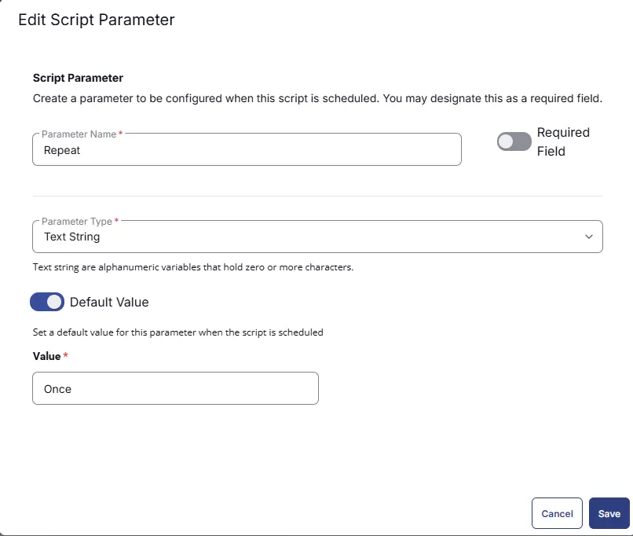

#### NotificationAppName

Add another parameter by clicking the `Add Parameter` button present at the top-right corner of the screen.

- Set `NotificationAppName` in the `Parameter Name` field.

- Select `Text String` from the `Parameter Type` dropdown menu.

- Click the `Save` button.

- Click the `Confirm` button to create the parameter.

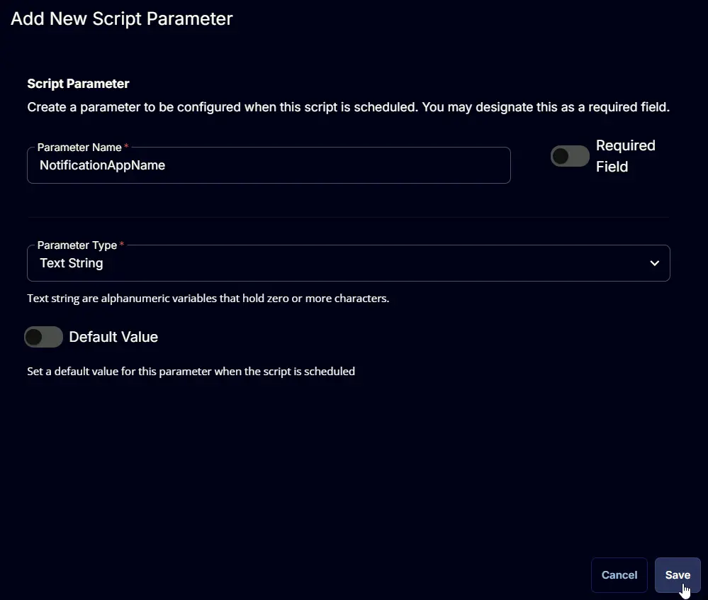

#### MaxOccurrences

Add another parameter by clicking the `Add Parameter` button present at the top-right corner of the screen.

- Set `MaxOccurrences` in the `Parameter Name` field.

- Select `Number Value` from the `Parameter Type` dropdown menu.

- Click the `Save` button.

- Click the `Confirm` button to create the parameter.

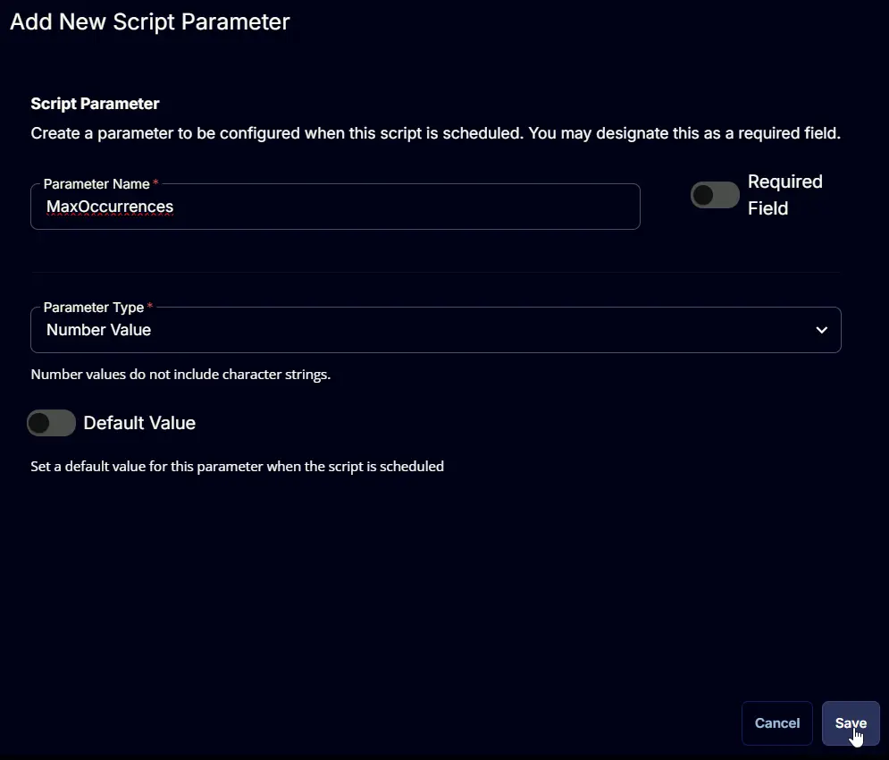

#### RunScriptButton

Add another parameter by clicking the `Add Parameter` button present at the top-right corner of the screen.

- Set `RunScriptButton` in the `Parameter Name` field.

- Select `Flag` from the `Parameter Type` dropdown menu.

- Set Default Value as `False `.

- Click the `Save` button.

- Click the `Confirm` button to create the parameter.

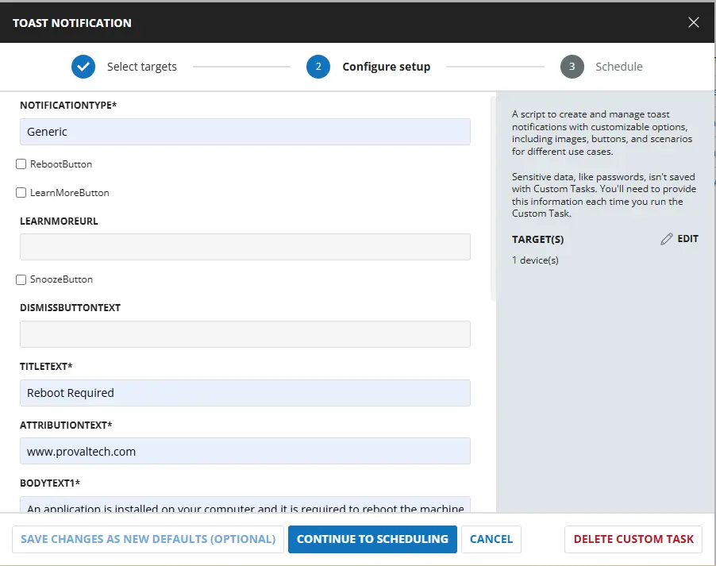

#### RunScriptButtonText

Add another parameter by clicking the `Add Parameter` button present at the top-right corner of the screen.

- Set `RunScriptButtonText` in the `Parameter Name` field.

- Select `Text String` from the `Parameter Type` dropdown menu.

- Click the `Save` button.

- Click the `Confirm` button to create the parameter.

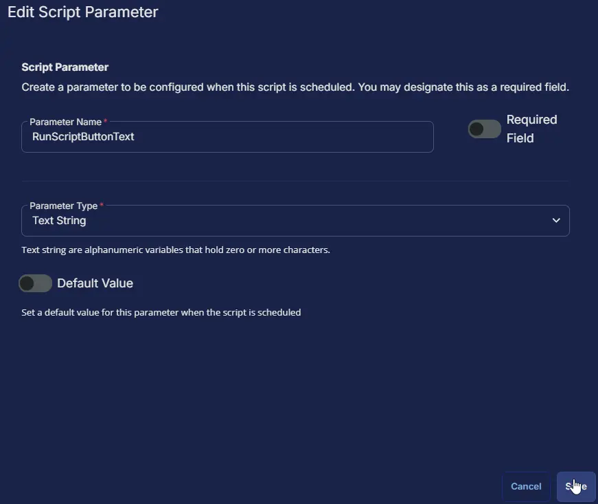

#### ScriptPath

Add another parameter by clicking the `Add Parameter` button present at the top-right corner of the screen.

- Set `ScriptPath` in the `Parameter Name` field.

- Select `Text String` from the `Parameter Type` dropdown menu.

- Click the `Save` button.

- Click the `Confirm` button to create the parameter.

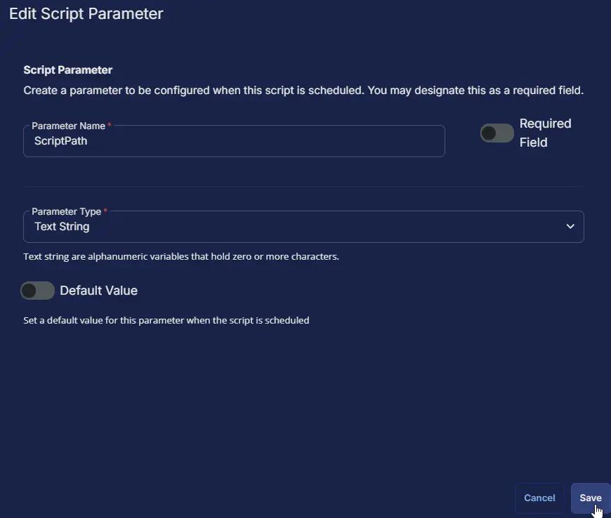

#### ScriptContext

Add another parameter by clicking the `Add Parameter` button present at the top-right corner of the screen.

- Set `ScriptContext` in the `Parameter Name` field.

- Select `Text String` from the `Parameter Type` dropdown menu.

- Click the `Save` button.

- Click the `Confirm` button to create the parameter.

#### ScriptStyle

Add another parameter by clicking the `Add Parameter` button present at the top-right corner of the screen.

- Set `ScriptStyle` in the `Parameter Name` field.

- Select `Text String` from the `Parameter Type` dropdown menu.

- Click the `Save` button.

- Click the `Confirm` button to create the parameter.

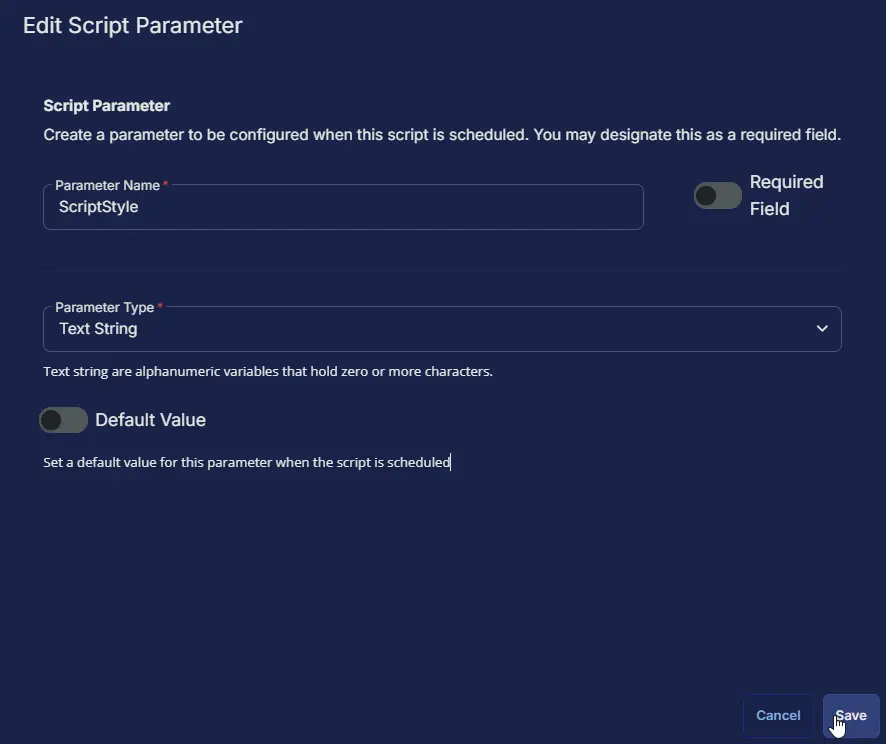

#### HideDismissButton

Add another parameter by clicking the `Add Parameter` button present at the top-right corner of the screen.

- Set `HideDismissButton` in the `Parameter Name` field.

- Select `Flag` from the `Parameter Type` dropdown menu.

- Set Default Value as `False `.

- Click the `Save` button.

- Click the `Confirm` button to create the parameter.

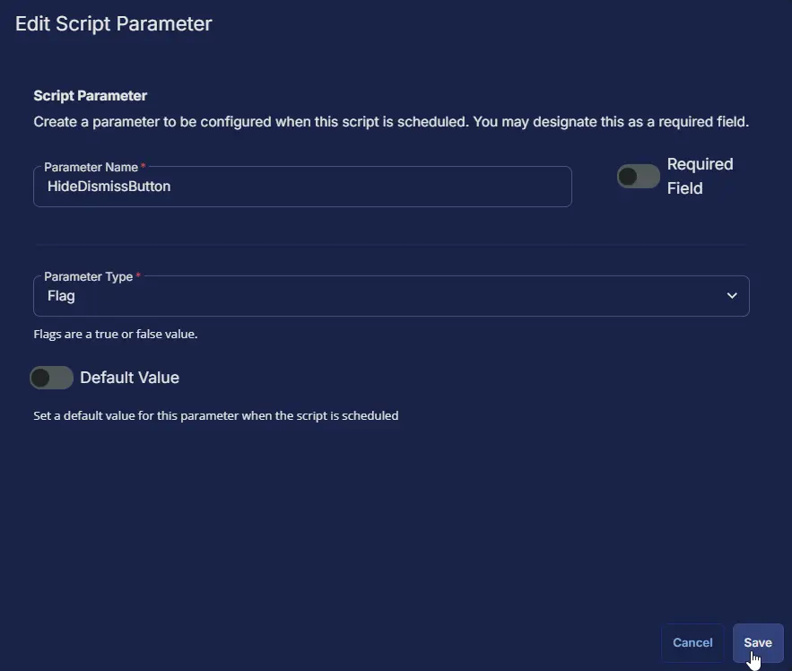

### Parameters block

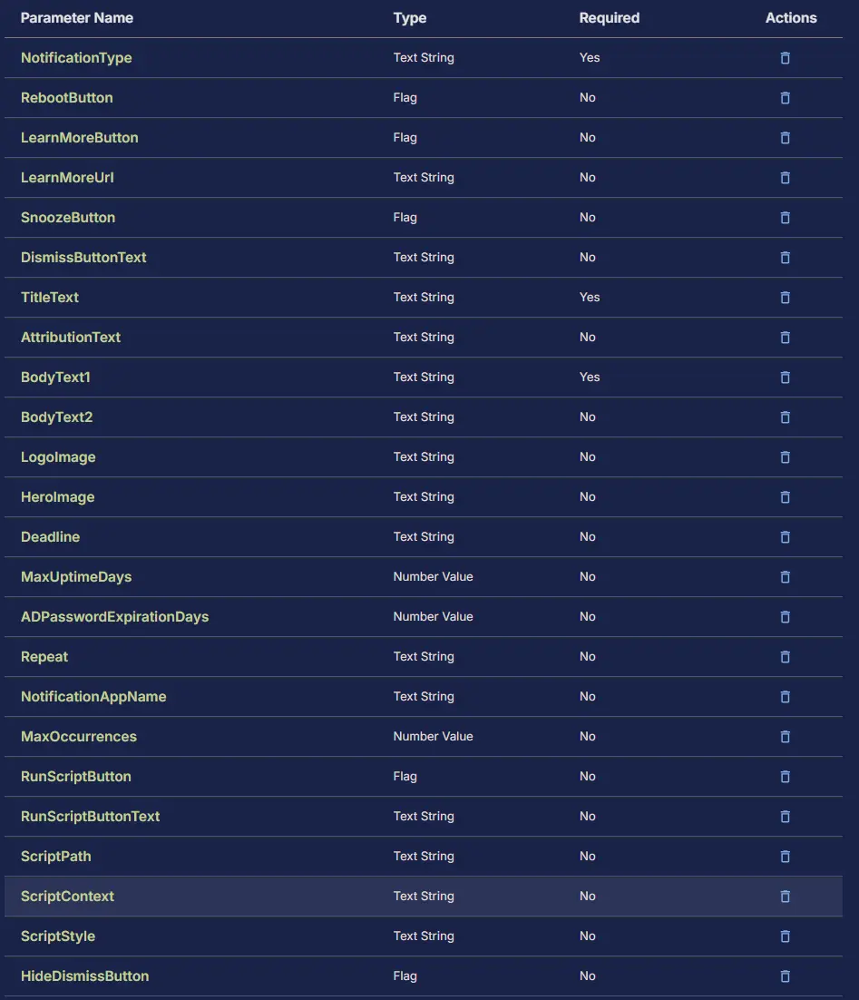

### Task

Navigate to the Script Editor Section and start by adding a row. You can do this by clicking the `Add Row` button at the bottom of the script page.

A blank function will appear.

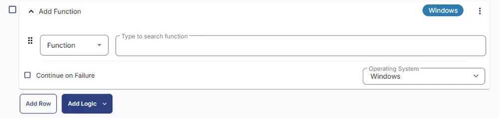

#### Row 1 Function: PowerShell Script

Search and select the `PowerShell Script` function.

The following function will pop up on the screen:

Paste in the following PowerShell script and set the expected time of script execution to `900 `seconds. Click the `Save` button.

[PowerShell Script](https://github.com/ProVal-Tech/cw-rmm/blob/main/tasks/toast-notification/script.ps1)

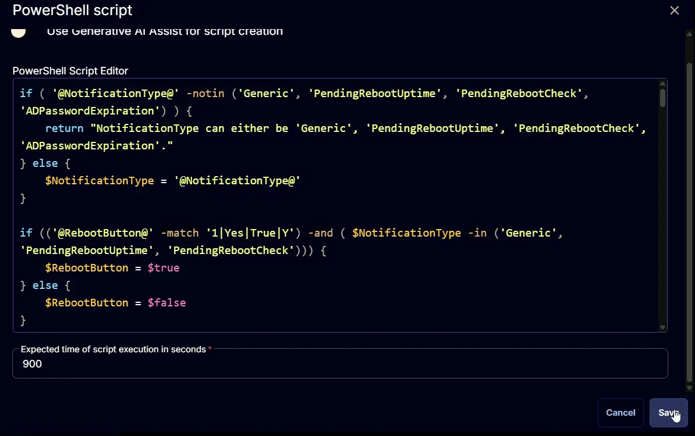

Flag the `Continue on Failure` button.

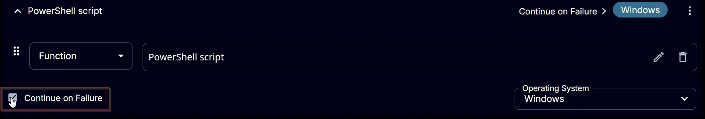

#### Row 2 Function: Script Log

Insert a new row by clicking the `Add Row` button.

Select the `Script Log` function.

In the script log message, simply type `%output%` so that the script will send the results of the PowerShell script above to the output on the Automation tab for the target device.

## Completed Task

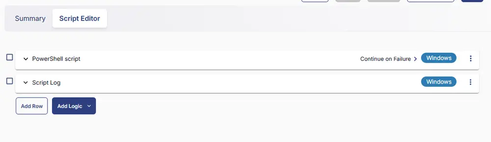

## Output

- Script Logs

## Changelog

### 2025-08-14

- Added a Run Script button where a PowerShell script can be triggered via a button click within the notification. And now the dismiss button is optional and can be excluded. Notifications can be shown with or without any buttons. Also, added a feature where on clicking Learn More button, it will send a prompt again. Earlier, on clicking on `Learn More` button, the prompt used to vanish. New Parameters:RunScriptButton, RunScriptButtonText, ScriptPath, ScriptContext, ScriptStyle, HideDismissButton

### 2025-04-16

- Added MaxOccurences parameter that specifies the maximum number of notifications to send before the scheduled task is automatically removed. This works in conjunction with the @Repeat@ parameter, except when @Repeat@ is set to Once.

### 2025-02-27

- Initial version of the document

