## Summary

This script installs updates for Dell, HP, Lenovo, and Windows based on the parameters selected. It uses agnostic scripts [Initialize-DellCommandUpdate](/docs/aa963f3d-f149-4bfa-8fdc-30f12c21ce7f), [Initialize-HPImageAssistant](/docs/92b749f0-2e30-4d4d-8916-fb5f30d85bff), [Install-LenovoUpdates](/docs/3640e534-d089-4304-89ba-68d3bc113978) and [Install-WindowsUpdates](/docs/3ccc8542-1961-4d3f-a54b-4a1bb9a78edd) for updates.

**Note** : 

- If no parameter is set, the script will not install any updates
- The script is designed to handle a single update source at a time, either Dell, Lenovo, HP, or Windows Update.  
- If Dell is selected for a dell machine, script will only execute dell updates and not windows updates. Same goes for HP and lenovo.

## Sample Run

### Example 1

- Set the below parameters to install Driver updates on Lenovo machines and to not reboot the machine after updates.
    - `Lenovo` to `Yes`
    - `Lenovo_Update_Type` to `Driver`
    - `Reboot` to `Yes`   

### Example 2 

- Set below parameters to install all types of windows updates and immediately reboot the machine after windows updates.  
    - `Windows_Update` to `Yes`
    - `Windows_Update_Type` to `ALL`
    - `Reboot` to `Yes`   
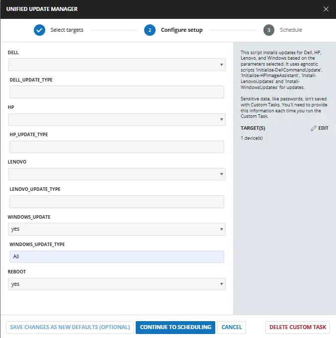

### Example 3

- Set the below parameters to install all types of Dell updates on Dell machines and to not reboot the machine after updates. 
    - `Dell` to `Yes`
    - `Dell_Update_Type` to `All`
    - `Reboot` to `No`  
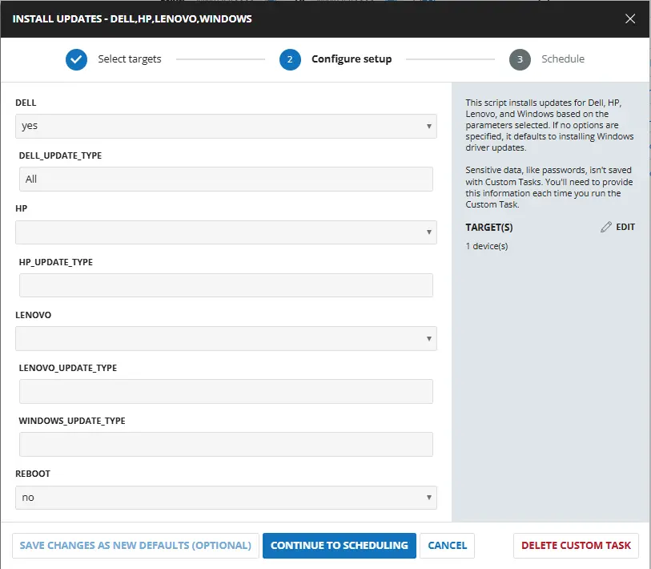

### Example 4

- Set the below parameters to install all types of Dell updates on Dell machines and to install just bios and firmware updates on HP machines without rebooting the machine after updates. This combination can be used to schedule the script on a group where HP and Dell machine are available.
    - `Dell` to `Yes`
    - `Dell_Update_Type` to `All`
    - `HP` to `Yes`
    - `HP_Update_Type` to `Bios,Firmware` 
    - `Reboot` to `No`   
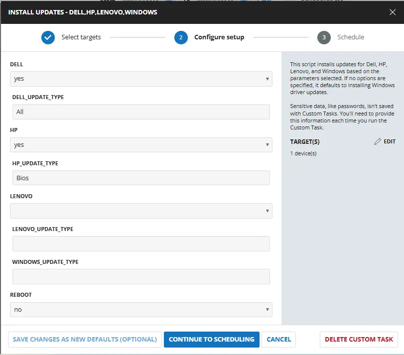

## Dependencies

- [Solution - Unified System Update Orchestrator](/docs/84a1de4d-0f17-407a-8c98-7ffc76e1d150)
- [Agnostic - Initialize-DellCommandUpdate](/docs/aa963f3d-f149-4bfa-8fdc-30f12c21ce7f)
- [Agnostic - Initialize-HPImageAssistant](/docs/92b749f0-2e30-4d4d-8916-fb5f30d85bff)
- [Agnostic - Install-LenovoUpdates](/docs/3640e534-d089-4304-89ba-68d3bc113978)
- [Agnostic - Install-WindowsUpdates](/docs/3ccc8542-1961-4d3f-a54b-4a1bb9a78edd)

## User Parameters

| Name | Example | Accepted Values | Required | Default | Type | Description |
| ---- | ------- | --------------- | -------- | ------- | ---- | ----------- |
| Dell | <ul><li>Yes</li></ul> | <ul><li>Yes</li><li>No</li></ul> | False |  | Flag | Set it to `Yes` to enable updates on dell machines. |
| Dell_Update_Type | <ul><li>Scan</li><li>All</li><li>Bios,Firmware</li></ul> | <ul><li>Scan</li><li>All</li><li>Bios</li><li>Firmware</li><li>Driver</li><li>Application</li></ul> | False |  | Text | Define the type of update to install on the Dell machine. Setting it to `Scan` will scan the updates. `All` will install all the updates. Define multiple updates by separating them with a comma i.e `bios,firmware,application`. It runs the [Agnostic - Initialize-DellCommandUpdate](/docs/aa963f3d-f149-4bfa-8fdc-30f12c21ce7f) for installing the updates. **If left blank, it will install driver updates on the machine. It will only work if Dell parameter is selected.**  |
| HP | <ul><li>Yes</li></ul> | <ul><li>Yes</li><li>No</li></ul> | False |  | Flag | Set it to `Yes` to enable updates on HP machines. |
| HP_Update_Type | <ul><li>Scan</li><li>All</li><li>Bios,firmware</li></ul> | <ul><li>Scan</li><li>All</li><li>Bios</li><li>Firmware</li><li>Driver</li><li>Application</li></ul> | False |  | Text | Define the type of update to install on the HP machine. Setting it to `Scan` will scan the updates. `All` will install all the updates. Define multiple updates by separating them with a comma i.e `bios,firmware,application`. It runs the [Agnostic script - Initialize-HPImageAssistant](/docs/92b749f0-2e30-4d4d-8916-fb5f30d85bff) for installing the updates. **If left blank, it will install driver updates on the machine. It will only work if HP parameter is selected.**  |
| Lenovo | <ul><li>Yes</li></ul> | <ul><li>Yes</li><li>No</li></ul> | False |  | Flag | Set it to `Yes` to enable updates on Lenovo machines. |
| Lenovo_Update_Type | <ul><li>Scan</li><li>All</li><li>Bios,Firmware</li></ul> | <ul><li>Scan</li><li>All</li><li>Bios</li><li>Firmware</li><li>Driver</li><li>Application</li></ul> | False |  | Text | Define the type of update to install on the Lenovo machine. Setting it to `Scan` will scan the updates. `All` will install all the updates. Define multiple updates by separating them with a comma i.e `bios,firmware,application`. It runs the [Agnostic Script - Install-LenovoUpdates](/docs/3640e534-d089-4304-89ba-68d3bc113978) for installing the updates. **If left blank, it will install driver updates on the machine. It will only work if Lenovo parameter is selected.**  |
| Windows_Update | <ul><li>Yes</li></ul> | <ul><li>Yes</li><li>No</li></ul> | False |  | Flag | Set it to `Yes` to enable windows updates on machines. |
| Windows_Update_Type | <ul><li>All</li><li>Critical Updates,drivers,tools</li></ul> | <ul><li>All</li><li>Critical Updates</li><li>Security Updates</li><li>Update Rollups</li><li>Feature Packs</li><li>Service Packs</li><li>Definition Updates</li><li>Drivers</li><li>Tools</li><li>Updates</li></ul> | False |  | Text | Define the type of windows update to install. `All` will install all the updates. Define multiple updates by separating them with a comma i.e `Critical Updates,drivers,tools`. It runs the [Agnostic Script - Install-WindowsUpdates](/docs/3ccc8542-1961-4d3f-a54b-4a1bb9a78edd) for installing the updates. **If left blank, it will install windows driver updates on the machine.**  |
| Reboot | <ul><li>Yes</li></ul> | <ul><li>Yes</li><li>No</li></ul> | False |  | Flag | Set it to `Yes` to reboot the machine after installing the updates. It applies to all Dell, HP, Lenovo and windows updates. |

## Task Creation

### Script Details

#### Step 1

Navigate to `Automation` ➞ `Tasks`  

#### Step 2

Create a new `Script Editor` style task by choosing the `Script Editor` option from the `Add` dropdown menu  

The `New Script` page will appear on clicking the `Script Editor` button:  

#### Step 3

Fill in the following details in the `Description` section:  

- **Name:** `Unified Update Manager`  
- **Description:** `This script installs updates for Dell, HP, Lenovo, and Windows based on the parameters selected. It uses agnostic scripts 'Initialize-DellCommandUpdate', 'Initialize-HPImageAssistant', 'Install-LenovoUpdates' and 'Install-WindowsUpdates' for updates.`  
- **Category:** `Custom`

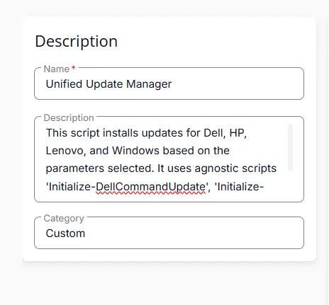

### Parameters

Locate the `Add Parameter` button on the right-hand side of the screen and click on it to create a new parameter.  

The `Add New Script Parameter` page will appear on clicking the `Add Parameter` button.  

#### Dell

- Set `Dell` in the `Parameter Name` field.  
- Select `Flag` from the `Parameter Type` dropdown menu.  
- Click the `Save` button. 

#### Dell_Update_Type

Add a new parameter by clicking the `Add Parameter` button present at the top-right corner of the screen.  

- Set `Dell_Update_Type` in the `Parameter Name` field.  
- Select `Text String` from the `Parameter Type` dropdown menu.  
- Click the `Save` button.  

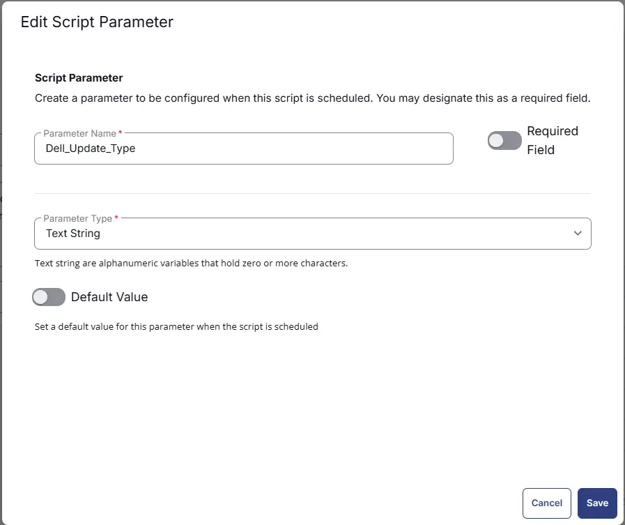

#### HP

Add a new parameter by clicking the `Add Parameter` button present at the top-right corner of the screen.  

- Set `HP` in the `Parameter Name` field.  
- Select `Flag` from the `Parameter Type` dropdown menu.  
- Click the `Save` button. 

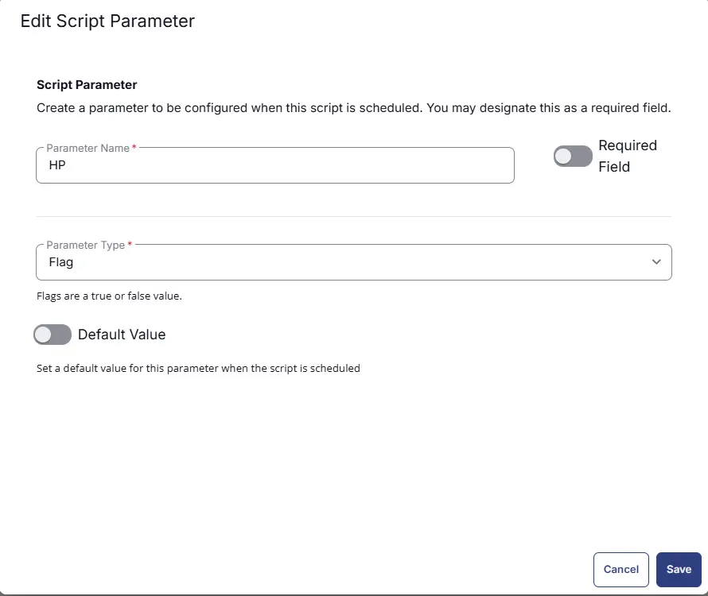

#### HP_Update_Type

Add a new parameter by clicking the `Add Parameter` button present at the top-right corner of the screen.  

- Set `HP_Update_Type` in the `Parameter Name` field.  
- Select `Text String` from the `Parameter Type` dropdown menu.  
- Click the `Save` button.  

#### Lenovo

Add a new parameter by clicking the `Add Parameter` button present at the top-right corner of the screen.  

- Set `Lenovo` in the `Parameter Name` field.  
- Select `Flag` from the `Parameter Type` dropdown menu.  
- Click the `Save` button. 

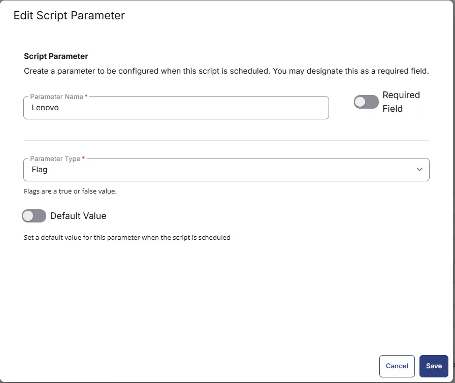

#### Lenovo_Update_Type

Add a new parameter by clicking the `Add Parameter` button present at the top-right corner of the screen.  

- Set `Lenovo_Update_Type` in the `Parameter Name` field.  
- Select `Text String` from the `Parameter Type` dropdown menu.  
- Click the `Save` button.  

#### Windows_Update

Add a new parameter by clicking the `Add Parameter` button present at the top-right corner of the screen.  

- Set `Windows_Update` in the `Parameter Name` field.  
- Select `Flag` from the `Parameter Type` dropdown menu.  
- Click the `Save` button. 

#### Windows_Update_Type

Add a new parameter by clicking the `Add Parameter` button present at the top-right corner of the screen.  

- Set `Windows_Update_Type` in the `Parameter Name` field.  
- Select `Text String` from the `Parameter Type` dropdown menu.  
- Click the `Save` button.  

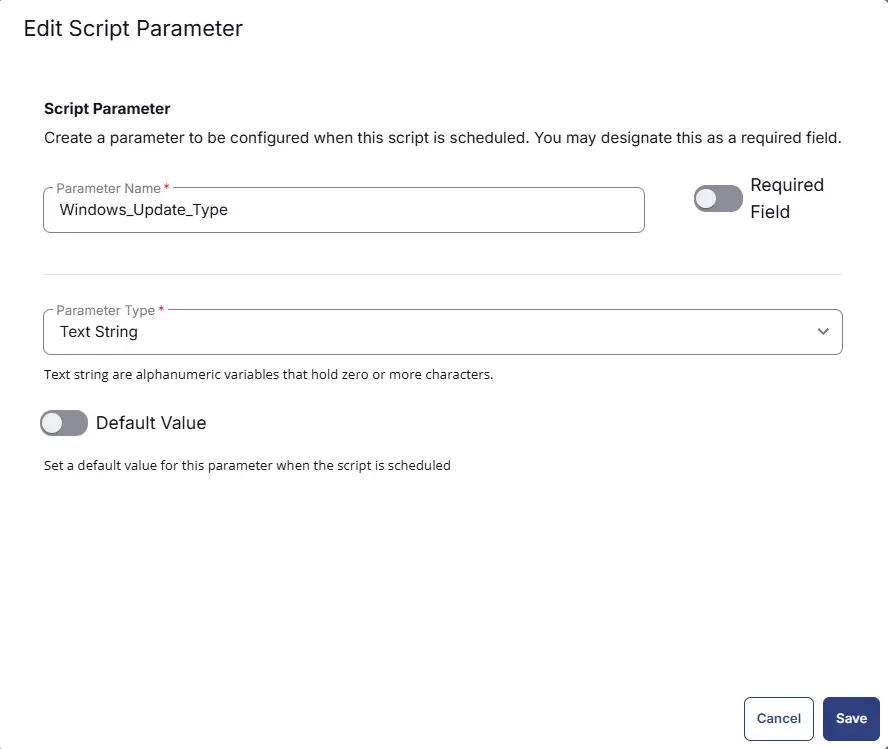

#### Reboot

Add a new parameter by clicking the `Add Parameter` button present at the top-right corner of the screen.  

- Set `Reboot` in the `Parameter Name` field.  
- Select `Flag` from the `Parameter Type` dropdown menu.  
- Set `False` as `Default` Value
- Click the `Save` button. 

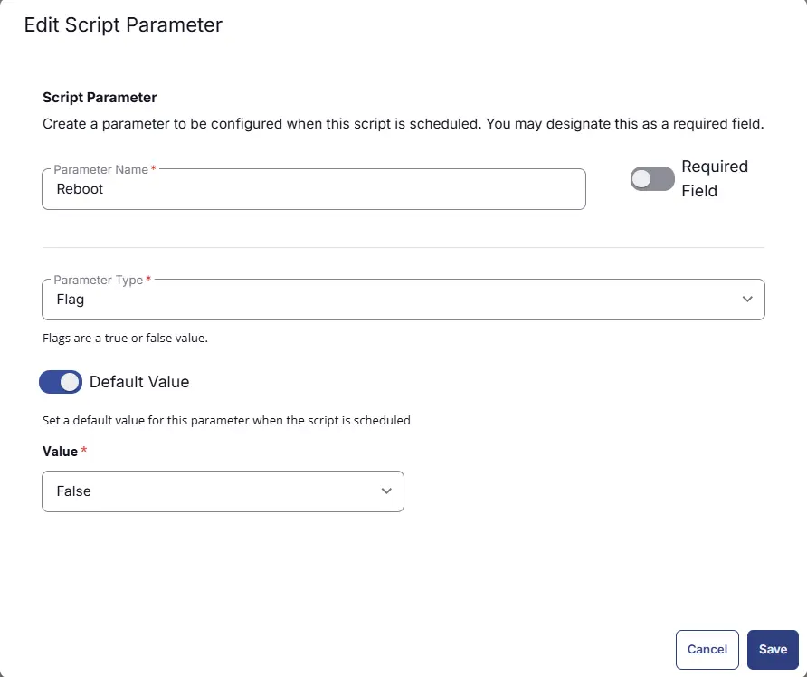

### Script Editor

Click the `Add Row` button in the `Script Editor` section to start creating the script  

A blank function will appear:  

#### Row 1 Function: `PowerShell Script`

Search and select the `PowerShell Script` function.  
 
  

The following function will pop up on the screen:  
  

Paste in the following PowerShell script and set the `Expected time of script execution in seconds` to `3600` seconds. Click the `Save` button.

[PowerShell Script](https://github.com/ProVal-Tech/cw-rmm/blob/main/tasks/unified-update-manager/script.ps1)

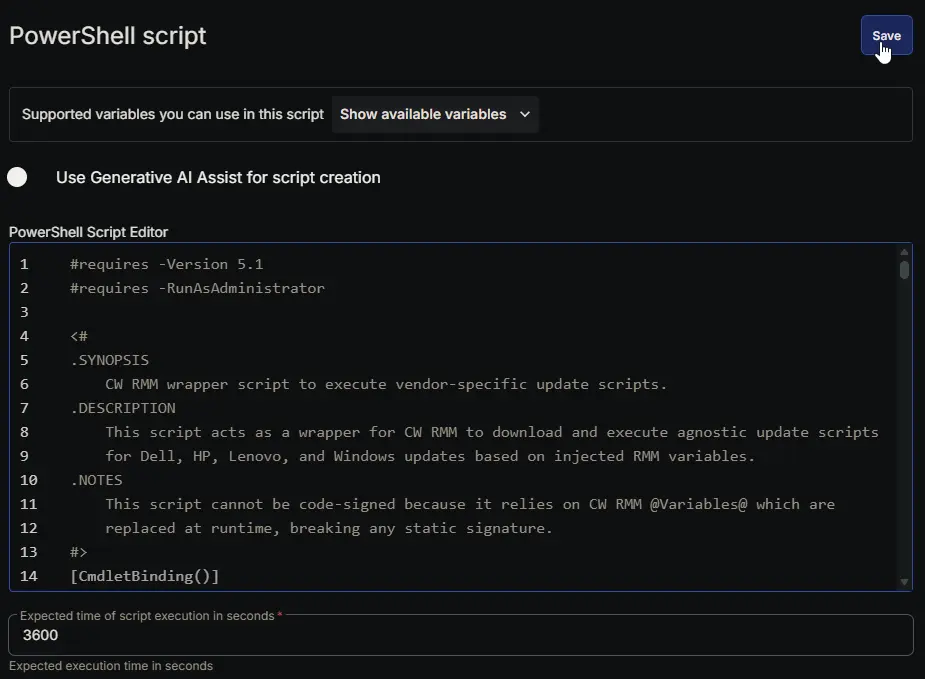

### Row 2 Function: Script Log

Add a new row by clicking the `Add Row` button.  
  

A blank function will appear.  
  

Search and select the `Script Log` function.  
  
 

In the script log message, simply type `%output%` and click the `Save` button.  

## Save Task

Click the `Save` button at the top-right corner of the screen to save the script.  

## Completed Task

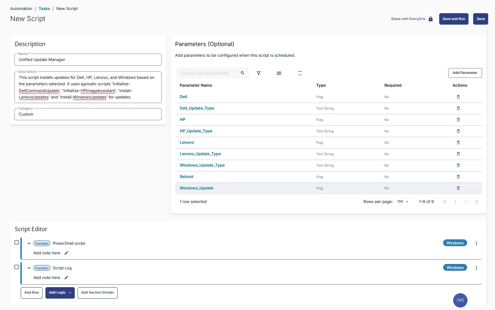

## Output

- Script Output

## Schedule Task

### Task Details

- **Name:** `Unified Update Manager`
- **Description:** `This script installs updates for Dell, HP, Lenovo, and Windows based on the parameters selected. It uses agnostic scripts 'Initialize-DellCommandUpdate', 'Initialize-HPImageAssistant', 'Install-LenovoUpdates' and 'Install-WindowsUpdates' for updates.`  
- **Category:** `Custom`

### Parameters

- Select the parameters as per requirement. For more details on parameters refer User parameter section in this document

### Schedule

- **Schedule Type:**  `Schedule`  
- **Timezone:** `Local Machine Time`  
- **Start:** `<Current Date>`  
- **Trigger:** `Time` `At` `<Current Time>`  
- **Recurrence:** `Every Day`
- **Execute at next agent check-in** `Not selected`

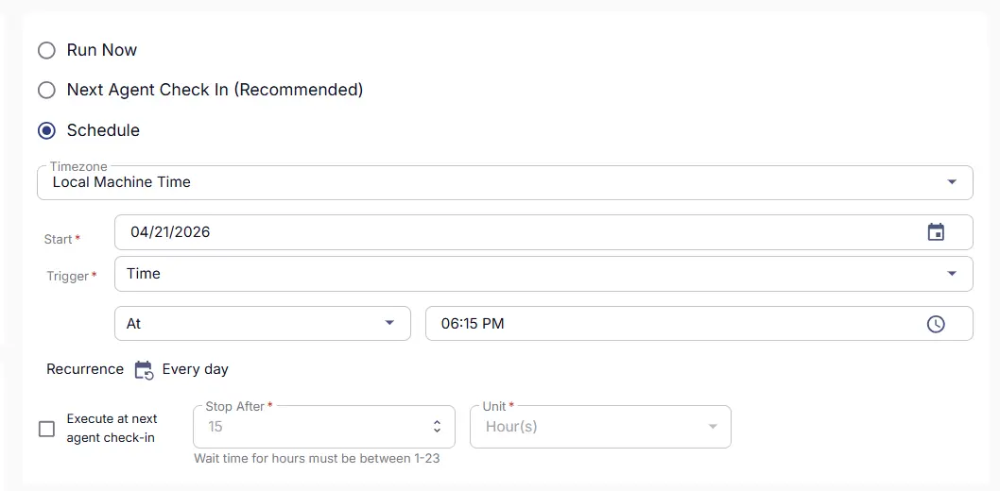

### Targeted Resource

**Device Group:** `Deploy All Updates`

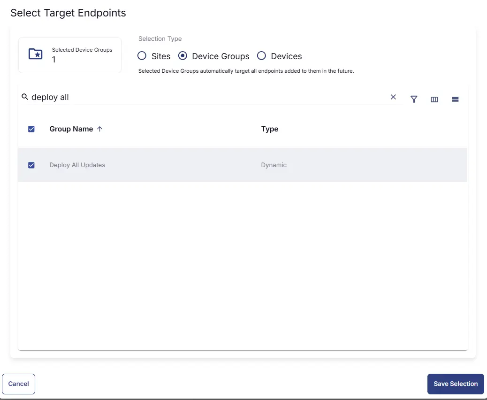

### Completed Scheduled Task

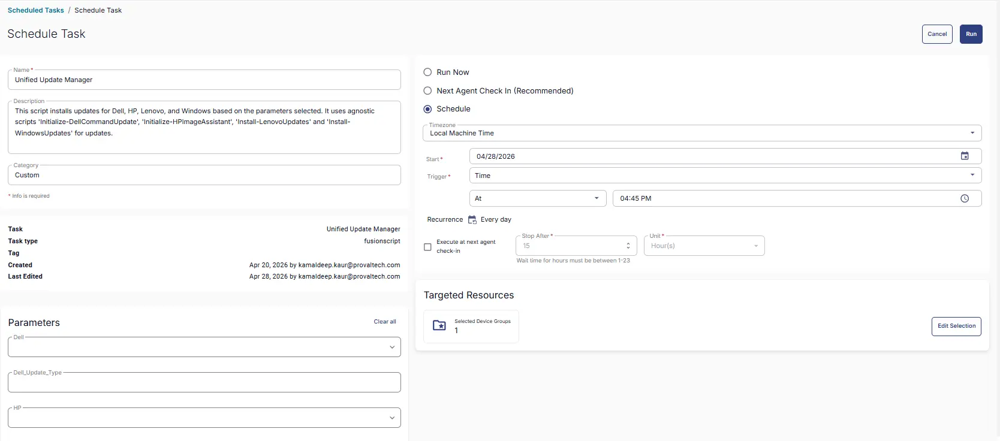

## Changelog

### 2026-08-07

- Bug fixes

### 2026-04-29

- Initial version of the document
