## Summary

This task uninstalls selected Cisco Secure Client modules from a Windows endpoint.  
The script checks installed Cisco Secure Client components in the uninstall registry, then calls the agnostic Remove-Application PowerShell script to perform the uninstall.  
Only selected and installed modules are targeted. If no selected modules are found, the task exits cleanly with a no-match message. If uninstall verification fails, the task returns an error.

**Parameter usage notes:**

1. All (`All`)
Select to remove all Cisco Secure Client modules found on the machine.  
This option has highest priority and overrides all other selections.

2. All Except Core VPN (`All_Except_Core_VPN`)
Select to remove all Cisco Secure Client modules except Core VPN.  
This option is only used when All is not selected.

3. Individual module checkboxes

    When neither All nor All Except Core VPN is selected, the script removes only the modules checked:

    - Core VPN (`Core_VPN`)
    - Start Before Login (`Start_Before_Login`)
    - DART (`DART`)
    - Network Access Manager (`Network_Access_Manager`)
    - Network Visibility Module (`Network_Visibility_Module`)
    - Secure Firewall Posture (`Secure_Firewall_Posture`)
    - ISE Posture (`ISE_Posture`)
    - ThousandEyes Endpoint (`Thousand_Eyes_Endpoint`)
    - Zero Trust Access (`Zero_Trust_Access`)
    - Umbrella (`Umbrella`)

4. Important behavior

    - At least one option must be selected, or the task will fail with a selection error.
    - If a selected module is not installed, it is skipped.
    - Core VPN removal may remove bundled Cisco components; DART is standalone and should be selected separately if you also want it removed.

5. Operator guidance

Use All for full removal, All Except Core VPN to preserve VPN connectivity, or individual checkboxes for targeted cleanup.  
For remote users who rely on VPN, avoid selecting Core VPN unless full Cisco client removal is intended.

## Sample Run

1. **Uninstalling all Modules:**

    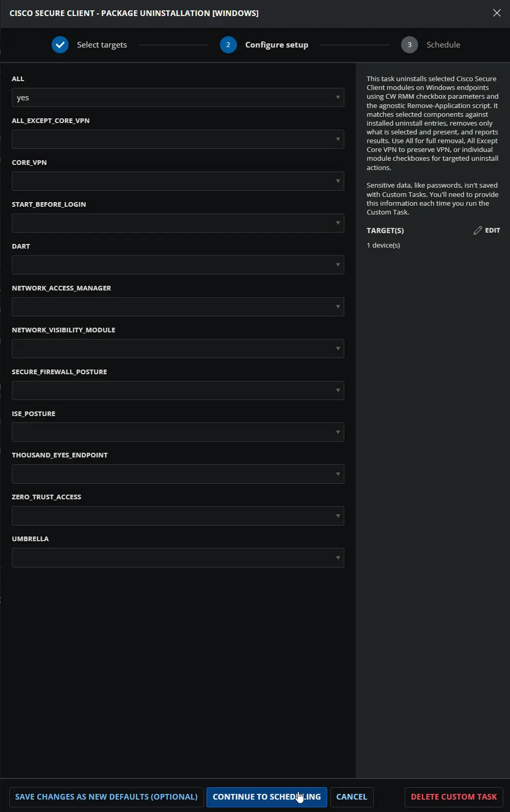

2. **Uninstalling all Modules except Core VPN:**

    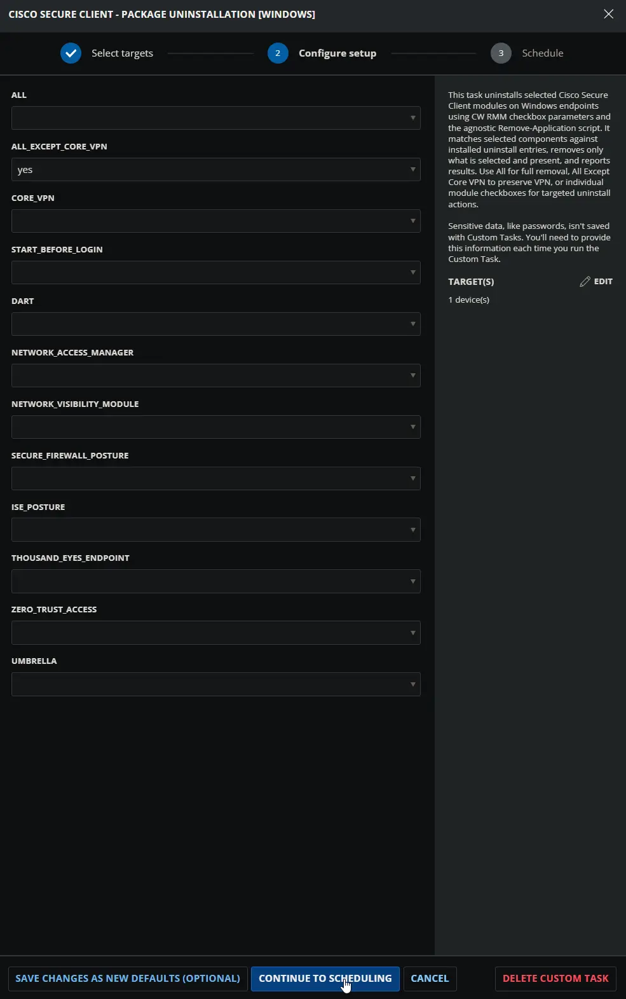

3. **Uninstalling Individual Modules (Umbrella and DART):**

    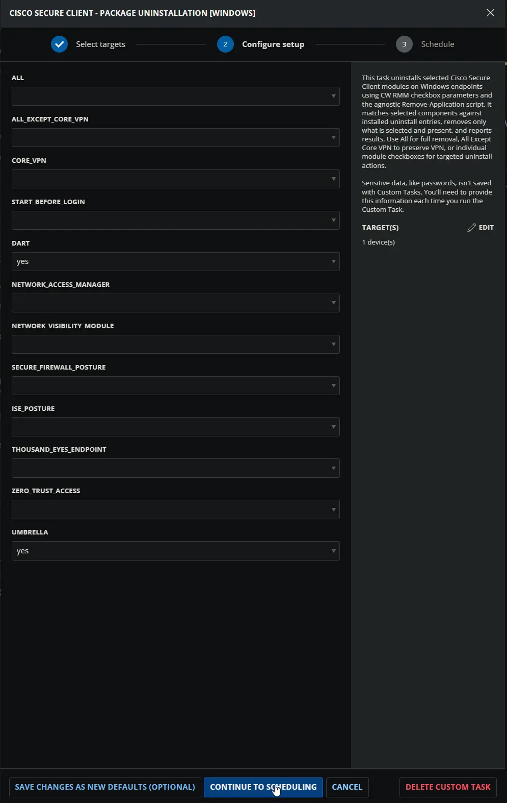

## Dependencies

[Remove-Application](/docs/8230693f-cf73-479d-8279-d2ff54c4296e)

## User Parameters

| Name | Example | Accepted Values | Required | Default | Type | Description |
|------|------|------|------|------|------|------|
| `All` | Yes | Yes, No | No | No | Flag | Set to Yes to remove all installed Cisco Secure Client modules. Highest priority; ignores all other selections. |
| `All_Except_Core_VPN` | Yes | Yes, No | No | No | Flag | Set to Yes to remove all installed Cisco Secure Client modules except Core VPN. Used only when `All` is `No`. |
| `Core_VPN` | Yes | Yes, No | No | No | Flag | Set to Yes to remove Cisco Secure Client Core VPN if installed. Removing Core_VPN will remove all embedded modules except for the DART module, which is a standalone module and will need to be removed separately if not needed. |
| `Start_Before_Login` | Yes | Yes, No | No | No | Flag | Set to Yes to remove Cisco Secure Client Start Before Login if installed. |
| `DART` | Yes | Yes, No | No | No | Flag | Set to Yes to remove Cisco Secure Client Diagnostic and Reporting Tool if installed. |
| `Network_Access_Manager` | Yes | Yes, No | No | No | Flag | Set to Yes to remove Cisco Secure Client Network Access Manager if installed. |
| `Network_Visibility_Module` | Yes | Yes, No | No | No | Flag | Set to Yes to remove Cisco Secure Client Network Visibility Module if installed. |
| `Secure_Firewall_Posture` | Yes | Yes, No | No | No | Flag | Set to Yes to remove Cisco Secure Client Secure Firewall Posture if installed. |
| `ISE_Posture` | Yes | Yes, No | No | No | Flag | Set to Yes to remove Cisco Secure Client ISE Posture if installed. |
| `Thousand_Eyes_Endpoint` | Yes | Yes, No | No | No | Flag | Set to Yes to remove Cisco Secure Client ThousandEyes Endpoint if installed. |
| `Zero_Trust_Access` | Yes | Yes, No | No | No | Flag | Set to Yes to remove Cisco Secure Client Zero Trust Access if installed. |
| `Umbrella` | Yes | Yes, No | No | No | Flag | Set to Yes to remove Cisco Secure Client Umbrella if installed. |

> Note: At least one parameter must be set to Yes or the script throws a selection error.

## Task Creation

### Description

- **Name:** `Cisco Secure Client - Package Uninstallation [Windows]`  
- **Description:** `This task uninstalls selected Cisco Secure Client modules on Windows endpoints using CW RMM checkbox parameters and the agnostic Remove-Application script. It matches selected components against installed uninstall entries, removes only what is selected and present, and reports results. Use All for full removal, All Except Core VPN to preserve VPN, or individual module checkboxes for targeted uninstall actions.`  
- **Category:** `Application`

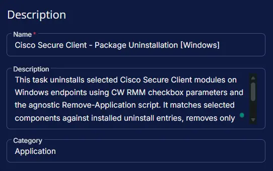

### Parameters

| Parameter Name | Required Field | Parameter Type | Default Value |
| -------------- | -------------- | -------------- | ------------- |
| All | Disabled | Flag | Disabled |

**All:**  
    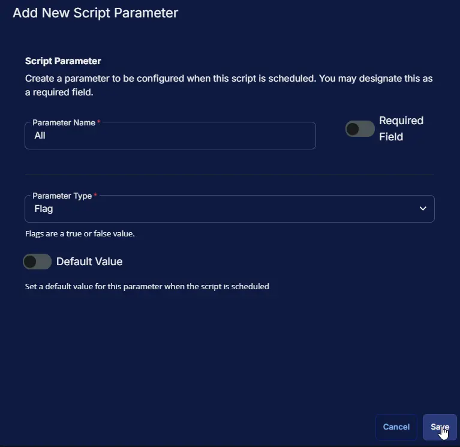

| Parameter Name | Required Field | Parameter Type | Default Value |
| -------------- | -------------- | -------------- | ------------- |
| All_Except_Core_VPN | Disabled | Flag | Disabled |

**All_Except_Core_VPN:**  
    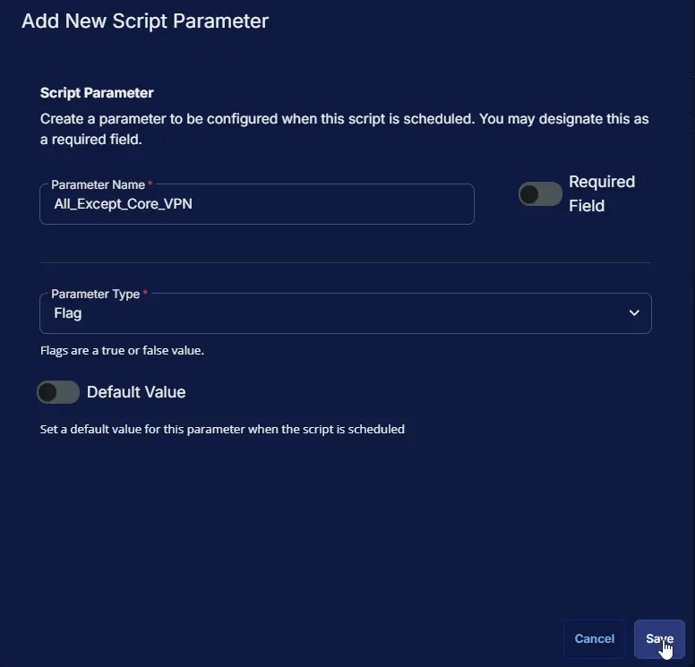

| Parameter Name | Required Field | Parameter Type | Default Value |
| -------------- | -------------- | -------------- | ------------- |
| Core_VPN | Disabled | Flag | Disabled |

**Core_VPN:**  
    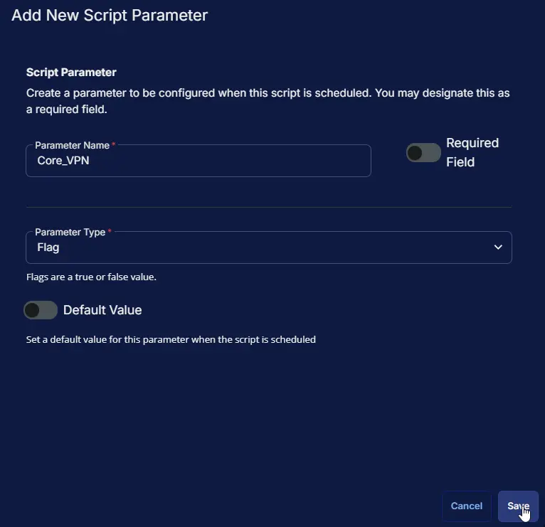

| Parameter Name | Required Field | Parameter Type | Default Value |
| -------------- | -------------- | -------------- | ------------- |
| Start_Before_Login | Disabled | Flag | Disabled |

**Start_Before_Login:**  
    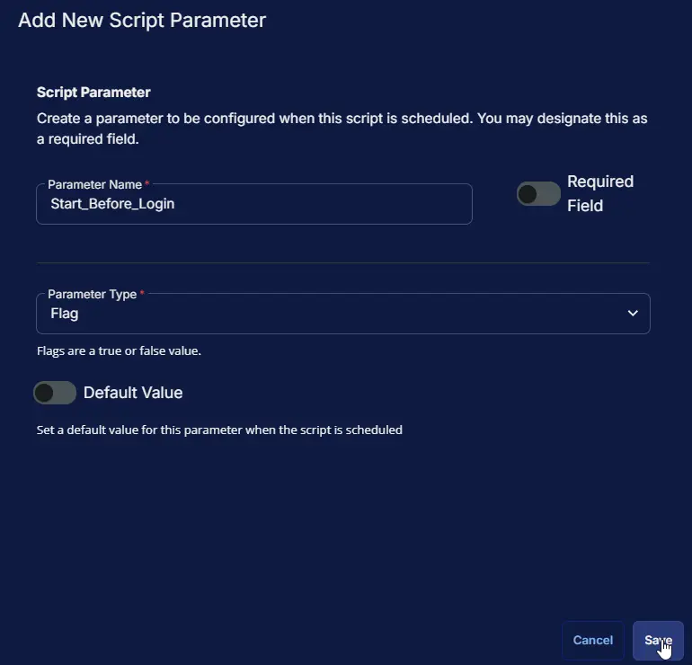

| Parameter Name | Required Field | Parameter Type | Default Value |
| -------------- | -------------- | -------------- | ------------- |
| DART | Disabled | Flag | Disabled |

**DART:**  
    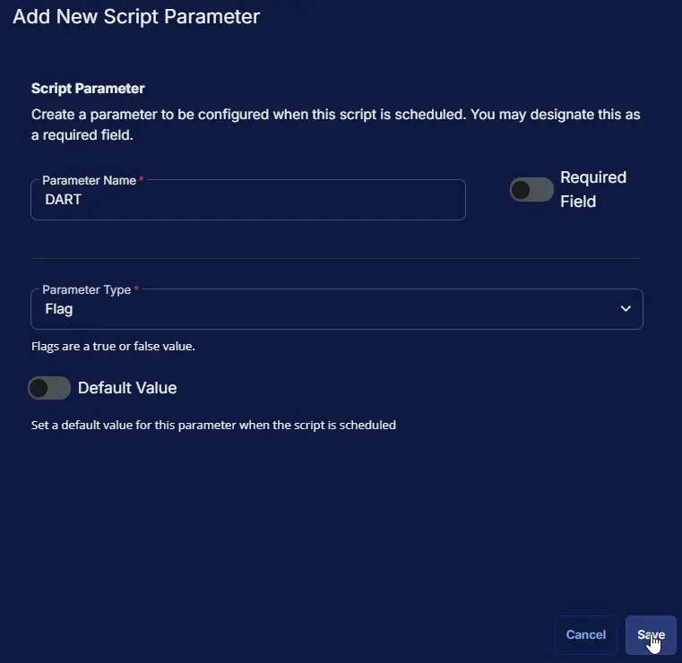

| Parameter Name | Required Field | Parameter Type | Default Value |
| -------------- | -------------- | -------------- | ------------- |
| Network_Access_Manager | Disabled | Flag | Disabled |

**Network_Access_Manager:**  
    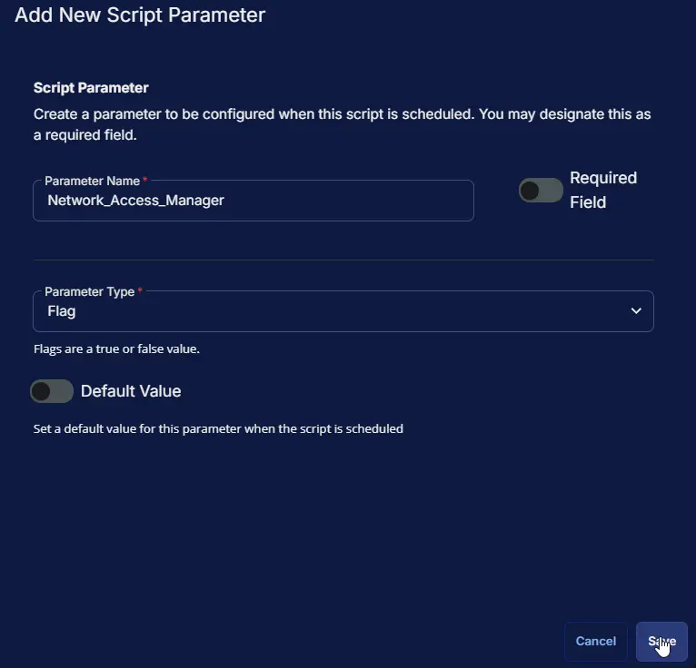

| Parameter Name | Required Field | Parameter Type | Default Value |
| -------------- | -------------- | -------------- | ------------- |
| Network_Visibility_Module | Disabled | Flag | Disabled |

**Network_Visibility_Module:**  
    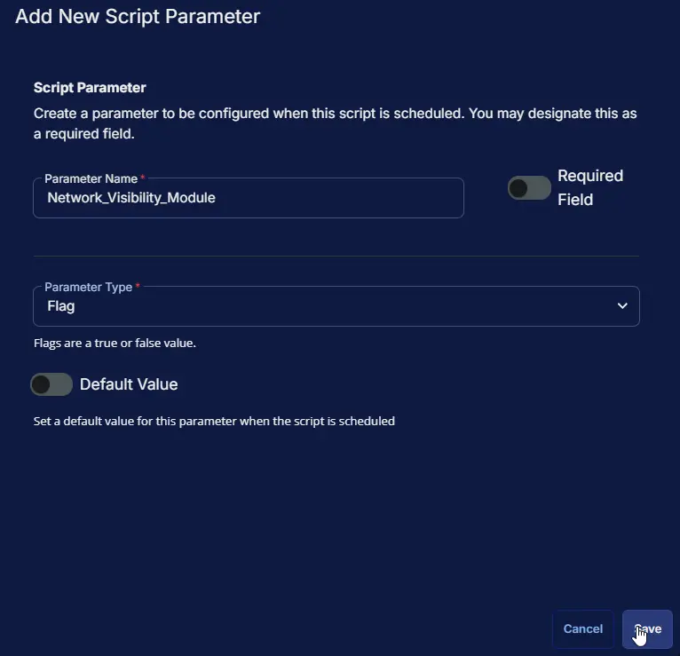

| Parameter Name | Required Field | Parameter Type | Default Value |
| -------------- | -------------- | -------------- | ------------- |
| Secure_Firewall_Posture | Disabled | Flag | Disabled |

**Secure_Firewall_Posture:**  
    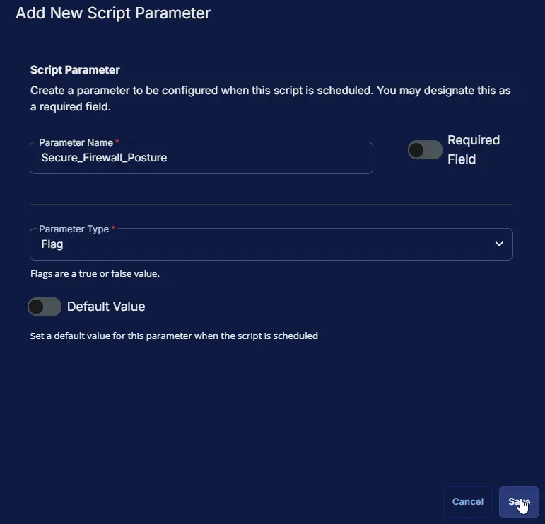

| Parameter Name | Required Field | Parameter Type | Default Value |
| -------------- | -------------- | -------------- | ------------- |
| ISE_Posture | Disabled | Flag | Disabled |

**ISE_Posture:**  
    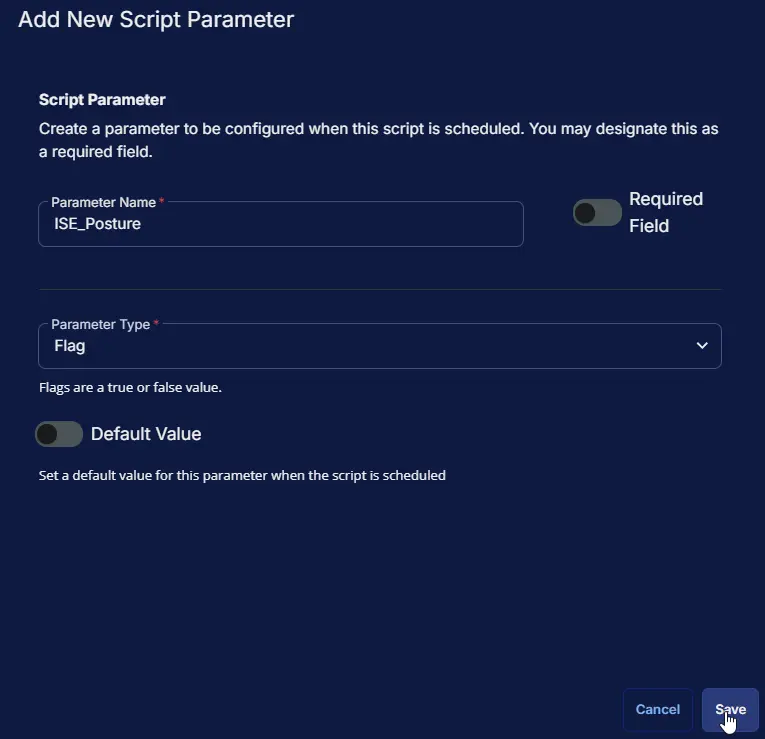

| Parameter Name | Required Field | Parameter Type | Default Value |
| -------------- | -------------- | -------------- | ------------- |
| Thousand_Eyes_Endpoint | Disabled | Flag | Disabled |

**Thousand_Eyes_Endpoint:**  
    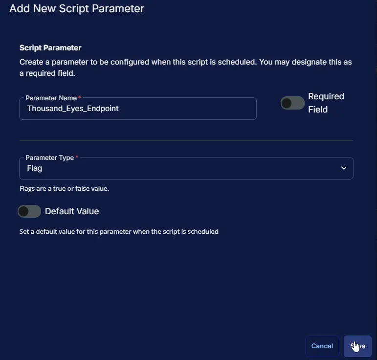

| Parameter Name | Required Field | Parameter Type | Default Value |
| -------------- | -------------- | -------------- | ------------- |
| Zero_Trust_Access | Disabled | Flag | Disabled |

**Zero_Trust_Access:**  
    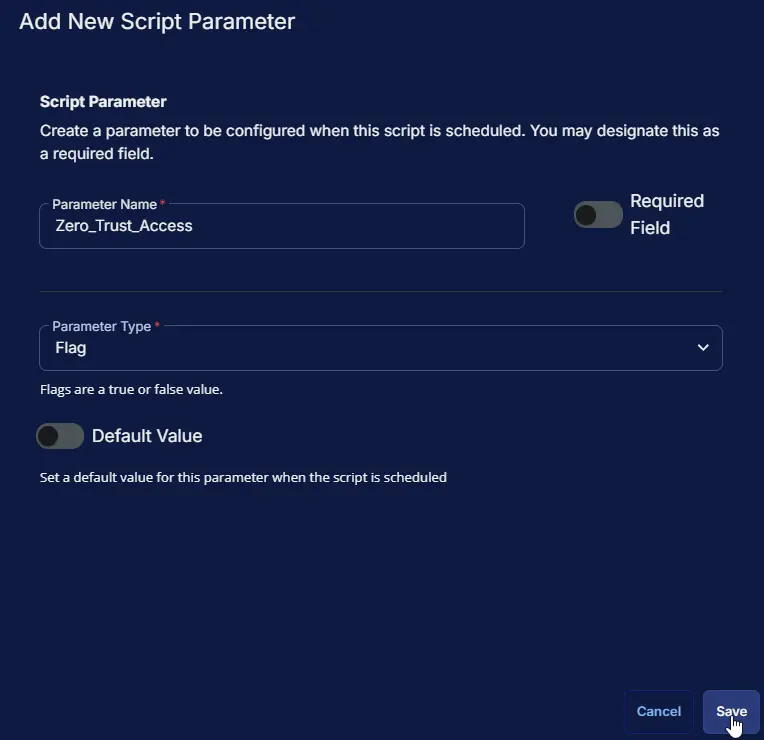

| Parameter Name | Required Field | Parameter Type | Default Value |
| -------------- | -------------- | -------------- | ------------- |
| Umbrella | Disabled | Flag | Disabled |

**Umbrella:**  
    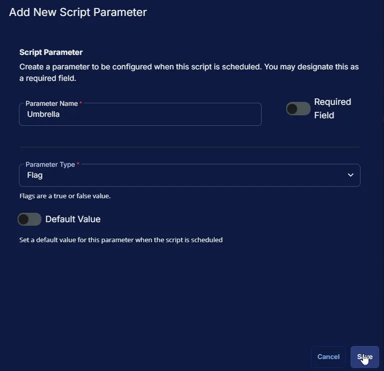

#### Parameters Section

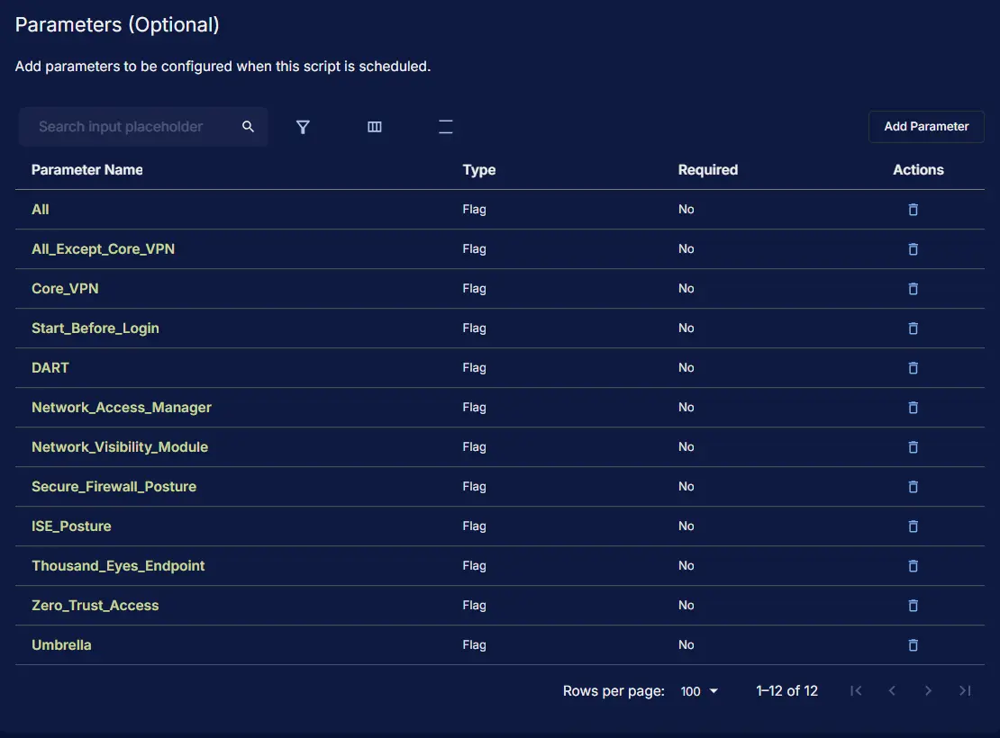

### Script Editor

#### Row 1: PowerShell script

- **Use Generative AI Assist for script creation:** `False`  
- **Expected time of script execution in seconds:** `1800`  
- **Continue on Failure:** `False`  
- **Run as:** `System`  
- **Operating System:** `Windows`  
- **PowerShell Script Editor:**

```PowerShell
<#
.SYNOPSIS
Removes selected Cisco Secure Client modules from a Windows machine using CW RMM task checkbox parameters.

.DESCRIPTION
This wrapper script is intended to run from a ConnectWise RMM task.
It reads CW RMM checkbox parameter tokens (for example `Core_VPN`), builds a list of matching
installed Cisco Secure Client modules from the uninstall registry, and then calls the agnostic
Remove-Application script to perform the uninstall operation.

If no matching modules are installed, the script exits with a message.
If a module is selected but uninstall fails, the script throws an error.

.PARAMETER All
CW RMM checkbox token: `All`
Selecting this removes all installed Cisco Secure Client modules.

.PARAMETER All_Except_Core_VPN
CW RMM checkbox token: `All_Except_Core_VPN`
Selecting this removes all installed Cisco Secure Client modules except Core VPN.

.PARAMETER Core_VPN
CW RMM checkbox token: `Core_VPN`
Selecting this removes the Cisco Secure Client Core VPN module if it is installed. 
Note: 
    - Removing Core_VPN will remove all embedded modules except for the DART module, which is a standalone module and will need to be removed separately if not needed.

.PARAMETER Start_Before_Login
CW RMM checkbox token: `Start_Before_Login`
Selecting this removes the Cisco Secure Client Start Before Login module if it is installed.

.PARAMETER DART
CW RMM checkbox token: `DART`
Selecting this removes the Cisco Secure Client Diagnostic and Reporting Tool module if it is installed.

.PARAMETER Network_Access_Manager
CW RMM checkbox token: `Network_Access_Manager`
Selecting this removes the Cisco Secure Client Network Access Manager module if it is installed.

.PARAMETER Network_Visibility_Module
CW RMM checkbox token: `Network_Visibility_Module`
Selecting this removes the Cisco Secure Client Network Visibility Module if it is installed.

.PARAMETER Secure_Firewall_Posture
CW RMM checkbox token: `Secure_Firewall_Posture`
Selecting this removes the Cisco Secure Client Secure Firewall Posture module if it is installed.

.PARAMETER ISE_Posture
CW RMM checkbox token: `ISE_Posture`
Selecting this removes the Cisco Secure Client ISE Posture module if it is installed.

.PARAMETER Thousand_Eyes_Endpoint
CW RMM checkbox token: `Thousand_Eyes_Endpoint`
Selecting this removes the Cisco Secure Client ThousandEyes Endpoint module if it is installed.

.PARAMETER Zero_Trust_Access
CW RMM checkbox token: `Zero_Trust_Access`
Selecting this removes the Cisco Secure Client Zero Trust Access module if it is installed.

.PARAMETER Umbrella
CW RMM checkbox token: `Umbrella`
Selecting this removes the Cisco Secure Client Umbrella module if it is installed.

.NOTES
Execution flow:
1. Read CW RMM checkbox tokens.
2. Resolve matching Cisco Secure Client uninstall entries from registry.
3. Download and execute Remove-Application from the content repository.
4. Validate logs and verify selected modules were removed.

Selection precedence:
- `All` takes priority over all other options.
- `All_Except_Core_VPN` is evaluated if `All` is not selected.
- Individual module selections are evaluated when neither `All` nor `All_Except_Core_VPN` is selected.

.LINK
    https://content.provaltech.com/docs/8230693f-cf73-479d-8279-d2ff54c4296e
    https://content.provaltech.com/docs/b2f98721-b82c-48ad-9bf9-83f0d82c5204
#>

#region globals
$ProgressPreference = 'SilentlyContinue'
$WarningPreference = 'SilentlyContinue'
#endRegion

#region variables
$projectName = 'Remove-Application'
$workingDirectory = '{0}\_Automation\Script\{1}' -f $env:ProgramData, $projectName
$scriptPath = '{0}\{1}.ps1' -f $workingDirectory, $projectName
$logPath = '{0}\{1}-log.txt' -f $workingDirectory, $projectName
$errorLogPath = '{0}\{1}-error.txt' -f $workingDirectory, $projectName
$baseUrl = 'https://contentrepo.net/repo'
$scriptUrl = '{0}/script/{1}.ps1' -f $baseUrl, $projectName
$logContentReplacePattern = '{0}$' -f $projectName
#endRegion

#region rmm parameters hash table
$uninstallerRegPaths = @(
    'HKLM:\SOFTWARE\Microsoft\Windows\CurrentVersion\Uninstall',
    'HKLM:\SOFTWARE\WOW6432Node\Microsoft\Windows\CurrentVersion\Uninstall'
)
$appsToRemove = @()
$displayNamePattern = 'Cisco Secure Client - ('

$all = '@All@'
$allExceptCoreVPN = '@All_Except_Core_VPN@'
$coreVPN = '@Core_VPN@'
$sbl = '@Start_Before_Login@'
$dart = '@DART@'
$nam = '@Network_Access_Manager@'
$nvm = '@Network_Visibility_Module@'
$vpnPosture = '@Secure_Firewall_Posture@'
$isePosture = '@ISE_Posture@'
$thousandEyes = '@Thousand_Eyes_Endpoint@'
$zeroTrust = '@Zero_Trust_Access@'
$umbrella = '@Umbrella@'

if ($all -match '1|Yes|True') {
    $appsToRemove = Get-ChildItem -Path $uninstallerRegPaths -ErrorAction SilentlyContinue |
        Get-ItemProperty -ErrorAction SilentlyContinue |
        Where-Object {
            $_.DisplayName -match $displayNamePattern
        } |
        Select-Object -ExpandProperty DisplayName
} elseif ($allExceptCoreVPN -match '1|Yes|True') {
    $appsToRemove = Get-ChildItem -Path $uninstallerRegPaths -ErrorAction SilentlyContinue |
        Get-ItemProperty -ErrorAction SilentlyContinue |
        Where-Object {
            $_.DisplayName -match $displayNamePattern -and $_.DisplayName -notmatch '(AnyConnect|Core) VPN'
        } |
        Select-Object -ExpandProperty DisplayName
} else {
    if ($coreVPN -match '1|Yes|True') {
        $displayNamePattern += 'AnyConnect|Core VPN|'
    }
    if ($sbl -match '1|Yes|True') {
        $displayNamePattern += 'Start Before Login|'
    }
    if ($dart -match '1|Yes|True') {
        $displayNamePattern += 'Diagnostic and Reporting Tool|'
    }
    if ($nam -match '1|Yes|True') {
        $displayNamePattern += 'Network Access Manager|'
    }
    if ($nvm -match '1|Yes|True') {
        $displayNamePattern += 'Network Visibility Module|'
    }
    if ($vpnPosture -match '1|Yes|True') {
        $displayNamePattern += 'Secure Firewall Posture|'
    }
    if ($isePosture -match '1|Yes|True') {
        $displayNamePattern += 'ISE Posture|'
    }
    if ($umbrella -match '1|Yes|True') {
        $displayNamePattern += 'Umbrella|'
    }
    if ($thousandEyes -match '1|Yes|True') {
        $displayNamePattern += 'Thousand Eyes Endpoint|'
    }
    if ($zeroTrust -match '1|Yes|True') {
        $displayNamePattern += 'Zero Trust Access|'
    }
    $displayNamePattern = $displayNamePattern.TrimEnd('|')
    $displayNamePattern += ')'

    if ($displayNamePattern -match 'Cisco Secure Client - \(\)') {
        throw 'No modules were selected for uninstallation. Please select at least one module or select All.'
    }

    $appsToRemove = Get-ChildItem -Path $uninstallerRegPaths -ErrorAction SilentlyContinue |
        Get-ItemProperty -ErrorAction SilentlyContinue |
        Where-Object {
            $_.DisplayName -match $displayNamePattern
        } |
        Select-Object -ExpandProperty DisplayName
}

if ($appsToRemove) {
    Write-Information -MessageData ('The following modules will be uninstalled: {0}' -f ($appsToRemove -join ', ')) -InformationAction Continue
} else {
    return 'No modules were found matching the selection criteria.'
}

$parameters = @{
    Name = $appsToRemove
}
#endRegion

#region working directory
if (-not (Test-Path -Path $workingDirectory)) {
    try {
        New-Item -Path $workingDirectory -ItemType Directory -Force -ErrorAction Stop | Out-Null
    } catch {
        throw ('Failed to create working directory {0}. Reason: {1}' -f $workingDirectory, $Error[0].Exception.Message)
    }
}
#endRegion

#region set tls policy
$supportedTLSversions = [enum]::GetValues('Net.SecurityProtocolType')
if (($supportedTLSversions -contains 'Tls13') -and ($supportedTLSversions -contains 'Tls12')) {
    [System.Net.ServicePointManager]::SecurityProtocol = [System.Net.SecurityProtocolType]::Tls13 -bor [System.Net.SecurityProtocolType]::Tls12
} elseif ($supportedTLSversions -contains 'Tls12') {
    [System.Net.ServicePointManager]::SecurityProtocol = [System.Net.SecurityProtocolType]::Tls12
} else {
    Write-Information -MessageData 'TLS 1.2 and/or TLS 1.3 are not supported on this system. This download may fail!' -InformationAction Continue
    if ($PSVersionTable.PSVersion.Major -lt 3) {
        Write-Information -MessageData 'PowerShell 2 / .NET 2.0 doesn''t support TLS 1.2.' -InformationAction Continue
    }
}
#endRegion

#region download script
try {
    Invoke-WebRequest -Uri $scriptUrl -OutFile $scriptPath -UseBasicParsing -ErrorAction Stop
} catch {
    if (-not (Test-Path -Path $scriptPath)) {
        throw ('Failed to download the script from ''{0}'', and no local copy of the script exists on the machine. Reason: {1}' -f $scriptUrl, $Error[0].Exception.Message)
    }
}
#endRegion

#region execute script
if ($parameters) {
    & $scriptPath @parameters
} else {
    & $scriptPath
}
#endRegion

#region log verification
if (-not (Test-Path -Path $logPath )) {
    throw ('Failed to run the agnostic script ''{0}''. A security application seems to have interrupted the script.' -f $scriptPath)
} else {
    $content = Get-Content -Path $logPath
    $logContent = $content[ $($($content.IndexOf($($content -match $logContentReplacePattern)[-1])) + 1)..$($content.length - 1) ]
    Write-Information -MessageData ('Log Content: {0}' -f ($logContent | Out-String)) -InformationAction Continue
}

if (Test-Path -Path $errorLogPath) {
    $errorLogContent = Get-Content -Path $errorLogPath -ErrorAction SilentlyContinue
    throw ('Error log Content: {0}' -f ($errorLogContent | Out-String -ErrorAction SilentlyContinue))
}
#endRegion

#region post-removal check
$appsPostRemoval = Get-ChildItem -Path $uninstallRegPaths -ErrorAction SilentlyContinue |
    Get-ItemProperty -ErrorAction SilentlyContinue |
    Where-Object {
        $appsToRemove -contains $_.DisplayName
    } |
    Select-Object -ExpandProperty DisplayName

if ($appsPostRemoval) {
    throw ('The following modules were not successfully uninstalled: {0}' -f ($appsPostRemoval -join ', '))
} else {
    Write-Information -MessageData 'All selected modules were successfully uninstalled.' -InformationAction Continue
}
#endRegion
```

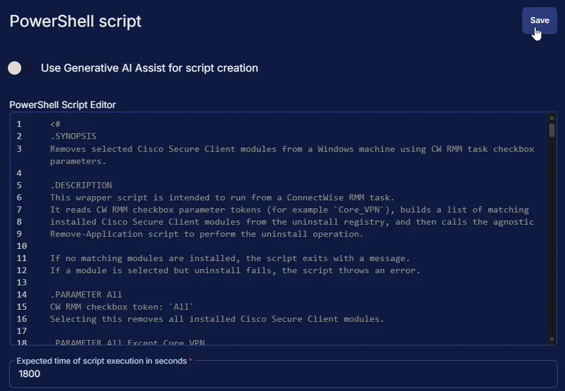

#### Row 2: Script Log

- **Script Log Message:** `%Output%`  
- **Continue on Failure:** `False`  
- **Operating System:** `Windows`

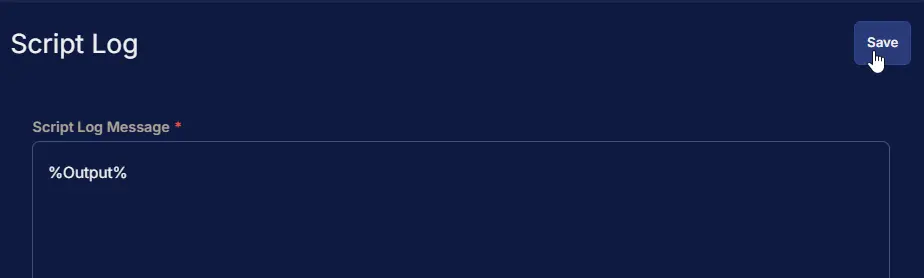

## Completed Script

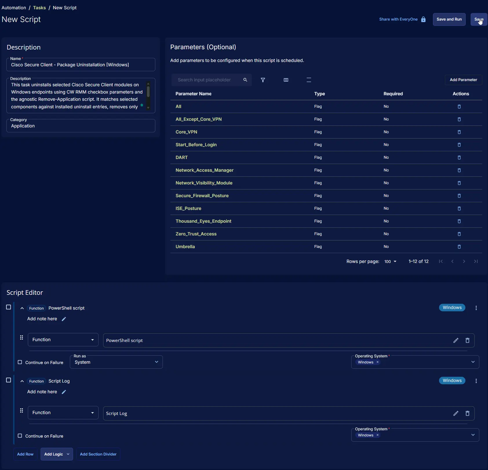

## Output

- Script Log

## Changelog

### 2026-03-30

- Initial version of the document
