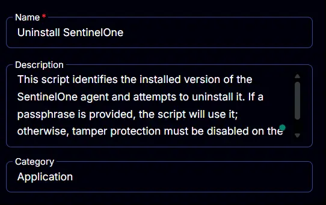
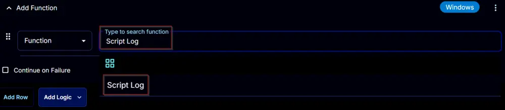

## Summary

This script identifies the installed version of the SentinelOne agent and attempts to uninstall it. If a passphrase is provided, the script will use it; otherwise, tamper protection must be disabled on the computer to proceed with the removal. CW RMM implementation of the agnostic script [Remove-SentinelOne](/docs/c64c47e7-8da3-46c6-9765-29da85addc2f).

## Sample Run

  
  
  

## Dependencies

[Remove-SentinelOne](/docs/c64c47e7-8da3-46c6-9765-29da85addc2f)

## User Parameters

| Name       | Example         | Required | Type        | Description                                                                                         |
|------------|------------------|----------|-------------|-----------------------------------------------------------------------------------------------------|
| PassPhrase | FQQHCWFQFC==     | False    | Text String | The passphrase used for uninstalling the SentinelOne agent when Anti-Tamper is enabled.           |


## Task Creation

Create a new `Script Editor` style script in the system to implement this Task.

  
  

**Name:** `Uninstall SentinelOne`  
**Description:** `This script identifies the installed version of the SentinelOne agent and attempts to uninstall it. If a passphrase is provided, the script will use it; otherwise, tamper protection must be disabled on the computer to proceed with the removal.`  
**Category:** `Application`  



## Parameters

### PassPhrase:
Add a new parameter by clicking the `Add Parameter` button present at the top-right corner of the screen.


This screen will appear.


- Set `PassPhrase` in the `Parameter Name` field.
- Select `Text String` from the `Parameter Type` dropdown menu.
- Click the `Save` button.


## Task

Navigate to the Script Editor Section and start by adding a row. You can do this by clicking the `Add Row` button at the bottom of the script page.


A blank function will appear.


### Row 1 Function: PowerShell Script
Search and select the `PowerShell Script` function.

  
  

The following function will pop up on the screen:


Paste in the following PowerShell script and set the `Expected time of script execution in seconds` to `300` seconds. Click the `Save` button.

```
#region parameters
$PassPhrase = '@PassPhrase@'
if ( $PassPhrase -match '/S{5,}' -and $PassPhrase -notmatch '/SPassPhrase/S' ) {
    $Parameters = @{
        PassPhrase = $PassPhrase
    }
}
#endregion parameters
#region Setup - Variables
$ProjectName = 'Remove-McAfeeSoftware'
[Net.ServicePointManager]::SecurityProtocol = [enum]::ToObject([Net.SecurityProtocolType], 3072)
$BaseURL = 'https://file.provaltech.com/repo'
$PS1URL = "$BaseURL/script/$ProjectName.ps1"
$WorkingDirectory = "C:/ProgramData/_automation/script/$ProjectName"
$PS1Path = "$WorkingDirectory/$ProjectName.ps1"
$WorkingPath = $WorkingDirectory
$LogPath = "$WorkingDirectory/$ProjectName-log.txt"
$ErrorLogPath = "$WorkingDirectory/$ProjectName-Error.txt"
#endregion
#region Setup - Folder Structure
New-Item -Path $WorkingDirectory -ItemType Directory -ErrorAction SilentlyContinue | Out-Null
$response = Invoke-WebRequest -Uri $PS1URL -UseBasicParsing
if (($response.StatusCode -ne 200) -and (!(Test-Path -Path $PS1Path))) {
    throw "No pre-downloaded script exists and the script '$PS1URL' failed to download. Exiting."
} elseif ($response.StatusCode -eq 200) {
    Remove-Item -Path $PS1Path -ErrorAction SilentlyContinue
    [System.IO.File]::WriteAllLines($PS1Path, $response.Content)
}
if (!(Test-Path -Path $PS1Path)) {
    throw 'An error occurred and the script was unable to be downloaded. Exiting.'
}
#endregion
#region Execution
if ($Parameters) {
    & $PS1Path @Parameters
} else {
    & $PS1Path
}
#endregion
#region log verification
if ( !(Test-Path $LogPath) ) {
    throw 'PowerShell Failure. A Security application seems to have restricted the execution of the PowerShell Script.'
}
if ( Test-Path $ErrorLogPath ) {
    $ErrorContent = ( Get-Content -Path $ErrorLogPath )
    throw $ErrorContent
}
Get-Content -Path $LogPath
#endregion
```


### Row 2 Function: Script Log
Add a new row by clicking the `Add Row` button.


A blank function will appear.


Search and select the `Script Log` function.



The following function will pop up on the screen:


In the script log message, simply type `%Output%` and click the `Save` button.


Click the `Save` button at the top-right corner of the screen to save the script.


## Completed Script


## Output

- Script log
