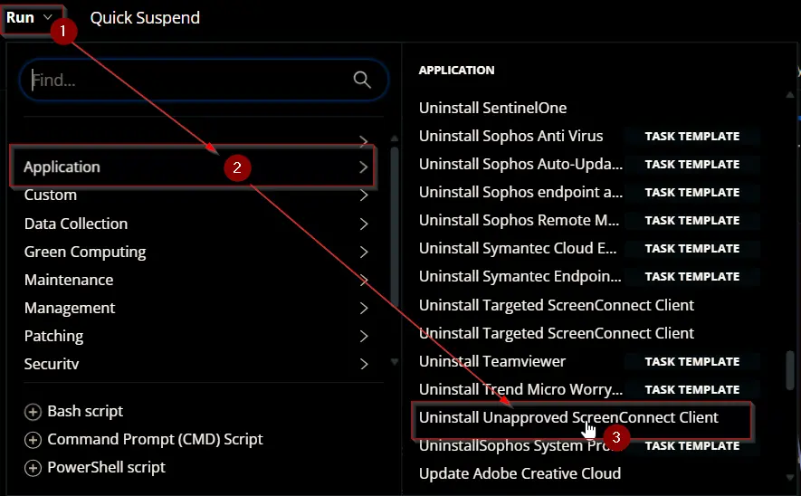
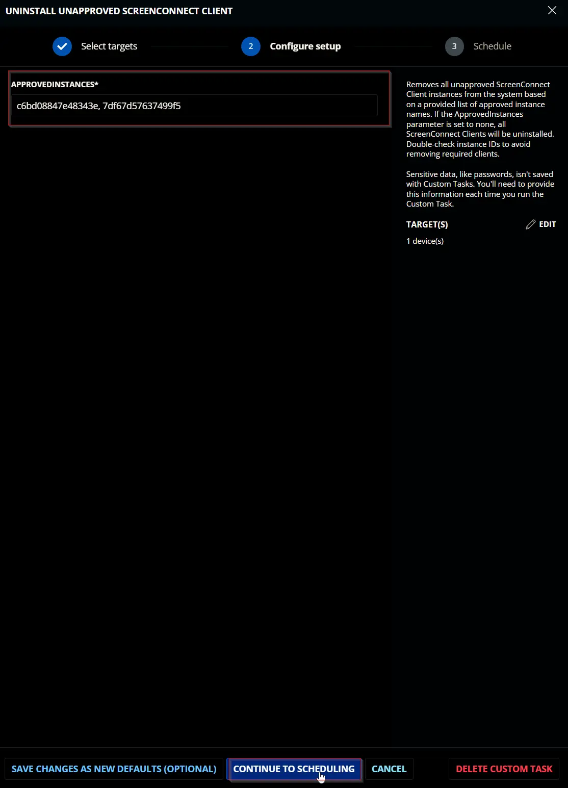
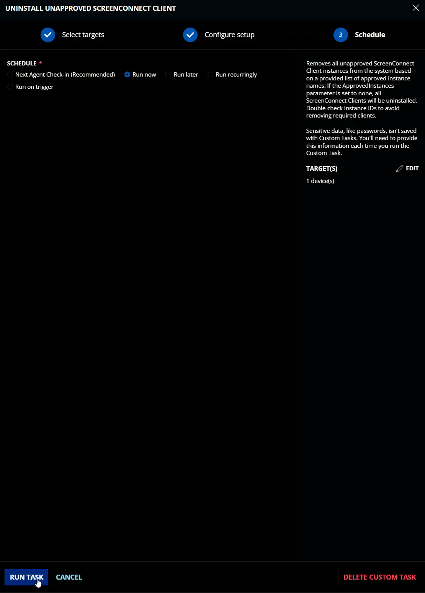
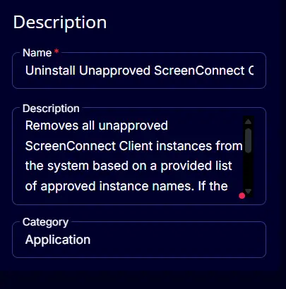
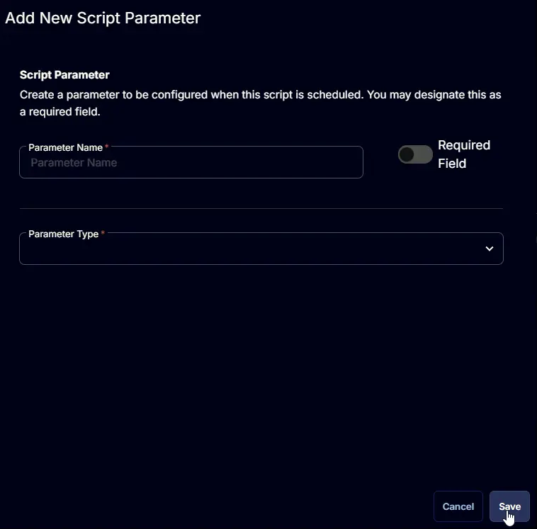
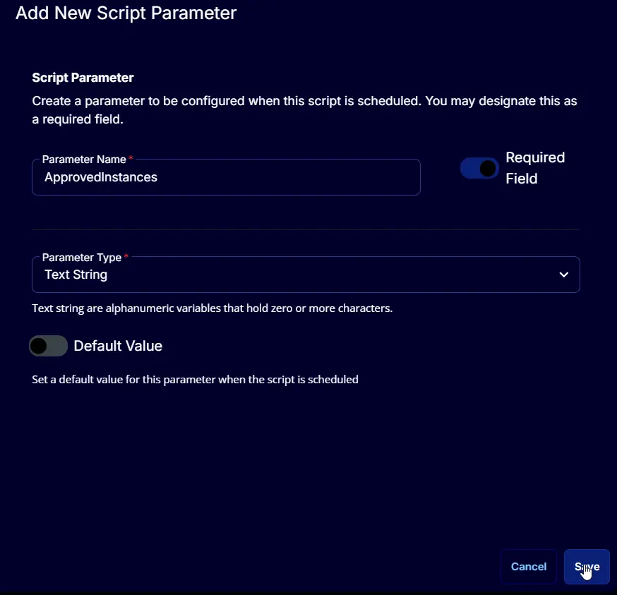
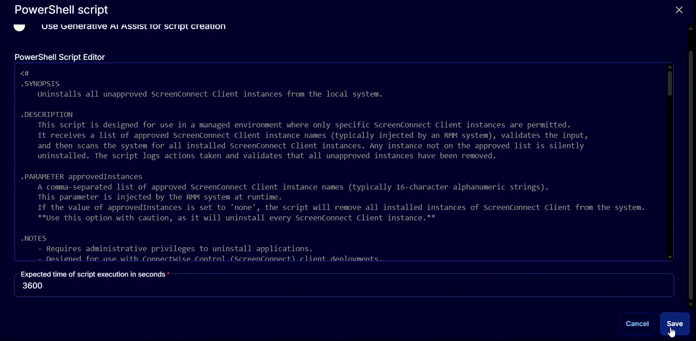
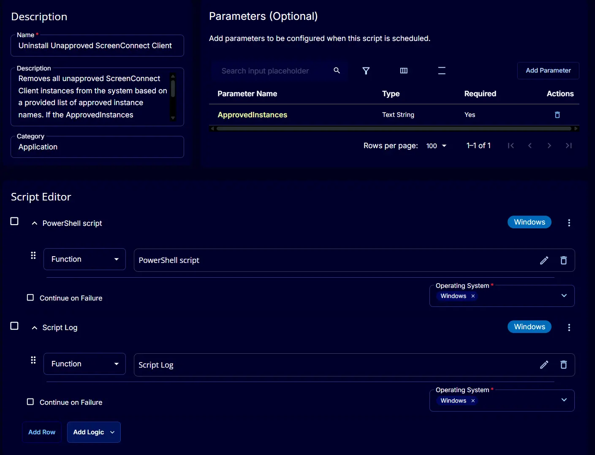

## Summary

This script is intended for managed environments where only designated ScreenConnect Client instances are allowed.  
It takes a parameter containing the names of approved ScreenConnect Client instances, verifies the input, and scans the system for all installed instances. Any instance not included in the approved list is silently uninstalled. The script records all actions and confirms that unapproved instances have been removed.

**If the ApprovedInstances parameter is set to `none`, the script will uninstall every ScreenConnect Client instance present on the system.**

<span style={{color:'red'}}>**EXERCISE EXTREME CAUTION – Double-check the InstanceIds before running the script. Using an incorrect InstanceId may result in the removal of integrated ScreenConnect Client.**</span>

## Sample Run

  



## User Parameters

| Name | Example | Accepted Values | Required | Default | Type | Description |
| ---- | ------- | --------------- | -------- | ------- | ---- | ----------- |
| **ApprovedInstances** | `56bd08847e48343f, 9df67d57637499f3` | | True | | Text String | A comma-separated list of approved ScreenConnect Client instance names (typically 16-character alphanumeric strings). If the value is set to 'none', the script will remove all installed instances of ScreenConnect Client from the system. **Use this option with caution, as it will uninstall every ScreenConnect Client instance.** |

## Task Creation

### Script Details

#### Step 1

Navigate to `Automation` ➞ `Tasks`  


#### Step 2

Create a new `Script Editor` style task by choosing the `Script Editor` option from the `Add` dropdown menu  


The `New Script` page will appear on clicking the `Script Editor` button:  


#### Step 3

Fill in the following details in the `Description` section:  

- **Name:** `Uninstall Unapproved ScreenConnect Client`  
- **Description:**  `Removes all unapproved ScreenConnect Client instances from the system based on a provided list of approved instance names. If the ApprovedInstances parameter is set to none, all ScreenConnect Clients will be uninstalled. Double-check instance IDs to avoid removing required clients.`

- **Category:** `Application`



### Parameters

#### **ApprovedInstances**

Locate the `Add Parameter` button on the right-hand side of the screen and click on it to create a new parameter.  


The `Add New Script Parameter` page will appear on clicking the `Add Parameter` button.  


Configure the parameter as described below:  
- **Parameter Name:** `ApprovedInstances`  
- **Required Field:** `True`  
- **Parameter Type:** `Text String`  
- **Default Value:** `False`  

Click the `Save` button to add the parameter.  


Read the message that will appear after clicking the `Save` button and click the `Confirm` button to save the changes.  


### Script Editor

Click the `Add Row` button in the `Script Editor` section to start creating the script  


A blank function will appear:  


#### Row 1 Function: PowerShell

Search and select the `PowerShell Script` function.  
  
  

The following function will pop up on the screen:  


Paste in the following PowerShell script and set the `Expected time of script execution in seconds` to `3600` seconds. Click the `Save` button.

```PowerShell
<#
.SYNOPSIS
    Uninstalls all unapproved ScreenConnect Client instances from the local system.

.DESCRIPTION
    This script is designed for use in a managed environment where only specific ScreenConnect Client instances are permitted.
    It receives a list of approved ScreenConnect Client instance names (typically injected by an RMM system), validates the input,
    and then scans the system for all installed ScreenConnect Client instances. Any instance not on the approved list is silently
    uninstalled. The script logs actions taken and validates that all unapproved instances have been removed.

.PARAMETER approvedInstances
    A comma-separated list of approved ScreenConnect Client instance names (typically 16-character alphanumeric strings).
    This parameter is injected by the RMM system at runtime.
    If the value of approvedInstances is set to 'none', the script will remove all installed instances of ScreenConnect Client from the system.
    **Use this option with caution, as it will uninstall every ScreenConnect Client instance.**

.NOTES
    - Requires administrative privileges to uninstall applications.
    - Designed for use with ConnectWise Control (ScreenConnect) client deployments.
    - Supports both 32-bit and 64-bit application registry locations.

.ACTIONS PERFORMED
    1. Validates the format and presence of the approvedInstances parameter.
    2. Logs the list of approved ScreenConnect Client instances for auditing.
    3. Prepares the approved instance list for use in regular expression matching.
    4. Enumerates all installed ScreenConnect Client instances from both 32-bit and 64-bit registry uninstall locations.
    5. Identifies any installed ScreenConnect Client instances that are NOT on the approved list.
    6. If unapproved instances are found:
        a. Logs the names of unapproved instances to be removed.
        b. Uninstalls each unapproved instance silently using msiexec.
    7. If no unapproved instances are found:
        a. Logs and returns a message listing all currently installed ScreenConnect Client instances.
    8. After attempted removal, verifies that no unapproved instances remain.
    9. If any unapproved instances could not be removed, throws an error listing them.
    10. If all unapproved instances were successfully removed, logs and returns a message listing the remaining approved instances.

.EXAMPLE
    .\Uninstall-UnapprovedScreenConnectClient.ps1

    This command will execute the script, removing any unapproved ScreenConnect Client instances as determined by the injected
    approvedInstances parameter. If approvedInstances is set to 'none', all ScreenConnect Client instances will be removed.

#>
#region CW RMM variables

# The list of approved ScreenConnect Client instance names, injected by RMM system
$approvedInstances = '@approvedInstances@'

# Validate the approvedInstances variable for correct format and presence
if (
    !$approvedInstances -or
    $approvedInstances -match '\SApprovedInstances\S' -or
    $approvedInstances -notmatch '(^[0-9A-z]{16},{0,}|^none$)'
) {
    throw 'The Approved Instances parameter is invalid or not properly configured.'
}

# Output the list of approved instances for logging purposes
if ($approvedInstances -eq 'none') {
    Write-Output 'The ''approvedInstances'' parameter is set to ''none''. Proceeding to uninstall all ScreenConnect Client instances currently installed on this system.'
} else {
    Write-Output ("Approved ScreenConnect Client Instances: '{0}'" -f $approvedInstances)
}
# Remove whitespace and convert comma-separated list to regex alternation for matching
$approvedInstances = $approvedInstances -replace '\s', '' -replace ',', '|'
#endRegion

#region Variables

# Define registry paths where installed applications are listed (both 32-bit and 64-bit)
$uninstallPaths = @(
    'HKLM:\SOFTWARE\Microsoft\Windows\CurrentVersion\Uninstall',
    'HKLM:\SOFTWARE\Wow6432Node\Microsoft\Windows\CurrentVersion\Uninstall'
)
#endRegion

#region Get ScreenConnect Instances to Remove

# Retrieve all installed ScreenConnect Client instances that are NOT approved
$instanceToRemove = Get-ChildItem -Path $uninstallPaths | Get-ItemProperty | Where-Object {
    $_.DisplayName -match 'ScreenConnect Client' -and $_.DisplayName -notmatch $approvedInstances
}

if ($instanceToRemove) {
    # Log the unapproved instances that will be removed
    Write-Output ("The following unapproved ScreenConnect Client instances will be uninstalled:`n{0}" -f ($instanceToRemove.DisplayName | Out-String))
} else {
    # If no unapproved instances are found, list all installed ScreenConnect Client instances and exit
    $installedInstances = Get-ChildItem -Path $uninstallPaths | Get-ItemProperty | Where-Object {
        $_.DisplayName -match 'ScreenConnect Client'
    }
    return @"
No unapproved ScreenConnect Client instances were detected.
Currently installed ScreenConnect Client instances:
$($installedInstances.DisplayName | Out-String)
"@
}
#endRegion

#region Uninstall

# Uninstall each unapproved ScreenConnect Client instance found
foreach ($instance in $instanceToRemove) {
    $guid = $instance.PSChildName
    $argumentList = @(
        '/x',         # Uninstall
        $guid,        # Product GUID
        '/quiet',     # Silent mode
        '/norestart'  # Do not restart after uninstall
    )
    Start-Process 'msiexec.exe' -ArgumentList $argumentList -Wait
}
#endRegion

#region Validation

# Verify that all unapproved instances have been removed
$postRemovalInstances = Get-ChildItem -Path $uninstallPaths | Get-ItemProperty | Where-Object {
    $_.DisplayName -match 'ScreenConnect Client' -and $_.DisplayName -notmatch $approvedInstances
}

if ($postRemovalInstances) {
    # If any unapproved instances remain, throw an error with details
    throw ("The following unapproved ScreenConnect Client instances could not be removed:`n{0}" -f ($postRemovalInstances.DisplayName | Out-String))
} else {
    # Otherwise, confirm successful removal and list all remaining ScreenConnect Client instances
    $installedInstances = Get-ChildItem -Path $uninstallPaths | Get-ItemProperty | Where-Object {
        $_.DisplayName -match 'ScreenConnect Client'
    }
    return @"
All unapproved ScreenConnect Client instances have been successfully removed.
Currently installed ScreenConnect Client instances:
$($installedInstances.DisplayName | Out-String)
"@
}
#endRegion
```



#### Row 2 Function: Script Log

Add a new row by clicking the `Add Row` button.  


A blank function will appear.  


Search and select the `Script Log` function.  


The following function will pop up on the screen:  


In the script log message, simply type `%Output%` and click the `Save` button.  


## Save Task

Click the `Save` button at the top-right corner of the screen to save the script.  


## Completed Task



## Output

- Script logs  
