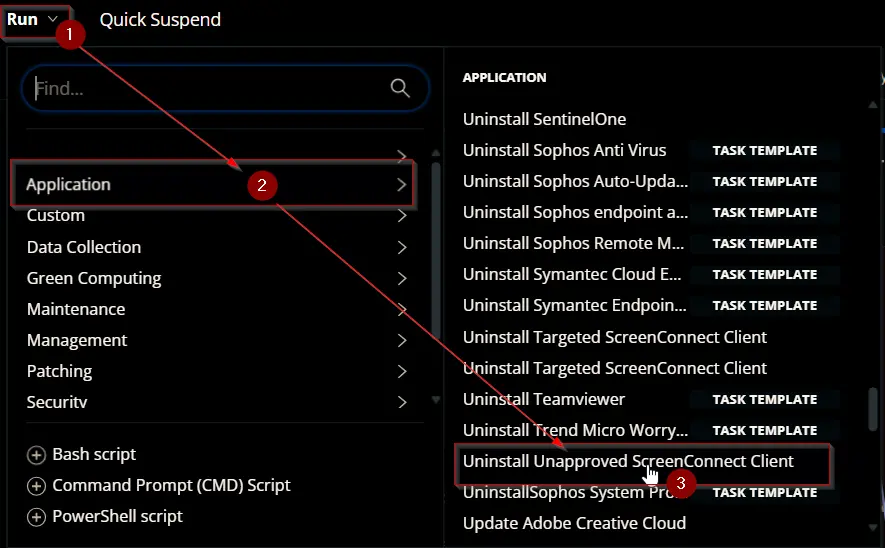
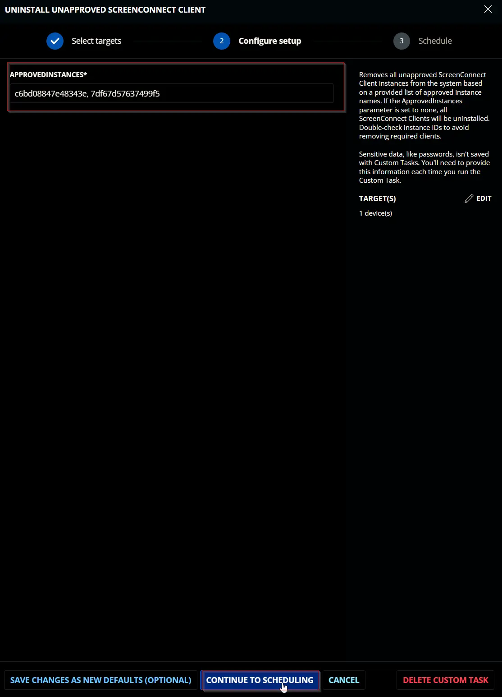
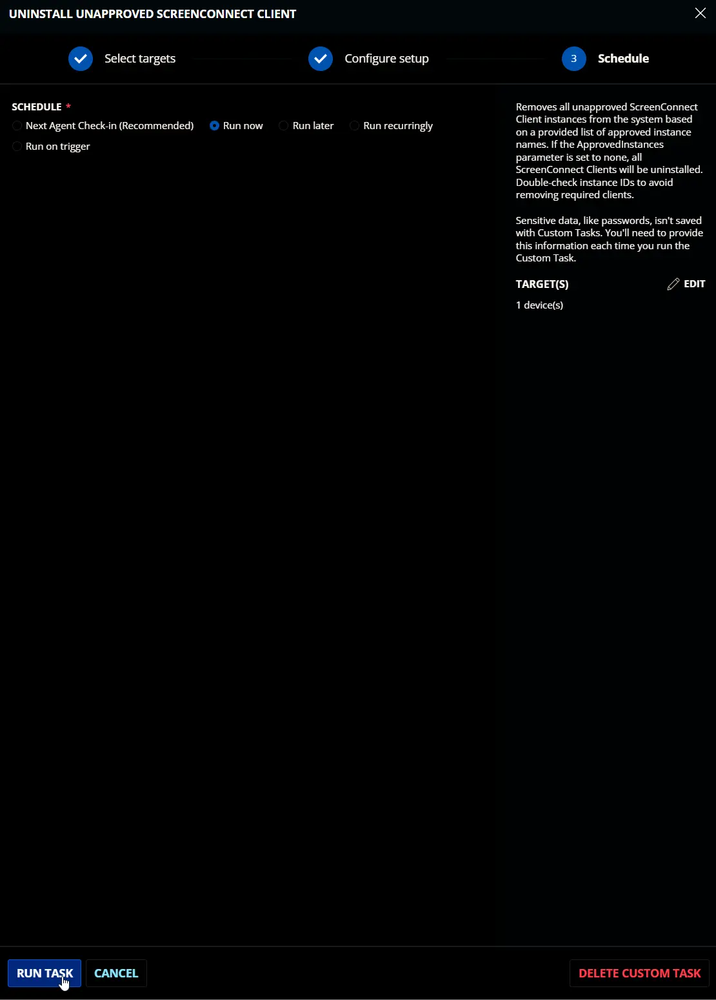
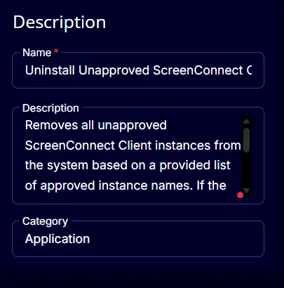
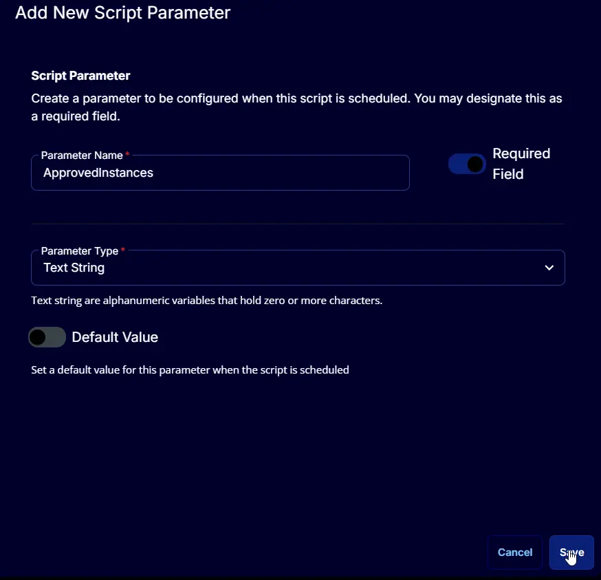
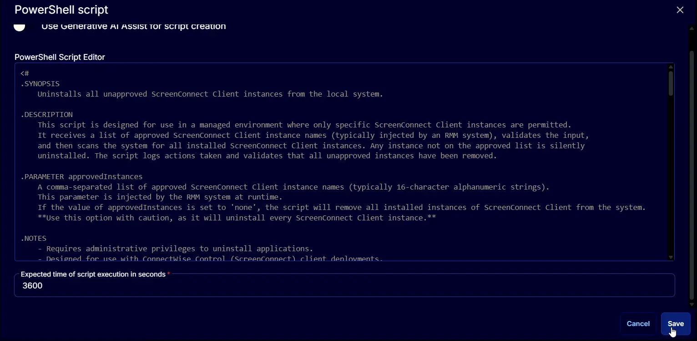
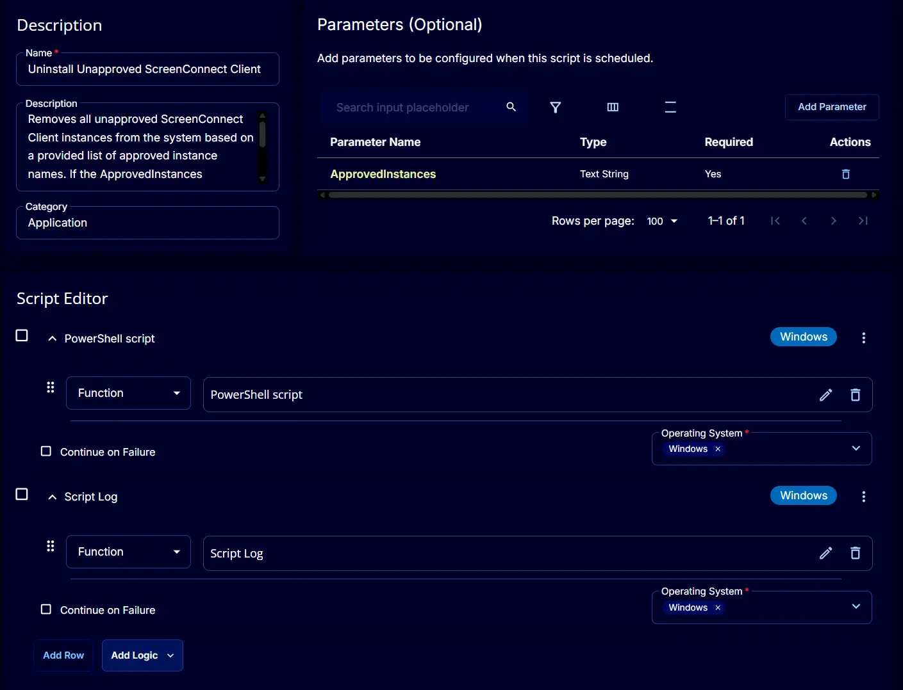

## Summary

This script is intended for managed environments where only designated ScreenConnect Client instances are allowed.  
It takes a parameter containing the names of approved ScreenConnect Client instances, verifies the input, and scans the system for all installed instances. Any instance not included in the approved list is silently uninstalled. The script records all actions and confirms that unapproved instances have been removed.

**If the ApprovedInstances parameter is set to `none`, the script will uninstall every ScreenConnect Client instance present on the system.**

**EXERCISE EXTREME CAUTION – Double-check the InstanceIds before running the script. Using an incorrect InstanceId may result in the removal of integrated ScreenConnect Client.**

## Sample Run

  

## User Parameters

| Name | Example | Accepted Values | Required | Default | Type | Description |
| ---- | ------- | --------------- | -------- | ------- | ---- | ----------- |
| **ApprovedInstances** | `56bd08847e48343f, 9df67d57637499f3` | | True | | Text String | A comma-separated list of approved ScreenConnect Client instance names (typically 16-character alphanumeric strings). If the value is set to 'none', the script will remove all installed instances of ScreenConnect Client from the system. **Use this option with caution, as it will uninstall every ScreenConnect Client instance.** |

## Task Creation

### Script Details

#### Step 1

Navigate to `Automation` ➞ `Tasks`  

#### Step 2

Create a new `Script Editor` style task by choosing the `Script Editor` option from the `Add` dropdown menu  

The `New Script` page will appear on clicking the `Script Editor` button:  

#### Step 3

Fill in the following details in the `Description` section:  

- **Name:** `Uninstall Unapproved ScreenConnect Client`  
- **Description:**  `Removes all unapproved ScreenConnect Client instances from the system based on a provided list of approved instance names. If the ApprovedInstances parameter is set to none, all ScreenConnect Clients will be uninstalled. Double-check instance IDs to avoid removing required clients.`

- **Category:** `Application`

### Parameters

#### **ApprovedInstances**

Locate the `Add Parameter` button on the right-hand side of the screen and click on it to create a new parameter.  

The `Add New Script Parameter` page will appear on clicking the `Add Parameter` button.  

Configure the parameter as described below:  
- **Parameter Name:** `ApprovedInstances`  
- **Required Field:** `True`  
- **Parameter Type:** `Text String`  
- **Default Value:** `False`  

Click the `Save` button to add the parameter.  

Read the message that will appear after clicking the `Save` button and click the `Confirm` button to save the changes.  

### Script Editor

Click the `Add Row` button in the `Script Editor` section to start creating the script  

A blank function will appear:  

#### Row 1 Function: PowerShell

Search and select the `PowerShell Script` function.  
  
  

The following function will pop up on the screen:  

Paste in the following PowerShell script and set the `Expected time of script execution in seconds` to `3600` seconds. Click the `Save` button.

[PowerShell Script](https://github.com/ProVal-Tech/cw-rmm/blob/main/tasks/uninstall-unapproved-screenconnect-client/script.ps1)

#### Row 2 Function: Script Log

Add a new row by clicking the `Add Row` button.  

A blank function will appear.  

Search and select the `Script Log` function.  

The following function will pop up on the screen:  

In the script log message, simply type `%Output%` and click the `Save` button.  

## Save Task

Click the `Save` button at the top-right corner of the screen to save the script.  

## Completed Task

## Output

- Script logs

## Changelog

### 2025-06-09

- Initial version of the document

