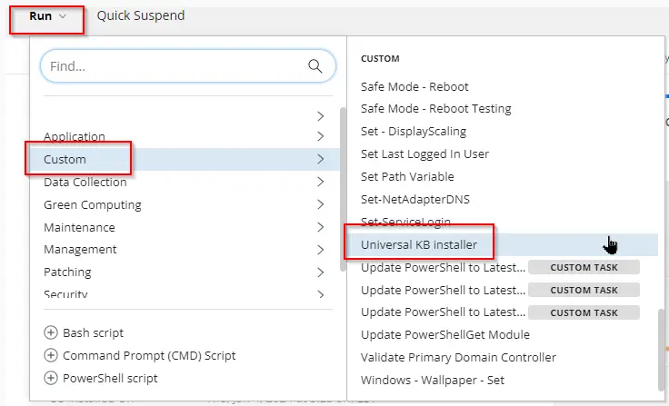
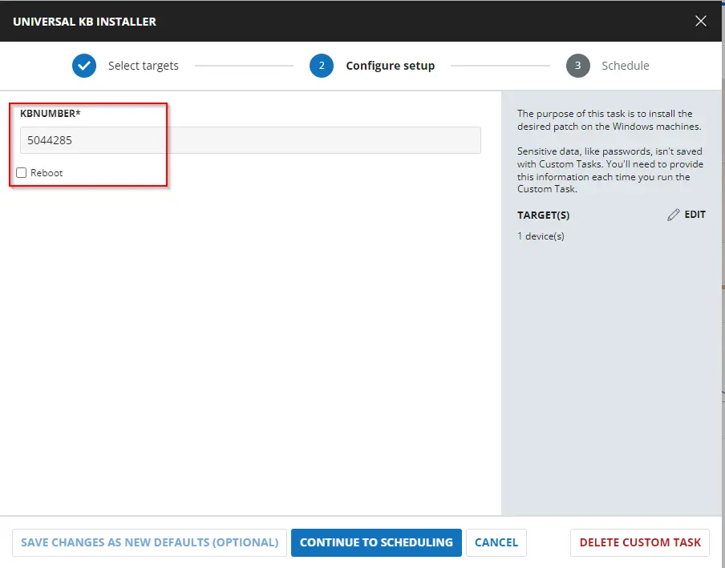
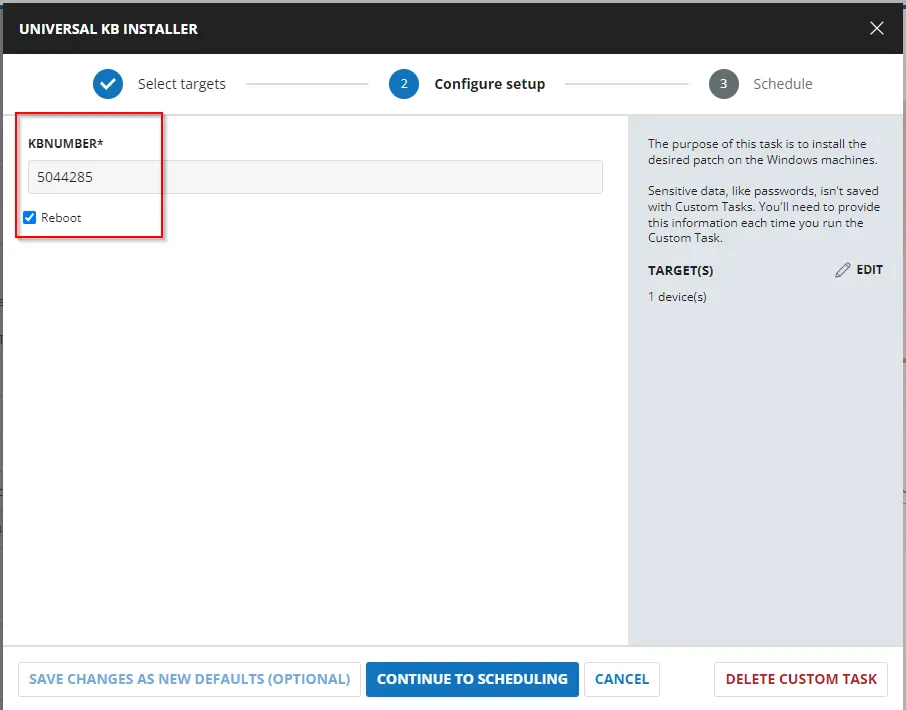
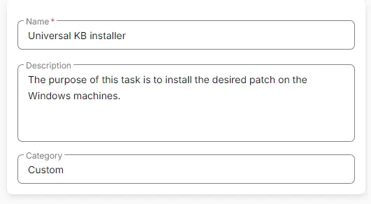
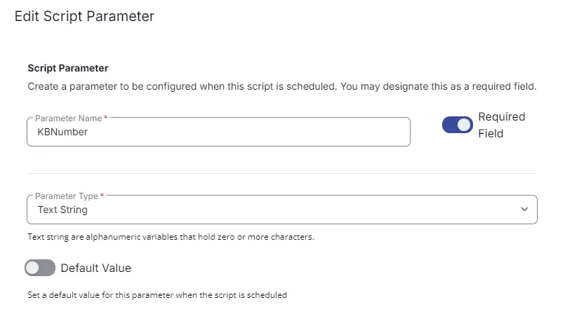
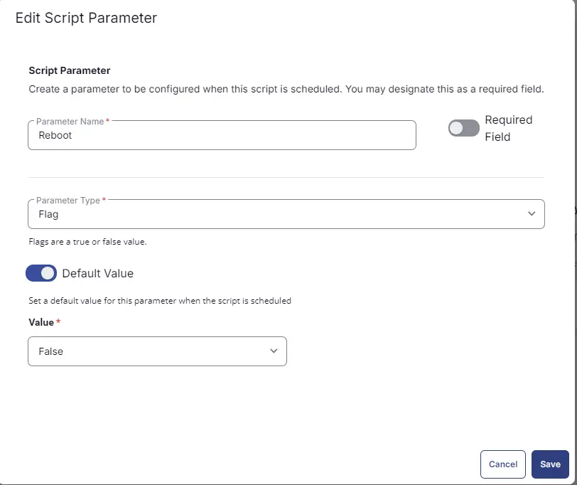
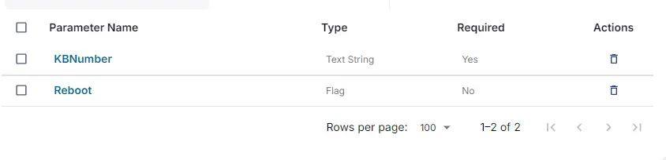

## Summary

The purpose of this task is to install the desired patch on the Windows machines.

## Sample Run



Leave the Reboot parameter unticked to prevent the machine from rebooting.



Tick the Reboot parameter to reboot the machine.



## User Parameters

| Name      | Example   | Accepted Values | Required | Default | Type   | Description                                                  |
|-----------|-----------|-----------------|----------|---------|--------|--------------------------------------------------------------|
| `KBNumber`| 5044285   | KB ID Number    | True     |         | String | KB ID Number of the patch that needs to be installed.       |
| `Reboot`  | Unmarked  |                 | False    | $false  | Flag   | Select it to reboot the machine during task execution.      |

## Task Creation

Create a new `Script Editor` style script in the system to implement this task.


**Name:** Universal KB Installer  
**Description:** The purpose of this task is to install the desired patch on the Windows machines.  
**Category:** Custom  



## Parameters

Add a new parameter by clicking the `Add Parameter` button present at the top-right corner of the screen.


This screen will appear.


- Set `KBNumber` in the `Parameter Name` field.
- Select `String` from the `Parameter Type` dropdown menu.
- Toggle the Required Field.
- Click the `Save` button.



It will ask for confirmation to proceed. Click the `Confirm` button to create the parameter.


Add another parameter by clicking the `Add Parameter` button present at the top-right corner of the screen.


- Set `Reboot` in the `Parameter Name` field.
- Select `Flag` from the `Parameter Type` dropdown menu.
- Toggle the Default Value.
- Set Default Value as `False`.
- Click the `Save` button.
- Click the `Confirm` button to create the parameter.



Parameters will look like as shown below:



## Task

Navigate to the Script Editor section and start by adding a row. You can do this by clicking the `Add Row` button at the bottom of the script page.


A blank function will appear.


### Row 1 Function: PowerShell Script

Search and select the `PowerShell Script` function.


The following function will pop up on the screen:


Paste in the following PowerShell script and set the expected time of script execution to `900` seconds. Click the `Save` button.

```powershell
if ( '@KBNumber@' -notmatch '[0-9]'){
    throw "Valid KB ID is required to install the patch"
} else {
    $KBNumber = '@KBNumber@'
}

if ( '@Reboot@' -match '1|Yes|True|Y') {
    $Reboot  = '1'
} else {
    $Reboot  = '0'
}

$ProgressPreference = 'SilentlyContinue'
[Net.ServicePointManager]::SecurityProtocol = [Enum]::ToObject([Net.SecurityProtocolType], 3072)
Get-PackageProvider -Name NuGet -ForceBootstrap | Out-Null
if ( !( Get-PSrepository -Name 'PSGallery' -ErrorAction SilentlyContinue ) ) {
    Register-PSRepository -Name PSGallery -SourceLocation '
https://www.powershellgallery.com/api/v2'
}
Set-PSRepository -Name PSGallery -InstallationPolicy Trusted
try {
    Update-Module -Name pswindowsupdate -ErrorAction Stop
} catch {
    Install-Module -Name pswindowsupdate -Repository PSGallery -SkipPublisherCheck -Force
    Get-Module -Name pswindowsupdate -ListAvailable | Where-Object { $_.Version -ne (Get-InstalledModule -Name pswindowsupdate).Version } | ForEach-Object { Uninstall-Module -Name pswindowsupdate -MaximumVersion $_.Version }
}
Import-Module -Name 'pswindowsupdate'

$isInstalled = Get-HotFix -Id $KBNumber -ErrorAction SilentlyContinue
if ($isInstalled) {
    return "$KBNumber is already installed."
}

$RebootRequired = (Get-WindowsUpdate -KBArticleID $KBNumber).RebootRequired
if ($Reboot -eq '1' -and $RebootRequired -eq 'True') {
   try {
    Get-WindowsUpdate -KBArticleID $KBNumber -Install -AcceptAll -AutoReboot
}
 catch {
    throw "Failed to install KBArticleID $KBNumber. Error: $_.Exception.Message"
}
}
else {
try {
    Get-WindowsUpdate -KBArticleID $KBNumber -Install -IgnoreReboot -AcceptAll
} catch {
    throw "Failed to install KBArticleID $KBNumber. Error: $_.Exception.Message"
}
}
```

### Row 2 Function: Script Log

In the script log message, simply type `%output%` so that the script will send the results of the PowerShell script above to the output on the Automation tab for the target device.


## Completed Task


## Output

- Script Log
