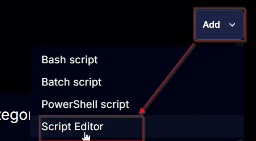
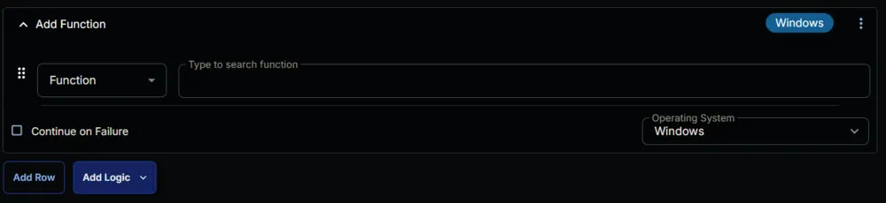
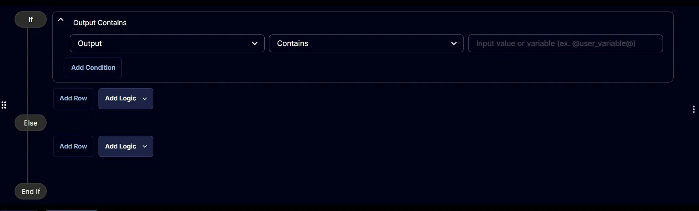
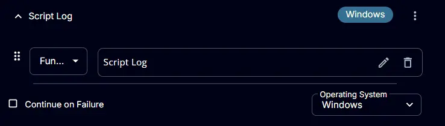

## Summary

This Script identifies unknown user-profiles and generates a ticket containing their details. If the computer's domain trust relationship is broken, the script will create a ticket indicating the broken trust relationship instead of listing unknown user profiles. Note that PowerShell 5 is required to run this script, and domain controllers are excluded from its scope.

## Sample Run

  


## Task Creation

Create a new `Script Editor` style script in the system to implement this task.  
  


**Name:** `Unknown User Profiles`  
**Description:** `This script identifies unknown user-profiles and generates a ticket containing their details. If the computer's domain trust relationship is broken, the script will create a ticket indicating the broken trust relationship instead of listing unknown user profiles. Note that PowerShell 5 is required to run this script, and domain controllers are excluded from its scope.`  
**Category:** `Custom`  


## Task

Navigate to the Script Editor section and start by adding a row. You can do this by clicking the `Add Row` button at the bottom of the script page.  
  

A blank function will appear.  


### Row 1 Function: Set Pre-defined Variable

- Search and select the `Set Pre-defined Variable` function
- **Variable:** `Computer`
- **System Variable:** `Endpoint` **>>** `Asset` **>>** `friendlyName`
- Click the `save` button to save the function.  

  
  


### Row 2 Function: PowerShell Script

Add a new row by clicking the `Add Row` button.  


A blank function will appear.  
  

Search and select the `Powershell Script` function.  
The following function will pop up on the screen:  


Paste in the following PowerShell script and set the `Expected time of script execution in seconds` to `1800` seconds. Click the `Save` button.

```PowerShell
#requires -Version 5

[Net.ServicePointManager]::SecurityProtocol = [enum]::ToObject([Net.SecurityProtocolType], 3072)
#domain Controller check
$domainRole = (Get-CimInstance -Class Win32_ComputerSystem -ErrorAction SilentlyContinue).domainrole
if ($domainRole -in (4, 5)) {
    throw 'Domain Controllers are not supported.'
}
#domain Trust Relationship Validation
if ($domainRole -in (2, 3)) {
    try {
        $domain = [System.DirectoryServices.ActiveDirectory.Domain]::GetCurrentDomain()
    } catch {
        return "Domain Trust Relationship between the computer ($Env:ComputerName) and it's domain ($env:userdomain) is broken. Error: $($Error[0].Exception.Message)"
    }
}
#region Setup - Variables
$ErrorActionPreference = 'SilentlyContinue'
$ProjectName = 'Get-UserProfiles'
$BaseURL = 'https://file.provaltech.com/repo'
$PS1URL = "$BaseURL/script/$ProjectName.ps1"
$WorkingDirectory = "C:\ProgramData\_automation\script\$ProjectName"
$PS1Path = "$WorkingDirectory\$ProjectName.ps1"
$WorkingPath = $WorkingDirectory
#endregion
#region Setup - Folder Structure
New-Item -Path $WorkingDirectory -ItemType Directory -ErrorAction SilentlyContinue | Out-Null
try {
    Invoke-WebRequest -Uri $PS1URL -OutFile $PS1path -UseBasicParsing -ErrorAction Stop
} catch {
    if (!(Test-Path -Path $PS1Path )) {
        throw ('Failed to download the script from ''{0}'', and no local copy of the script exists on the machine. Reason: {1}' -f $PS1URL, $($Error[0].Exception.Message))
    }
}
#endregion
#region Execution
$output = & $PS1Path
#endregion
#region Output
$inferredProfiles = $output | Where-Object { $_.UserName -match 'Inferred' }
if ( $inferredProfiles ) {
    Write-Output "$($inferredProfiles.count) Unknown user profiles detected on $Env:ComputerName.`nDetails:`n"
    $inferredProfiles
} else {
    return 'No Inferred profiles detected'
}
#endregion
```  
  
  

### Row 3 Logic: If/Then/Else

Add a new `If/Then/Else logic` from the `Add Logic` dropdown menu  
 

A blank logic will appear  
 

### Row 3a Condition: Output Contains

Set the condition to: 

`Output` `Contains` `Domain Controllers are not Supported`  
`Or`  
`Output` `Contains` `No pre-downloaded script exists and the script`  
`Or`  
`Output` `Contains` `An error occurred and the script was unable to be downloaded`  
  

### Row 3b Function: Script Exit

Add a new row by clicking the `Add Row` button inside the `If` section.  
 

A blank function will appear.  
  

Search and select the `Script Exit` function.  
The following function will pop up on the screen:  
  

Type `%Output%` in the `Error Message` and click the `Save` button to save the function.  
  
  

### Row 3c Logic: If/Then/Else

Add a new `If/Then/Else logic` from the `Add Logic` dropdown menu inside the `Else` section.  
 

A blank logic will appear  
 

### Row 3c(i) Condition: Output Contains

Set the condition to:

`Output` `Contains` `Domain Trust Relationship between the computer`  
 

### Row 3c(ii) Function: Create Ticket

Add a new row by clicking the `Add Row` button inside the `If` section.  
 

A blank function will appear.  
  

Search and select the `Create Ticket` function.  
The following function will pop up on the screen:  
  

- **Subject:** `Domain Trust Relationship is broken for @Computer@`  
- **Description:**  
```
    %Output%

    Please resolve the problem to enable the unknown user profile auditing solution.
```  
- **Priority:** `Medium`  
- Click the `Save` button to save the function.  

  


### Row 3c(iii) Function: Script Exit

Add a new row by clicking the `Add Row` button inside the `If` section.  
 

A blank function will appear.  
  

Search and select the `Script Exit` function.  
The following function will pop up on the screen:  
  

Type `%Output%` in the `Error Message` and click the `Save` button to save the function.  
  
  

### Row 3c(iv) Logic: If/Then/Else

Add a new `If/Then/Else logic` from the `Add Logic` dropdown menu inside the internal `Else` section.  
 

A blank logic will appear  
 

### Row 3c(iv)(1) Condition: Output Contains

Set the condition to:

`Output` `Contains` `Unknown user profiles detected on`  


### Row 3c(iv)(2) Function: Create Ticket

Add a new row by clicking the `Add Row` button inside the innermost `If` section.  
 

A blank function will appear.  
  

Search and select the `Create Ticket` function.  
The following function will pop up on the screen:  
  

- **Subject:** `Unknown user profiles detected on @Computer@`  
- **Description:**

```Shell
    %Output%

    Please confirm that the identified user profiles are safe to remove from the computer.
```  

- **Priority:** `Medium`  

- Click the `Save` button to save the function.  

  
  

### Row 3c(iv)(3) Function: Script Log

Add a new row by clicking the `Add Row` button inside the innermost `If` section.  
 

A blank function will appear.  
  

Search and select the `Script Log` function.  
The following function will pop up on the screen:  
  

Type `%Output%` in the `Script Log Message` and click the `Save` button to save the function.  
  
  

### Row 3c(iv)(4) Function: Script Log

Add a new row by clicking the `Add Row` button inside the innermost `Else` section.  
 

A blank function will appear.  
  

Search and select the `Script Log` function.  
The following function will pop up on the screen:  
  

Type `%Output%` in the `Script Log Message` and click the `Save` button to save the function.  
  
  

### Save Task

Click the `Save` button at the top right corner of the screen to save the task.  
  

## Completed Task

  

## Deployment

It is suggested to run the Task once per week against [Unknown User Profiles Detection](/docs/1c950fdd-99f2-4943-9617-a1d13a4b87ec) group.

- Go to Automation > Tasks.
- Search for `Unknown User Profiles` Task.
- Select the concerned task.
- Click on the `Schedule` button to schedule the task/script.  

  

The following screen will appear:  
  

Select the `Schedule` button and click the `calendar icon` to change the recurrence schedule.  


Select the `Weeks` for the `Repeat`, set `M` for `Day`, and click the `OK` button to save the schedule.  
 

Click the `Select Targets` button to select the concerned target.  
  

Search and select the [Unknown User Profiles Detection](/docs/1c950fdd-99f2-4943-9617-a1d13a4b87ec) Device Group for the target.  
  

Click the `Run` button to initiate the schedule.  
  

## Output

- Script Log
- Ticket

### Sample Ticket

  