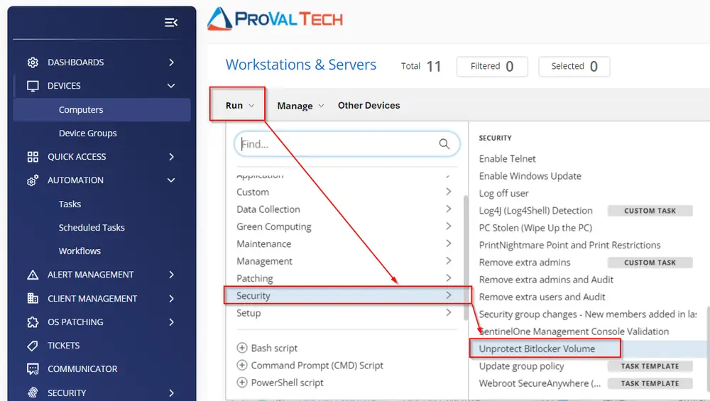
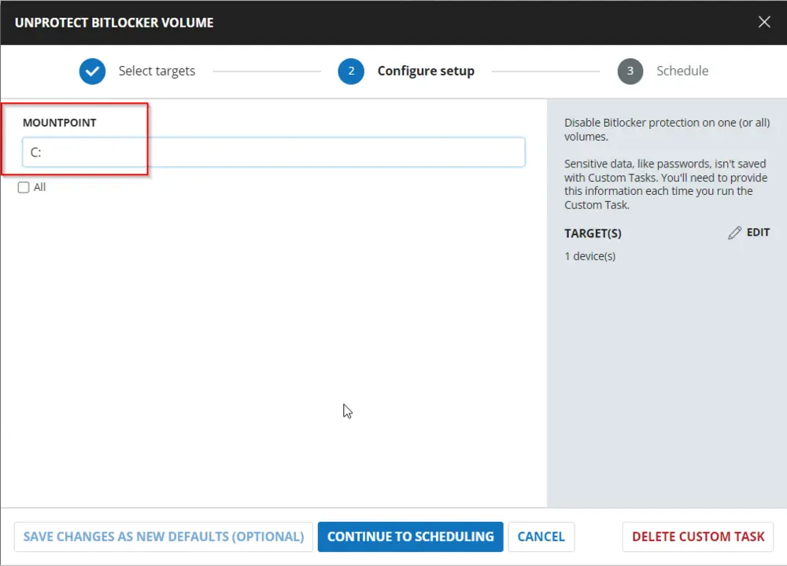
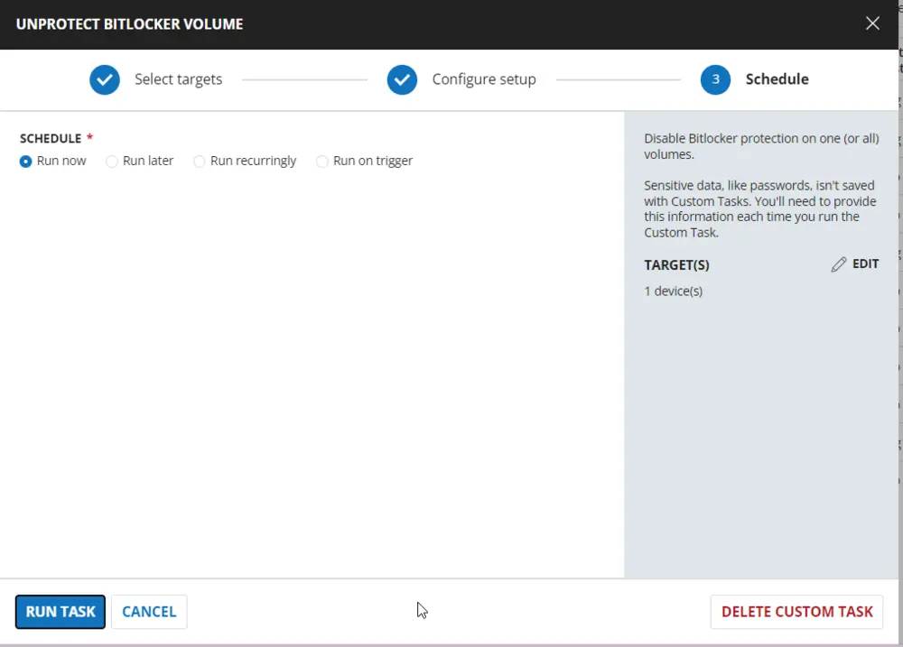
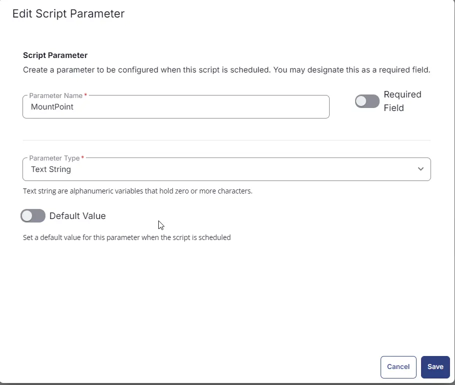
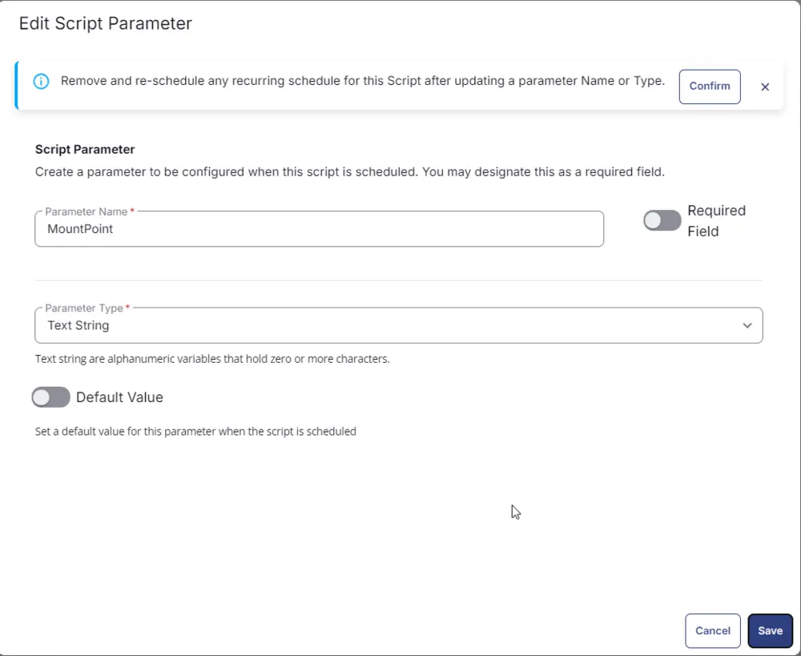
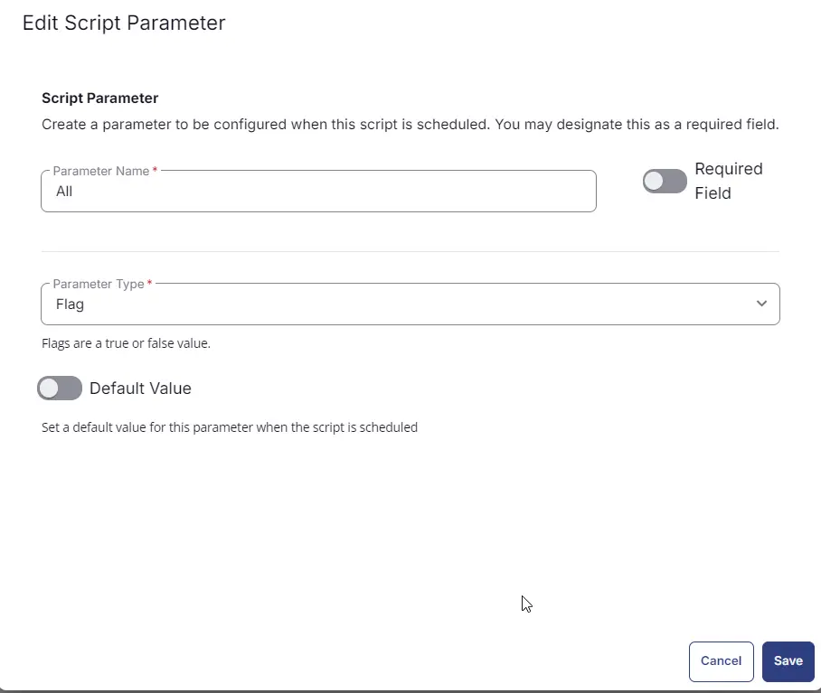
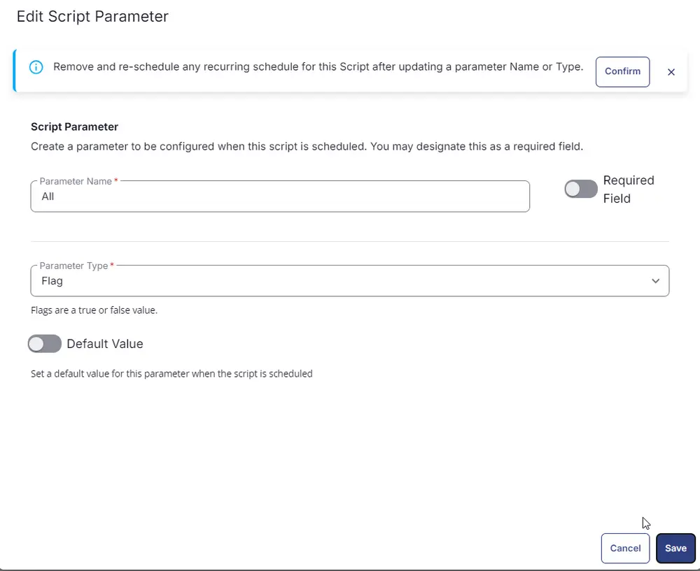
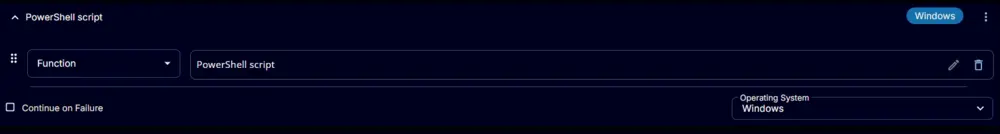
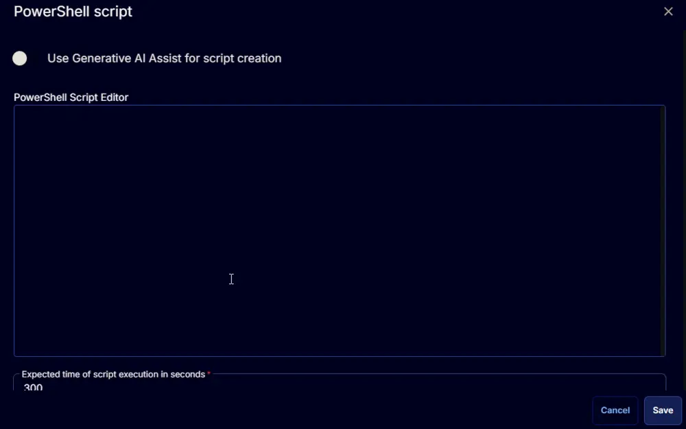
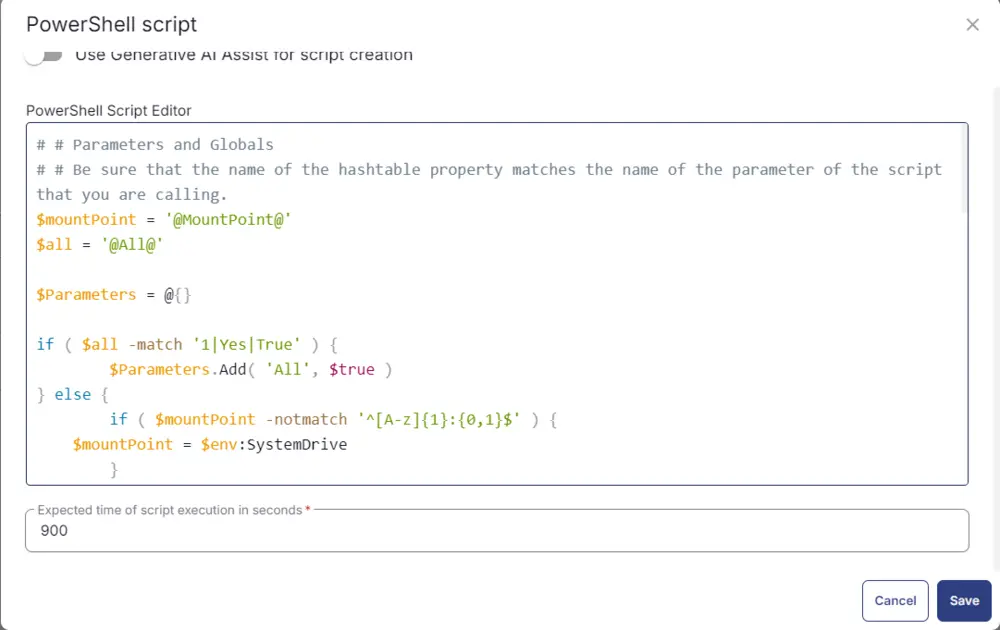

---
id: '904664df-741e-4c18-9667-6bf351b4754c'
slug: /904664df-741e-4c18-9667-6bf351b4754c
title: 'Unprotect Bitlocker Volume'
title_meta: 'Unprotect Bitlocker Volume'
keywords: ['bitlocker', 'protection', 'disable', 'volumes', 'security']
description: 'This document provides detailed instructions on how to disable Bitlocker protection on one or all volumes. It includes sample runs, dependencies, user parameters, task creation steps, and script execution details.'
tags: ['encryption', 'security', 'setup', 'windows']
draft: false
unlisted: false
last_update:
  date: 2025-11-27
---

## Summary

Disable Bitlocker protection on one (or all) volumes.

## Sample Run

  
  
  

## Dependencies

[Unprotect-BitLockerVolume](/docs/22114d12-c60e-479e-93a5-50d3450b6631)

## User Parameters

| Name       | Example       | Required   | Description                                                        |
|------------|---------------|------------|--------------------------------------------------------------------|
| MountPoint | C:            | Partially  | The target volume to remove Bitlocker protection from.             |
| All        | True / False  | Partially  | Use this switch to remove Bitlocker protection from all volumes.   |

**Note:**

- The `All` parameter will take precedence if both parameters are specified.
- If no parameters are set, the script will attempt to disable BitLocker on the system drive.

## Task Creation

Create a new `Script Editor` style script in the system to implement this task.  

  
  

**Name:** Unprotect Bitlocker Volume  
**Description:** Disable Bitlocker protection on one (or all) volumes.  
**Category:** Security  

### Parameters

Add a new parameter by clicking the `Add Parameter` button present at the top-right corner of the screen.  

  

This screen will appear.  

  

- Set `MountPoint` in the `Parameter Name` field.
- Select `Text String` from the `Parameter Type` dropdown menu.
- Click the `Save` button.  

  

Click the `Confirm` button to save the parameter.  

  

Add a new parameter by clicking the `Add Parameter` button present at the top-right corner of the screen.  

  

This screen will appear.  

  

- Set `All` in the `Parameter Name` field.
- Select `Flag` from the `Parameter Type` dropdown menu.
- Click the `Save` button.  

  

Click the `Confirm` button to save the parameter.  

  

### Task

Navigate to the Script Editor Section and start by adding a row. You can do this by clicking the `Add Row` button at the bottom of the script page.  

  

A blank function will appear.  

  

Search and select the `PowerShell Script` function.  

  

  

The following function will pop up on the screen:  

  

[PowerShell Script](https://github.com/ProVal-Tech/cw-rmm/blob/main/tasks/unprotect-bitlocker-volume/script.ps1)

  

## Row 2 Function: Script Log

Add a new row by clicking the `Add Row` button.  

  

A blank function will appear.  

  

Search and select the `Script Log` function.  

  

  

The following function will pop up on the screen:  

  

In the script log message, simply type `%output%` and click the `Save` button.  

  

Click the `Save` button at the top-right corner of the screen to save the script.  

  

## Completed Task

  

## Output

- Script log

## Changelog

### 2025-04-10

- Initial version of the document

