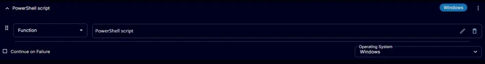

## Summary

Disable Bitlocker protection on one (or all) volumes.

## Sample Run

  
  
  

## Dependencies

[Unprotect-BitLockerVolume](/docs/22114d12-c60e-479e-93a5-50d3450b6631)

## User Parameters

| Name       | Example       | Required   | Description                                                        |
|------------|---------------|------------|--------------------------------------------------------------------|
| MountPoint | C:            | Partially  | The target volume to remove Bitlocker protection from.             |
| All        | True / False  | Partially  | Use this switch to remove Bitlocker protection from all volumes.   |

**Note:**

- The `All` parameter will take precedence if both parameters are specified.
- If no parameters are set, the script will attempt to disable BitLocker on the system drive.

## Task Creation

Create a new `Script Editor` style script in the system to implement this task.  

  
  

**Name:** Unprotect Bitlocker Volume  
**Description:** Disable Bitlocker protection on one (or all) volumes.  
**Category:** Security  

### Parameters

Add a new parameter by clicking the `Add Parameter` button present at the top-right corner of the screen.  

  

This screen will appear.  

  

- Set `MountPoint` in the `Parameter Name` field.
- Select `Text String` from the `Parameter Type` dropdown menu.
- Click the `Save` button.  

  

Click the `Confirm` button to save the parameter.  

  

Add a new parameter by clicking the `Add Parameter` button present at the top-right corner of the screen.  

  

This screen will appear.  

  

- Set `All` in the `Parameter Name` field.
- Select `Flag` from the `Parameter Type` dropdown menu.
- Click the `Save` button.  

  

Click the `Confirm` button to save the parameter.  

  

### Task

Navigate to the Script Editor Section and start by adding a row. You can do this by clicking the `Add Row` button at the bottom of the script page.  

  

A blank function will appear.  

  

Search and select the `PowerShell Script` function.  

  

  

The following function will pop up on the screen:  

  

```powershell
# # Parameters and Globals
# # Be sure that the name of the hashtable property matches the name of the parameter of the script that you are calling.
$mountPoint = '@MountPoint@'
$all = '@All@'
$Parameters = @{}
if ( $all -match '1|Yes|True' ) {
    $Parameters.Add( 'All', $true )
} else {
    if ( $mountPoint -notmatch '^[A-z]{1}:{0,1}$' ) {
    $mountPoint = $env:SystemDrive
    } 
    $Parameters.Add( 'MountPoint', $mountPoint )
}
#region Setup - Variables
$ProjectName = 'Unprotect-BitLockerVolume'
[Net.ServicePointManager]::SecurityProtocol = [enum]::ToObject([Net.SecurityProtocolType], 3072)
$BaseURL = 'https://file.provaltech.com/repo'
$PS1URL = "$BaseURL/script/$ProjectName.ps1"
$WorkingDirectory = "C:\ProgramData\_automation\script\$ProjectName"
$PS1Path = "$WorkingDirectory\$ProjectName.ps1"
$Workingpath = $WorkingDirectory
$LogPath = "$WorkingDirectory\$ProjectName-log.txt"
$ErrorLogPath = "$WorkingDirectory\$ProjectName-Error.txt"
#endregion
#region Setup - Folder Structure
New-Item -Path $WorkingDirectory -ItemType Directory -ErrorAction SilentlyContinue | Out-Null
$response = Invoke-WebRequest -Uri $PS1URL -UseBasicParsing
if (($response.StatusCode -ne 200) -and (!(Test-Path -Path $PS1Path))) {
    throw "No pre-downloaded script exists and the script '$PS1URL' failed to download. Exiting."
} elseif ($response.StatusCode -eq 200) {
    Remove-Item -Path $PS1Path -ErrorAction SilentlyContinue
    [System.IO.File]::WriteAllLines($PS1Path, $response.Content)
}
if (!(Test-Path -Path $PS1Path)) {
    throw 'An error occurred and the script was unable to be downloaded. Exiting.'
}
#endregion
#region Execution
if ($Parameters) {
    & $PS1Path @Parameters
} else {
    & $PS1Path
}
#endregion
if ( !(Test-Path $LogPath) ) {
    throw 'PowerShell Failure. A Security application seems to have restricted the execution of the PowerShell Script.'
}
if ( Test-Path $ErrorLogPath ) {
    $ErrorContent = ( Get-Content -Path $ErrorLogPath )
    throw $ErrorContent
}
Get-Content -Path $LogPath
```

  

## Row 2 Function: Script Log

Add a new row by clicking the `Add Row` button.  

  

A blank function will appear.  

  

Search and select the `Script Log` function.  

  

  

The following function will pop up on the screen:  

  

In the script log message, simply type `%output%` and click the `Save` button.  

  

Click the `Save` button at the top-right corner of the screen to save the script.  

  

## Completed Task

  

## Output

- Script log
