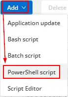
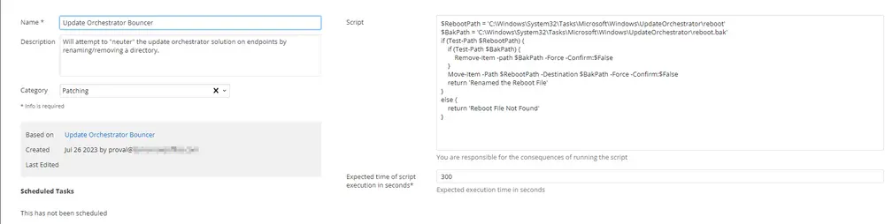

## Summary

This script will attempt to "neuter" the update orchestrator solution on endpoints by renaming or removing a directory.

## Manual Run

This script does not have any parameters and can be run against any online Windows device.

## Dependencies

None. This script can be run against any Windows device.

## Create Script

**Update Orchestrator Bouncer**

To implement this script, please create a new "PowerShell" style script in the system.

  
  

- **Name:** Update Orchestrator Bouncer  
- **Description:** Will attempt to "neuter" the update orchestrator solution on endpoints by renaming or removing a directory.  
- **Category:** Patching  

  

## Script

  
Paste the below PowerShell script directly into the "Script" field.

```
$RebootPath = 'C:\\Windows\\System32\\Tasks\\Microsoft\\Windows\\UpdateOrchestrator\\reboot'
$BakPath = 'C:\\Windows\\System32\\Tasks\\Microsoft\\Windows\\UpdateOrchestrator\\reboot.bak'
if (Test-Path $RebootPath) {
    if (Test-Path $BakPath) {
        Remove-Item -Path $BakPath -Force -Confirm:$False
    }
    Move-Item -Path $RebootPath -Destination $BakPath -Force -Confirm:$False
    return 'Renamed the Reboot File'
} else {
    return 'Reboot File Not Found'
}
```

## Script Deployment

The script is intended to run from the ["CW RMM - Custom Monitor - Update Orchestrator Bouncer"](/docs/a88678ef-dc82-4837-802c-e77573277504) monitor as the "Run Automated Task."

This script can also run manually against any Windows-based device.

## Output

- Script log