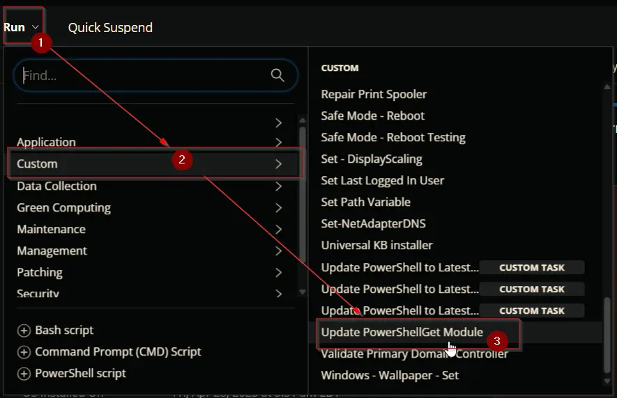
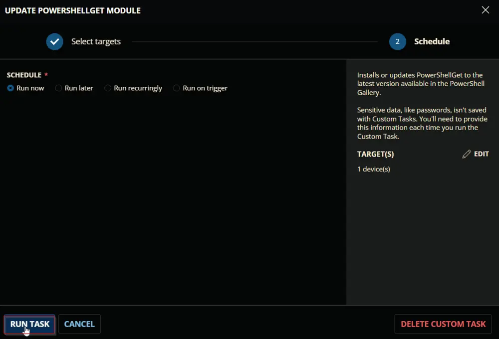
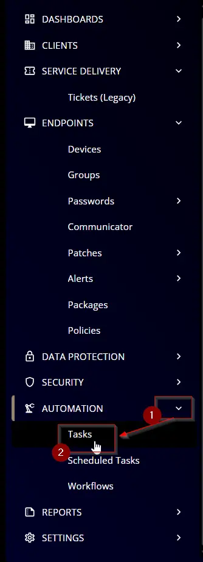
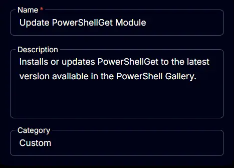
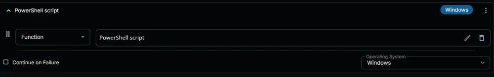
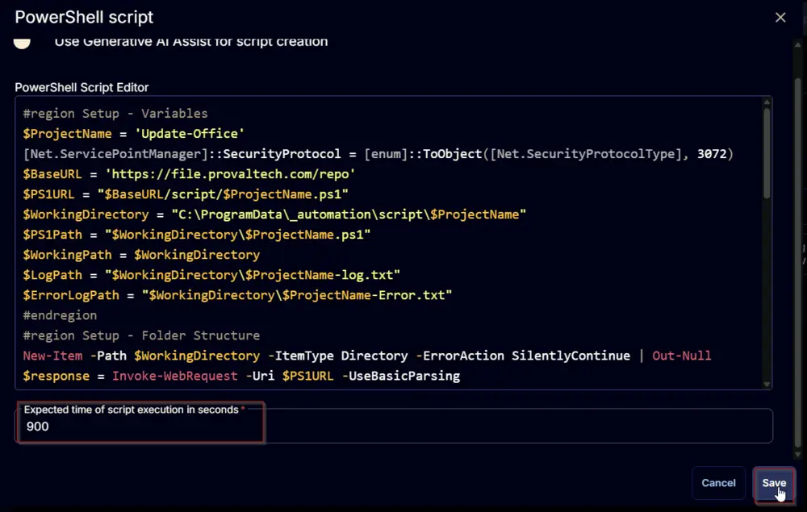
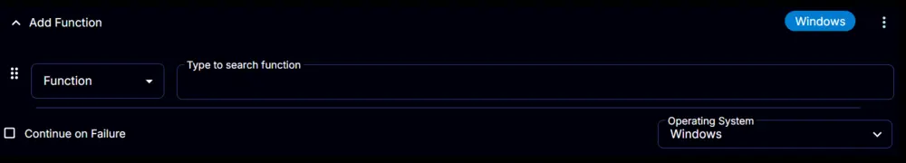

---
id: 'f17a9912-b0d6-4b48-812d-380a4dc9de90'
slug: /f17a9912-b0d6-4b48-812d-380a4dc9de90
title: 'Update PowerShellGet Module'
title_meta: 'Update PowerShellGet Module'
keywords: ['powershellget', 'update', 'module', 'script', 'install']
description: 'This document provides a comprehensive guide on how to install or update the PowerShellGet module to the latest version available in the PowerShell Gallery, including sample runs, dependencies, task creation steps, and script execution details.'
tags: ['installation', 'security', 'update']
draft: false
unlisted: false
last_update:
  date: 2025-11-27
---

## Summary

Installs or updates PowerShellGet to the latest version available in the PowerShell Gallery. CW RMM implementation of the agnostic script [Update-PowerShellGet](https://file.provaltech.com/repo/script/Update-PowerShellGet.ps1).

## Sample Run

## Dependencies

[Update-PowerShellGet Script](https://file.provaltech.com/repo/script/Update-PowerShellGet.ps1)

## Task Creation

Create a new `Script Editor` style script in the system to implement this task.

**Name:** `Update PowerShellGet Module`  
**Description:** `Installs or updates PowerShellGet to the latest version available in the PowerShell Gallery.`  
**Category:** `Custom`  

## Task

Navigate to the Script Editor section and start by adding a row. You can do this by clicking the `Add Row` button at the bottom of the script page.

A blank function will appear.

### Row 1 Function: PowerShell Script

Search and select the `PowerShell Script` function.

The following function will pop up on the screen:

Paste in the following PowerShell script and set the `Expected time of script execution in seconds` to `900` seconds. Click the `Save` button.

[PowerShell Script](https://github.com/ProVal-Tech/cw-rmm/blob/main/tasks/update-powershellget-module/script.ps1)

### Row 2 Function: Script Log

Add a new row by clicking the `Add Row` button.

A blank function will appear.

Search and select the `Script Log` function.

The following function will pop up on the screen:

In the script log message, simply type `%Output%` and click the `Save` button.

Click the `Save` button at the top-right corner of the screen to save the script.

## Completed Task

## Output

- Script log

## Changelog

### 2025-04-10

- Initial version of the document

