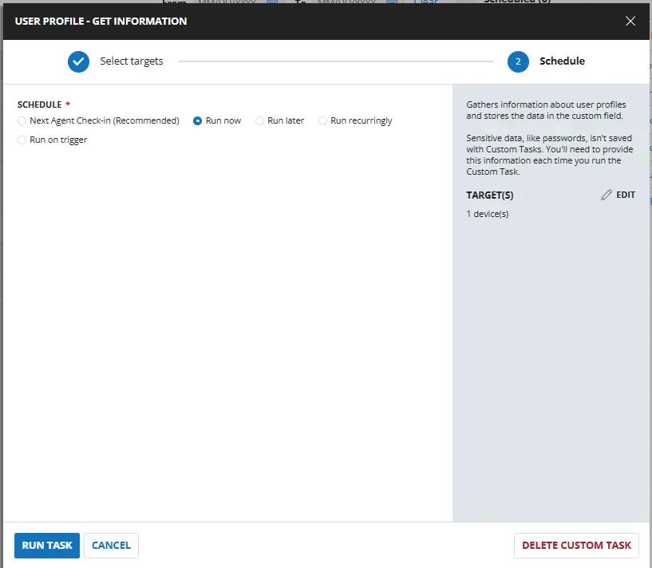
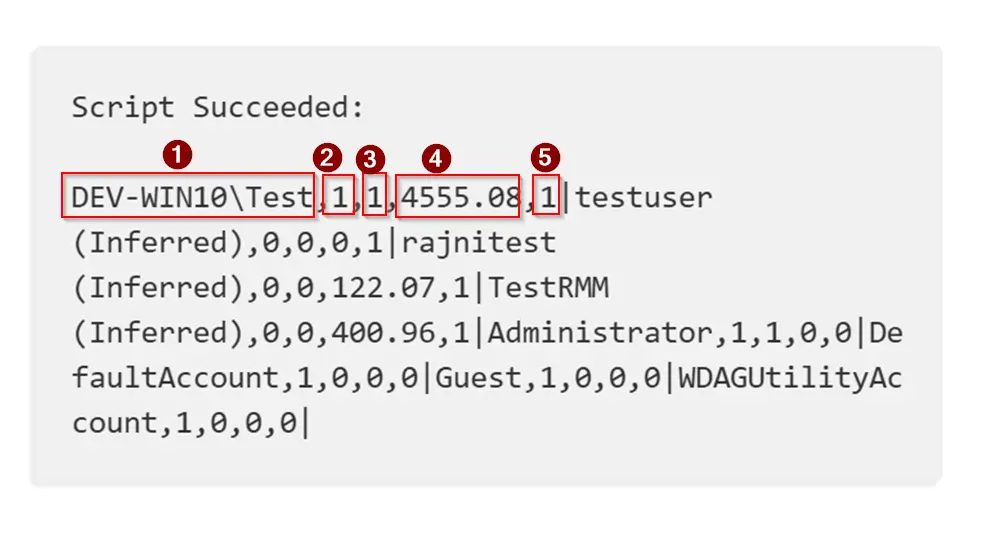
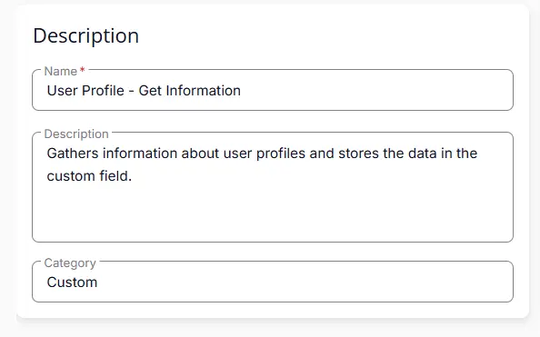
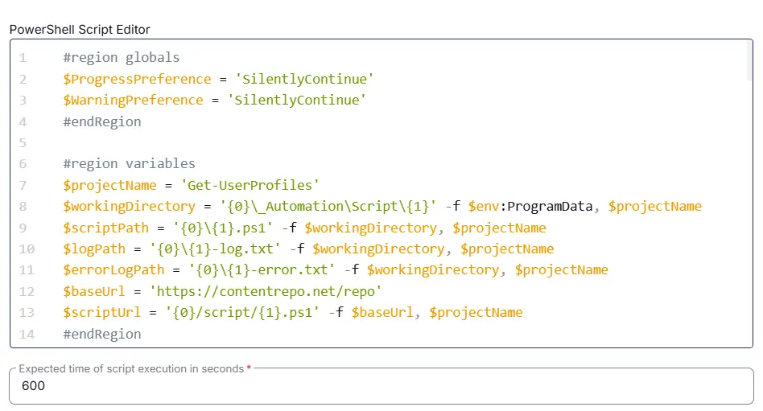
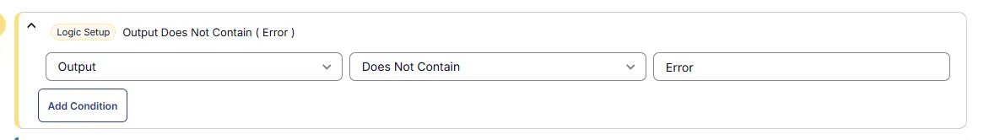
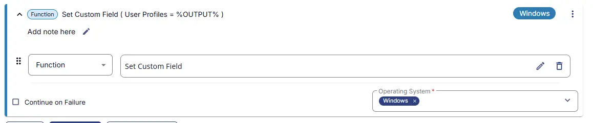
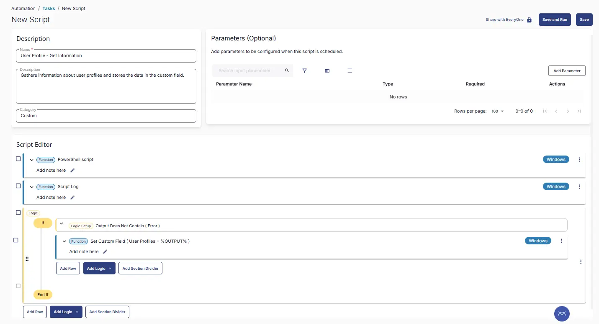
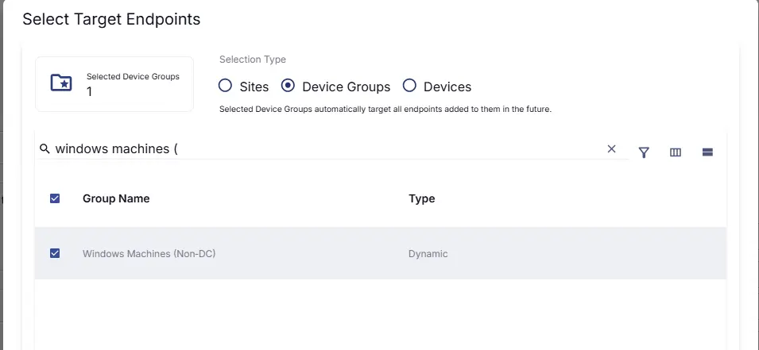
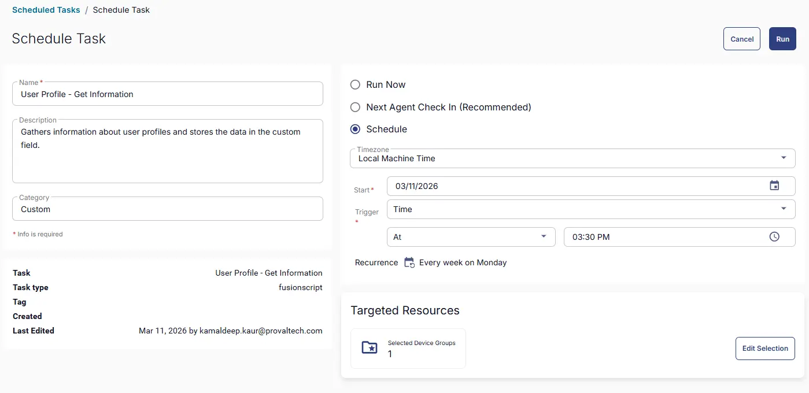

## Summary
Gathers information about user profiles and stores the data in the custom field.

## Sample Run



## Dependencies

- [Get-UserProfiles](/docs/dee76265-9071-47bb-9262-d656dd8b5c6d)
- PowerShell v5
- [Solution - Windows User Profiles](/docs/0ebb7e89-d2d8-40d4-ba1e-330ab20f86cd)

## Output Description

Script Output looks like below and here is the output description :

Output has 5 parts for each user profile and each user profile is separated by a `|`

1. `Username` : The username of the target profile. If (Inferred) is appended, then the user could not be found and the username was inferred from the profile path.
2. `LocalUser` : Indicates if the user is a local user. `1` if its a localuser, `0` if its not a local user.
3. `Admin` : 	Indicates if the user is a local admin. `1` if its a local admin, `0` if its not.
4. `ProfileSizeMB` : 	The size of the user folder for the target profile.
5. `Enabled` : `1` if local account is enabled, `0` if disabled. `2` when the account is not local.



## Task Creation

### Script Details

#### Step 1

Navigate to `Automation` ➞ `Tasks`  


#### Step 2

Create a new `Script Editor` style task by choosing the `Script Editor` option from the `Add` dropdown menu  


The `New Script` page will appear on clicking the `Script Editor` button:  


#### Step 3

Fill in the following details in the `Description` section:  

**Name:** `User Profile - Get Information`  
**Description:** `Gathers information about user profiles and stores the data in the custom field.`  
**Category:** `Custom`




### Script Editor

Click the `Add Row` button in the `Script Editor` section to start creating the script  


A blank function will appear:  


#### Row 1 Function: `PowerShell Script`

Search and select the `PowerShell Script` function.  
 
  

The following function will pop up on the screen:  
  

Paste in the following PowerShell script and set the `Expected time of script execution in seconds` to `600` seconds. Click the `Save` button.

```powershell
#region globals
$ProgressPreference = 'SilentlyContinue'
$WarningPreference = 'SilentlyContinue'
#endRegion

#region variables
$projectName = 'Get-UserProfiles'
$workingDirectory = '{0}\_Automation\Script\{1}' -f $env:ProgramData, $projectName
$scriptPath = '{0}\{1}.ps1' -f $workingDirectory, $projectName
$logPath = '{0}\{1}-log.txt' -f $workingDirectory, $projectName
$errorLogPath = '{0}\{1}-error.txt' -f $workingDirectory, $projectName
$baseUrl = 'https://contentrepo.net/repo'
$scriptUrl = '{0}/script/{1}.ps1' -f $baseUrl, $projectName
#endRegion


#region working Directory
if (!(Test-Path -Path $workingDirectory)) {
    try {
        New-Item -Path $workingDirectory -ItemType Directory -Force -ErrorAction Stop | Out-Null
    } catch {
        throw ('Error : Failed to Create working directory {0}. Reason: {1}' -f $workingDirectory, $($Error[0].Exception.Message))
    }
}

$acl = Get-Acl -Path $workingDirectory
$hasFullControl = $acl.Access | Where-Object {
    $_.IdentityReference -match 'Everyone' -and $_.FileSystemRights -match 'FullControl'
}
if (-not $hasFullControl) {
    $accessRule = New-Object -TypeName System.Security.AccessControl.FileSystemAccessRule(
        'Everyone', 'FullControl', 'ContainerInherit, ObjectInherit', 'None', 'Allow'
    )
    $acl.AddAccessRule($accessRule)
    Set-Acl -Path $workingDirectory -AclObject $acl -ErrorAction SilentlyContinue
}
#endRegion

#region set tls policy
$supportedTLSversions = [enum]::GetValues('Net.SecurityProtocolType')
if (($supportedTLSversions -contains 'Tls13') -and ($supportedTLSversions -contains 'Tls12')) {
    [System.Net.ServicePointManager]::SecurityProtocol = [System.Net.ServicePointManager]::SecurityProtocol::Tls13 -bor [System.Net.SecurityProtocolType]::Tls12
} elseif ($supportedTLSversions -contains 'Tls12') {
    [System.Net.ServicePointManager]::SecurityProtocol = [System.Net.SecurityProtocolType]::Tls12
} else {
    Write-Information 'TLS 1.2 and/or TLS 1.3 are not supported on this system. This download may fail!' -InformationAction Continue
    if ($PSVersionTable.PSVersion.Major -lt 3) {
        Write-Information 'PowerShell 2 / .NET 2.0 doesn''t support TLS 1.2.' -InformationAction Continue
    }
}
#endRegion

#region download script
try {
    Invoke-WebRequest -Uri $scriptUrl -OutFile $scriptPath -UseBasicParsing -ErrorAction Stop
} catch {
    if (!(Test-Path -Path $scriptPath)) {
        throw ('Error : Failed to download the script from ''{0}'', and no local copy of the script exists on the machine. Reason: {1}' -f $scriptUrl, $($Error[0].Exception.Message))
    }
}
#endRegion


$output = & $scriptPath

#endRegion


$outstring = ''
$output | ForEach-Object {
    $enabledStatus = if ($_.Enabled -eq $true -or $_.Enabled -eq 'Remote') { 
        '1' 
    } else { 
        '0' 
    }

    $outstring += "$(
        $_.Username
    ),$(
       ([int]($_.IsLocalUser)) 
    ),$(
       $([int]($_.IsAdmin))
    ),$(
        $_.ProfileSize
    ),$(
        $enabledStatus
    )|"
}

return $outstring

```



### Row 2 Function: Script Log

Add a new row by clicking the `Add Row` button.  
  

A blank function will appear.  
  

Search and select the `Script Log` function.  
  
 

In the script log message, simply type `%output%` and click the `Save` button.  


#### Step 3 Logic: If/Then

Click on `Add Logic` > select `If/Then`

#### Row 3a Condition: Output Contains

- **Condition:** `Output`  
- **Operator:** `Contains`  
- **Input Values:** `Error`



#### Row 3b Function: Set Custom Field

- Select `User Profiles` from dropdown
- Add `%output%` in the Value



## Save Task

Click the `Save` button at the top-right corner of the screen to save the script.  


## Completed Task



## Schedule Task

### Task Details

**Name:** `User Profile - Get Information`  
**Description:** `Gathers information about user profiles and stores the data in the custom field.`  
**Category:** `Custom`


### Schedule

- **Schedule Type:**  `Schedule`  
- **Timezone:** `Local Machine Time`  
- **Start:** `<Current Date>`  
- **Trigger:** `Time` `At` `<Current Time>`  
- **Recurrence:** `Every week on Monday`


### Targeted Resource

**Device Groups:** `Windows Machines (Non‑DC)`



### Completed Scheduled Task




## Output
- Script Logs
- Custom Field

## Changelog

### 2026-03-11

- Initial version of the document