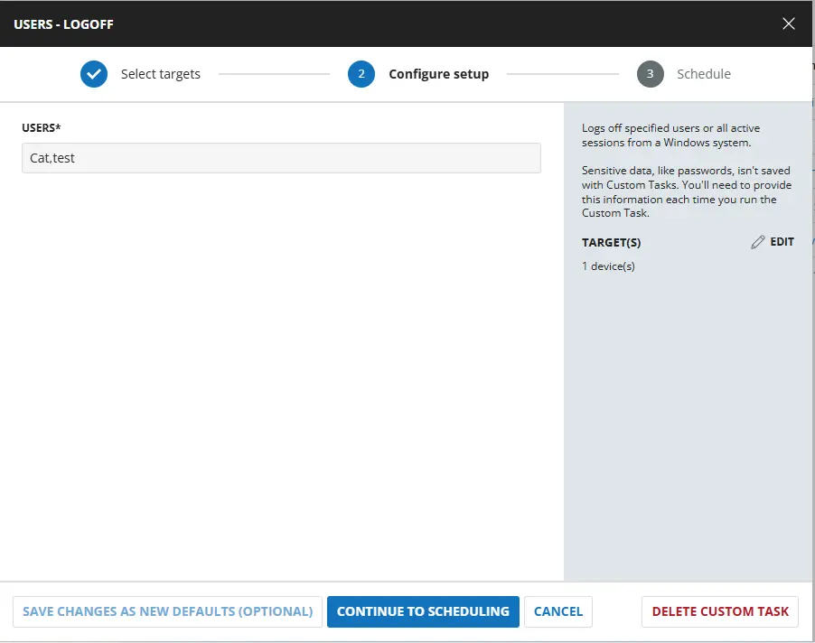
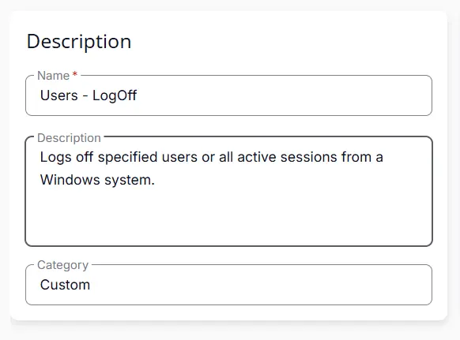
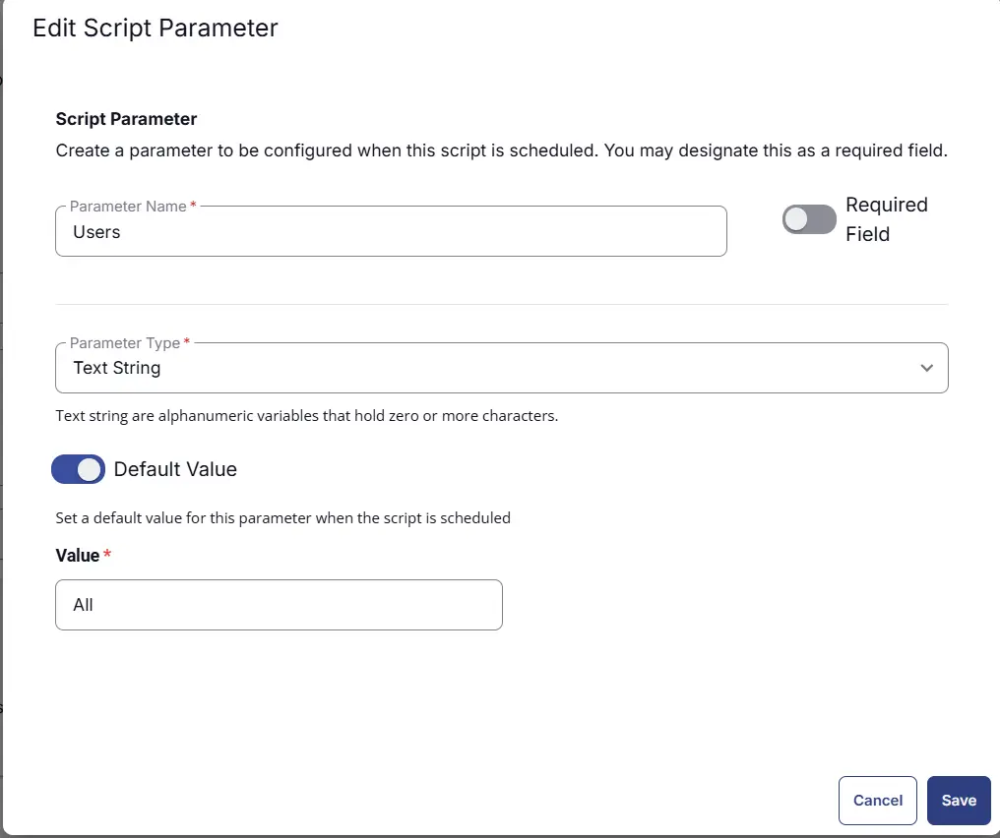
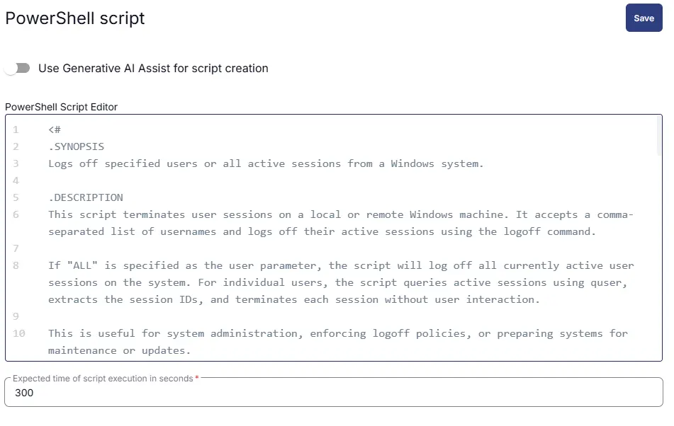
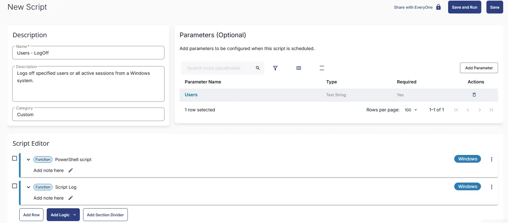

## Summary
Logs off specified users or all active sessions from a Windows system. It provides flexibility in managing user sessions and can be executed with different parameters to target individual users or the entire user base.

## Sample Run

 


## User Parameters

| Name | Example | Accepted Values | Required | Default | Type | Description |
|------|---------|-----------------|----------|-------|--------|--------------|
| Users | Calve,Test,All | user names separated by `,` or use ALL to log off all users | False | ALL | Text | The target user, multiple users, or all users to log off the machine. By default it will Log Off All users. |

## Task Creation

### Script Details

#### Step 1

Navigate to `Automation` ➞ `Tasks`  


#### Step 2

Create a new `Script Editor` style task by choosing the `Script Editor` option from the `Add` dropdown menu  


The `New Script` page will appear on clicking the `Script Editor` button:  


#### Step 3

Fill in the following details in the `Description` section:  

**Name:** `Users - LogOff`  
**Description:** `Logs off specified users or all active sessions from a Windows system.`  
**Category:** `Custom`

 

### Parameters

Locate the `Add Parameter` button on the right-hand side of the screen and click on it to create a new parameter.  


The `Add New Script Parameter` page will appear on clicking the `Add Parameter` button.  


- Set `Users` in the `Parameter Name` field.
- Select `Text String` from the `Parameter Type` dropdown menu.
- Set `All` as Default Value.
- Click the `Save` button.

 


### Script Editor

Click the `Add Row` button in the `Script Editor` section to start creating the script  


A blank function will appear:  


#### Row 1 Function: `PowerShell Script`

Search and select the `PowerShell Script` function.  
 
  

The following function will pop up on the screen:  
  

Paste in the following PowerShell script and set the `Expected time of script execution in seconds` to `300` seconds. Click the `Save` button.

```powershell
<#
.SYNOPSIS
Logs off specified users or all active sessions from a Windows system.

.DESCRIPTION
This script terminates user sessions on the local Windows machine where it is executed. It accepts a comma-separated list of usernames and logs off their active sessions using the logoff command. 

If "ALL" is specified as the user parameter, the script will log off all currently active user sessions on the system. For individual users, the script queries active sessions using quser, extracts the session IDs, and terminates each session without user interaction.

This is useful for system administration, enforcing logoff policies, or preparing systems for maintenance or updates.

.PARAMETER Users
A comma-separated list of usernames to log off, or "ALL" to log off all active sessions. Whitespace and quotes are automatically trimmed.

.NOTES
Requires administrative privileges to execute logoff commands.
#>


$Users = '@Users@'

if ((-not $Users) -or ($Users).Length -le 2) {
    return "No users specified. Exiting script."
}

# Normalize input
$UserArray = $Users -split ',' | ForEach-Object { $_.Trim().Trim("'") } | Where-Object { $_ }

# Resolve correct system path (handles 32-bit vs 64-bit PowerShell)
function Get-SystemCommandPath {
    param ($exe)
    if ([Environment]::Is64BitOperatingSystem -and -not [Environment]::Is64BitProcess) {
        return "$env:WINDIR\Sysnative\$exe"
    } else {
        return "$env:WINDIR\System32\$exe"
    }
}

# Get session data safely
function Get-SessionData {
    param ($User)
    $quserPath = Get-SystemCommandPath -exe "quser.exe"
    $queryPath = Get-SystemCommandPath -exe "query.exe"

    try {
        if (Test-Path $quserPath) {
            if ($User) {
                return & $quserPath $User 2>$null
            } else {
                return & $quserPath 2>$null
            }
        }
        elseif (Test-Path $queryPath) {
            if ($User) {
                return cmd /c "`"$queryPath`" user $User" 2>$null
            } else {
                return cmd /c "`"$queryPath`" user" 2>$null
            }
        }
        else {
            throw "Neither quser.exe nor query.exe found."
        }
    }
    catch {
        return $null
    }
}

function Invoke-Logoff {
param ($accountname)

Write-Output "Processing user: $accountname"

$quserResult = Get-SessionData -User $accountname

if ($quserResult) {
    $quserRegex = $quserResult | ForEach-Object { $_ -replace '\s{2,}', ',' }
    $quserObject = $quserRegex | ConvertFrom-Csv -Header 'USERNAME','SESSIONNAME','ID','STATE','IDLE','LOGONTIME'

    # Filter valid sessions
    $validSessions = $quserObject | Where-Object { $_.ID -match '^\d+$' }

    if (-not $validSessions) {
        Write-Output "User $accountname not logged in."
        return
    }

    foreach ($session in $validSessions) {
        Write-Output "Logging off user: $accountname"
        logoff $session.ID
    }
}
else {
    try {
        $loggedUsers = Get-CimInstance Win32_ComputerSystem -ErrorAction Stop | Select-Object -ExpandProperty UserName
    }
    catch {
        $loggedUsers = $null
    }

    if ($loggedUsers -and ($loggedUsers -match [regex]::Escape($accountname))) {
        throw "User '$accountname' appears to be logged in, but session query failed."
    }
    else {
        Write-Output "User $accountname not logged in."
    }
}
}

# Handle ALL users
if ($UserArray -contains "ALL") {
$query = query user

Write-output "Logging off all users.."

foreach ($line in $query) {
    # Skip header line
    if ($line -match "USERNAME") { continue }

    # Split by whitespace
    $parts = $line -split "\s+"

    if ($parts.Length -ge 3) {
        $username = $parts[0]
        $sessionId = $parts[2]
        logoff $sessionId /V
     }
    }
}
else {
    foreach ($accountname in $UserArray) {
        Invoke-Logoff -accountname $accountname
    }
}

```

 


### Row 2 Function: Script Log

Add a new row by clicking the `Add Row` button.  
  

A blank function will appear.  
  

Search and select the `Script Log` function.  
  
 

In the script log message, simply type `%output%` and click the `Save` button.  


## Save Task

Click the `Save` button at the top-right corner of the screen to save the script.  


## Completed Task

 


## Output
- Script logs

## Changelog

### 2026-03-26

- Initial version of the document
