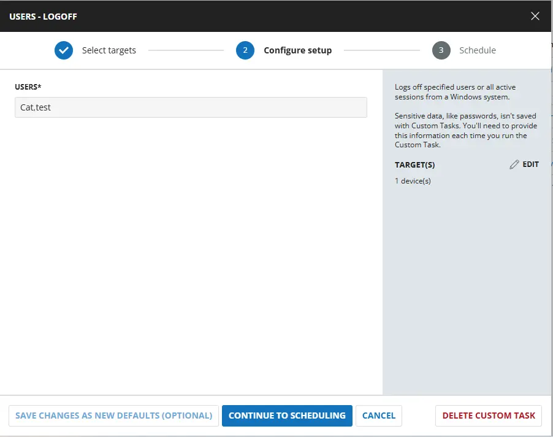
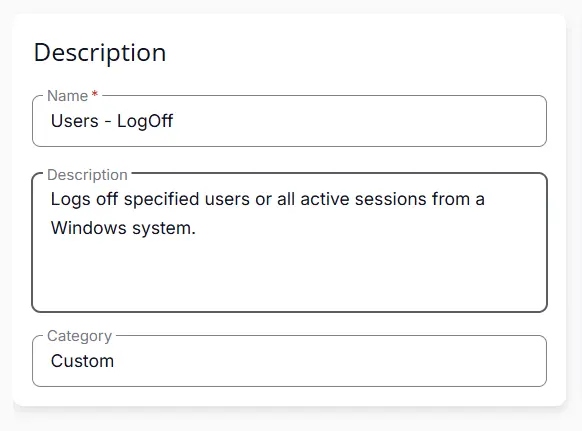
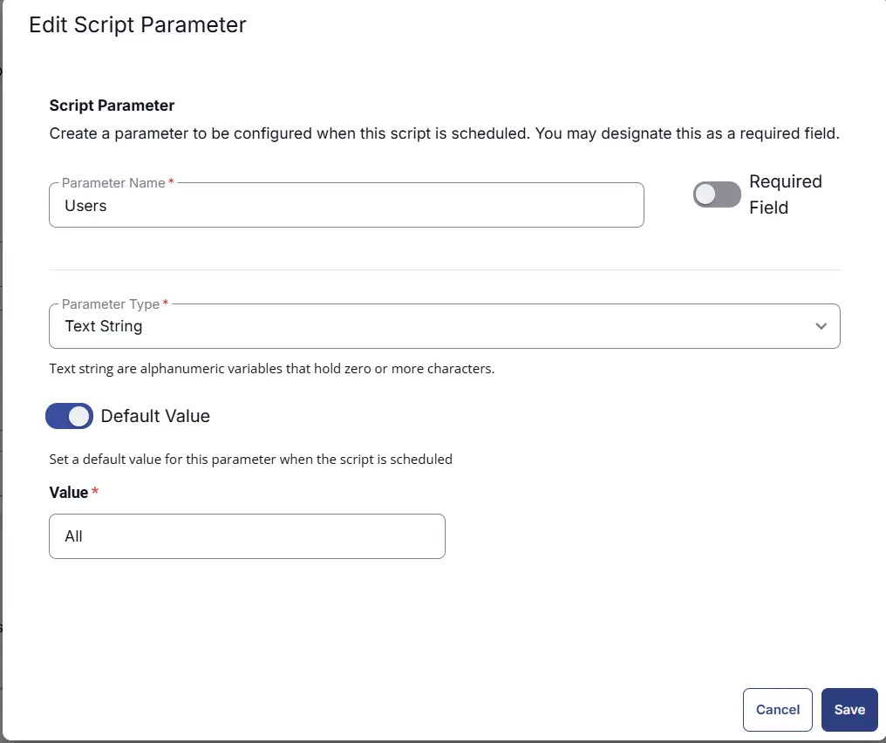
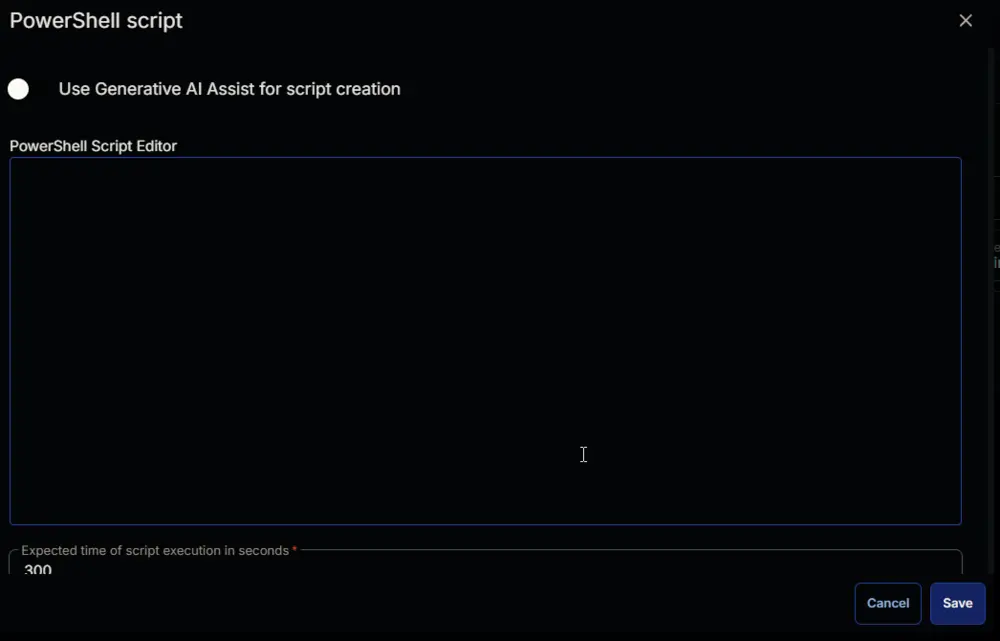
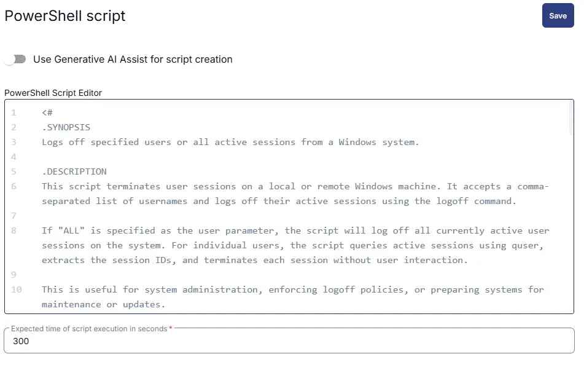
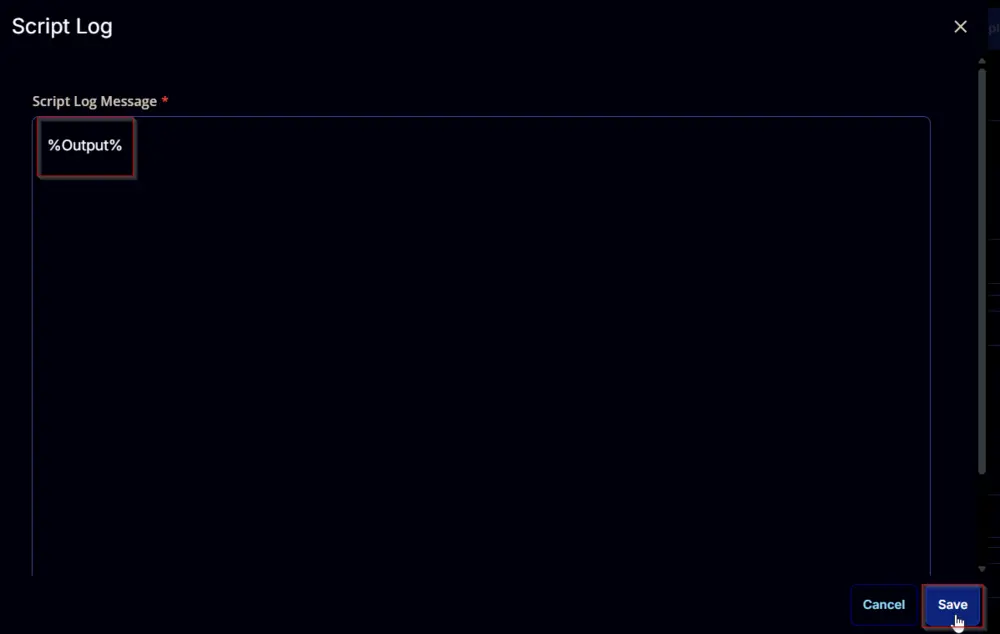
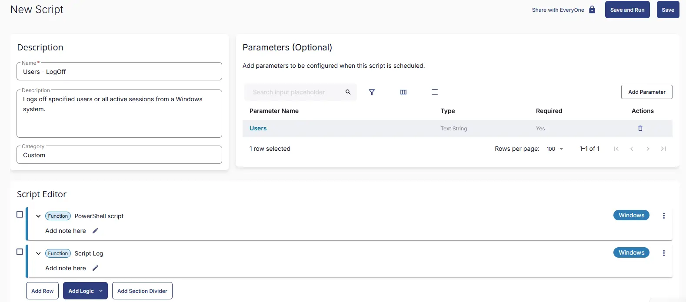

## Summary
Logs off specified users or all active sessions from a Windows system. It provides flexibility in managing user sessions and can be executed with different parameters to target individual users or the entire user base.

## Sample Run

 

## User Parameters

| Name | Example | Accepted Values | Required | Default | Type | Description |
|------|---------|-----------------|----------|-------|--------|--------------|
| Users | Calve,Test,All | user names separated by `,` or use ALL to log off all users | False | ALL | Text | The target user, multiple users, or all users to log off the machine. By default it will Log Off All users. |

## Task Creation

### Script Details

#### Step 1

Navigate to `Automation` ➞ `Tasks`  

#### Step 2

Create a new `Script Editor` style task by choosing the `Script Editor` option from the `Add` dropdown menu  

The `New Script` page will appear on clicking the `Script Editor` button:  

#### Step 3

Fill in the following details in the `Description` section:  

**Name:** `Users - LogOff`  
**Description:** `Logs off specified users or all active sessions from a Windows system.`  
**Category:** `Custom`

 

### Parameters

Locate the `Add Parameter` button on the right-hand side of the screen and click on it to create a new parameter.  

The `Add New Script Parameter` page will appear on clicking the `Add Parameter` button.  

- Set `Users` in the `Parameter Name` field.
- Select `Text String` from the `Parameter Type` dropdown menu.
- Set `All` as Default Value.
- Click the `Save` button.

 

### Script Editor

Click the `Add Row` button in the `Script Editor` section to start creating the script  

A blank function will appear:  

#### Row 1 Function: `PowerShell Script`

Search and select the `PowerShell Script` function.  
 
  

The following function will pop up on the screen:  
  

Paste in the following PowerShell script and set the `Expected time of script execution in seconds` to `300` seconds. Click the `Save` button.

[PowerShell Script](https://github.com/ProVal-Tech/cw-rmm/blob/main/tasks/users-logoff/script.ps1)

 

### Row 2 Function: Script Log

Add a new row by clicking the `Add Row` button.  
  

A blank function will appear.  
  

Search and select the `Script Log` function.  
  
 

In the script log message, simply type `%output%` and click the `Save` button.  

## Save Task

Click the `Save` button at the top-right corner of the screen to save the script.  

## Completed Task

 

## Output
- Script logs

## Changelog

### 2026-03-26

- Initial version of the document

