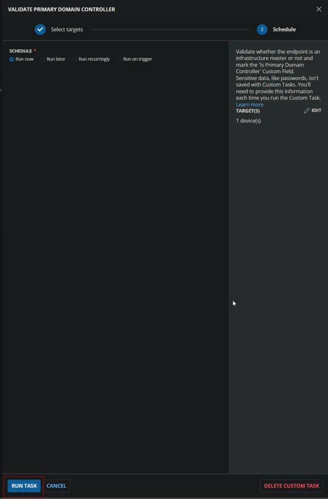
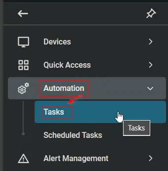
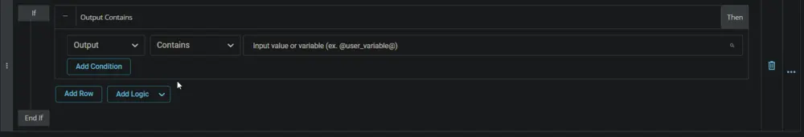

## Summary

This task validates whether the endpoint is a primary domain controller. It updates the value of the [Custom Field - Is Primary Domain Controller](/docs/b6a7c804-693c-4cf5-a60e-61dcb10ddcae) custom field, which is then used to create the [Machine Group - Infrastructure Master](/docs/c2c2d22b-f735-4ec5-91a6-a014ab2e84a8) group.

This task should be scheduled to run once per week or month against the [Domain Controllers](/docs/eeeb4ee0-d683-44fd-81cf-7f8872b71c68) group.

## Sample Run




## Dependencies

- [Machine Group - Domain Controllers](/docs/eeeb4ee0-d683-44fd-81cf-7f8872b71c68)
- [Custom Field - Is Primary Domain Controller](/docs/b6a7c804-693c-4cf5-a60e-61dcb10ddcae)

## Implementation

Create the group [Machine Group - Domain Controllers](/docs/eeeb4ee0-d683-44fd-81cf-7f8872b71c68).

Create the Custom Field [Custom Field - Is Primary Domain Controller](/docs/b6a7c804-693c-4cf5-a60e-61dcb10ddcae).

### Create Script

Create a new `Script Editor` style script in the system to implement this task.




**Name:** Validate Primary Domain Controller

**Description:** Validate whether the endpoint is an infrastructure master or not and mark the `Is Primary Domain Controller` custom field.

**Category:** Custom


### Script

Start by adding a row. You can do this by clicking the `Add Row` button at the bottom of the script page.


#### Row 1 Function: PowerShell Script


Paste in the following PowerShell script and set the expected time of script execution to `300` seconds. This PowerShell function will validate whether the endpoint is an infrastructure master or not.

```powershell
Import-Module ActiveDirectory
if ((Get-ADDomain -ErrorAction SilentlyContinue).InfrastructureMaster -match $env:COMPUTERNAME) {'Yes'} else {'No'}
```


#### Row 2 Logic: If Then




##### Row 2a Condition: Output Contains

Enter `Yes` in the text box.


##### Row 2b Function: Set Custom Field

Add a new row by clicking on the `Add Row` button.


Select `Set Custom Field` function.


When you select `Set Custom Field`, a new window will open.


In this window, search for the `Is Primary Domain Controller` field.

**Custom Field:** Is Primary Domain Controller

**Value:** Yes 


Once all items are added, please save the task. The final task should look like the screenshot below.


### Deployment

It is suggested to run the task once per hour against the primary domain controllers or infrastructure masters.

- Go to `Automation` > `Tasks`.
- Search for `Validate Primary Domain Controller Task`.
- Select the concerned task.
- Click on the `Schedule` button to schedule the task/script.


This screen will appear.


Click the `Does not repeat` button.


This pop-up box will appear.


Select the `Week(s)` option from the Repeat dropdown and select a day to schedule the task.


Search for `Domain Controllers` in the `Resources*` and select the `Domain Controllers` group.


Now click the `Run` button to initiate the task.


The task will start appearing in the Scheduled Tasks.


## Output

- Custom Field 
