## Summary

This task utilizes the agnostic script [Test-WeakCredentials](/docs/9188a8e9-ba15-45aa-9391-d412866b1ebc  ) to test the hashed credentials in Active Directory against a known compromised or weak password list.

## Sample Run

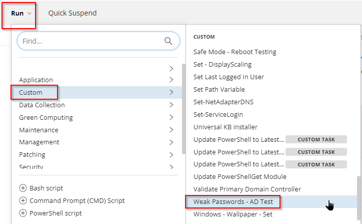

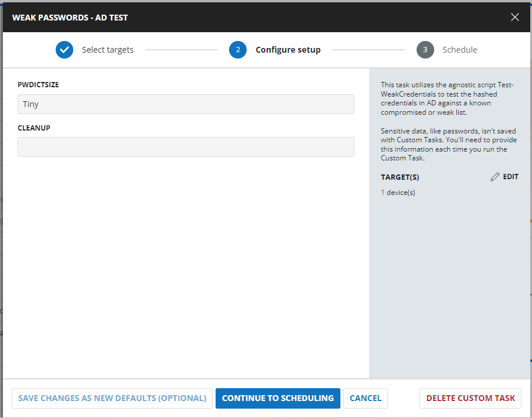

## Dependencies

- [Test-WeakCredentials](/docs/9188a8e9-ba15-45aa-9391-d412866b1ebc  )  
- [Weak Passwords Audit](/docs/67f4ab8a-5eb0-49f6-ae41-4b3a308b1f11)

## User Parameters

| Name          | Example | Accepted Values                     | Required | Default | Type   | Description                                                                                     |
|---------------|---------|-------------------------------------|----------|---------|--------|-------------------------------------------------------------------------------------------------|
| `PWDictSize`  | Small   | 'Tiny', 'Small', 'Medium', 'Large' | False    | Medium  | String | This parameter specifies the password dictionary you wish to query. It is a validated set of 'Tiny', 'Small', 'Medium', 'Large'. |
| `Force`       | All     | 'All', 'Text', 'Zipped'            | False    |         | String | This parameter accepts any combination of its validated set. It is a validated set of 'All', 'Text', 'Zipped'. |

## Task Creation

Create a new `Script Editor` style script in the system to implement this task.


**Name:** Weak Passwords - AD Test  
**Description:** This task utilizes the agnostic script Test-WeakCredentials to test the hashed credentials in AD against a known compromised or weak password list.  
**Category:** Custom

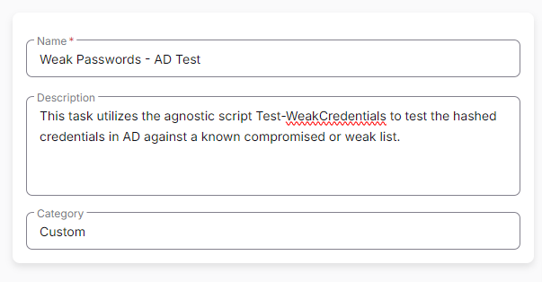

## Parameters

Add a new parameter by clicking the `Add Parameter` button present at the top-right corner of the screen.


This screen will appear.


- Set `PWDictSize` in the `Parameter Name` field.
- Select `String` from the `Parameter Type` dropdown menu.
- Toggle Default Value
- Set Default Value as `Medium`
- Click the `Save` button
- 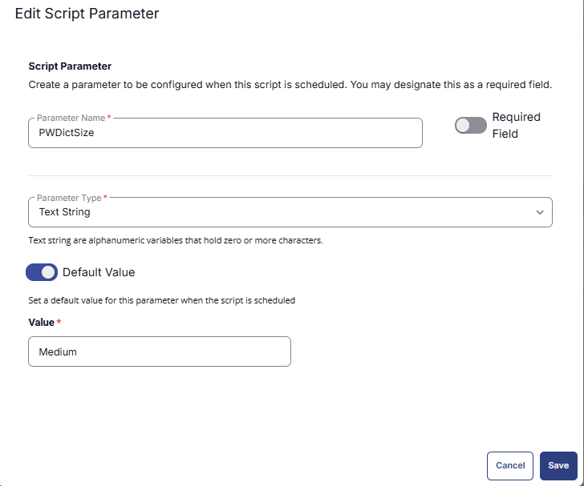
- It will ask for confirmation to proceed. Click the `Confirm` button to create the parameter.


Add another parameter by clicking the `Add Parameter` button present at the top-right corner of the screen.


- Set `Cleanup` in the `Parameter Name` field.
- Select `String` from the `Parameter Type` dropdown menu.
- Click the `Save` button
- Click the `Confirm` button to create the parameter.
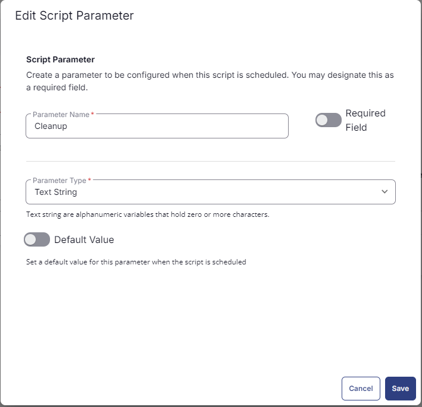

Parameters will look like the following:

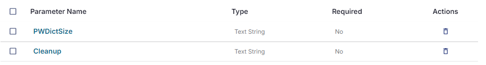

## Task

Navigate to the Script Editor section and start by adding a row. You can do this by clicking the `Add Row` button at the bottom of the script page.


A blank function will appear.


### Row 1 Function: PowerShell Script

Search and select the `PowerShell Script` function.


The following function will pop up on the screen:


Paste in the following PowerShell script and set the expected time of script execution to `600` seconds. Click the `Save` button.

```powershell
if ( '@PWDictSize@' -notin ( 'Tiny', 'Small', 'Medium', 'Large' ) ) {
    $PWDictSize = 'Medium'
} else {
    $PWDictSize = '@PWDictSize@'
}
 
if ( '@Cleanup@' -notin ( 'All', 'Text', 'Zipped' ) ) {
    $Cleanup = $null
} else {
    $Cleanup = '@Cleanup@'
}
 
if (!($Cleanup)) {
    $Parameters = @{
        PWDictSize = $PWDictSize
    }
} else {
    $Parameters = @{
        PWDictSize = $PWDictSize
        Cleanup = $cleanup
    }
}
#region Setup - Variables
$ProjectName = 'Test-WeakCredentials'
[Net.ServicePointManager]::SecurityProtocol = [enum]::ToObject([Net.SecurityProtocolType], 3072)
$BaseURL = 'https://file.provaltech.com/repo'
$PS1URL = "$BaseURL/script/$ProjectName.ps1"
$WorkingDirectory = "C:\ProgramData\_automation\script\$ProjectName"
$PS1Path = "$WorkingDirectory\$ProjectName.ps1"
$Workingpath = $WorkingDirectory
$LogPath = "$WorkingDirectory\$ProjectName-log.txt"
$ErrorLogPath = "$WorkingDirectory\$ProjectName-Error.txt"
#endregion
 
 
#region Setup - Folder Structure
New-Item -Path $WorkingDirectory -ItemType Directory -ErrorAction SilentlyContinue | Out-Null
$response = Invoke-WebRequest -Uri $PS1URL -UseBasicParsing
if (($response.StatusCode -ne 200) -and (!(Test-Path -Path $PS1Path))) {
    throw "No pre-downloaded script exists and the script '$PS1URL' failed to download. Exiting."
} elseif ($response.StatusCode -eq 200) {
    Remove-Item -Path $PS1Path -ErrorAction SilentlyContinue
    [System.IO.File]::WriteAllLines($PS1Path, $response.Content)
}
if (!(Test-Path -Path $PS1Path)) {
    throw 'An error occurred and the script was unable to be downloaded. Exiting.'
}
#endregion
 
#region Execution
$TheseResults = & "$PS1Path" @Parameters 2>$Null 6>$Null
 
if (!$TheseResults) {
    if ( $ErrorLogPath ) {
        $errorContent = Get-Content $ErrorLogPath -ErrorAction SilentlyContinue
        throw $($errorContent | Out-String)
    }
    throw 'The underlying script failed to return any data. Please review script logs for additional information.'
}
 
$weakpw = $($TheseResults.WeakPasswords -replace '\\', '\\' -replace "'", "\'" -replace "$([char]0x2018)|$([char]0x2019)", "\'")
$DuplicatePW = $($TheseResults.DuplicatePasswords -replace '\\', '\\' -replace "'", "\'" -replace "$([char]0x2018)|$([char]0x2019)", "\'")
$weakpwcount = $TheseResults.WeakPasswords.Count
$DuplicatePWCount = $TheseResults.DuplicatePasswords.Count
 
return "DuplicatePasswordCount:$($DuplicatePWCount)|WeakPasswordCount:$($weakpwcount)|DuplicatePassword:$($DuplicatePW)|WeakPassword:$($weakpw)"
```

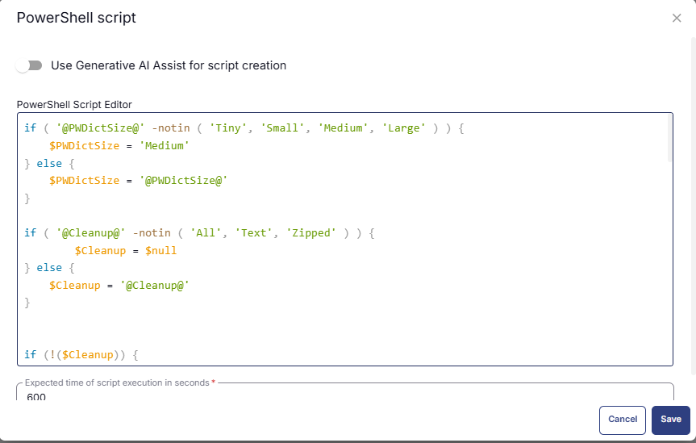

### Row 2: Function: Script Log

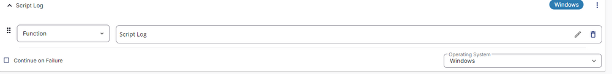  
In the script log message, simply type `%output%` so that the script will send the results of the PowerShell script above to the output on the Automation tab for the target device.  
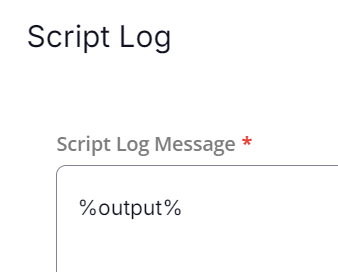

### Row 3: Function: PowerShell Script

Search and select the `PowerShell Script` function.


The following function will pop up on the screen:


Paste in the following PowerShell script and set the expected time of script execution to `600` seconds. Click the `Save` button.

```powershell
$output = '%output%'
$WeakPasswordCount = $($($output -split '/|')[1] -split ':')[1]
if ($WeakPasswordCount -match '[1-9]') { return $WeakPasswordCount } else { return 'No weak password found' }
```

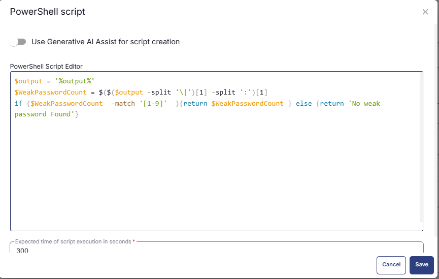

### Row 4 Logic: If /Then/Else

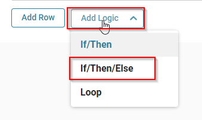

There will be two sections: If part and Else part.

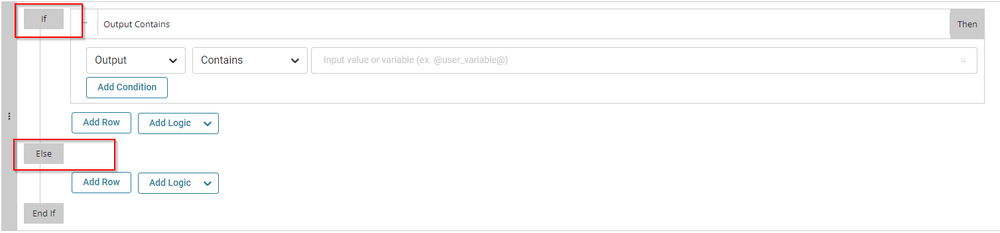

### Row 4a Condition: Output Contains

In the IF part, enter `password found` in the right box of the "Output Contains" part.

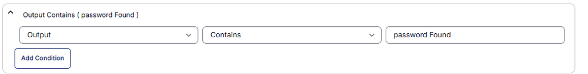

### Row 4b Function: Set Custom Field

Add a new row by clicking on the Add row button. Set Custom Field 'Weak Password Count' to 'NA'.

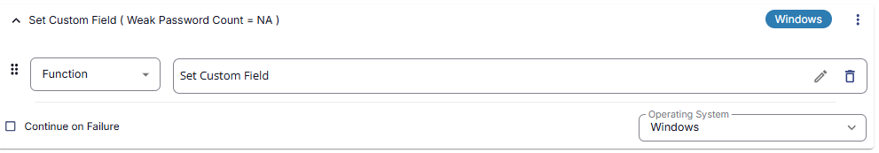

### Row 4c Function: Set Custom Field

Add a new row by clicking on the Add row button in the ELSE part. Set Custom Field `Weak Password Count` to `%output%`.

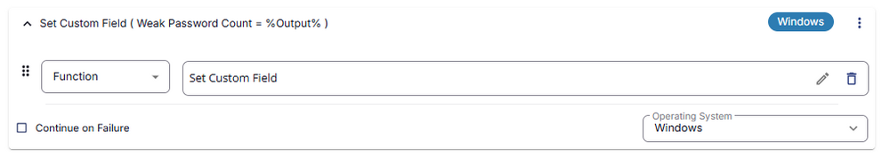

### Row 5: Function: PowerShell Script

Search and select the `PowerShell Script` function.


The following function will pop up on the screen:


Paste in the following PowerShell script and set the expected time of script execution to `600` seconds. Click the `Save` button.

```powershell
$output = '%output%'
$duplicatePasswordCount = $($($output -split '\|')[0] -split ':')[1]
if ($duplicatePasswordCount  -match '[1-9]'  ){return $duplicatePasswordCount } else {return 'No Duplicate Password found'}
```

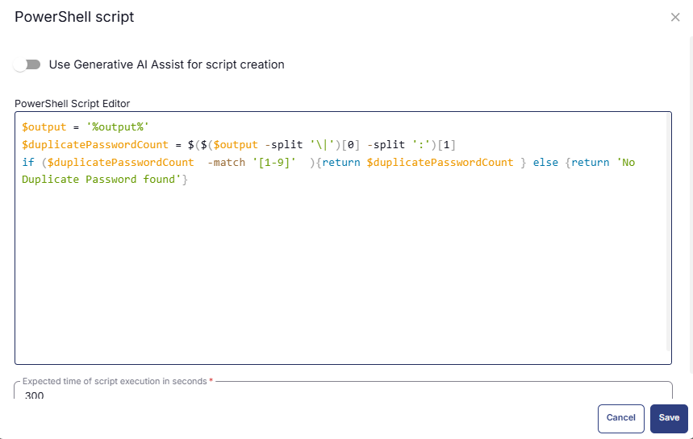

### Row 6 Logic: If /Then/Else


There will be two sections: If part and Else part.


### Row 6a Condition: Output Contains

In the IF part, enter `password found` in the right box of the "Output Contains" part.


### Row 6b Function: Set Custom Field

Add a new row by clicking on the Add row button. Set Custom Field `Duplicate Password Count` to `NA`.

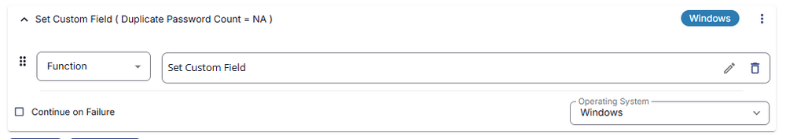

### Row 6c Function: Set Custom Field

Add a new row by clicking on the Add row button in the ELSE part. Set Custom Field `Duplicate Password Count` to `%output%`.

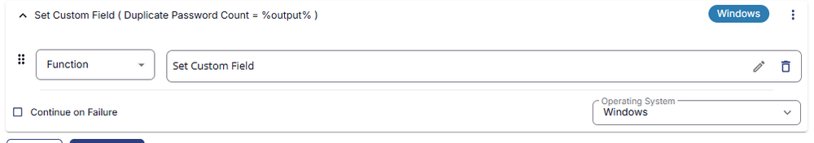

## Completed Task

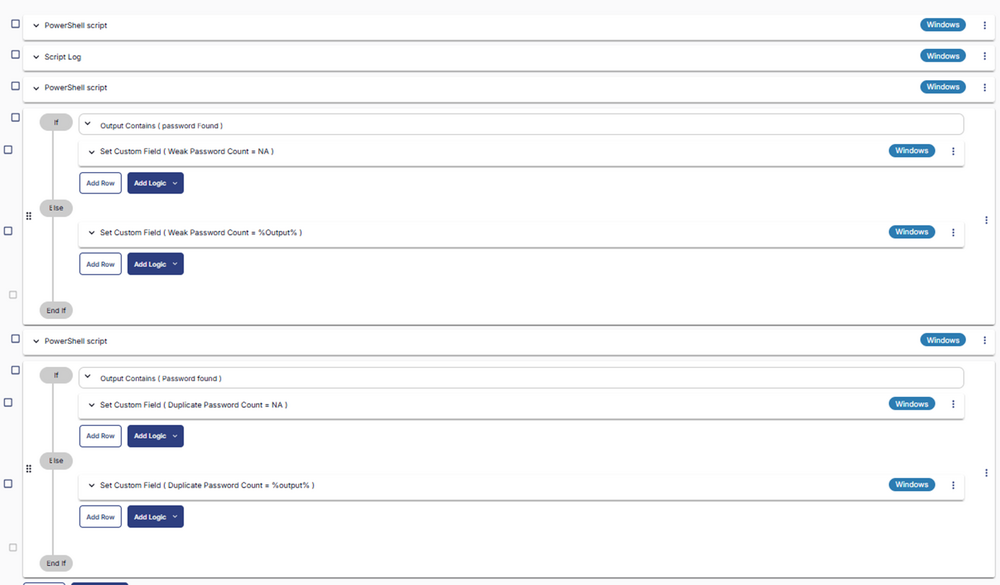

## Implementation

This task has to be scheduled on the [CW RMM - Machine Group - Domain Controllers](/docs/eeeb4ee0-d683-44fd-81cf-7f8872b71c68) group for auto deployment. The script can also be run manually if required.

Go to Automations > Tasks.  
Search for Weak Passwords - AD Test.  
Then click on Schedule and provide the parameters details as necessary for the script completion.

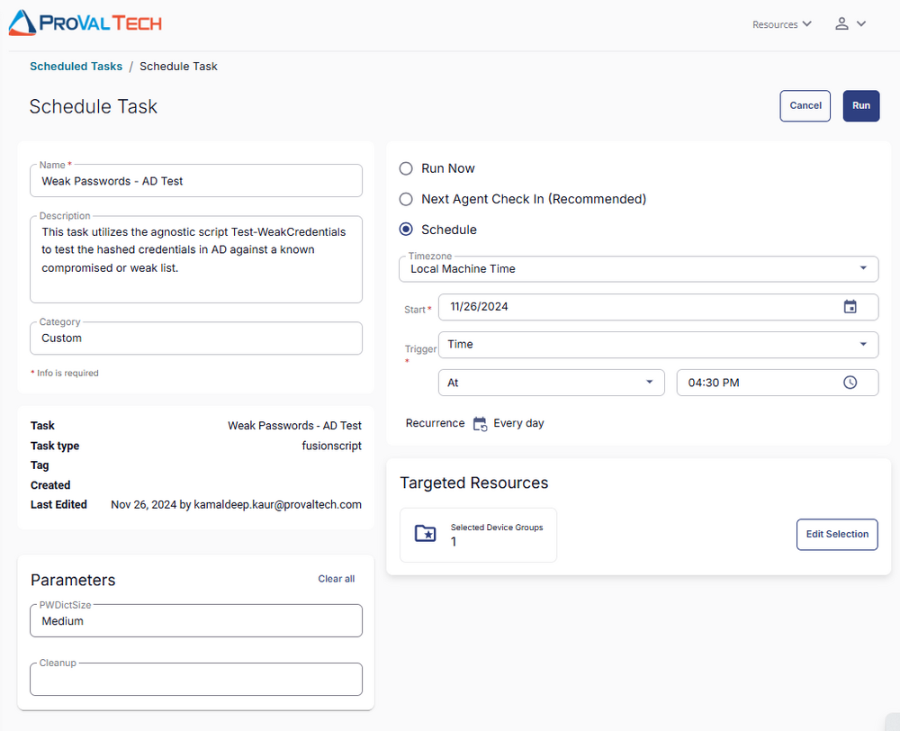

## Output

- Script Log
