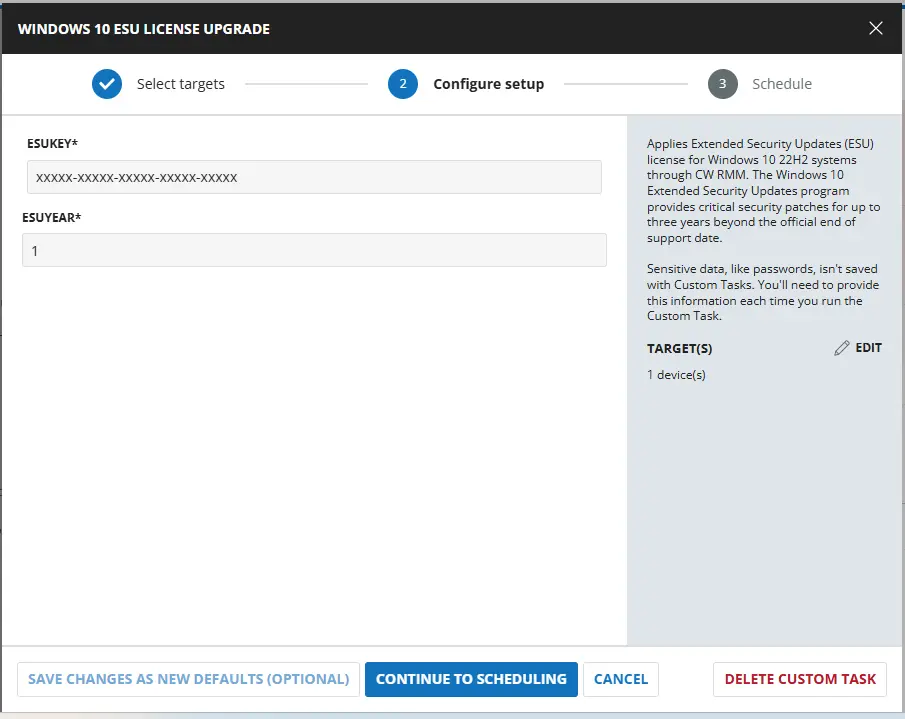
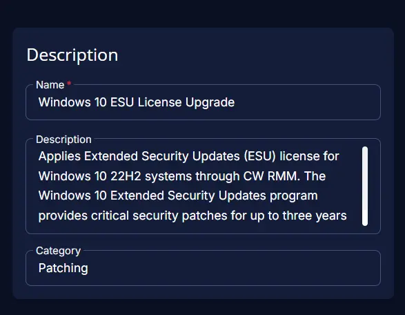
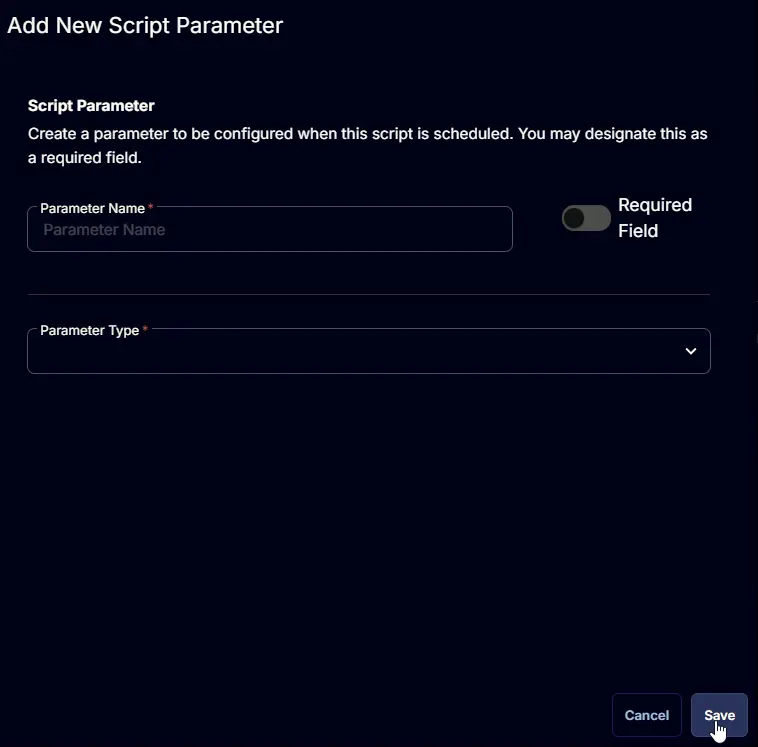
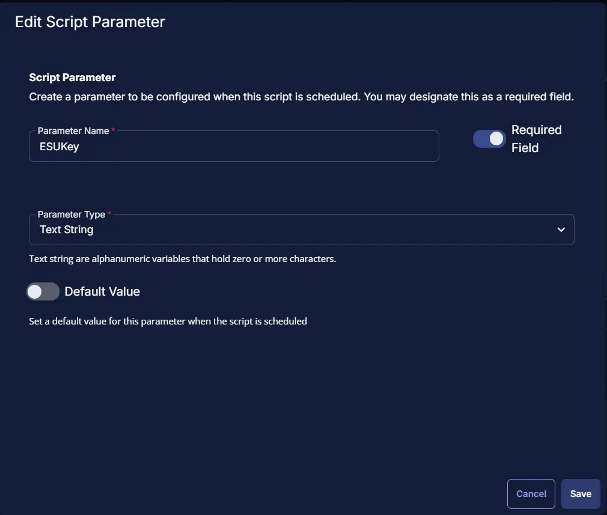
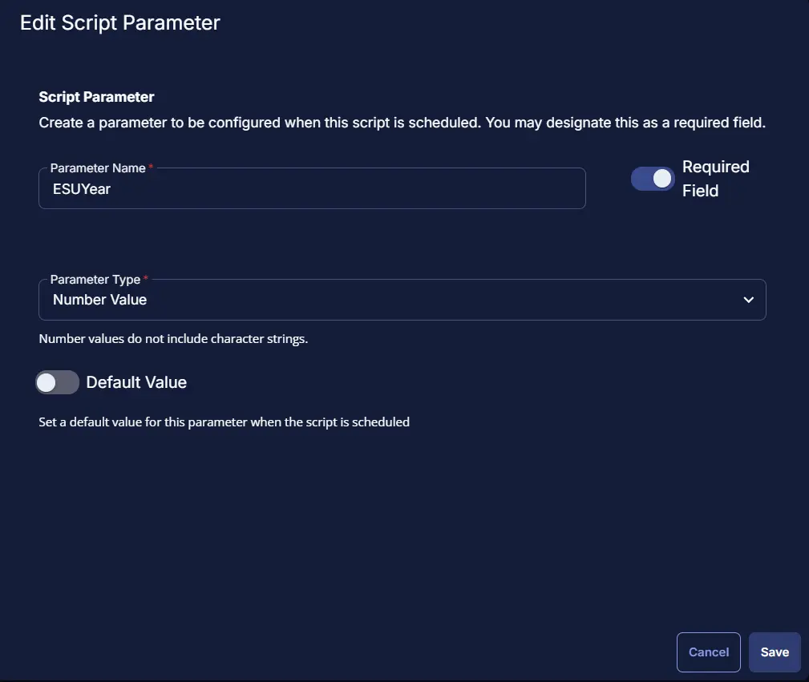
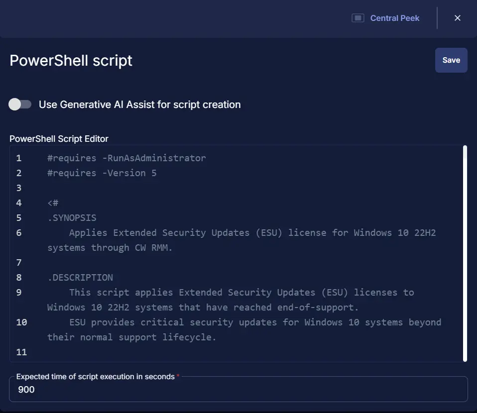
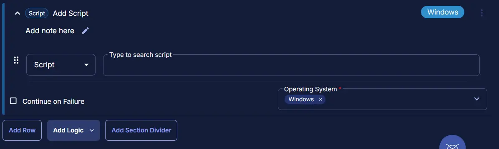
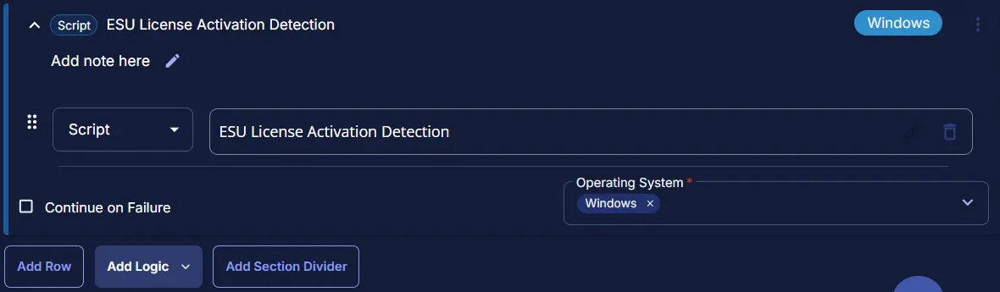
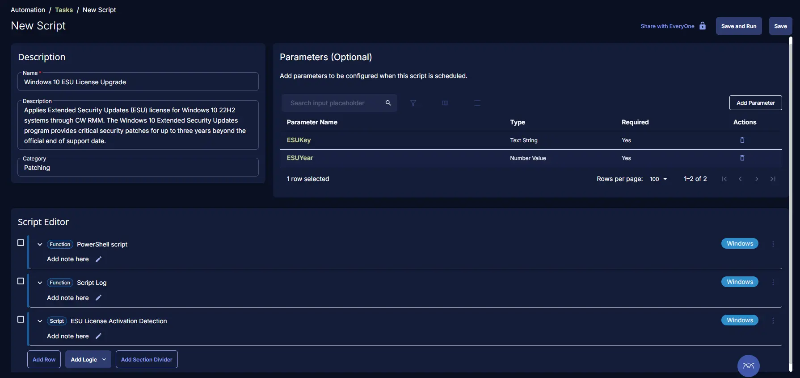

## Summary
Applies Extended Security Updates (ESU) license for Windows 10 22H2 systems through CW RMM. The Windows 10 Extended Security Updates program provides critical security patches for up to three years beyond the official end of support date.

## Sample Run



## Dependencies

- [Task : ESU License Activation Detection](/docs/fad37673-34ab-46e9-8797-b87058f79faa) 
- [Solution - Windows 10 ESU Licensing and Auditing](/docs/a7e4073e-1f09-4772-aa5e-ee44cf9bf9e7)

## User Parameters

| Name | Example | Accepted Values | Required | Default | Type | Description |
| ---- | ------- | --------------- | -------- | ------- | ---- | ----------- |
| ESU Key | xxxxx-xxxxx-xxxxx-xxxxx-xxxxx | | True | | String/Text | Provide the ESU license key for activation of Windows 10 extended use. |
| ESU Year | 2 | 1, 2, or 3 | True | | Number Value | Select the license key year validation like 1, 2, or 3. |


## Task Creation

### Script Details

#### Step 1

Navigate to `Automation` ➞ `Tasks`  


#### Step 2

Create a new `Script Editor` style task by choosing the `Script Editor` option from the `Add` dropdown menu  


The `New Script` page will appear on clicking the `Script Editor` button:  


#### Step 3

Fill in the following details in the `Description` section:  

- **Name:** `Windows 10 ESU License Upgrade`  
- **Description:** `Applies Extended Security Updates (ESU) license for Windows 10 22H2 systems through CW RMM. The Windows 10 Extended Security Updates program provides critical security patches for up to three years beyond the official end of support date.`  
- **Category:** `Patching`



### Parameters

### ESUKey :
Locate the `Add Parameter` button on the right-hand side of the screen and click on it to create a new parameter.  


The `Add New Script Parameter` page will appear on clicking the `Add Parameter` button.  


- Set `ESUKey` in the `Parameter Name` field.
- Select `Text String` from the `Parameter Type` dropdown menu.
- Enable the `Required Field` button.
- Click the `Save` button.



### ESUYear:
Add a new parameter by clicking the `Add Parameter` button present at the top-right corner of the screen. And Add the below details:

- Set `ESUYear` in the `Parameter Name` field.
- Select `Number Value` from the `Parameter Type` dropdown menu.
- Enable the `Required Field` button.
- Click the `Save` button.



### Script Editor

Click the `Add Row` button in the `Script Editor` section to start creating the script  


A blank function will appear:  


#### Row 1 Function: `PowerShell Script`

Search and select the `PowerShell Script` function.  
 
  

The following function will pop up on the screen:  
   

Paste in the following PowerShell script and set the `Expected time of script execution in seconds` to `900` seconds. Click the `Save` button.

```powershell
<#requires -RunAsAdministrator
#requires -Version 5

<#
.SYNOPSIS
    Applies Extended Security Updates (ESU) license for Windows 10 22H2 systems through CW RMM.

.DESCRIPTION
    This script applies Extended Security Updates (ESU) licenses to Windows 10 22H2 systems that have reached end-of-support.
    ESU provides critical security updates for Windows 10 systems beyond their normal support lifecycle.

    The script performs the following operations:
    - Validates system compatibility (Windows 10 22H2 Build 19045)
    - Checks for required cumulative update (KB5046613 or later)
    - Installs the ESU MAK (Multiple Activation Key)
    - Activates the ESU license for the specified year (1, 2, or 3)
    - Verifies the activation status

    ESU licenses are available for up to 3 years after Windows 10 reaches end-of-support, allowing organizations
    to continue receiving critical security updates while planning their migration to supported Windows versions.

.PARAMETER esuKey
    The ESU MAK (Multiple Activation Key) required for activation.
    This parameter can be provided via:
    - Runtime variable 'ESU Key'

    The ESU key is obtained from Microsoft Volume Licensing and is specific to your organization.
    If this parameter is missing, the script will throw an error with the message:
    "Error: ESU Key is missing. Please provide the ESU MAK Key as the runtime variable 'ESU Key'."

.PARAMETER esuYear
    The ESU year for which the license should be activated.
    Valid values: 1, 2, or 3

    This parameter can be provided via:
    - Runtime variable 'ESU Year'

    ESU licenses are available for up to 3 years after Windows 10 end-of-support:
    - Year 1: First year of ESU coverage
    - Year 2: Second year of ESU coverage
    - Year 3: Third year of ESU coverage

    If this parameter is missing, the script will throw an error with the message:
    "Error: ESU Year is missing. Please set the ESU Year as the runtime variable 'ESU Year'. Note: You can only use 1, 2, or 3 as Windows only allowed extensions for 3 years."

    If an invalid value is provided, the script will throw:
    "Error: Invalid ESU Year value. Only 1, 2, or 3 are allowed."

.EXAMPLE
    -esuKey "XXXXX-XXXXX-XXXXX-XXXXX-XXXXX" -esuYear 1

    Applies ESU license for the first year using the specified MAK key.

.EXAMPLE
    -esuKey "XXXXX-XXXXX-XXXXX-XXXXX-XXXXX" -esuYear 2

    Applies ESU license for the second year using the specified MAK key.

.LINK
    https://learn.microsoft.com/en-us/windows/whats-new/enable-extended-security-updates
    https://www.systemcenterdudes.com/deploy-windows-10-extended-security-update-key-with-intune-or-sccm/
#>

#region Globals
$ProgressPreference = 'SilentlyContinue'
$InformationPreference = 'Continue'
$WarningPreference = 'SilentlyContinue'
#endRegion

#region Variables
$requiredKB = 5046613
$supportedBuild = 19045
$activationIDs = @{
    1 = 'f520e45e-7413-4a34-a497-d2765967d094'
    2 = '1043add5-23b1-4afb-9a0f-64343c8f3f8d'
    3 = '83d49986-add3-41d7-ba33-87c7bfb5c0fb'
}

$activationID = $activationIDs[$esuYear]
$slmgrPath = '{0}\System32\slmgr.vbs' -f $env:SystemRoot
$acceptedEsuYearValues = @(1, 2, 3)
#endRegion

#region set parameters
$esuKey = '@ESUKey@'
if ([string]::IsNullOrEmpty($esuKey) -or $esuKey -match 'ESUKey') {
    throw 'Error: ESU Key is missing. Please provide the ESU MAK Key as the runtime variable ''ESU Key''.'
}

$esuYear = '@ESUYear@'
if ([string]::IsNullOrEmpty($esuYear) -or $esuYear -match 'ESUYear') {
    throw 'Error: ESU Year is missing. Please set the ESU Year as the runtime variable ''ESU Year''. Note: You can only use 1, 2, or 3 as Windows only allowed extensions for 3 years.'
}

if ($acceptedEsuYearValues -notcontains $esuYear) {
    throw 'Error: Invalid ESU Year value. Only 1, 2, or 3 are allowed.'
}
#endRegion

#region Set TLS Policy
$supportedTLSversions = [enum]::GetValues('Net.SecurityProtocolType')
if (($supportedTLSversions -contains 'Tls13') -and ($supportedTLSversions -contains 'Tls12')) {
    [System.Net.ServicePointManager]::SecurityProtocol = [System.Net.ServicePointManager]::SecurityProtocol::Tls13 -bor [System.Net.SecurityProtocolType]::Tls12
} elseif ($supportedTLSversions -contains 'Tls12') {
    [System.Net.ServicePointManager]::SecurityProtocol = [System.Net.SecurityProtocolType]::Tls12
} else {
    Write-Information -MessageData 'TLS 1.2 and/or TLS 1.3 are not supported on this system. This download may fail!'
    if ($PSVersionTable.PSVersion.Major -lt 3) {
        Write-Information -MessageData 'PowerShell 2 / .NET 2.0 doesn''t support TLS 1.2.'
    }
}
#endRegion

#region Compatibility Check
Write-Information -MessageData 'Checking Windows version and cumulative update...'

# Windows 10 22H2 has build number 19045
$build = (Get-CimInstance -ClassName 'Win32_OperatingSystem' -ErrorAction SilentlyContinue).buildNumber
if ($build -ne $supportedBuild) {
    throw ('Error: Not Compatible. The Windows version is not 22H2 (Build 19045). Current build: {0}' -f $build)
}

# Check for KB5046613 or later
$hotFixes = Get-HotFix | Where-Object { $_.HotFixID } | Select-Object @{
    Name       = 'KBID'
    Expression = { $_.HotFixId -replace 'Kb', '' }
}
$latestKB = $hotFixes | Sort-Object -Property 'KBID' -Descending | Select-Object -First 1 -ExpandProperty 'KBID'
if ($latestKB -lt $requiredKB) {
    throw ('Error: Not Compatible. Required cumulative update KB5046613 or later not found. Latest installed KB: KB{0}' -f $latestKB)
}

Write-Information -MessageData 'Windows 10 version and update check passed.'
#endRegion

#region Set ESU Key
Write-Information -MessageData 'Installing ESU MAK key...'
try {
    $argumentList = @(
        '/nologo',
        $slmgrPath,
        '/ipk',
        $esuKey
    )
    $procInfo = Start-Process -FilePath 'cscript.exe' -ArgumentList $argumentList -Wait -PassThru -NoNewWindow -ErrorAction Stop
} catch {
    throw ('Error: Failed to install ESU Key. Process exited with the exit code {0}. Reason: {1}' -f $procInfo.ExitCode, $Error[0].Exception.Message)
}
#endRegion

#region Activating ESU Key
Write-Information -MessageData ('Activating ESU MAK key for Year {0}...' -f $esuYear)
try {
    $argumentList = @(
        '/nologo',
        $slmgrPath,
        '/ato',
        $activationID
    )
    $procInfo = Start-Process -FilePath 'cscript.exe' -ArgumentList $argumentList -Wait -PassThru -NoNewWindow -ErrorAction Stop
} catch {
    throw ('Error: Failed to activate ESU Key. Process exited with the exit code {0}. Reason: {1}' -f $procInfo.ExitCode, $Error[0].Exception.Message)
}
#endRegion

#region Verification
Write-Information -MessageData 'Verifying activation status...'
try {
    $argumentList = @(
        '/nologo',
        $slmgrPath,
        '/dlv'
    )
    $tempFile = '{0}\temp\slmgrDlv.txt' -f $env:SystemRoot
    $procInfo = Start-Process -FilePath 'cscript.exe' -ArgumentList $argumentList -Wait -PassThru -NoNewWindow -ErrorAction Stop -RedirectStandardOutput $tempFile
    $dlvOutput = Get-Content -Path $tempFile
    Remove-Item -Path $tempFile -ErrorAction SilentlyContinue
} catch {
    throw ('Error: Failed to verify the activation status. Reason: {0}' -f $Error[0].Exception.Message)
}

$activationIDString = $dlvOutput -match 'Activation ID'
$licenseStatusString = $dlvOutput -match 'License Status'

if ($activationIDString -match [Regex]::Escape($activationID) -and $licenseStatusString -match 'Licensed') {
    return ('ESU license successfully activated for ''{0}'' year.' -f $esuYear)
} else {
    return ('Warning: Could not confirm ESU activation. Please manually verify the output below:{0}{1}' -f [char]10, ($dlvOutput | Out-String))
}
#endRegion

```



### Row 2 Function: Script Log

Add a new row by clicking the `Add Row` button.  
  

A blank function will appear.  
  

Search and select the `Script Log` function.  
  
 

In the script log message, simply type `%output%` and click the `Save` button.  
 

### Row 3 Script: ESU License Activation Detection

Add a new row by clicking the `Add Row` button.  
  

A blank function will appear.  Change Function to Script from the dropdown.  


Search and select the `ESU License Activation Detection` Script.  


## Save Task

Click the `Save` button at the top-right corner of the screen to save the script.  


## Completed Task



## Output
- Script Logs

## Changelog

### 2026-02-04

- Initial version of the document
