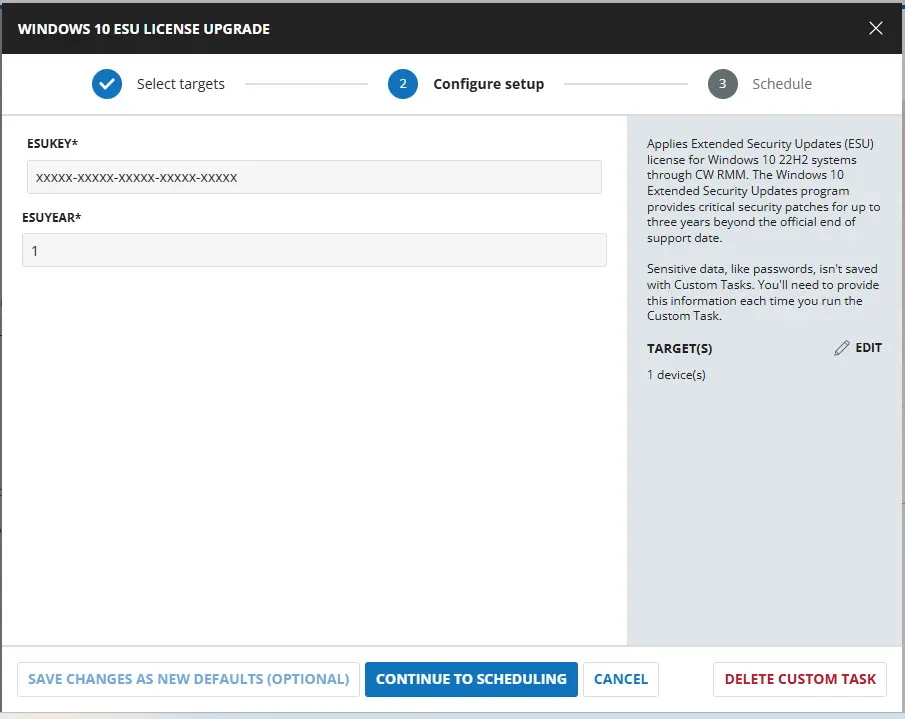
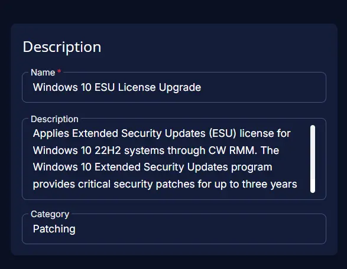
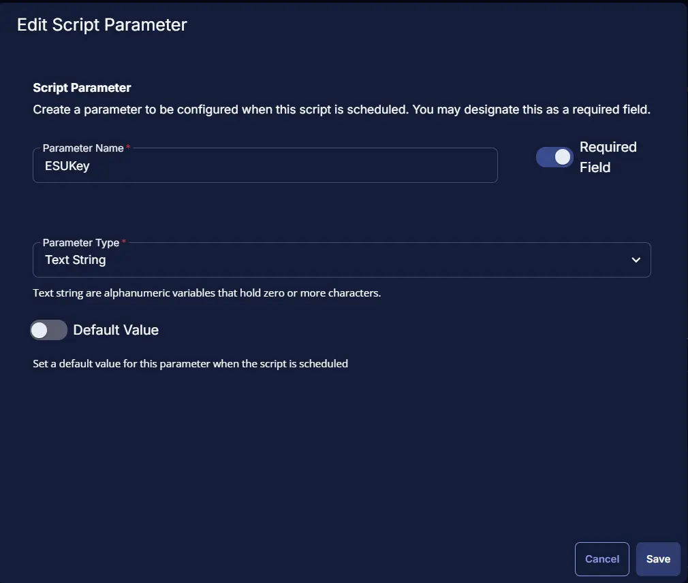
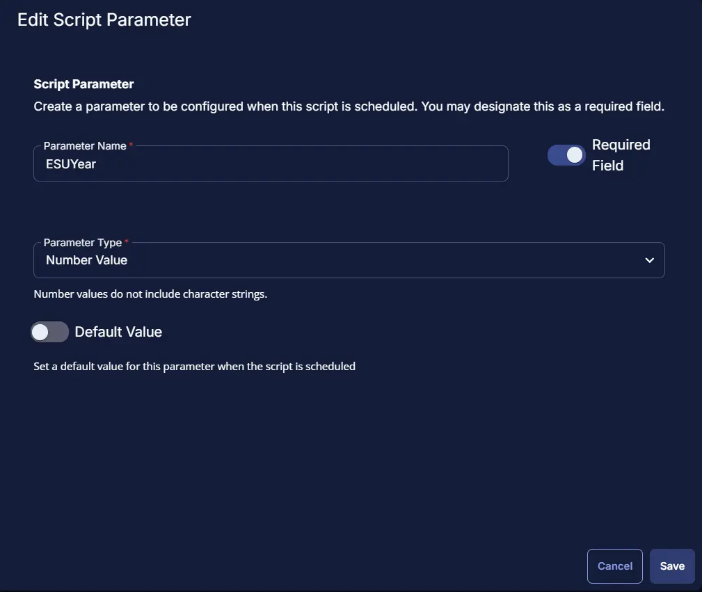
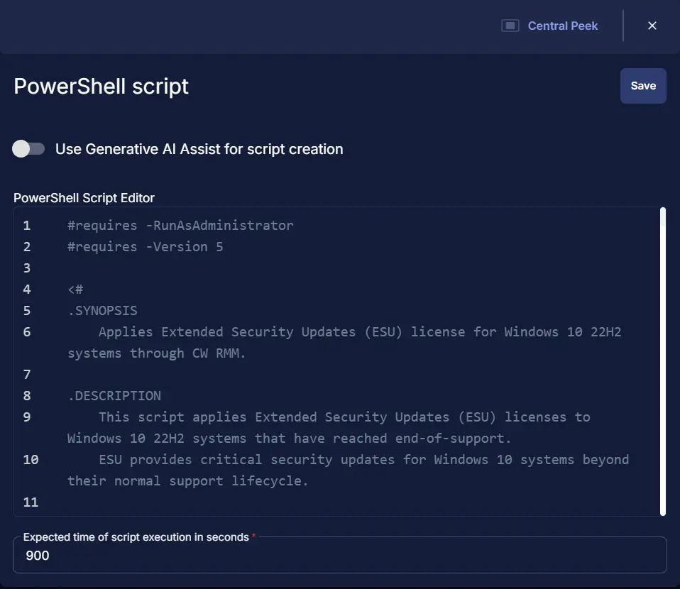
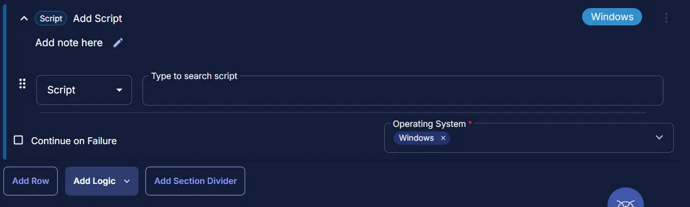
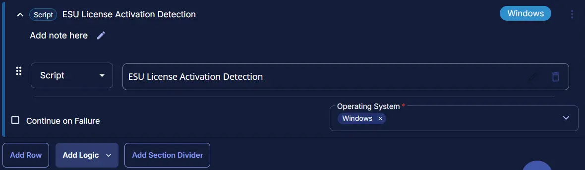
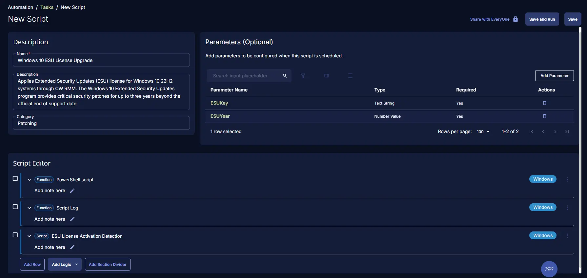

## Summary
Applies Extended Security Updates (ESU) license for Windows 10 22H2 systems through CW RMM. The Windows 10 Extended Security Updates program provides critical security patches for up to three years beyond the official end of support date.

## Sample Run

## Dependencies

- [Task : ESU License Activation Detection](/docs/fad37673-34ab-46e9-8797-b87058f79faa) 
- [Solution - Windows 10 ESU Licensing and Auditing](/docs/a7e4073e-1f09-4772-aa5e-ee44cf9bf9e7)

## User Parameters

| Name | Example | Accepted Values | Required | Default | Type | Description |
| ---- | ------- | --------------- | -------- | ------- | ---- | ----------- |
| ESU Key | xxxxx-xxxxx-xxxxx-xxxxx-xxxxx | | True | | String/Text | Provide the ESU license key for activation of Windows 10 extended use. |
| ESU Year | 2 | 1, 2, or 3 | True | | Number Value | Select the license key year validation like 1, 2, or 3. |

## Task Creation

### Script Details

#### Step 1

Navigate to `Automation` ➞ `Tasks`  

#### Step 2

Create a new `Script Editor` style task by choosing the `Script Editor` option from the `Add` dropdown menu  

The `New Script` page will appear on clicking the `Script Editor` button:  

#### Step 3

Fill in the following details in the `Description` section:  

- **Name:** `Windows 10 ESU License Upgrade`  
- **Description:** `Applies Extended Security Updates (ESU) license for Windows 10 22H2 systems through CW RMM. The Windows 10 Extended Security Updates program provides critical security patches for up to three years beyond the official end of support date.`  
- **Category:** `Patching`

### Parameters

### ESUKey :
Locate the `Add Parameter` button on the right-hand side of the screen and click on it to create a new parameter.  

The `Add New Script Parameter` page will appear on clicking the `Add Parameter` button.  

- Set `ESUKey` in the `Parameter Name` field.
- Select `Text String` from the `Parameter Type` dropdown menu.
- Enable the `Required Field` button.
- Click the `Save` button.

### ESUYear:
Add a new parameter by clicking the `Add Parameter` button present at the top-right corner of the screen. And Add the below details:

- Set `ESUYear` in the `Parameter Name` field.
- Select `Number Value` from the `Parameter Type` dropdown menu.
- Enable the `Required Field` button.
- Click the `Save` button.

### Script Editor

Click the `Add Row` button in the `Script Editor` section to start creating the script  

A blank function will appear:  

#### Row 1 Function: `PowerShell Script`

Search and select the `PowerShell Script` function.  
 
  

The following function will pop up on the screen:  
   

Paste in the following PowerShell script and set the `Expected time of script execution in seconds` to `900` seconds. Click the `Save` button.

[PowerShell Script](https://github.com/ProVal-Tech/cw-rmm/blob/main/tasks/windows-10-esu-license-upgrade/script.ps1)

### Row 2 Function: Script Log

Add a new row by clicking the `Add Row` button.  
  

A blank function will appear.  
  

Search and select the `Script Log` function.  
  
 

In the script log message, simply type `%output%` and click the `Save` button.  
 

### Row 3 Script: ESU License Activation Detection

Add a new row by clicking the `Add Row` button.  
  

A blank function will appear.  Change Function to Script from the dropdown.  

Search and select the `ESU License Activation Detection` Script.  

## Save Task

Click the `Save` button at the top-right corner of the screen to save the script.  

## Completed Task

## Output
- Script Logs

## Changelog

### 2026-02-04

- Initial version of the document

