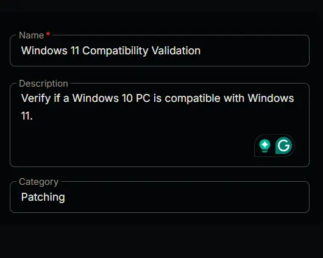
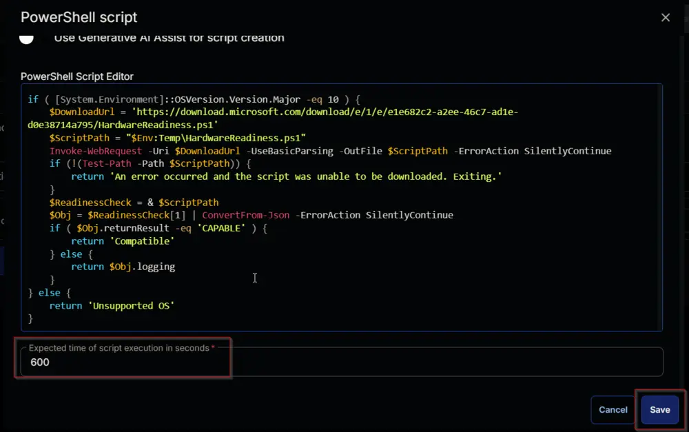
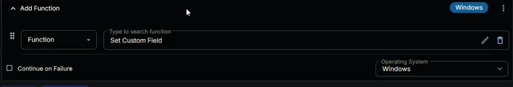
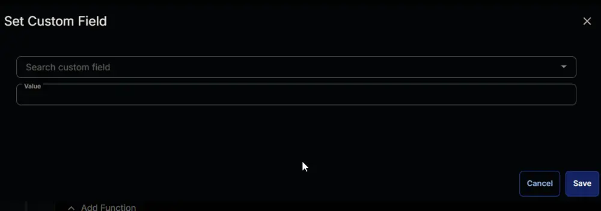
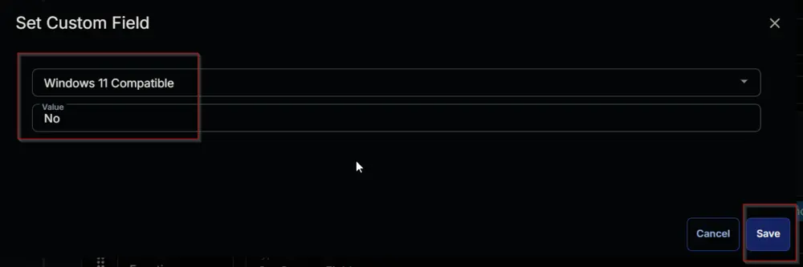
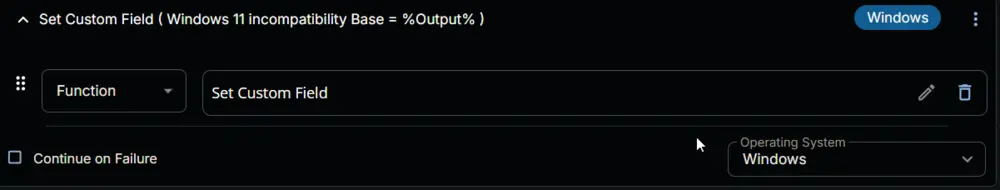
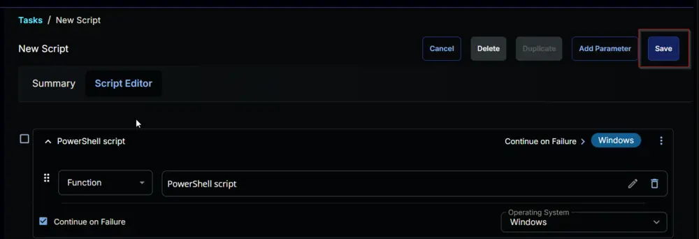
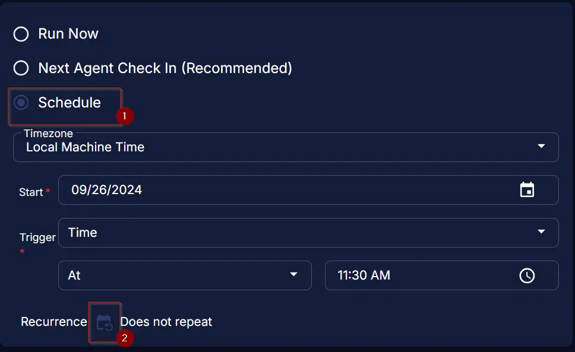
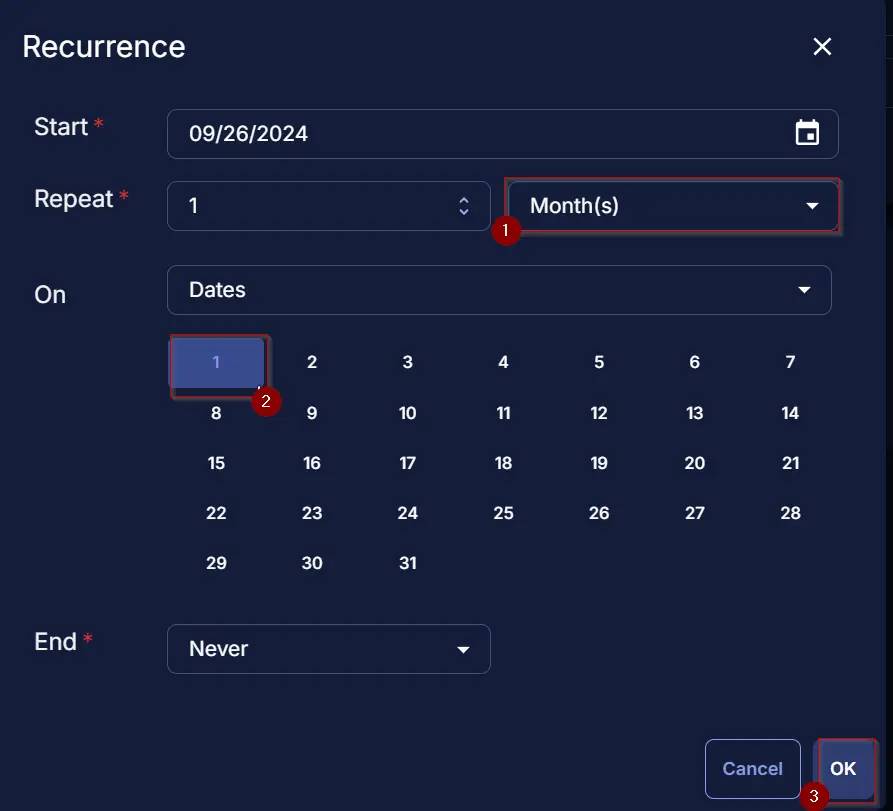

## Summary

Verify if a Windows 10 PC is compatible with Windows 11.

## Sample Run

  


## Dependencies

- [CW RMM - Device Group - Upgrade Enabled Windows 11 Compatible Machines](/docs/9c422249-e949-4bcd-83ea-2c91b8365a96)  
- [CW RMM - Custom Field - Endpoint - Windows 11 incompatibility Base](/docs/7894870c-b7e8-44e0-806c-c948f151fc49)  
- [CW RMM - Device Group - Windows 10 Machines](/docs/8d5c2d6a-5bb8-4720-bd11-4fa7396fbf7a)  

## Variables

| Name   | Description                         |
|--------|-------------------------------------|
| Output | Output of the PowerShell Script.    |

## Task Creation

Create a new `Script Editor` style script in the system to implement this Task.  
  
  

**Name:** Windows 11 Compatibility Validation  
**Description:** Verify if a Windows 10 PC is compatible with Windows 11.  
**Category:** Patching  
  

## Task

Navigate to the Script Editor Section and start by adding a row. You can do this by clicking the `Add Row` button at the bottom of the script page.  
  

A blank function will appear.  
  

### Row 1 Function: PowerShell Script

Search and select the `PowerShell Script` function.  
  
  

The following function will pop up on the screen:  
  

Paste in the following PowerShell script and set the expected time of script execution to `600` seconds. Click the `Save` button.

```powershell
[Net.ServicePointManager]::SecurityProtocol = [Enum]::ToObject([Net.SecurityProtocolType], 3072)
Set-ExecutionPolicy -Scope Process -ExecutionPolicy Unrestricted -Force -Confirm:$false
if ( [System.Environment]::OSVersion.Version.Major -eq 10 ) {
    $DownloadUrl = 'https://download.microsoft.com/download/e/1/e/e1e682c2-a2ee-46c7-ad1e-d0e38714a795/HardwareReadiness.ps1'
    $ScriptPath = "$Env:Temp/HardwareReadiness.ps1"
    Invoke-WebRequest -Uri $DownloadUrl -UseBasicParsing -OutFile $ScriptPath -ErrorAction SilentlyContinue
    if (!(Test-Path -Path $ScriptPath)) {
        return 'An error occurred and the script was unable to be downloaded. Exiting.'
    }
    $ReadinessCheck = & $ScriptPath
    $Obj = $ReadinessCheck[1] | ConvertFrom-Json -ErrorAction SilentlyContinue
    if ( $Obj.returnResult -eq 'CAPABLE' ) {
        return 'Compatible'
    } else {
        return $Obj.logging
    }
} else {
    return 'Unsupported OS'
}
```

  

Mark the `Continue on Failure` checkbox for the function.  
  

### Row 2 Logic: If/Then/Else

Add a new `If/Then/Else` logic.  
  
  

#### Row 2a Condition: Output Contains

Type `Compatible` in the `Input Value or Variable` field and press `Enter`.  
  

#### Row 2b Function: Set Custom Field

Add a new row by clicking the `Add Row` button inside the `If` section.  
  

A blank function will appear.  
  

Search and select `Set Custom Field` Function.  
  
  

Search and select `Windows 11 Compatible` in the `Search Custom Field` field, set `Yes` in the `Value` field, and click the `Save` button.  
  
  

#### Row 2c Logic: If/Then/Else

Add a new `If/Then/Else` logic inside the `Else` section.  
  

An empty logic will appear.  
  

##### Row 2c(i) Condition: Output Contains

Type `An error occurred and the script` in the `Input Value or Variable` field and press `Enter`.  
  

Add another condition by clicking the `Add Condition` button.  
  
  

Change the logical operator to `Or` from `And`.  
  

In the new condition, type `Unsupported OS` in the `Input Value or Variable` field and press `Enter`.  
  

##### Row 2c(ii) Function: Script Exit

Click the `Add Row` button inside the `If` section after the above conditions.  
  

A blank function will appear.  
  

Search and select the `Script Exit` function in the newly appeared row.  
  
  

The following function will pop up on the screen:  
  

Paste the following lines in the `Error Message` field and click the `Save` button.  

```plaintext
%Output%
```

  

##### Row 2c(iii) Function: Set Custom Field

Add a new row by clicking the `Add Row` button inside the inner `Else` section.  
  

A blank function will appear.  
  

Search and select `Set Custom Field` Function.  
  
  

Search and select `Windows 11 Compatible` in the `Search Custom Field` field and set `No` in the `Value` field and click the `Save` button.
  
  

##### Row 2c(iv) Function: Set Custom Field

Add a new row by clicking the `Add Row` button inside the inner `Else` section after the above function.  


A blank function will appear.  
  

Search and select `Set Custom Field` Function.  
  
  

Search and select `Windows 11 incompatible Base` in the `Search Custom Field` field, set `%Output%` in the `Value` field, and click the `Save` button.  
  


---

Click the `Save` button at the top-right corner of the screen to save the script.  
  

## Completed Task

  
  

## Deployment

It is suggested to run the Task once per month against [Windows 10 Machines](/docs/8d5c2d6a-5bb8-4720-bd11-4fa7396fbf7a).

- Go to `Automation` > `Tasks.`
- Search for `Windows 10 Machines` Task.
- Select the concerned task.
- Click on the `Schedule` button to schedule the task/script.  
  
- This screen will appear.  
  
- Select the `Schedule` button and click the calendar icon present in front of the `Recurrence` option.  
  
- Select the `Month(s)` for the `Repeat`, set `1` for `Dates`, and click the `OK` button to save the schedule.  
  
- Click the `Select Targets` button to select the concerned target.  
  
- Search and select the [Windows 10 Machines](/docs/8d5c2d6a-5bb8-4720-bd11-4fa7396fbf7a) Device Group for the target.  
  
- Click the `Run` button to initiate the schedule.  
  

## Output

- Script Log
- Custom Field