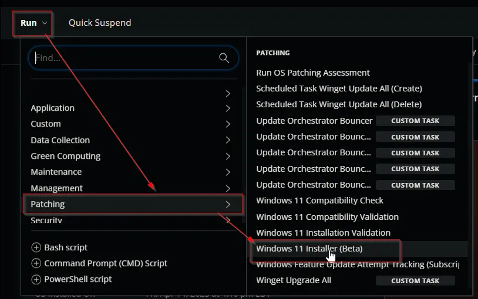
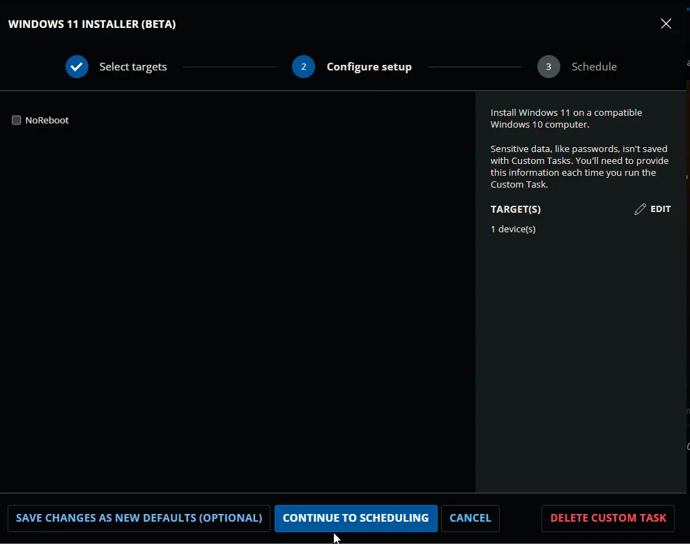
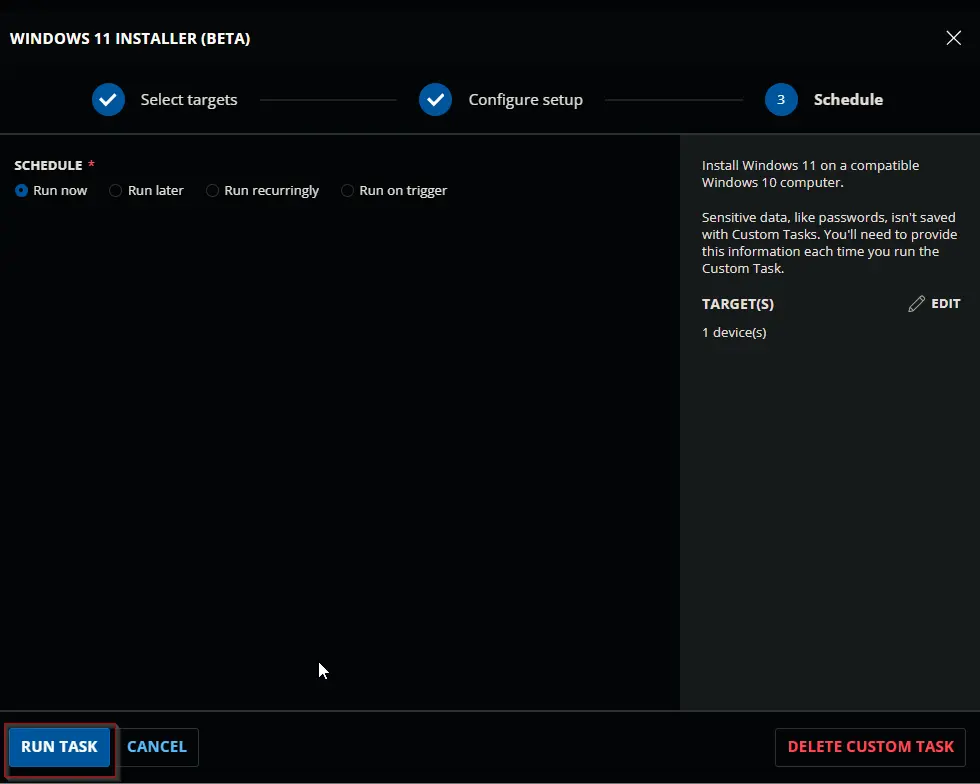
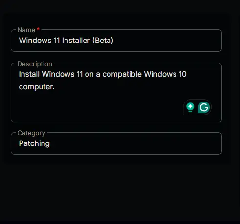
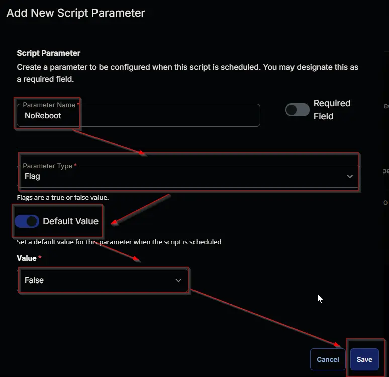
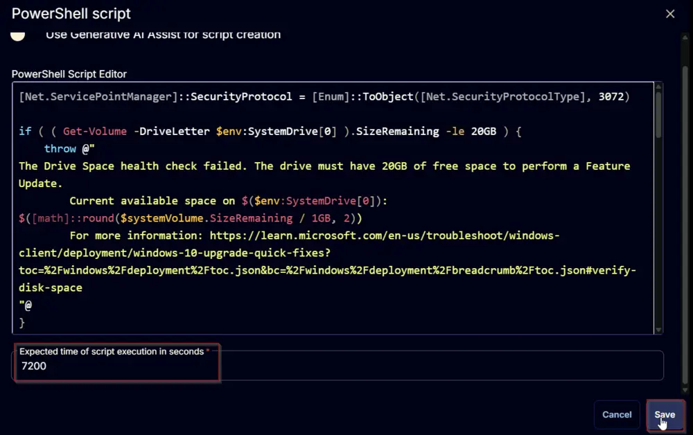
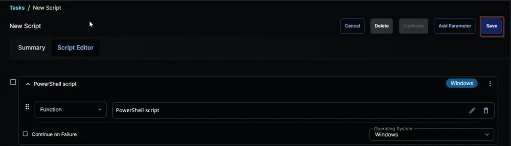
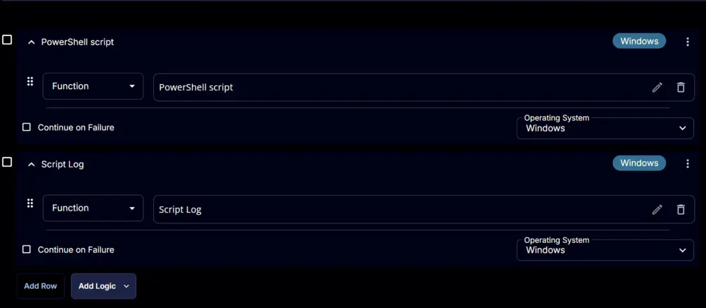

## Summary

Install Windows 11 on a compatible Windows 10 computer. The default behavior of the script is to restart the computer to complete the upgrade. However, the `NoReboot` parameter provides an option to suppress the reboot. It is recommended that the computer be rebooted at the earliest convenience to complete the upgrade.

The OS drive should have 20 GB of free space to install the upgrade.

This task can be executed manually against the computers present in the [Windows 11 Compatible Machines](/docs/9bfa70b2-a410-45d7-a8cc-a75c8e90c6f5) group.

## Sample Run

  
  
  

## Dependencies

- [CW RMM - Custom Field - Windows 11 Upgrade RunTime](/docs/ffce7cd6-7757-4918-bce0-461cf9dce0b4)
- [CW RMM - Device Group - Windows 11 Compatible Machines](/docs/9bfa70b2-a410-45d7-a8cc-a75c8e90c6f5)

## Variables

| Name   | Description                                       |
|--------|---------------------------------------------------|
| Output | Output of the previously executed PowerShell script. |

## User Parameters

| Name      | Type  | Required | Description                                                 | Default Value |
|-----------|-------|----------|-------------------------------------------------------------|---------------|
| NoReboot  | Flag  | No       | Provides an option to suppress the reboot while running the script. | False         |

## Task Creation

Create a new `Script Editor` style script in the system to implement this task.

  
  

**Name:** Windows 11 Installer  
**Description:** Install Windows 11 on a compatible Windows 10 computer.  
**Category:** Patching  

  

### Parameters

Add a new parameter by clicking the `Add Parameter` button present at the top-right corner of the screen.

  

This screen will appear.  
  

- Set `NoReboot` in the `Parameter Name` field.
- Select `Flag` from the `Parameter Type` dropdown menu.
- Enable the `Default Value` option.
- Select `False` from the `Value` dropdown menu.
- Click the `Save` button.  
  
- It will ask for confirmation to proceed. Click the `Confirm` button to create the parameter.  
  

### Task

Navigate to the Script Editor Section and start by adding a row. You can do this by clicking the `Add Row` button at the bottom of the script page.  
  

A blank function will appear.  
  

#### Row 1 Function: PowerShell Script

Search and select the `PowerShell Script` function.  
  
  

The following function will pop up on the screen:  
  

Paste in the following PowerShell script and leave the expected time of script execution set to `7200` seconds. Click the `Save` button.  

[PowerShell Script](https://github.com/ProVal-Tech/cw-rmm/blob/main/tasks/windows-11-installer-beta/script.ps1)

  

#### Row 2 Function: Script Log

Add a new row by clicking the `Add Row` button.  
  

A blank function will appear.  
  

Search and select the `Script Log` function.  
  
  

The following function will pop up on the screen:  
  

In the script log message, simply type `%output%` and click the `Save` button  

Click the `Save` button at the top right corner of the screen to save the task.  
  

Click the `Save` button at the top right corner of the screen to save the task.

## Completed Task

  

## Deployment

It is suggested to run this task manually for the time being.

## Output

- Script Log
- Custom Field

## Changelog

### 2025-07-23

- Fixed PowerShell Bug

### 2025-04-10

- Initial version of the document

### 2025-04-02

- Updated the document to remove deprecated custom fields.

