## Summary

Designed to upgrade Windows systems to the latest version. It can be used to:

--> Upgrade Windows 10 to Windows 11
--> Install Windows 11 feature updates (e.g., 21H2 → 22H2 → 23H2 → 24H2 → 25H2)

Supports multiple source types including HTTP/HTTPS URLs, local files, and network shares (UNC paths).

## Sample Run

### Example 1: Installing 24H2


### Example 2: Installing 25H2

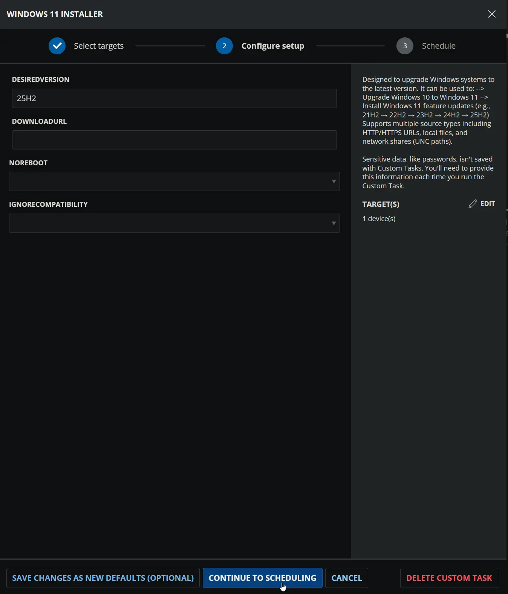

### Example 3: From a custom source

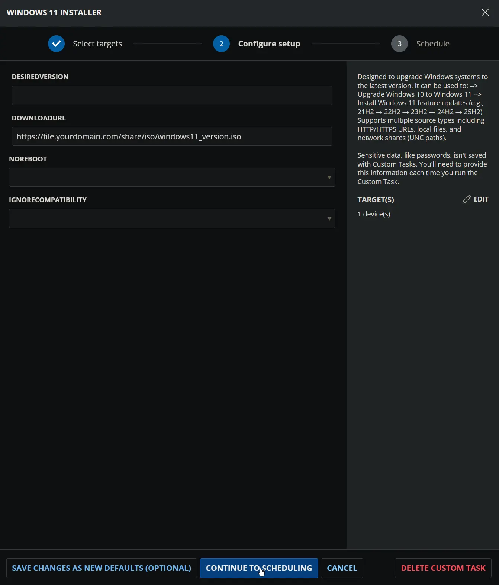

## Dependencies

- [Windows 11 Upgrade RunTime](/docs/ffce7cd6-7757-4918-bce0-461cf9dce0b4)
- [Windows 11 Compatible Machines](/docs/9bfa70b2-a410-45d7-a8cc-a75c8e90c6f5)

## User Parameters

| Name             | Example   | Accepted Values     | Required | Default | Type         | Description  |
|------------------|-----------|---------------------|----------|---------|--------------|--------------|
| DesiredVersion   |  25H2     | `24H2`, `25H2`      | False    | `24H2`  | Text String  | Specifies the Windows 11 version to install from ProVal's repository: `24H2` or `25H2`. Defaults to `24H2`. Cannot be used with `DownloadURL`. |
| DownloadURL      |  [https://my.repo.site/repo/Windows11.zip](https://my.repo.site/repo/Windows11.zip)     | Download URL for hosted zip or iso windows image | False    |  | Text String  | URL or path to the Windows 11 installation files. Accepts HTTP/HTTPS URLs, local file paths, and UNC network paths. Cannot be used with `DesiredVersion`. |
| NoReboot         | False     |                     | False    | False   | Flag         | Suppresses system reboot after successful installation. Note: Major upgrades may still trigger a reboot regardless of this setting. |
| IgnoreCompatibility         | False     |                     | False    | False   | Flag         | Bypasses Windows 11 hardware compatibility validation. Exercise caution when enabling. |

## Task Setup Path

- **Tasks Path:** `AUTOMATION` ➞ `Tasks`  
- **Task Type:** `Script Editor`  

## Task Creation

### Description

- **Name:** `Windows 11 Installer`  
- **Description:**

    ```PlainText
    Designed to upgrade Windows systems to the latest version. It can be used to:

    --> Upgrade Windows 10 to Windows 11
    --> Install Windows 11 feature updates (e.g., 21H2 → 22H2 → 23H2 → 24H2 → 25H2)

    Supports multiple source types including HTTP/HTTPS URLs, local files, and network shares (UNC paths).
    ```

- **Category:** `Patching`

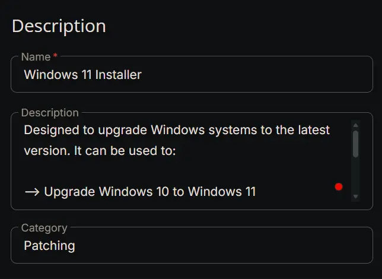

### Parameters

#### **DesiredVersion**

| Parameter Name | Required Field | Parameter Type | Default Value |
| -------------- | -------------- | -------------- | ------------- |
| DesiredVersion | Disabled | Text String | Disabled |

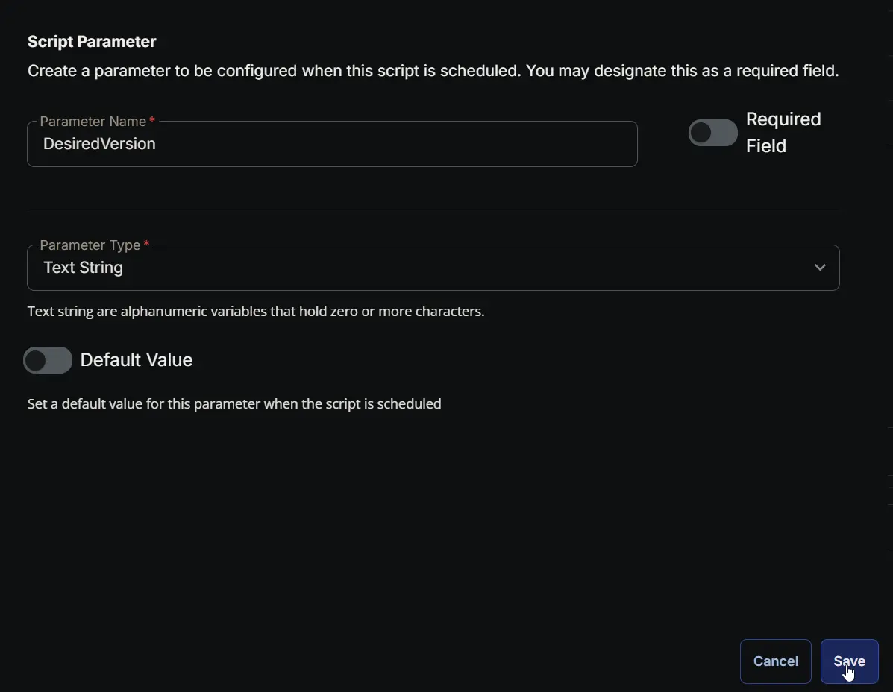

#### **DownloadURL**

| Parameter Name | Required Field | Parameter Type | Default Value |
| -------------- | -------------- | -------------- | ------------- |
| DownloadURL | Disabled | Text String | Disabled |

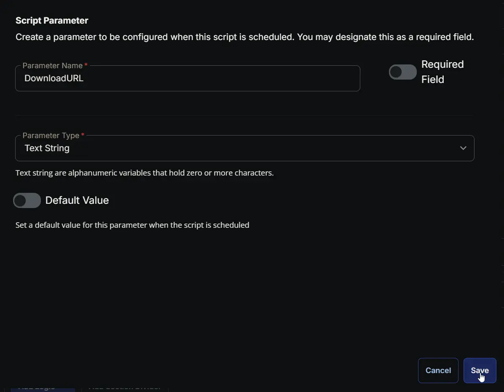

#### **NoReboot**

| Parameter Name | Required Field | Parameter Type | Default Value |
| -------------- | -------------- | -------------- | ------------- |
| NoReboot | Disabled | Flag | Disabled |

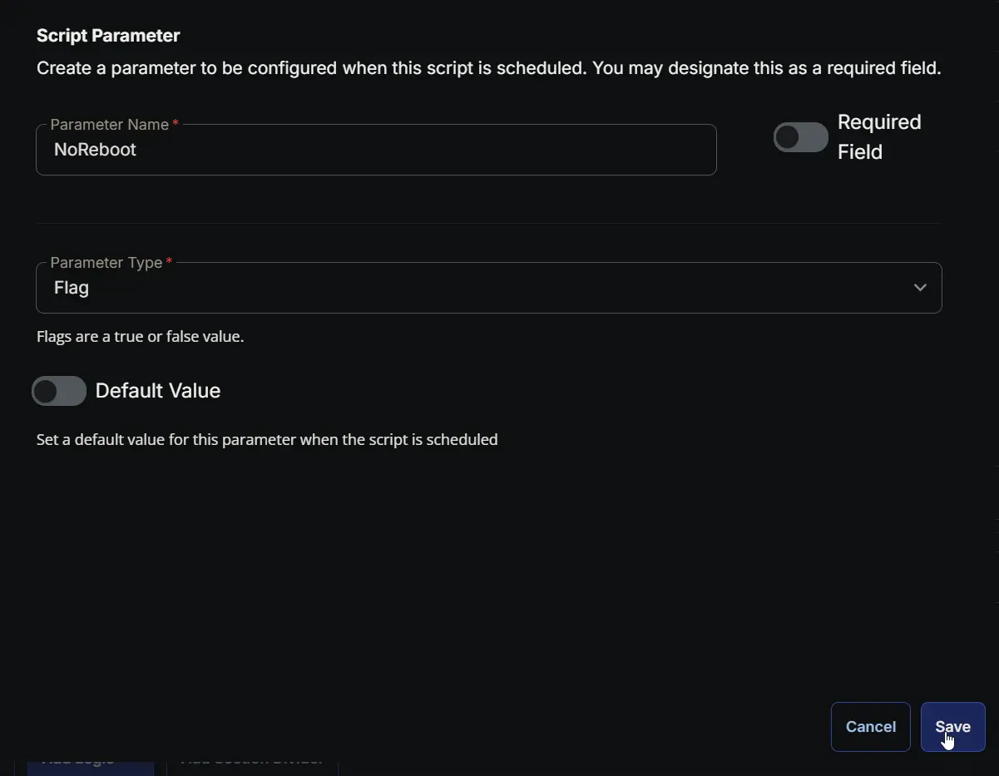

#### **IgnoreCompatibility**

| Parameter Name | Required Field | Parameter Type | Default Value |
| -------------- | -------------- | -------------- | ------------- |
| IgnoreCompatibility | Disabled | Flag | Disabled |

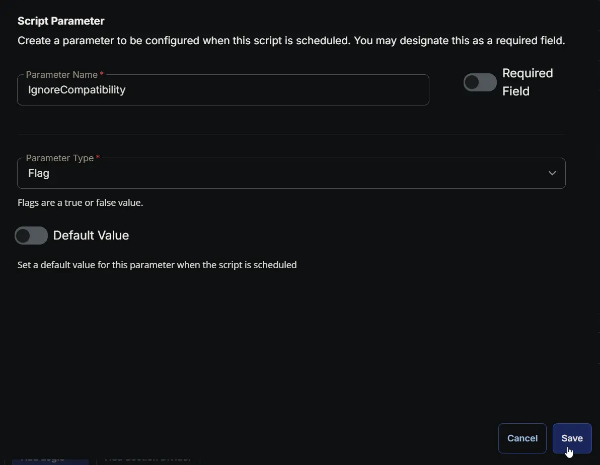

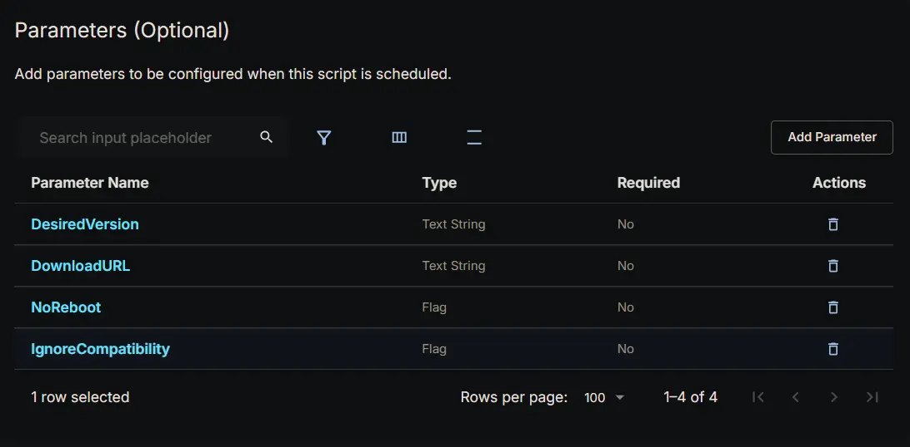

### Script Editor

#### **Row 1: PowerShell script**

- **Use Generative AI Assist for script creation:** `False`  
- **Expected time of script execution in seconds:** `7200`  
- **Operating System:** `Windows`  
- **Continue on Failure:** `False`  
- **Run as:** `System`  
- **PowerShell Script Editor:**

```PowerShell
#Requires -RunAsAdministrator

#region globals
$ProgressPreference = 'SilentlyContinue'
$WarningPreference = 'SilentlyContinue'
$InformationPreference = 'Continue'
#endRegion

#region variables
$appName = 'windows-upgrader'
$workingDirectory = '{0}\_Automation\App\{1}' -f $env:ProgramData, $appName
$appPath = '{0}\{1}.exe' -f $workingDirectory, $appName
$baseUrl = 'https://contentrepo.net/repo'
$downloadUrl = '{0}/app/{1}.exe' -f $baseUrl, $appName
$potentialTempPaths = @(
    'C:\Windows\Temp\win11Temp.zip',
    'C:\Windows\Temp\win11Temp.iso',
    'C:\Windows\Temp\Win11Extract',
    'C:\Windows\System32\config\systemprofile\AppData\Local\Temp\win11Temp.zip',
    'C:\Windows\System32\config\systemprofile\AppData\Local\Temp\win11Temp.iso',
    'C:\Windows\System32\config\systemprofile\AppData\Local\Temp\win11Extract'
)
#endRegion

#region cw-rmm parameters
$Version = '@DesiredVersion@'
$Uri = '@DownloadURL@'
$NoReboot = '@NoReboot@'
$IgnoreCompat = '@IgnoreCompatibility@'


$Version = if ($Version -match '24H2') {
    '24H2'
} elseif ($Version -match '25H2') {
    '25H2'
} else {
    $null
}

$Uri = if ($Uri -match '^https?://') {
    $Uri
} else {
    $null
}

$NoReboot = if ($NoReboot -match '1|Yes|True' -and $NoReboot -notmatch 'NoReboot') {
    $true
} else {
    $false
}

$IgnoreCompat = if ($IgnoreCompat -match '1|Yes|True' -and $IgnoreCompat -notmatch 'IgnoreCompat') {
    $true
} else {
    $false
}
#endRegion

#region parameters variable
$parameters = ''
if ($Version) {
    $parameters += ' --version {0}' -f $Version
} elseif ($Uri) {
    $parameters += ' --uri {1}{0}{1}' -f $Uri, [char]34
}

if ($Multipart) {
    $parameters += ' --multipart'
}

if ($NoReboot) {
    $parameters += ' --noreboot'
}

if ($IgnoreCompat) {
    $parameters += ' --ignorecompat'
}

if ($EnableDebug) {
    $parameters += ' --debug'
}

$upgraderCommand = '{0} {1}' -f $appPath, $parameters.Trim()
#endRegion

#region working Directory
if (-not (Test-Path -Path $workingDirectory)) {
    try {
        New-Item -Path $workingDirectory -ItemType Directory -Force -ErrorAction Stop | Out-Null
    } catch {
        throw ('Failed to Create working directory {0}. Reason: {1}' -f $workingDirectory, $Error[0].Exception.Message)
    }
}

$acl = Get-Acl -Path $workingDirectory
$hasFullControl = $acl.Access | Where-Object {
    $_.IdentityReference -match 'Everyone' -and $_.FileSystemRights -match 'FullControl'
}
if (-not $hasFullControl) {
    $accessRule = New-Object -TypeName System.Security.AccessControl.FileSystemAccessRule(
        'Everyone', 'FullControl', 'ContainerInherit, ObjectInherit', 'None', 'Allow'
    )
    $acl.AddAccessRule($accessRule)
    Set-Acl -Path $workingDirectory -AclObject $acl -ErrorAction SilentlyContinue
}
#endRegion

#region set tls policy
$supportedTLSversions = [enum]::GetValues('Net.SecurityProtocolType')
if (($supportedTLSversions -contains 'Tls13') -and ($supportedTLSversions -contains 'Tls12')) {
    [System.Net.ServicePointManager]::SecurityProtocol = [System.Net.ServicePointManager]::SecurityProtocol::Tls13 -bor [System.Net.SecurityProtocolType]::Tls12
} elseif ($supportedTLSversions -contains 'Tls12') {
    [System.Net.ServicePointManager]::SecurityProtocol = [System.Net.SecurityProtocolType]::Tls12
} else {
    Write-Information -MessageData 'TLS 1.2 and/or TLS 1.3 are not supported on this system. This download may fail!'
    if ($PSVersionTable.PSVersion.Major -lt 3) {
        Write-Information -MessageData 'PowerShell 2 / .NET 2.0 doesn''t support TLS 1.2.'
    }
}
#endRegion

#region drive space check
if ( ( Get-Volume -DriveLetter $env:SystemDrive[0] ).SizeRemaining -le 20GB ) {
    throw @"
The Drive Space health check failed. The drive must have 20GB of free space to perform a Feature Update.
Current available space on $($env:SystemDrive[0]): $([math]::round($systemVolume.SizeRemaining / 1GB, 2))
For more information: https://learn.microsoft.com/en-us/troubleshoot/windows-client/deployment/windows-10-upgrade-quick-fixes?toc=%2Fwindows%2Fdeployment%2Ftoc.json&bc=%2Fwindows%2Fdeployment%2Fbreadcrumb%2Ftoc.json#verify-disk-space
"@
}
#endRegion

#region reserved partition check
$free = (Get-Partition | Where-Object { $_.IsSystem } | Get-Volume).SizeRemaining / 1MB
if ($free -gt 15) {
    Write-Information -MessageData 'Sufficient Space Available in System Reserved Partition.'
}
$diskNumber = (Get-Partition | Where-Object { $_.IsSystem }).DiskNumber
$style = (Get-Disk | Where-Object { $_.Number -eq $diskNumber }).PartitionStyle
if ($style -eq 'MBR') {
    throw @'
15MB of free space on the System Reserved Partition (SRP) is needed for upgrading a Windows 10 to 11.
Autofix is not recommended for MBR disks.
Please follow the instructions provided for 'Windows 10 with GPT partition' in the this article:
https://support.microsoft.com/en-us/topic/-we-couldn-t-update-system-reserved-partition-error-installing-windows-10-46865f3f-37bb-4c51-c69f-07271b6672ac
'@
}
Write-Information -MessageData 'Clearing unneeded space on the System Reserved Partition...'
cmd.exe /c mountvol y: /s
Get-ChildItem -Path 'Y:\EFI\Microsoft\Boot\Fonts' -Force -Recurse | Remove-Item -Force -Recurse
cmd.exe /c mountvol y: /D

$free = (Get-Partition | Where-Object { $_.IsSystem } | Get-Volume).SizeRemaining / 1MB
if ($free -gt 15) {
    Write-Information -MessageData 'Freed Sufficient Space in System Reserved Partition.'
} else {
    throw @'
Failed to free up enough space on the System Reserved Partition (SRP).
15MB of free space on the System Reserved Partition (SRP) is needed for upgrading a Windows 10 to 11.
Please follow the instructions provided in the this article:
https://support.microsoft.com/en-us/topic/-we-couldn-t-update-system-reserved-partition-error-installing-windows-10-46865f3f-37bb-4c51-c69f-07271b6672ac
'@
}
#endRegion

#region download upgrader
try {
    Invoke-WebRequest -Uri $downloadUrl -OutFile $appPath -UseBasicParsing -ErrorAction Stop
} catch {
    if (-not (Test-Path -Path $appPath)) {
        throw ('Failed to download the app from ''{0}'', and no local copy of the app exists on the machine. Reason: {1}' -f $downloadUrl, $Error[0].Exception.Message)
    }
}
Unblock-File -Path $appPath -ErrorAction SilentlyContinue
#endRegion

#region execute upgrader
Write-Information -MessageData ('Executing upgrader command: {0}' -f $upgraderCommand)
cmd.exe /c $upgraderCommand
#endRegion

#region cleanup
foreach ($tempPath in $potentialTempPaths) {
    if (Test-Path -Path $tempPath) {
        Remove-Item -Path $tempPath -Force -Recurse -Confirm:$false -ErrorAction SilentlyContinue
    }
}
#endRegion
```

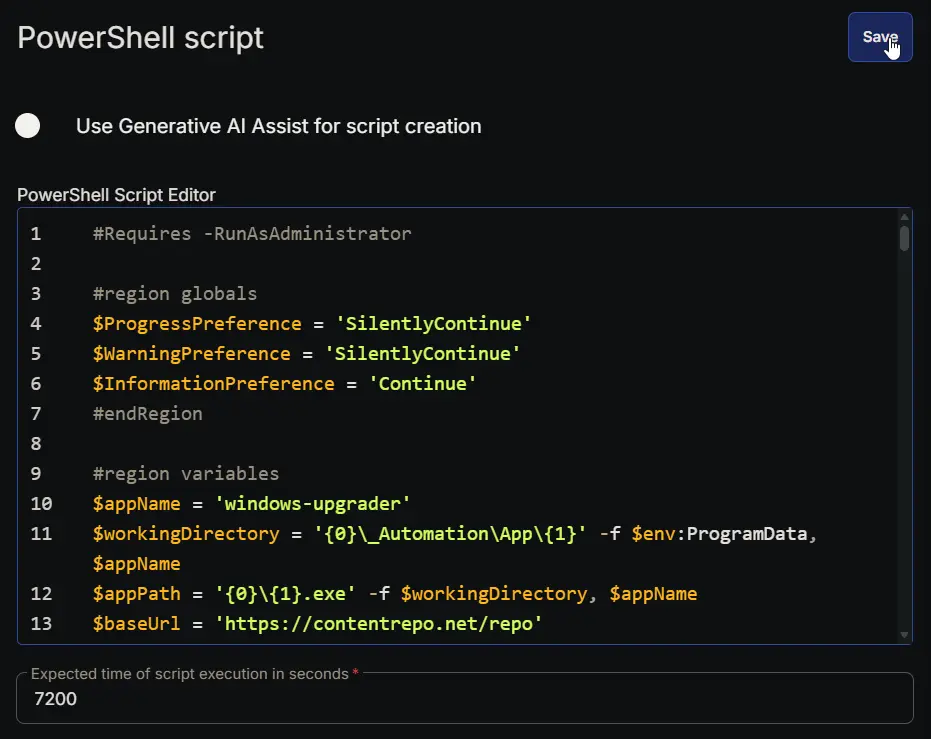

#### **Row 2: Script Log**

- **Script Log Message:** `%output%`  
- **Continue on Failure:** `False`  
- **Operating System:** `Windows`

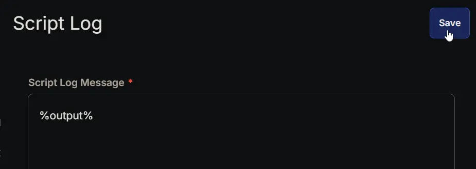

## Completed Script

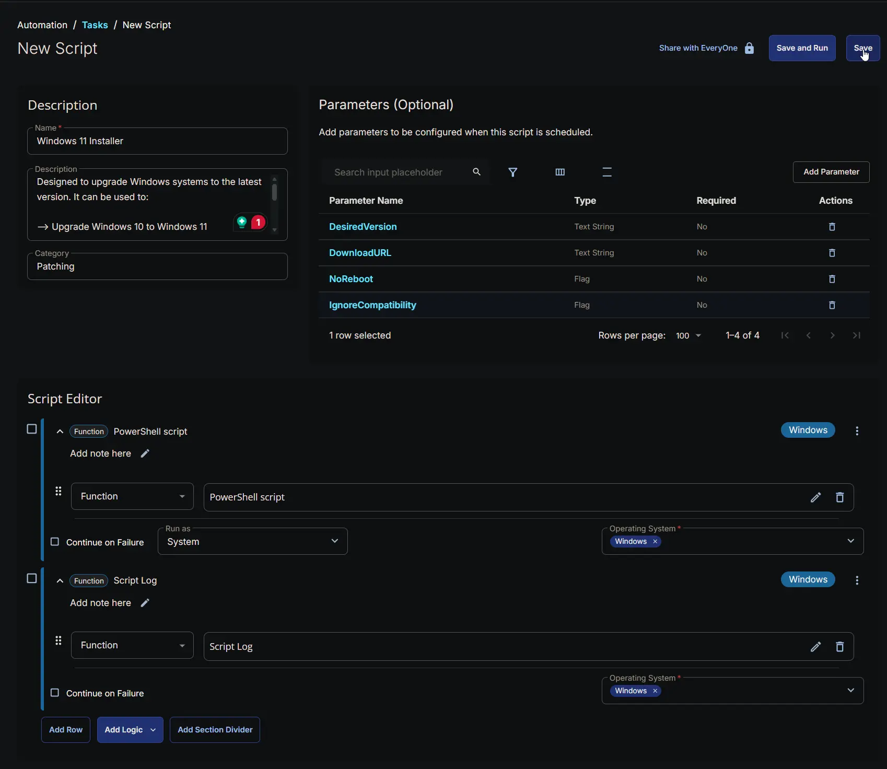

## Output

- Script Log
