## Summary

This script is a subscript used for tracking the number of times the Windows Feature Upgrade solution has run and enters that value into the `WinFeatUpgradeAttempts` field.

## Sample Run

The script is intended to be called from the task [Feature Update Install With Tracking](/docs/5244ac77-6926-4902-a183-b4b2aac18e2b) and should not be executed manually.

## Dependencies

- [Task - Feature Update Install With Tracking](/docs/5244ac77-6926-4902-a183-b4b2aac18e2b)
- [Custom Field - WinFeatUpgradeAttempts](/docs/58b312bd-f26c-4b05-ab92-c184520d05de)

## Create Script

Create a new `Script Editor` style script in the system to implement this task.


**Name:** `Windows Feature Update Attempt Tracking (Subscript)`

**Description:** `This script is a subscript used for tracking the number of times the Win Feature Upgrade solution has run and enters that value into the WinFeatUpgradeAttempts field.`

**Category:** Patching


Start by adding a row. You can do this by clicking the `Add Row` button at the bottom of the script page.


### Row 1 Function: PowerShell Script

Insert a new row by clicking the `Add Row` button.


Select `PowerShell Script` function.


Paste in the following PowerShell script, set the expected time of script execution to `300` seconds, and click the `Save` button.

```powershell
$output='@reset@'
$output
```

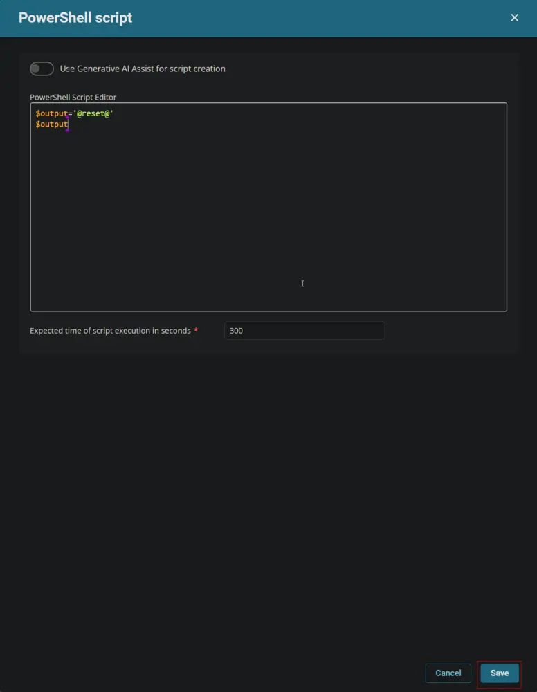

Mark the `Continue on Failure` checkbox.


### Row 2 Logic: If Then

Insert a new `If/Then` logic from the `Add Logic` dropdown menu.

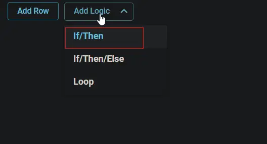  


### Row 2a Condition: Output Contains

Type `True` in the Value box and press `Enter`.


#### Row 2b Function: Script Log

Insert a new row by clicking the `Add Row` button inside the `If Then` logic after the `Output Contains` condition.

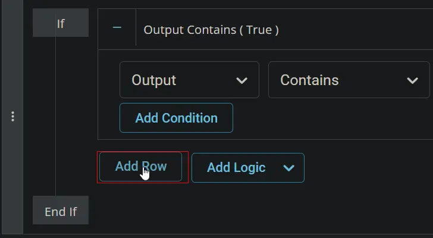

Search and select the `Script Log` function in the new row.


Paste this line in the `Script Log Message` box and click the `Save` button.  
`Reset Variable = %output%  
Resetting WinFeatUpgradeAttempts Custom Field to 0.`

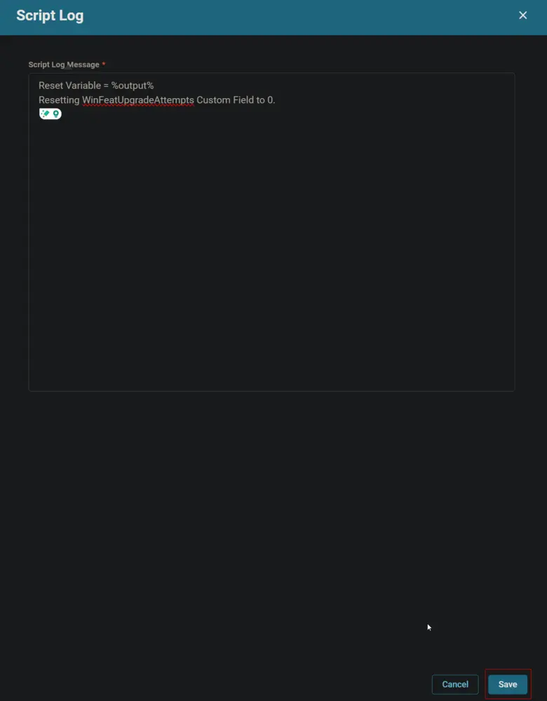

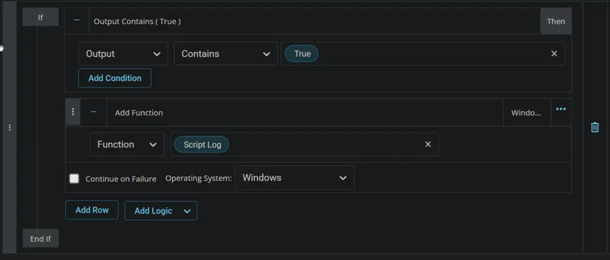

#### Row 2c Function: Set Custom Field

Insert a new row by clicking the `Add Row` button inside the `If Then` logic.


Search and select the `Set Custom Field` function in the new row.


Search and select the `WinFeatUpgradeAttempts` Custom Field.

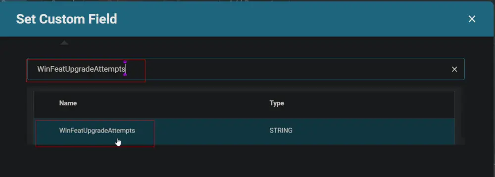

Type `0` in the `Value` box and click the `Save` button.


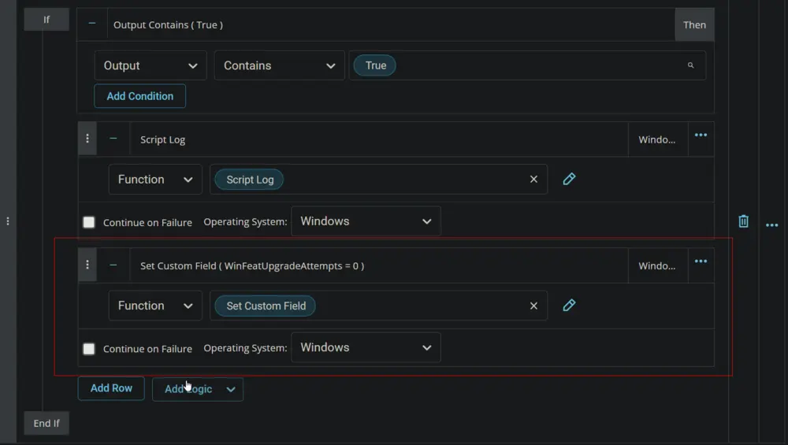

### Step 3 Function: Set Pre-defined Variable

Insert a new row by clicking the `Add Row` button.


Select `Set Pre-defined Variable` function.

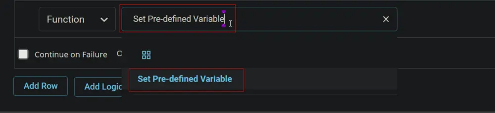


Type `VarCheck` in the `Variable Name` field, mark the `Custom Field` checkbox, select `WinFeatUpgradeAttempts` in the Custom Field box, and click the `Save` button.


### Step 4 Function: Script Log

Insert a new row by clicking the `Add Row` button.


Search and select the `Script Log` function in the new row.


Paste this line in the `Script Log Message` box and click the `Save` button.  
`Win Feature Pack Upgrade Attempts = @varcheck@`


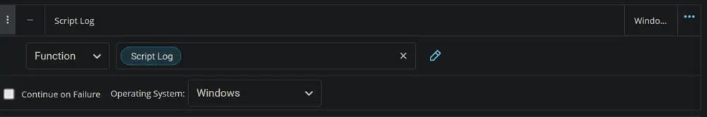

### Row 5 Function: PowerShell Script

Insert a new row by clicking the `Add Row` button.


Select `PowerShell Script` function.


Paste in the following PowerShell script, set the expected time of script execution to `300` seconds, and click the `Save` button.

```Powershell
$Number = @VarCheck@
$Number++
$Number
```

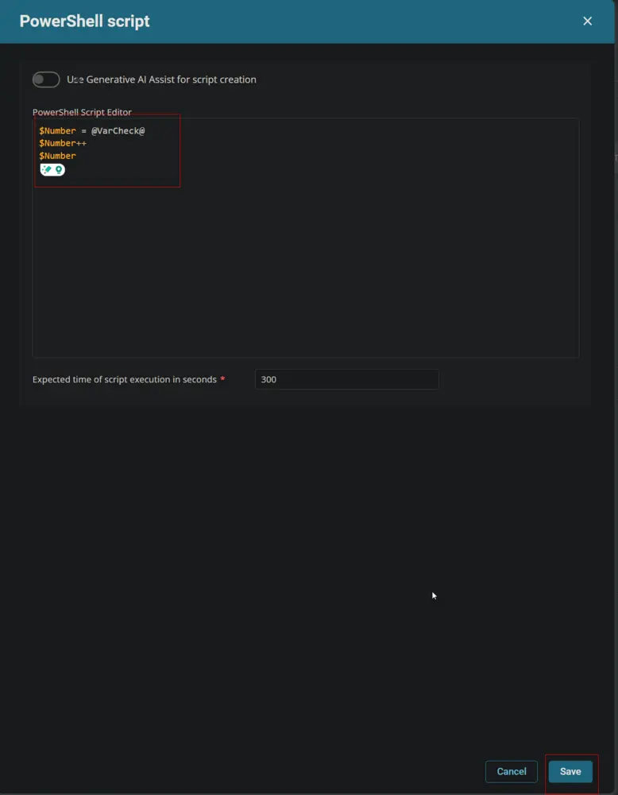

Mark the `Continue on Failure` checkbox.


### Step 6 Function: Script Log

Insert a new row by clicking the `Add Row` button.


Search and select the `Script Log` function in the new row.


Paste this line in the `Script Log Message` box and click the `Save` button.  
`%output%`

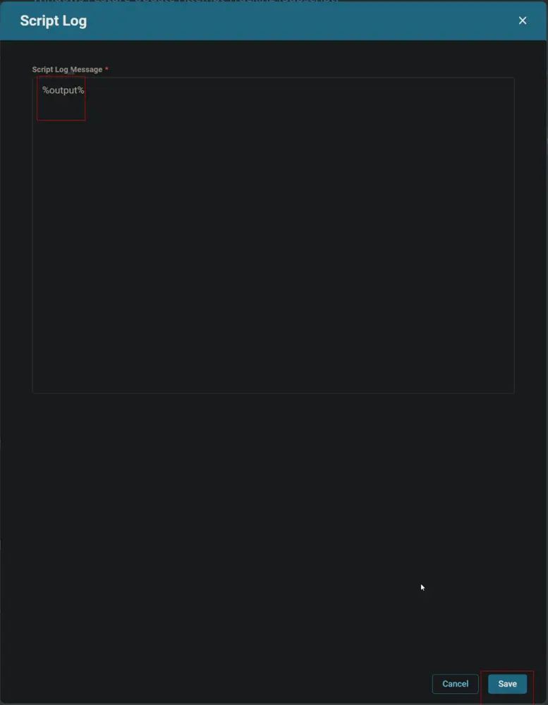


### Row 7 Function: Set Custom Field

Insert a new row by clicking the `Add Row` button.


Search and select the `Set Custom Field` function in the new row.

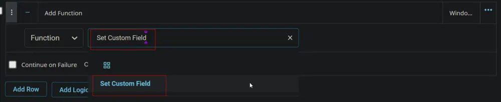


Search and select the `WinFeatUpgradeAttempts` Custom Field.


Type `%Output%` in the `Value` box and click the `Save` button.

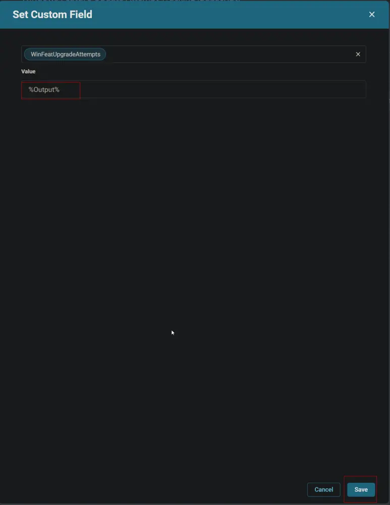

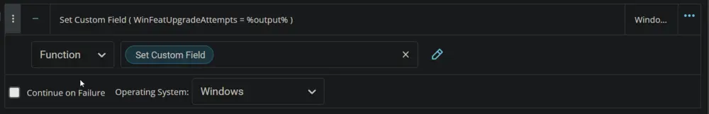

Click the `Save` button to save the task.


## Completed Script

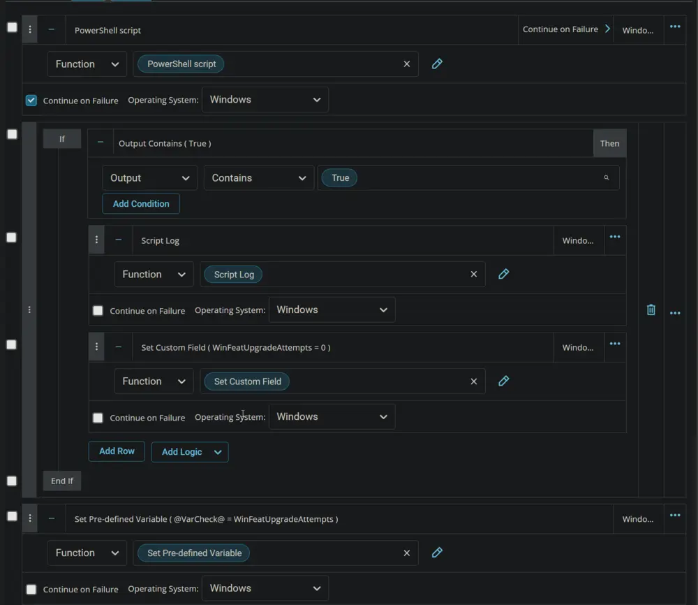

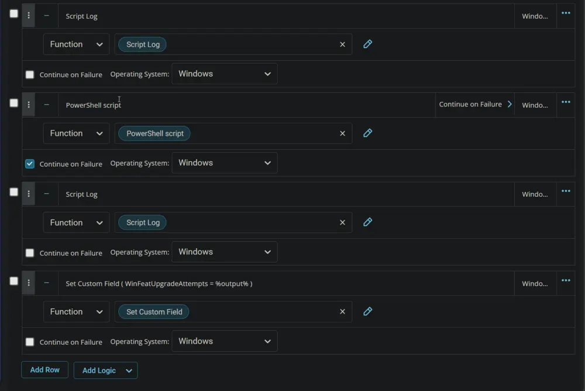

## Output

- Script Log
- Custom Field