## Summary
This Script fetches the status of key certificate and configurations that will be needed before the current secure boot certificates expire.

## Sample Run
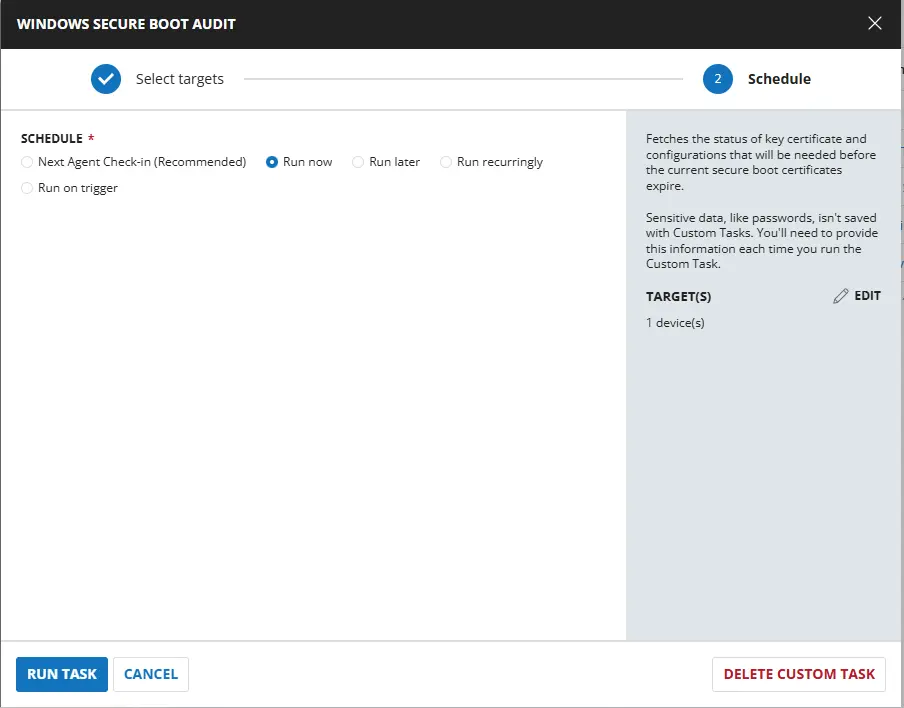 

## Dependencies

- [Solution : Windows Secure Boot Audit](/docs/05b9e73a-64ae-43f6-8ed5-89c952a3aaec)

## Task Creation

### Script Details

#### Step 1

Navigate to `Automation` ➞ `Tasks`  


#### Step 2

Create a new `Script Editor` style task by choosing the `Script Editor` option from the `Add` dropdown menu  


The `New Script` page will appear on clicking the `Script Editor` button:  


#### Step 3

Fill in the following details in the `Description` section:  

**Name:** `Windows Secure Boot Audit`  
**Description:** `Fetches the status of key certificate and configurations that will be needed before the current secure boot certificates expire.`  
**Category:** `Custom`

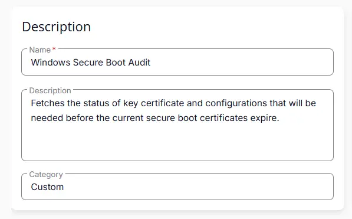 


### Script Editor

Click the `Add Row` button in the `Script Editor` section to start creating the script  


A blank function will appear:  


#### Row 1 Function: `PowerShell Script`

Search and select the `PowerShell Script` function.  
 
  

The following function will pop up on the screen:  
  

Paste in the following PowerShell script and set the `Expected time of script execution in seconds` to `300` seconds. Click the `Save` button.

```powershell

try { if (Confirm-SecureBootUEFI) { "Enabled" } else { "Disabled" } } catch { "Unsupported or Disabled" }

```

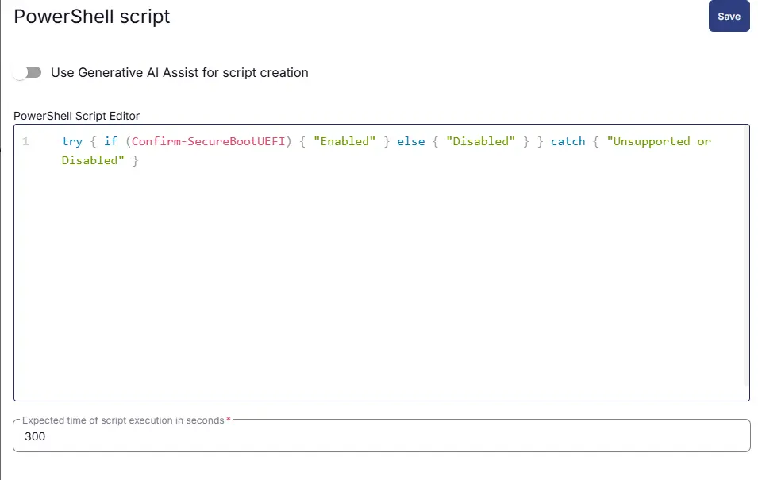


### Row 2 Function: Script Log

Add a new row by clicking the `Add Row` button.  
  

A blank function will appear.  
  

Search and select the `Script Log` function.  
  
 

In the script log message, simply type `%output%` and click the `Save` button.  


### Row 3 Function: Set Custom Field

Add a new row by clicking the `Add Row` button.  
  

A blank function will appear.  
  

Search and select the `Set Custom Field` function.  
  

The following function will pop up on the screen:  
  

- Search and select the Computer-Level Custom Field `Windows Secure Boot` from the Custom Field dropdown menu.
- Set `%Output%` in the `Value` field.
- Click the `Save` button.

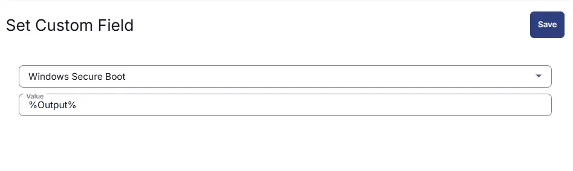  

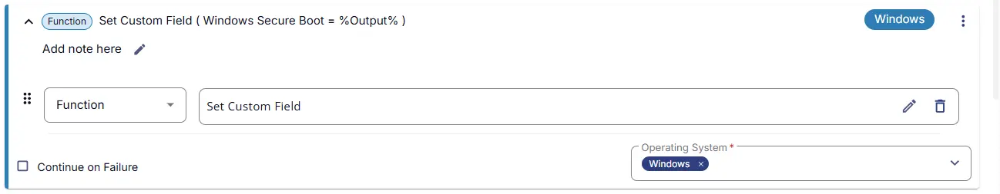 

#### Row 4 Function: `PowerShell Script`

Search and select the `PowerShell Script` function.  
 
  

The following function will pop up on the screen:  
  

Paste in the following PowerShell script and set the `Expected time of script execution in seconds` to `300` seconds. Click the `Save` button.

```powershell

$result = (Get-ItemProperty -Path "HKLM:\SOFTWARE\Microsoft\Windows\CurrentVersion\Policies\DataCollection" -Name "AllowTelemetry" -ErrorAction SilentlyContinue).AllowTelemetry

if ($result -in 1,2,3) {
    "Enabled"
} else {
    "Disabled"
}

```

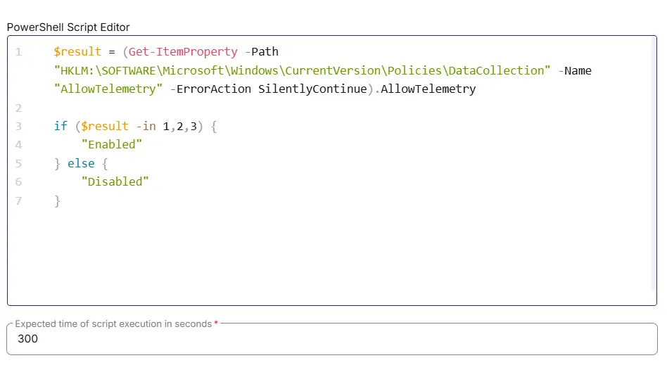

### Row 5 Function: Script Log

Add a new row by clicking the `Add Row` button.  
  

A blank function will appear.  
  

Search and select the `Script Log` function.  
  
 

In the script log message, simply type `%output%` and click the `Save` button.  


### Row 6 Function: Set Custom Field

Add a new row by clicking the `Add Row` button.  
  

A blank function will appear.  
  

Search and select the `Set Custom Field` function.  
  

The following function will pop up on the screen:  
  

- Search and select the Computer-Level Custom Field `Windows Telemetry` from the Custom Field dropdown menu.
- Set `%Output%` in the `Value` field.
- Click the `Save` button.

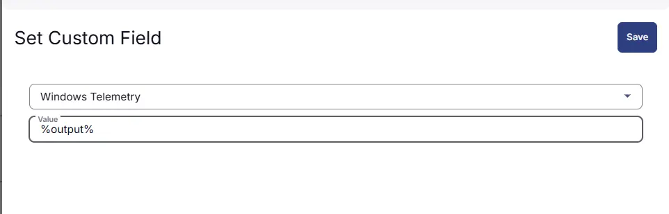  

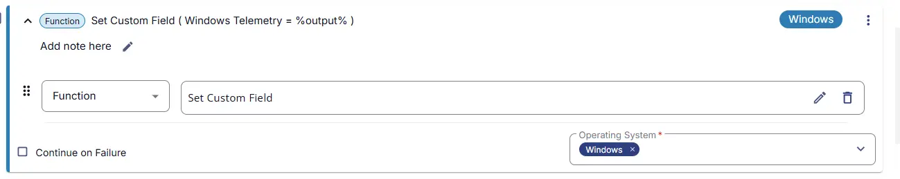 

#### Row 7 Function: `PowerShell Script`

Search and select the `PowerShell Script` function.  
 
  

The following function will pop up on the screen:  
  

Paste in the following PowerShell script and set the `Expected time of script execution in seconds` to `300` seconds. Click the `Save` button.

```powershell

$result = [System.Text.Encoding]::ASCII.GetString((Get-SecureBootUEFI db).bytes) -match '(Windows|Microsoft) UEFI CA 2023'

if ($result) {
    "Up to Date"
} else {
    "Out of Date"
}

```

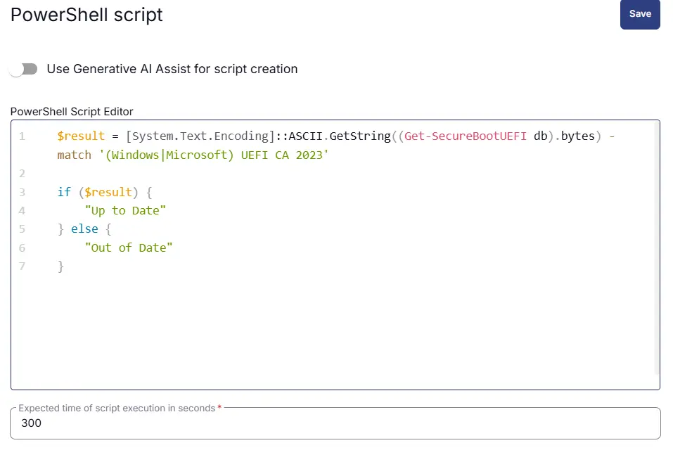

### Row 8 Function: Script Log

Add a new row by clicking the `Add Row` button.  
  

A blank function will appear.  
  

Search and select the `Script Log` function.  
  
 

In the script log message, simply type `%output%` and click the `Save` button.  


### Row 9 Function: Set Custom Field

Add a new row by clicking the `Add Row` button.  
  

A blank function will appear.  
  

Search and select the `Set Custom Field` function.  
  

The following function will pop up on the screen:  
  

- Search and select the Computer-Level Custom Field `Windows DB Certificate` from the Custom Field dropdown menu.
- Set `%Output%` in the `Value` field.
- Click the `Save` button.

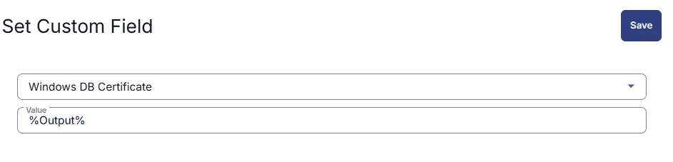  

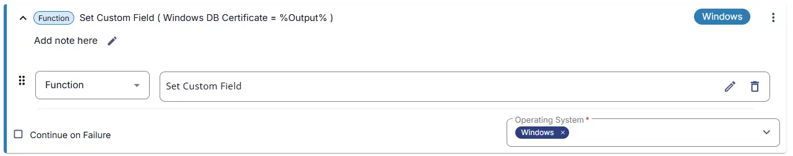 

### Row 10 Function: `PowerShell Script`

Search and select the `PowerShell Script` function.  
 
  

The following function will pop up on the screen:  
  

Paste in the following PowerShell script and set the `Expected time of script execution in seconds` to `300` seconds. Click the `Save` button.

```powershell

$result = [System.Text.Encoding]::ASCII.GetString((Get-SecureBootUEFI KEK).bytes) -match 'Microsoft Corporation KEK 2K CA 2023'

if ($result) {
    "Up to Date"
} else {
    "Out of Date"
}

```

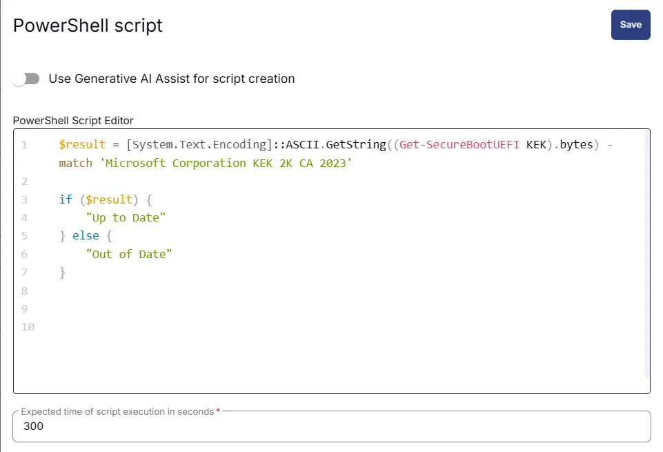

### Row 11 Function: Script Log

Add a new row by clicking the `Add Row` button.  
  

A blank function will appear.  
  

Search and select the `Script Log` function.  
  
 

In the script log message, simply type `%output%` and click the `Save` button.  


### Row 12 Function: Set Custom Field

Add a new row by clicking the `Add Row` button.  
  

A blank function will appear.  
  

Search and select the `Set Custom Field` function.  
  

The following function will pop up on the screen:  
  

- Search and select the Computer-Level Custom Field `Windows KEK Certificate` from the Custom Field dropdown menu.
- Set `%Output%` in the `Value` field.
- Click the `Save` button.

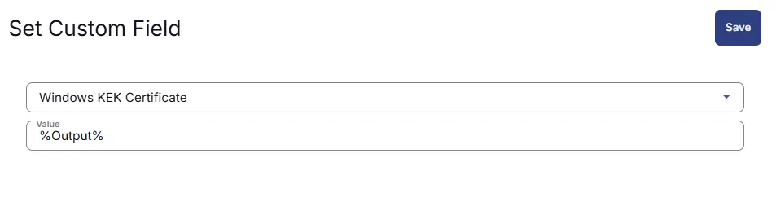  

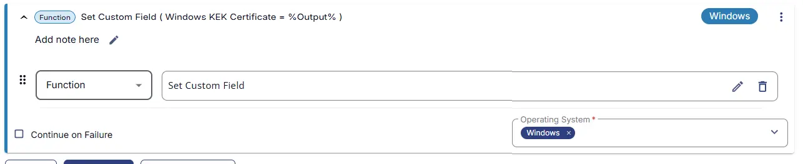 

## Save Task

Click the `Save` button at the top-right corner of the screen to save the script.  


## Completed Task

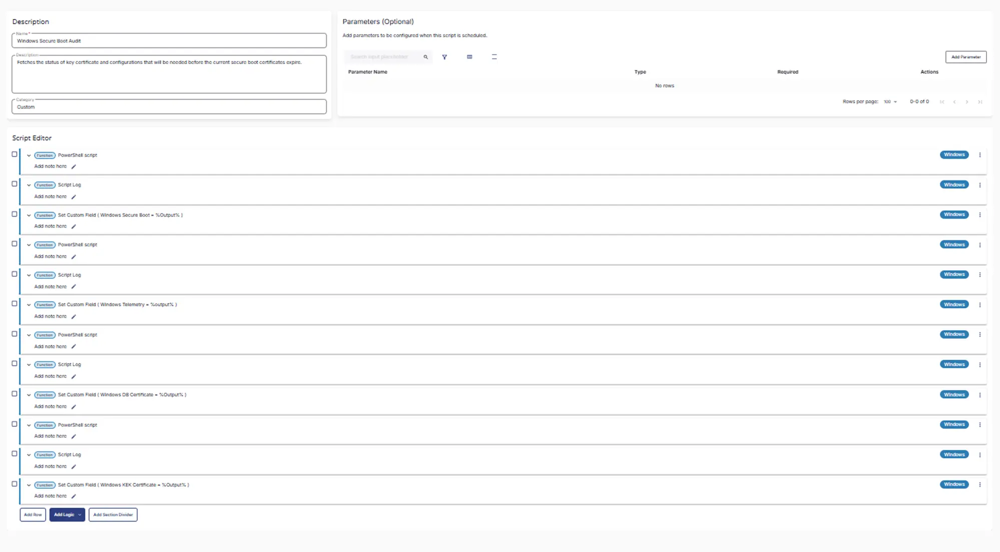 


## Output

- Custom fields
- Script Output

## Schedule Task

### Task Details

- **Name:** `Windows Secure Boot Audit`  
- **Description:** `Fetches the status of key certificate and configurations that will be needed before the current secure boot certificates expire.`  
- **Category:** `Custom`

 

### Schedule

- **Schedule Type:**  `Schedule`  
- **Timezone:** `Local Machine Time`  
- **Start:** `<Current Date>`  
- **Trigger:** `Time` `At` `<Current Time>`  
- **Recurrence:** `Every 15 Days`

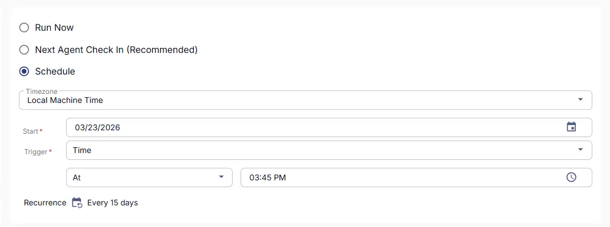 

### Targeted Resource

**Device Group:** `Windows Machines`

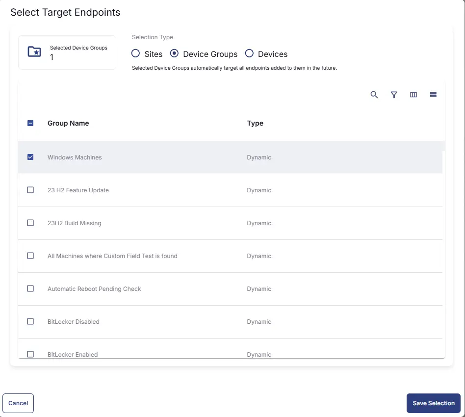 


### Completed Scheduled Task

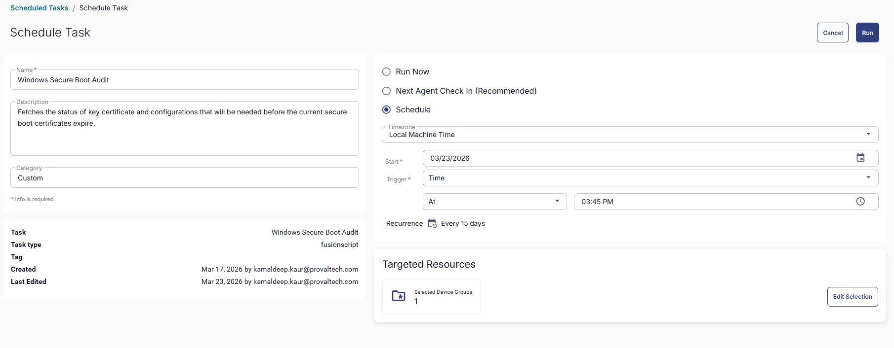 

## Changelog

### 2026-03-23

- Initial version of the document