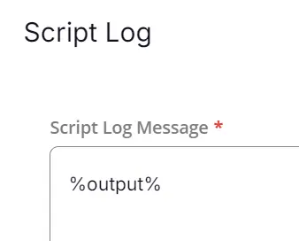

## Summary

This is an RMM implementation of the agnostic script [Set-Wallpaper](/docs/be77cc20-d07b-4cbd-b762-cb20913860b9) to set the active desktop wallpaper for all users from a local path or a URL. It can optionally be switched to enforce the wallpaper for all users on login.

## Sample Run


- Set Mode  
  

- Enforcement mode:  
  

- Reset Mode:  
  

## Dependencies

[Set-Wallpaper](/docs/be77cc20-d07b-4cbd-b762-cb20913860b9)

## User Parameters

| Name      | Example                                          | Required | Description                                                                                                      |
|-----------|--------------------------------------------------|----------|------------------------------------------------------------------------------------------------------------------|
| Path      | C:/user/myuser/Pictures/CoolWallpaper.png       | True     | Either a path to a local image or URL.                                                                          |
| AllUsers  | 1                                                | False    | Select it to enforce the wallpaper for all users on login.                                                     |
| Reset     | 1                                                | False    | Select it to remove all enforcement and reset all users' wallpapers back to their previous one. If they do not have a previous wallpaper, the default Windows wallpaper will be used. |

## Task Creation

Create a new `Script Editor` style script in the system to implement this Task.


**Name:** Windows - Wallpaper - Set  
**Description:** This script sets the active desktop wallpaper for all users from a local path or a URL. It can optionally be switched to enforce the wallpaper for all users on login.  
**Category:** Custom  


## Parameters

Add a new parameter by clicking the `Add Parameter` button present at the top-right corner of the screen.


This screen will appear.  


- Set `Path` in the `Parameter Name` field.
- Select `Text String` from the `Parameter Type` dropdown menu.
- Click the `Save` button.  
  

- It will ask for confirmation to proceed. Click the `Confirm` button to create the parameter.  
  

Add another parameter by clicking the `Add Parameter` button present at the top-right corner of the screen.  


- Set `AllUsers` in the `Parameter Name` field.
- Select `Flag` from the `Parameter Type` dropdown menu.
- Click the `Save` button.  
  

- It will ask for confirmation to proceed. Click the `Confirm` button to create the parameter.

Add another parameter by clicking the `Add Parameter` button present at the top-right corner of the screen.  

- Set `Reset` in the `Parameter Name` field.
- Select `Flag` from the `Parameter Type` dropdown menu.
- Click the `Save` button.
- It will ask for confirmation to proceed. Click the `Confirm` button to create the parameter.  
  

All the parameters will look like this:  


## Task

Navigate to the Script Editor Section and start by adding a row. You can do this by clicking the `Add Row` button at the bottom of the script page.  


A blank function will appear.  


### Row 1 Function: PowerShell Script

Search and select the `PowerShell Script` function.  


The following function will pop up on the screen:  


Paste the following PowerShell script and set the expected time of script execution to `900` seconds. Click the `Save` button.

```powershell
$Path = "@Path@"
$AllUsers = "@AllUsers@"
$Reset = "@Reset@"
#region Setup - Variables
$ProjectName = 'Set-Wallpaper'

[Net.ServicePointManager]::SecurityProtocol = [enum]::ToObject([Net.SecurityProtocolType], 3072)
$BaseURL = 'https://file.provaltech.com/repo'
$PS1URL = "$BaseURL/script/$ProjectName.ps1"
$WorkingDirectory = "C:\ProgramData\_automation\script\$ProjectName"
$PS1Path = "$WorkingDirectory\$ProjectName.ps1"
$Workingpath = $WorkingDirectory
$LogPath = "$WorkingDirectory\$ProjectName-log.txt"
$ErrorLogPath = "$WorkingDirectory\$ProjectName-Error.txt"
#endregion
#region Setup - Folder Structure
mkdir -Path $WorkingDirectory -ErrorAction SilentlyContinue | Out-Null
$response = Invoke-WebRequest -Uri $PS1URL -UseBasicParsing
if (($response.StatusCode -ne 200) -and (!(Test-Path -Path $PS1Path))) {
    Write-Error -Message "No pre-downloaded script exists and the script '$PS1URL' failed to download. Exiting."
    return
} elseif ($response.StatusCode -eq 200) {
    Remove-Item -Path $PS1Path -ErrorAction SilentlyContinue
    [System.IO.File]::WriteAllLines($PS1Path, $response.Content)
}
if (!(Test-Path -Path $PS1Path)) {
    Write-Error -Message 'An error occurred and the script was unable to be downloaded. Exiting.'
    return
}
#endregion
if ($AllUsers -match '1|Y|Yes|True' ) {
  & $PS1Path -uri $Path -Enforce
} 
elseif ($Reset -match '1|Y|Yes|True' ){
  & $PS1Path -Reset
}
else{
  & $PS1Path -uri $Path
}
if ( !(Test-Path $LogPath) ) {
  Throw 'PowerShell Failure. A Security application seems to have restricted the execution of the PowerShell Script.'
}
if ( Test-Path $ErrorLogPath ) {
  $ErrorContent = ( Get-Content -Path $ErrorLogPath )
  throw $ErrorContent
}
Get-Content -Path $LogPath
```


### Row 2: Function: Script Log

In the script log message, simply type `%output%` so that the script will send the results of the PowerShell script above to the output on the Automation tab for the target device.  


## Completed Task


## Output

- Script Log