## Summary

Verify if a Windows 10/11 PC is compatible with Windows 11 upgrade.

## Sample Run

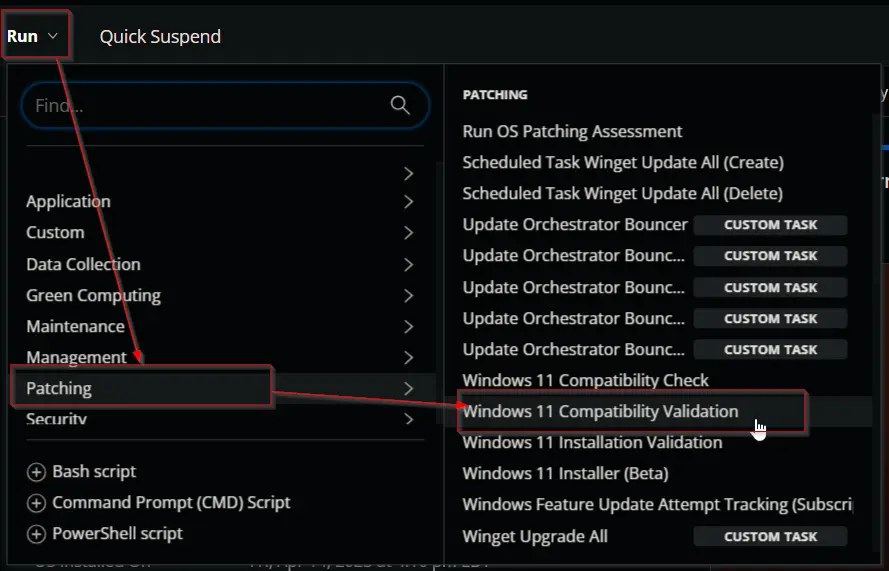  
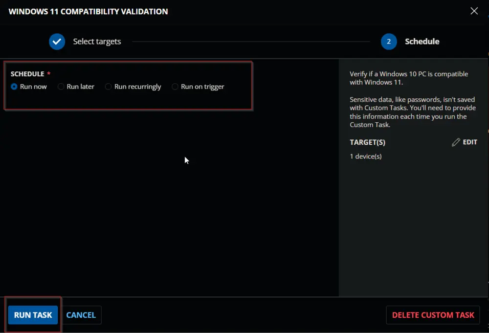

## Dependencies

- [Device Group - Upgrade Enabled Windows 11 Compatible Machines](/docs/9c422249-e949-4bcd-83ea-2c91b8365a96)  
- [Custom Field - Endpoint - Windows 11 incompatible](/docs/7894870c-b7e8-44e0-806c-c948f151fc49)  
- [Device Group - Windows 10 Machines](/docs/8d5c2d6a-5bb8-4720-bd11-4fa7396fbf7a)  
- [Device Group - Windows 11 machines](/docs/a3cdc948-d650-413e-8c02-3b549403f88f)


## Task Creation

Create a new `Script Editor` style script in the system to implement this Task.  
  
  

- **Name:** Windows 11 Compatibility Validation  
- **Description:** Verify if a Windows 10/11 PC is compatible with Windows 11.  
- **Category:** Patching  
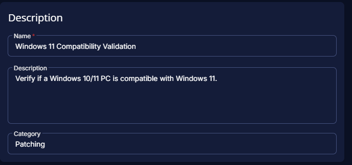  

## Task

Navigate to the Script Editor Section and start by adding a row. You can do this by clicking the `Add Row` button at the bottom of the script page.  
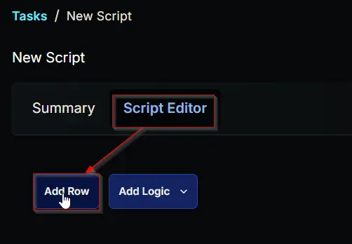  

A blank function will appear.  
  

### Row 1 Function: PowerShell Script

Search and select the `PowerShell Script` function.  
  
  

The following function will pop up on the screen:  
  

Paste in the following PowerShell script and set the expected time of script execution to `600` seconds. Click the `Save` button.

[PowerShell Script](https://github.com/ProVal-Tech/cw-rmm/blob/main/tasks/windows11-compatibility-validation/script.ps1)


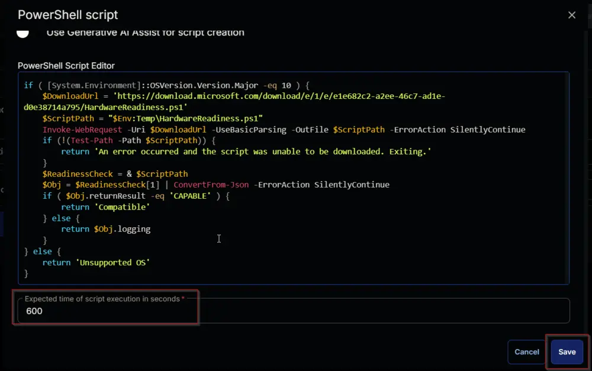  

Mark the `Continue on Failure` checkbox for the function.  
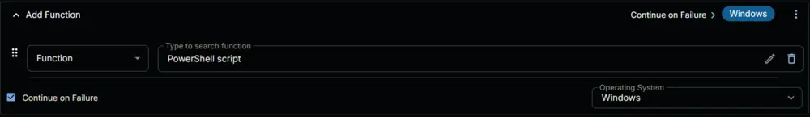  

### Row 2 Function: Set Custom Field

- Add a new row with the `Add Row` button.  
- A blank function will appear.   

  

Search and select `Set Custom Field` Function.  
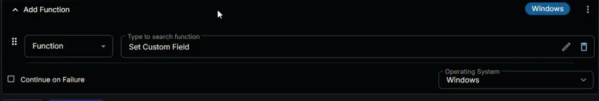  

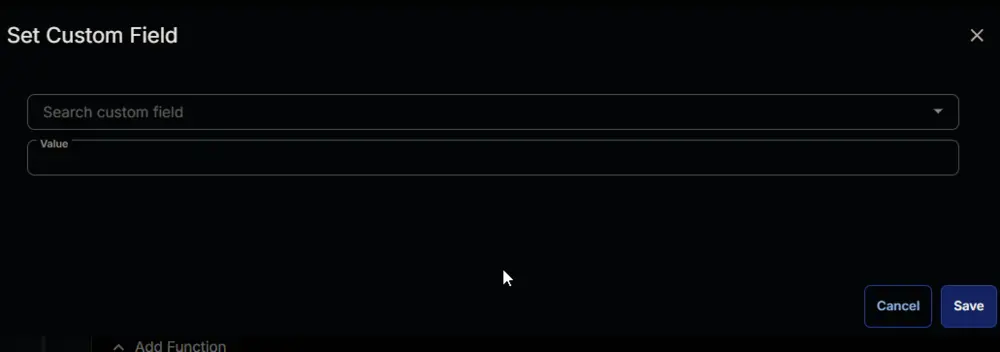  

Search and select `Windows 11 incompatible Base` in the `Search Custom Field`. Set `%Output%` in the `Value` field, and click the `Save` button.  

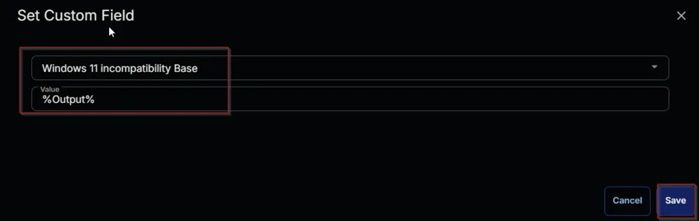  

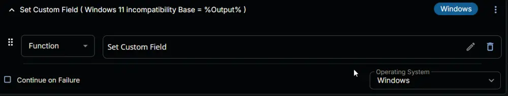


### Row 3 Function: Script Log

- Add a new row with the `Add Row` button.  
- A blank function will appear.  

 

Search and select `Script Log` Function. 

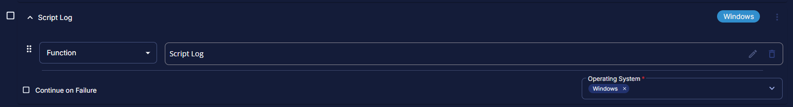

Paste the following lines in the `Error Message` field and click the `Save` button.

```plaintext
%Output%
```

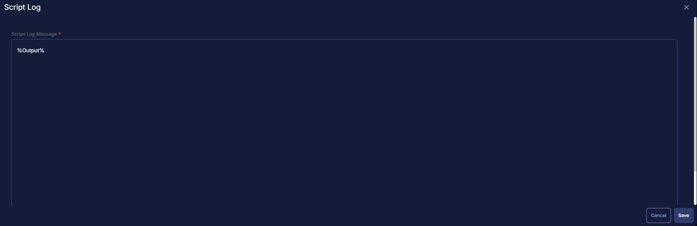


### Row 4 Logic: If/Then/Else

Add a new `If/Then/Else` logic.  
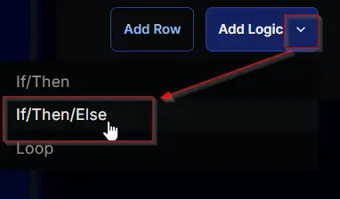

An empty logic will appear.  
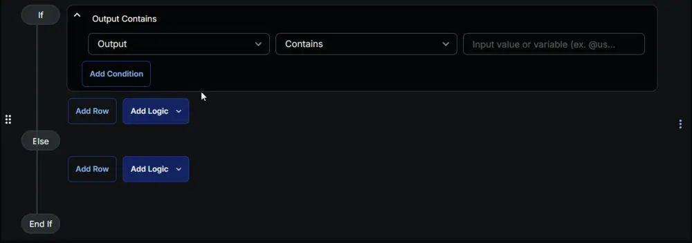

#### Row 4a Condition: Output Contains

Type `Result=CAPABLE` in the `Input Value or Variable` field and press `Enter`.


##### Row 4a(i) Function: Set Custom Field

Add a new row by clicking the `Add Row` button inside the `If` section.


A blank function will appear.  
 

Search and select `Set Custom Field` Function.  
  

 

Search and select `Windows 11 Compatible` in the `Search Custom Field` field, set `Yes` in the `Value` field, and click the `Save` button.
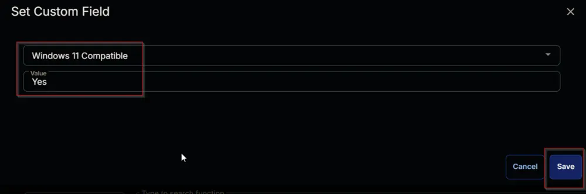

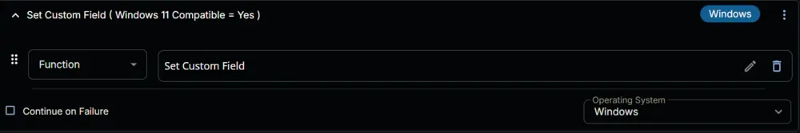

##### Row 4a(ii) Function: Set Custom Field

Add a new row by clicking the `Add Row` button inside the inner `Else` section.  
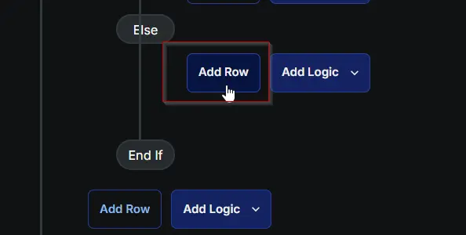  

A blank function will appear.  
  

Search and select `Set Custom Field` Function.  
  
  

Search and select `Windows 11 Compatible` in the `Search Custom Field` field and set `No` in the `Value` field and click the `Save` button.
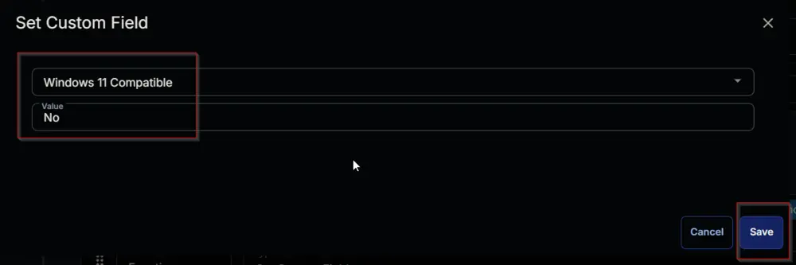  

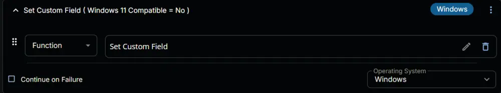   

---

Click the `Save` button at the top-right corner of the screen to save the script.  
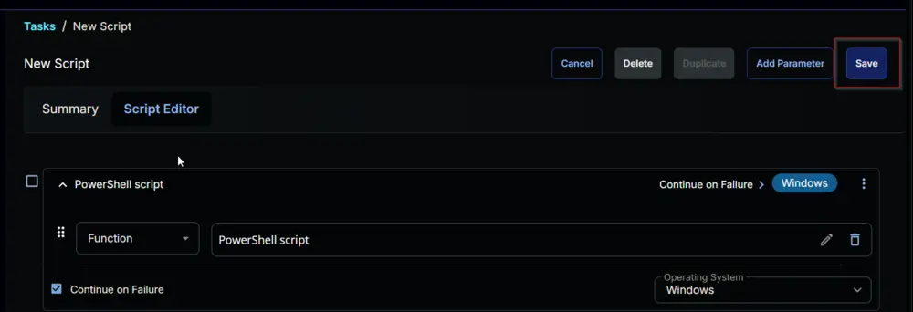  

## Completed Task

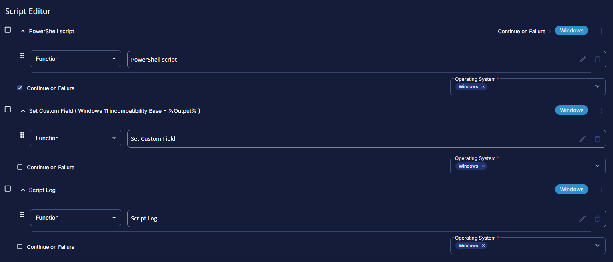
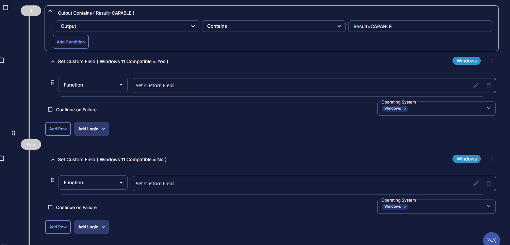

## Deployment

It is suggested to run the Task once per month against [Windows 10 Machines](/docs/8d5c2d6a-5bb8-4720-bd11-4fa7396fbf7a) and [Windows 11 machines](/docs/a3cdc948-d650-413e-8c02-3b549403f88f).

- Go to `Automation` > `Tasks.`
- Search for `Windows 11 Compatibility Validation`.
- Select the concerned task.
- Click on the `Schedule` button to schedule the task/script.  
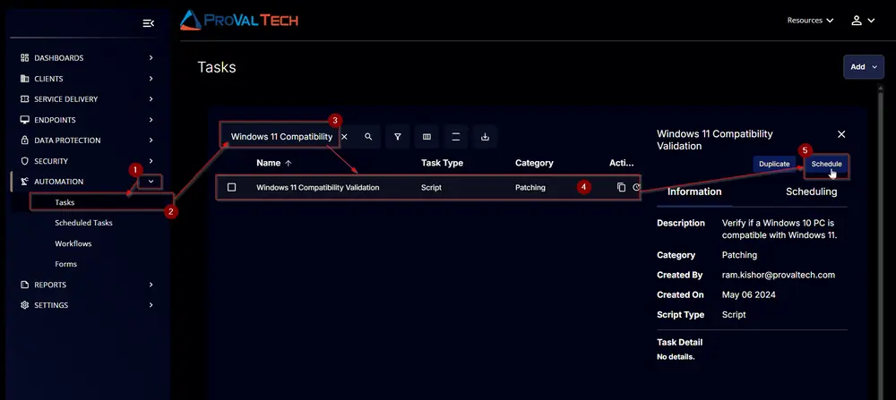  
- This screen will appear.  
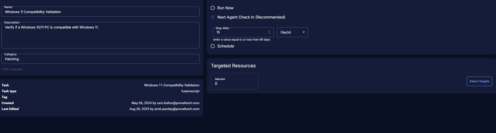
- Select the `Schedule` button and click the calendar icon present in front of the `Recurrence` option.  
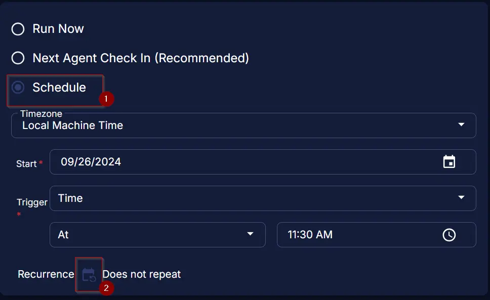  
- Select the `Month(s)` for the `Repeat`, set `1` for `Dates`, and click the `OK` button to save the schedule.  
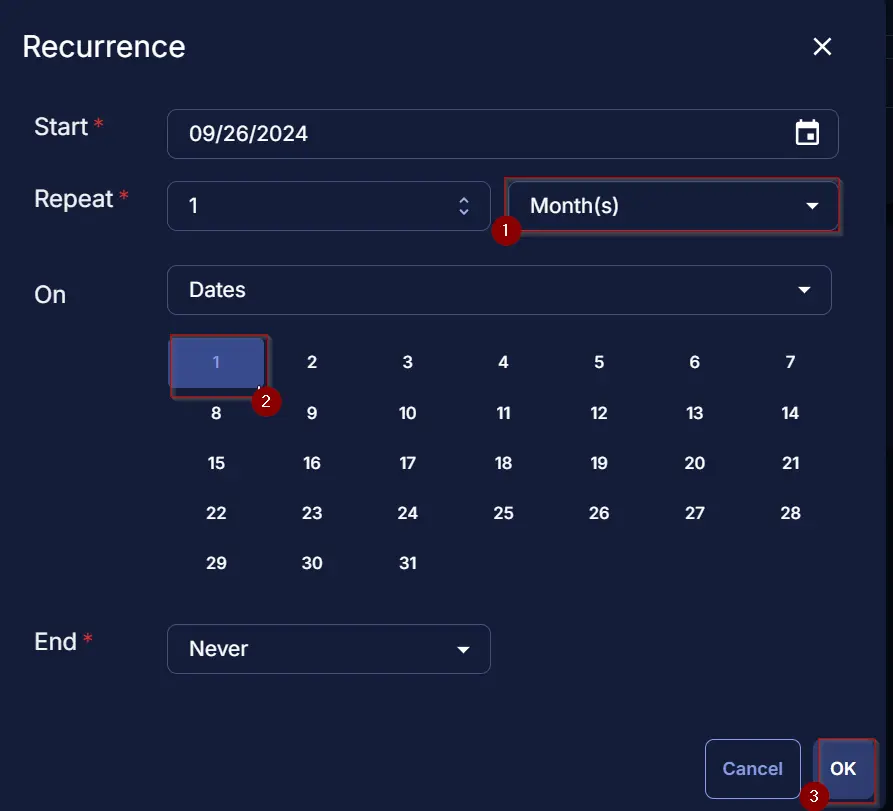  
- Click the `Select Targets` button to select the concerned target.  
  
- Search and select the [Windows 10 machines](/docs/8d5c2d6a-5bb8-4720-bd11-4fa7396fbf7a) and [Windows 11 machines](/docs/a3cdc948-d650-413e-8c02-3b549403f88f)

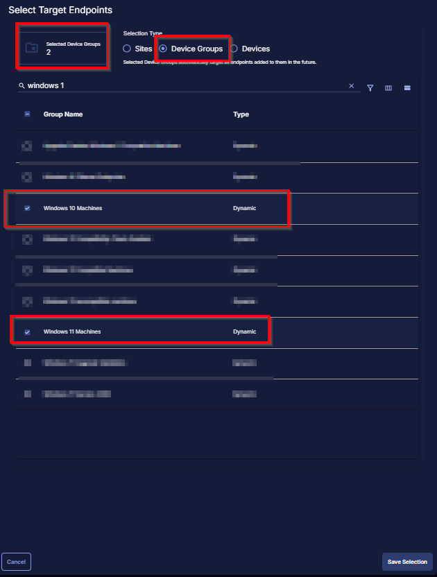   
- Click the `Run` button to initiate the schedule.  
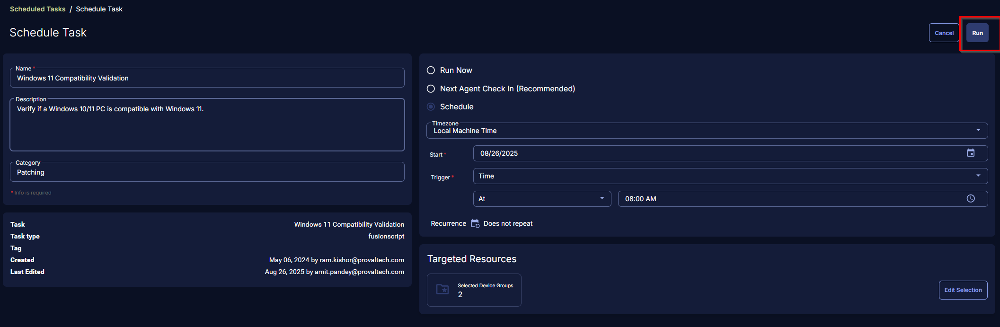  

## Output

- Script Log
- Custom Field

## Changelog

### 2025-06-30

- The Windows 11 compatibility validation script has been updated to check for 64GB of free space. This will run in addition to the existing total space check, and they can pass/fail independently of each other.

### 2025-05-02

- Initial version of the document

