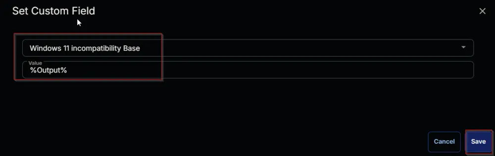

## Summary

Verify if a Windows 10 PC is compatible with Windows 11.

## Sample Run

  


## Dependencies

- [Device Group - Upgrade Enabled Windows 11 Compatible Machines](/docs/9c422249-e949-4bcd-83ea-2c91b8365a96)  
- [Custom Field - Endpoint - Windows 11 incompatibility Base](/docs/7894870c-b7e8-44e0-806c-c948f151fc49)  
- [Device Group - Windows 10 Machines](/docs/8d5c2d6a-5bb8-4720-bd11-4fa7396fbf7a)  

## Variables

| Name   | Description                         |
|--------|-------------------------------------|
| Output | Output of the PowerShell Script.    |

## Task Creation

Create a new `Script Editor` style script in the system to implement this Task.  
  
  

**Name:** Windows 11 Compatibility Validation  
**Description:** Verify if a Windows 10 PC is compatible with Windows 11.  
**Category:** Patching  
  

## Task

Navigate to the Script Editor Section and start by adding a row. You can do this by clicking the `Add Row` button at the bottom of the script page.  
  

A blank function will appear.  
  

### Row 1 Function: PowerShell Script

Search and select the `PowerShell Script` function.  
  
  

The following function will pop up on the screen:  
  

Paste in the following PowerShell script and set the expected time of script execution to `600` seconds. Click the `Save` button.

```powershell
<#
.SYNOPSIS
    This script checks the compatibility of a Windows system (Windows 10 or Windows 11) for upgrading to Windows 11.

.DESCRIPTION
    The script performs the following steps:
    1. Sets the `$ProgressPreference` to 'SilentlyContinue' to suppress progress messages.
    2. Configures the .NET ServicePointManager to use TLS 1.2 for secure web requests.
    3. Temporarily sets the PowerShell execution policy to 'Unrestricted' for the current process.
    4. Checks if the operating system is Windows 10 or Windows 11. If not, it exits with a message indicating an unsupported OS.
    5. Downloads the `HardwareReadiness.ps1` script from Microsoft's official website to a working directory.
    6. Ensures the working directory exists and creates it if necessary.
    7. Executes the downloaded `HardwareReadiness.ps1` script to perform the compatibility check.
    8. Parses the results of the compatibility check:
        - If the system is compatible, it returns a success message with all required components marked as compatible.
        - If the system is not compatible, it parses the detailed results and converts the status of each component (CPU, TPM, OS Drive Size, Secure Boot, and Memory) into string values:
            - Pass
            - Fail
            - Failed to Run
            - Undetermined
        - Returns a detailed string summarizing the compatibility status of each component and the overall result.

.NOTES
    - This script is intended for use on Windows 10 and Windows 11 systems only.
    - The `HardwareReadiness.ps1` script is downloaded from Microsoft's official website.
    - Ensure that the system has internet access to download the readiness script.

.EXAMPLE
    Run the script to check Windows 11 compatibility:
    .\CWRMMImp-CheckWindows11Compatibility.ps1

.OUTPUTS
    - If compatible: `CPU=PASS|TPM=PASS|OSDriveSize=PASS|FreeSpace=FreeSpace :: PASS|Secureboot=PASS|Memory=PASS|Result=Capable`
    - If not compatible: `CPU=FAIL|TPM=UNDETERMINED|OSDriveSize=FAIL|FreeSpace=FreeSpace: Storage is null :: FAIL|Secureboot=PASS|Memory=FAIL|Result=Undertermined`
    - If unsupported OS: `Unsupported OS`
#>
$ProgressPreference = 'SilentlyContinue'
$ConfirmPreference = 'None'
[Net.ServicePointManager]::SecurityProtocol = [Enum]::ToObject([Net.SecurityProtocolType], 3072)
Set-ExecutionPolicy -Scope Process -ExecutionPolicy Unrestricted -Force -Confirm:$false
if ( [System.Environment]::OSVersion.Version.Major -eq 10 ) {
    $DownloadUrl = 'https://download.microsoft.com/download/e/1/e/e1e682c2-a2ee-46c7-ad1e-d0e38714a795/HardwareReadiness.ps1'
    $workingDirectory = 'C:\ProgramData\_Automation\Script\Check-Windows11Compatibility'
    $ScriptPath = "$workingDirectory\HardwareReadiness.ps1"
    if (!(Test-Path -Path $workingDirectory)) {
        New-Item -Path $workingDirectory -ItemType Directory -Force | Out-Null
    }
    Invoke-WebRequest -Uri $DownloadUrl -UseBasicParsing -OutFile $ScriptPath -ErrorAction SilentlyContinue
    if (!(Test-Path -Path $ScriptPath)) {
        return 'An error occurred and the script was unable to be downloaded. Exiting.'
    }
    $ReadinessCheck = & $ScriptPath
    $Obj = $ReadinessCheck[1] | ConvertFrom-Json -ErrorAction SilentlyContinue
   
    # Storage - Free Diskspace
    [int]$MinOSDiskSizeGB = 64
    try {
        $osDrive = Get-CimInstance -Class Win32_OperatingSystem | Select-Object -Property SystemDrive
        $osDriveSize = Get-CimInstance -Class Win32_LogicalDisk -filter "DeviceID='$($osDrive.SystemDrive)'" | Select-Object @{Name = "SizeGB"; Expression = { $_.Size / 1GB -as [int] } }
        $freeSpaceGB = (Get-CimInstance -Class Win32_LogicalDisk -Filter "DeviceID='$($osDrive.SystemDrive)'" | Select-Object @{Name = "FreeSpaceGB"; Expression = { $_.FreeSpace / 1GB -as [int] } }).FreeSpaceGB
        
        if ($null -eq $freeSpaceGB) {
            $Obj.logging += "FreeSpace: Storage is null :: FAIL; "
        }
        elseif ($freeSpaceGB -lt $MinOSDiskSizeGB) {
            $Obj.logging += "FreeSpace: Less than 64GB :: FAIL; "
        }
        else {
            $Obj.logging += "FreeSpace: FreeSpace=$($freeSpaceGB)GB :: PASS; "
        }
    }
    catch {
        $Obj.logging += "FreeSpace: OSDiskSize=Undetermined :: UNDETERMINED; "
    }

    $logging = ($obj.logging -split ';(?![^{}]*\})').trim()
    $Storage = (($logging -match '^Storage:') -split '\. ')[-1].Trim()
    $FreeSpace = (($logging -match '^FreeSpace:') -split '\. ')[-1].Trim()
    $Memory = (($logging -match '^Memory:') -split '\. ')[-1].Trim()
    $TPM = (($logging -match 'TPM:') -split '\. ')[-1].Trim()
    $Processor = (($logging -match 'Processor:') -split '\. ')[-1].Trim()
    $secureBoot = (($logging -match 'SecureBoot:') -split '\. ')[-1].Trim()
        
    if ($Obj.logging -like "*null*") {
      $Obj.returnResult = "Undetermined"
    } elseif ($Obj.logging -like "*fail*") {
      $Obj.returnResult = "Not Capable"
    }
    
    return "CPU=$Processor|TPM=$TPM|OSDriveSize=$Storage|FreeSpace=$FreeSpace|Secureboot=$secureBoot|Memory=$Memory|Result=$($Obj.returnResult)"
} else {
    return 'Unsupported OS'
}
```

  

Mark the `Continue on Failure` checkbox for the function.  
  

### Row 2 Function: Set Custom Field

Add a new row with the `Add Row` button.  
A blank function will appear.  
  

Search and select `Set Custom Field` Function.  
  
  

Search and select `Windows 11 incompatible Base` in the `Search Custom Field` field, set `%Output%` in the `Value` field, and click the `Save` button.  
  


### Row 3 Function: Script Log

Add a new row with the `Add Row` button.  
A blank function will appear.  
 

Search and select `Script Log` Function. 


Paste the following lines in the `Error Message` field and click the `Save` button.

```plaintext
%Output%
```


### Row 4 Logic: If/Then/Else

Add a new `If/Then/Else` logic.  


An empty logic will appear.  


#### Row 4a Condition: Output Contains

Type `Result=CAPABLE` in the `Input Value or Variable` field and press `Enter`.


##### Row 4a(i) Function: Set Custom Field

Add a new row by clicking the `Add Row` button inside the `If` section.


A blank function will appear.  
 

Search and select `Set Custom Field` Function.  
  
 

Search and select `Windows 11 Compatible` in the `Search Custom Field` field, set `Yes` in the `Value` field, and click the `Save` button.


##### Row 4a(ii) Function: Set Custom Field

Add a new row by clicking the `Add Row` button inside the inner `Else` section.  
  

A blank function will appear.  
  

Search and select `Set Custom Field` Function.  
  
  

Search and select `Windows 11 Compatible` in the `Search Custom Field` field and set `No` in the `Value` field and click the `Save` button.
  
   

---

Click the `Save` button at the top-right corner of the screen to save the script.  
  

## Completed Task


## Deployment

It is suggested to run the Task once per month against [Windows 10 Machines](/docs/8d5c2d6a-5bb8-4720-bd11-4fa7396fbf7a).

- Go to `Automation` > `Tasks.`
- Search for `Windows 10 Machines` Task.
- Select the concerned task.
- Click on the `Schedule` button to schedule the task/script.  
  
- This screen will appear.  
  
- Select the `Schedule` button and click the calendar icon present in front of the `Recurrence` option.  
  
- Select the `Month(s)` for the `Repeat`, set `1` for `Dates`, and click the `OK` button to save the schedule.  
  
- Click the `Select Targets` button to select the concerned target.  
  
- Search and select the [Windows 10 Machines](/docs/8d5c2d6a-5bb8-4720-bd11-4fa7396fbf7a) Device Group for the target.  
  
- Click the `Run` button to initiate the schedule.  
  

## Output

- Script Log
- Custom Field