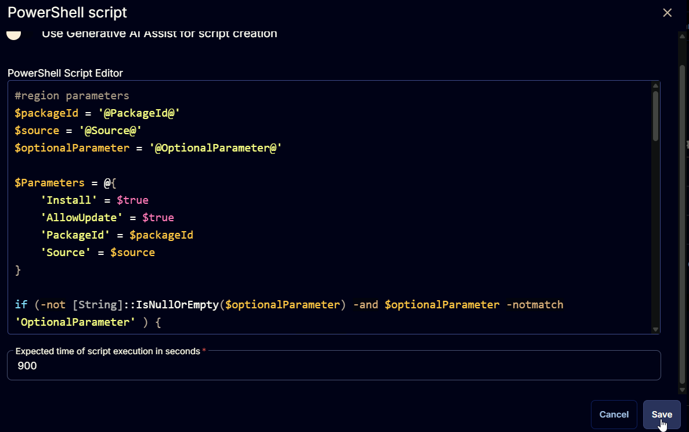
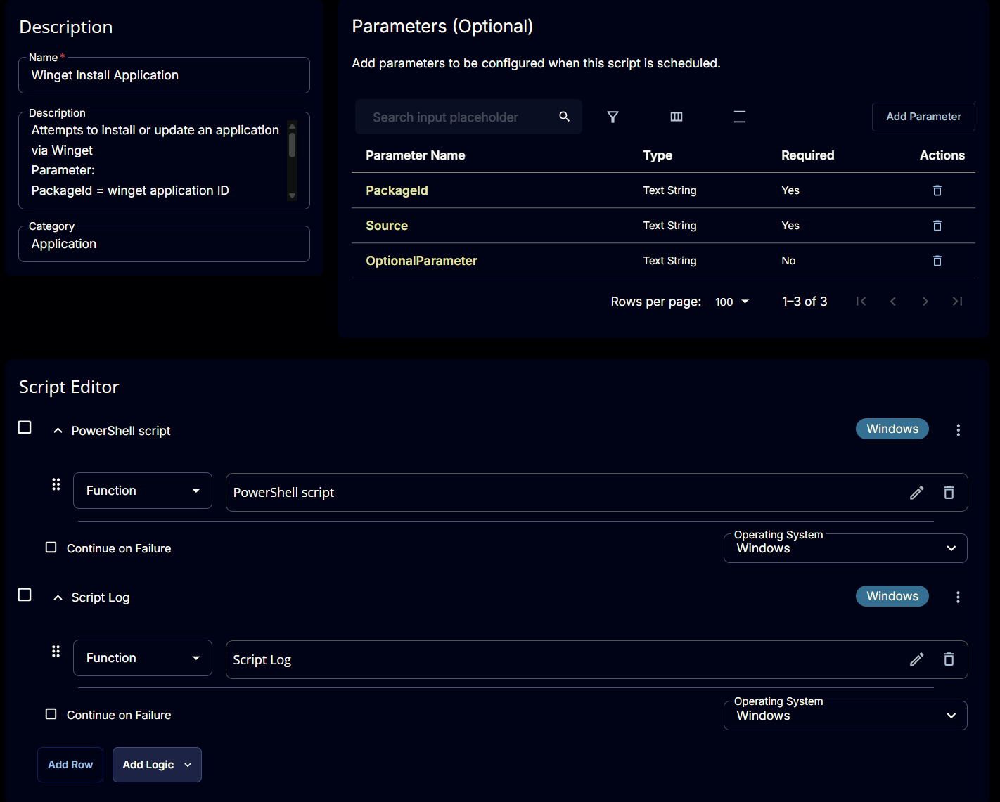

## Summary

Attempts to install or update an application via Winget.
To get the PackageId and source, you can search in cmd using **"winget search appname"** or by browsing to winget.run

## Sample Run


**Example 1:** Installing application without any optional parameters


**Example 2:** Installing application with optional parameter


## Dependencies

[Invoke-WingetProcessor](/docs/8496c2e9-0e52-4961-a1f1-4a95296e8cf7)

## User Parameters

| Name | Example | Accepted Values | Required | Default | Type | Description |
| ---- | ------- | --------------- | -------- | ------- | ---- | ----------- |
| PackageId | `AgileBits.1Password` | | Yes |  | Text String | winget application ID |
| Source | `winget` | `winget`, `msstore` | Yes | | Text String | Specifies winget or msstore as the source for package install |
| OptionalParameter | `--Scope machine` | | No | | Text String | Specifies option parameters to deploy the application |

## Task Creation

### Script Details

#### Step 1

Navigate to `Automation` ➞ `Tasks`  


#### Step 2

Create a new `Script Editor` style task by choosing the `Script Editor` option from the `Add` dropdown menu  


The `New Script` page will appear on clicking the `Script Editor` button:  


#### Step 3

Fill in the following details in the `Description` section:  

**Name:** `Winget Install Application`  
**Description:**

```PlainText
Attempts to install or update an application via Winget
Parameter:
PackageId = winget application ID (Example: Google.Chrome)
Source could be either 'winget', 'msstore'
To get the PackageId and source, you can search in cmd using "winget search appname" or by browsing to winget.run
```

**Category:** `Application`


### Parameters

#### **PackageId**

Locate the `Add Parameter` button on the right-hand side of the screen and click on it to create a new parameter.  


The `Add New Script Parameter` page will appear on clicking the `Add Parameter` button.  


Configure the parameter as described below:  
**Parameter Name:** `PackageId`  
**Required Field:** `True`  
**Parameter Type:** `Text String`  
**Default Value:** `False`  

Click the `Save` button to add the parameter.  


Read the message that will appear after clicking the `Save` button and click the `Confirm` button to save the changes.  


#### **Source**

Locate the `Add Parameter` button on the right-hand side of the screen and click on it to create a new parameter.  


The `Add New Script Parameter` page will appear on clicking the `Add Parameter` button.  


Configure the parameter as described below:  
**Parameter Name:** `Source`  
**Required Field:** `True`  
**Parameter Type:** `Text String`  
**Default Value:** `False`  

Click the `Save` button to add the parameter.  


Read the message that will appear after clicking the `Save` button and click the `Confirm` button to save the changes.  


#### **OptionalParameter**

Locate the `Add Parameter` button on the right-hand side of the screen and click on it to create a new parameter.  


The `Add New Script Parameter` page will appear on clicking the `Add Parameter` button.  


Configure the parameter as described below:  
**Parameter Name:** `OptionalParameter`  
**Required Field:** `False`  
**Parameter Type:** `Text String`  
**Default Value:** `False`  

Click the `Save` button to add the parameter.  


Read the message that will appear after clicking the `Save` button and click the `Confirm` button to save the changes.  


### Script Editor

Click the `Add Row` button in the `Script Editor` section to start creating the script  


A blank function will appear:  


#### **Row 1 Function: PowerShell script**

Search and select the `PowerShell Script` function.  
  
  

The following function will pop up on the screen:  


Paste in the following PowerShell script and set the `Expected time of script execution in seconds` to `900` seconds. Click the `Save` button.

```PowerShell
#region parameters
$packageId = '@PackageId@'
$source = '@Source@'
$optionalParameter = '@OptionalParameter@'

$Parameters = @{
    'Install' = $true
    'AllowUpdate' = $true
    'PackageId' = $packageId
    'Source' = $source
}

if (-not [String]::IsNullOrEmpty($optionalParameter) -and $optionalParameter -notmatch 'OptionalParameter' ) {
    $optionalParameter = $optionalParameter -replace '\s{1,}', ' '
    $pattern = '("[^"]+"|\S+)'
    $optionalParameter = ([regex]::matches($optionalParameter, $pattern)).Value
    $Parameters.Add('OptionalParameter', $optionalParameter)
}
#endRegion
#region Setup - Variables
$ProjectName = 'Invoke-WingetProcessor'
[Net.ServicePointManager]::SecurityProtocol = [enum]::ToObject([Net.SecurityProtocolType], 3072)
$BaseURL = 'https://file.provaltech.com/repo'
$PS1URL = "$BaseURL/script/$ProjectName.ps1"
$WorkingDirectory = "C:\ProgramData\_automation\script\$ProjectName"
$PS1Path = "$WorkingDirectory\$ProjectName.ps1"
$Workingpath = $WorkingDirectory
$LogPath = "$WorkingDirectory\$ProjectName-log.txt"
$ErrorLogPath = "$WorkingDirectory\$ProjectName-Error.txt"
#endRegion
#region Setup - Folder Structure
New-Item -Path $WorkingDirectory -ItemType Directory -ErrorAction SilentlyContinue | Out-Null
$response = Invoke-WebRequest -Uri $PS1URL -UseBasicParsing
if (($response.StatusCode -ne 200) -and (!(Test-Path -Path $PS1Path))) {
    throw "No pre-downloaded script exists and the script '$PS1URL' failed to download. Exiting."
} elseif ($response.StatusCode -eq 200) {
    Remove-Item -Path $PS1Path -ErrorAction SilentlyContinue
    [System.IO.File]::WriteAllLines($PS1Path, $response.Content)
}
if (!(Test-Path -Path $PS1Path)) {
    throw 'An error occurred and the script was unable to be downloaded. Exiting.'
}
#endRegion
#region Execution
if ($Parameters) {
    Write-Information ('Parameters Used: {0}' -f ($Parameters | Out-String)) -InformationAction Continue
    & $PS1Path @Parameters
} else {
    & $PS1Path
}
#endRegion
#region log verification
if ( !(Test-Path $LogPath) ) {
    throw 'PowerShell Failure. A Security application seems to have restricted the execution of the PowerShell Script.'
}
if ( Test-Path $ErrorLogPath ) {
    $ErrorContent = ( Get-Content -Path $ErrorLogPath )
    throw ('Error Content: {0}' -f ($ErrorContent | Out-String))
}
$content = Get-Content -Path $LogPath
$logContent = $content[ $($($content.IndexOf($($content -match "$($ProjectName)$")[-1])) + 1)..$($Content.length - 1) ]
return ('Log Content: {0}' -f ($logContent | Out-String))
#endRegion
```



#### **Row 2 Function: Script Log**

Add a new row by clicking the `Add Row` button.  


A blank function will appear.  


Search and select the `Script Log` function.  


The following function will pop up on the screen:  


In the script log message, simply type `%Output%` and click the `Save` button.  


## Save Task

Click the `Save` button at the top-right corner of the screen to save the script.  


## Completed Task



## Output

- Script Log
