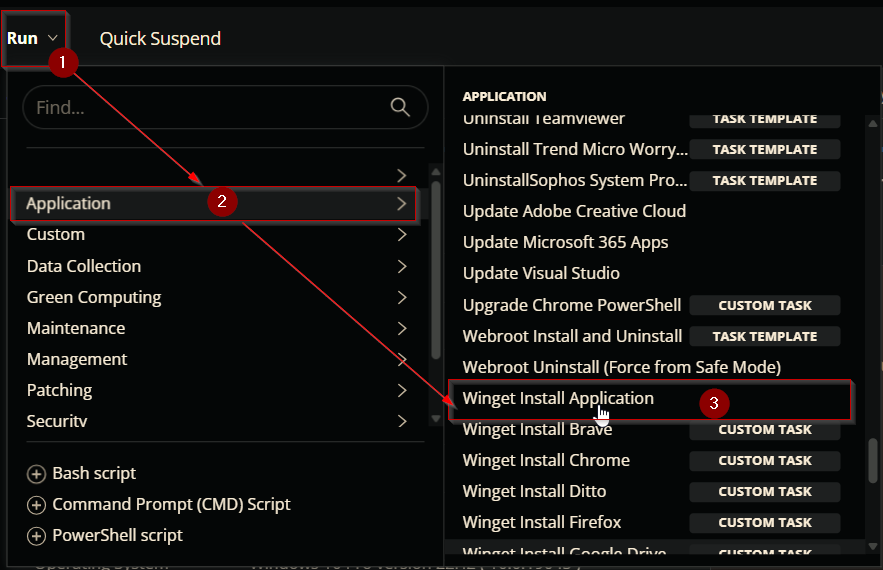
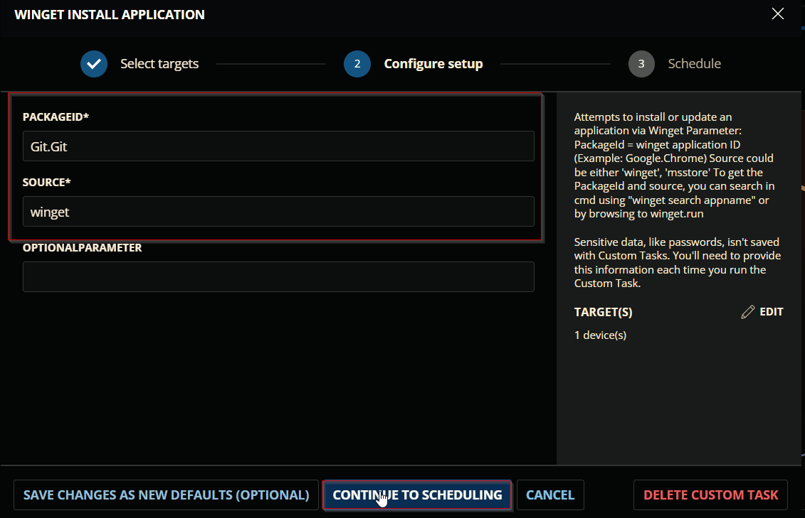
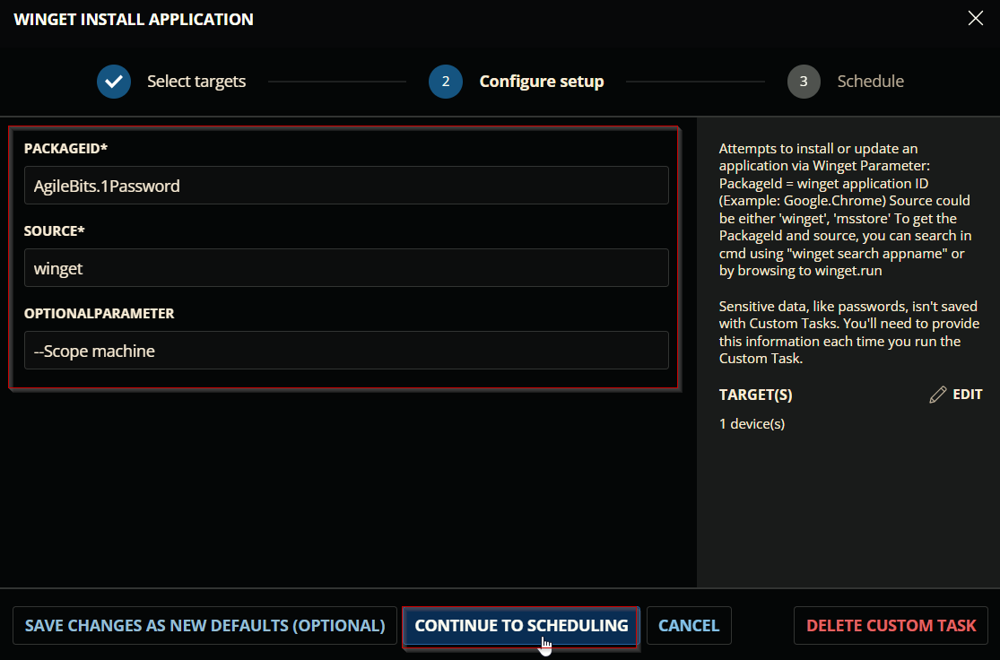
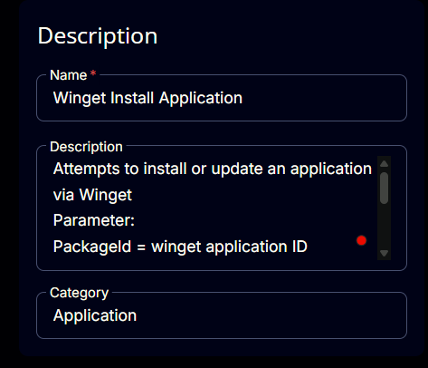
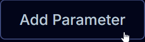
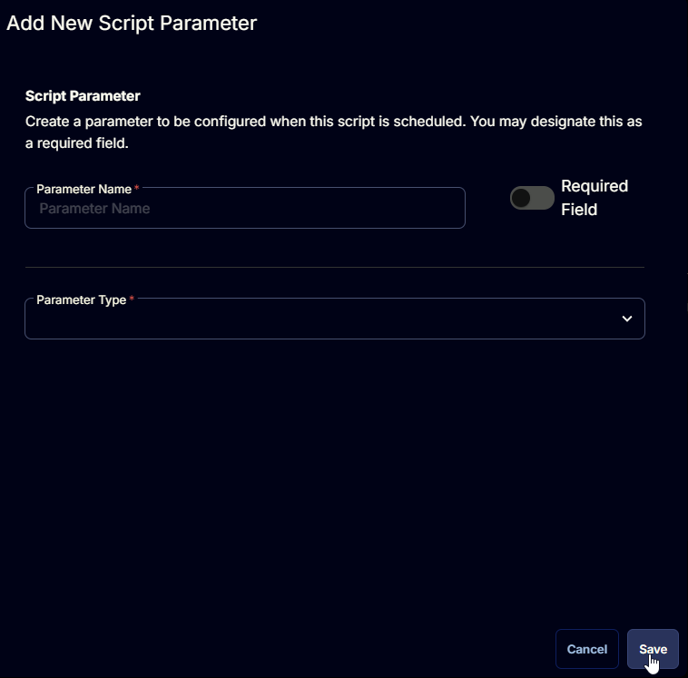
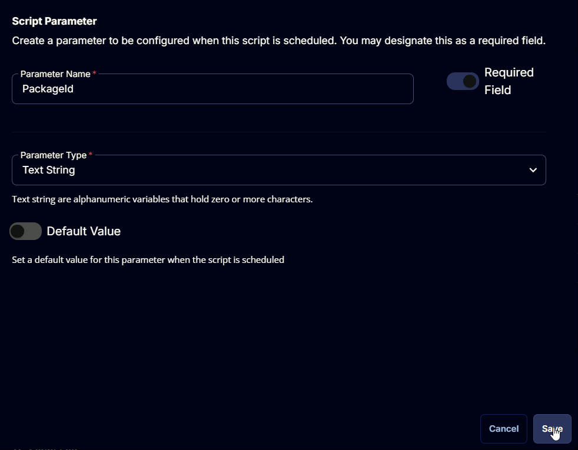
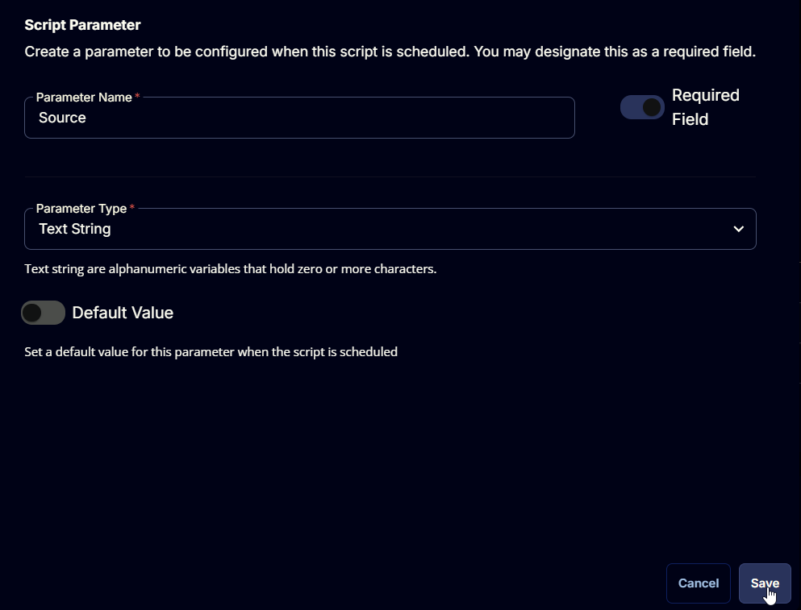
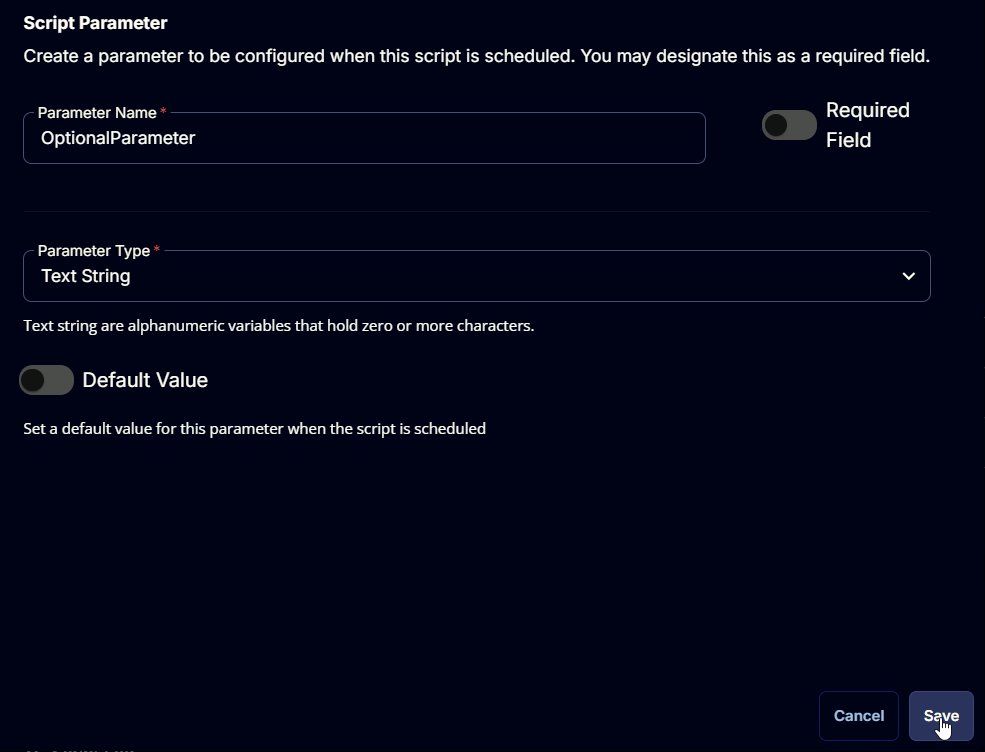

## Summary

Attempts to install or update an application via Winget.
To get the PackageId and source, you can search in cmd using **"winget search appname"** or by browsing to winget.run

## Sample Run



**Example 1:** Installing application without any optional parameters



**Example 2:** Installing application with optional parameter




## Dependencies

[Invoke-WingetProcessor](/docs/8496c2e9-0e52-4961-a1f1-4a95296e8cf7)

## User Parameters

| Name | Example | Accepted Values | Required | Default | Type | Description |
| ---- | ------- | --------------- | -------- | ------- | ---- | ----------- |
| PackageId | `AgileBits.1Password` | | Yes |  | Text String | winget application ID |
| Source | `winget` | `winget`, `msstore` | Yes | | Text String | Specifies winget or msstore as the source for package install |
| OptionalParameter | `--Scope machine` | | No | | Text String | Specifies option parameters to deploy the application |

## Task Creation

### Script Details

#### Step 1

Navigate to `Automation` ➞ `Tasks`  


#### Step 2

Create a new `Script Editor` style task by choosing the `Script Editor` option from the `Add` dropdown menu  


The `New Script` page will appear on clicking the `Script Editor` button:  


#### Step 3

Fill in the following details in the `Description` section:  

**Name:** `Winget Install Application`  
**Description:**

```PlainText
Attempts to install or update an application via Winget
Parameter:
PackageId = winget application ID (Example: Google.Chrome)
Source could be either 'winget', 'msstore'
To get the PackageId and source, you can search in cmd using "winget search appname" or by browsing to winget.run
```

**Category:** `Application`



### Parameters

#### **PackageId**

Locate the `Add Parameter` button on the right-hand side of the screen and click on it to create a new parameter.  


The `Add New Script Parameter` page will appear on clicking the `Add Parameter` button.  


Configure the parameter as described below:  
**Parameter Name:** `PackageId`  
**Required Field:** `True`  
**Parameter Type:** `Text String`  
**Default Value:** `False`  

Click the `Save` button to add the parameter.  


Read the message that will appear after clicking the `Save` button and click the `Confirm` button to save the changes.  


#### **Source**

Locate the `Add Parameter` button on the right-hand side of the screen and click on it to create a new parameter.  


The `Add New Script Parameter` page will appear on clicking the `Add Parameter` button.  


Configure the parameter as described below:  
**Parameter Name:** `Source`  
**Required Field:** `True`  
**Parameter Type:** `Text String`  
**Default Value:** `False`  

Click the `Save` button to add the parameter.  


Read the message that will appear after clicking the `Save` button and click the `Confirm` button to save the changes.  


#### **OptionalParameter**

Locate the `Add Parameter` button on the right-hand side of the screen and click on it to create a new parameter.  


The `Add New Script Parameter` page will appear on clicking the `Add Parameter` button.  


Configure the parameter as described below:  
**Parameter Name:** `OptionalParameter`  
**Required Field:** `False`  
**Parameter Type:** `Text String`  
**Default Value:** `False`  

Click the `Save` button to add the parameter.  


Read the message that will appear after clicking the `Save` button and click the `Confirm` button to save the changes.  


### Script Editor

Click the `Add Row` button in the `Script Editor` section to start creating the script  


A blank function will appear:  


#### Row 1 Function: `PowerShell script`


## Completed Task

`<Screenshot(s) of completed task>`

## Deployment


## Output
