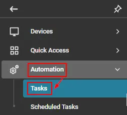
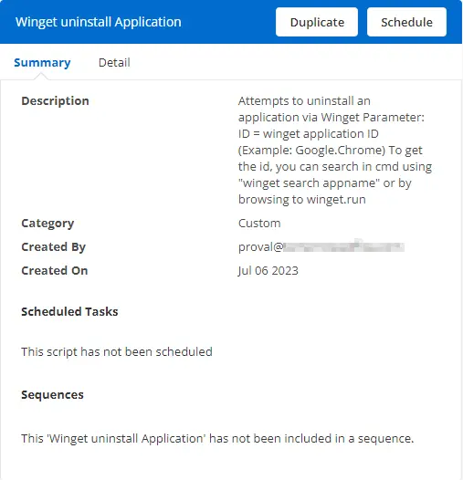
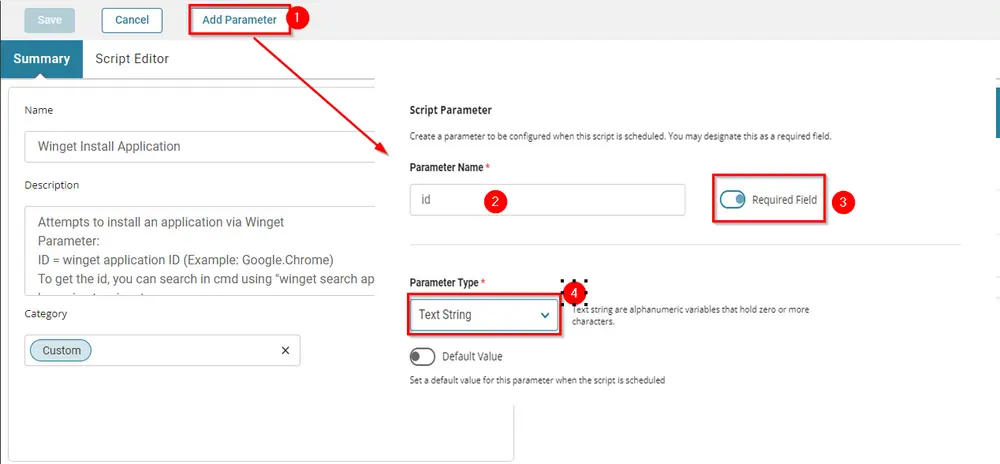
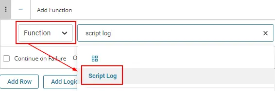
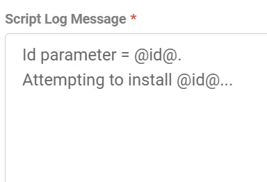
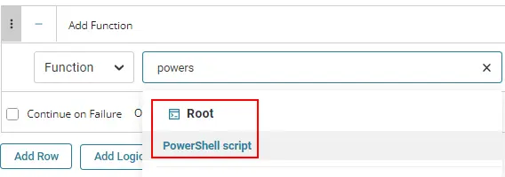
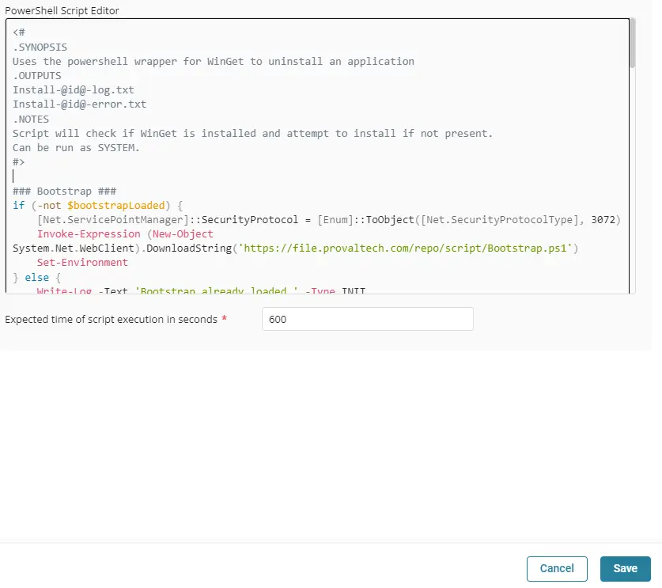
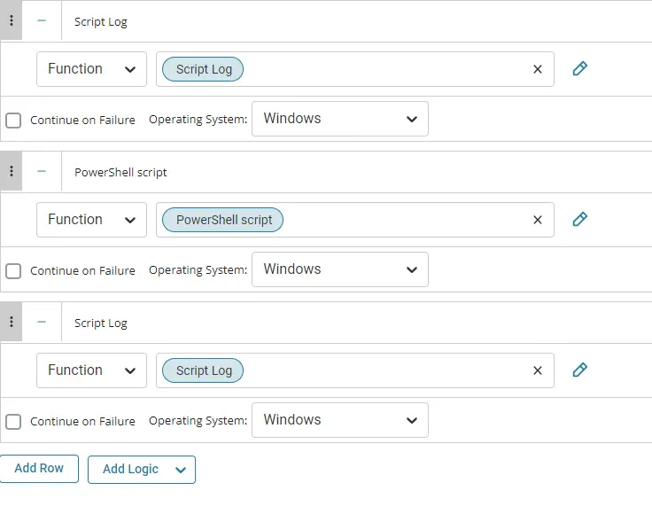

## Summary

This document outlines the process to uninstall an application via Winget.

## Parameters

**ID** = Winget application ID (Example: Google.Chrome)  
To obtain the ID, you can search in the command prompt using `winget search appname` or by browsing to winget.run.

## Dependencies

None. This script can be executed on any Windows device.

## Create Script

To implement this script, please create a new PowerShell-style script on the system.

  
  

**Name:** `Winget Uninstall Application`  
**Description:** 

[Bash Script 1](https://github.com/ProVal-Tech/cw-rmm/blob/main/tasks/winget-uninstall-application/script1.sh)

**Category:** `Custom`  

  

### Parameter

  
**Parameter Name:** id  
**Required Field:** Selected  
**Parameter Type:** Text String  

### Script

#### Row 1 Function: Script Log

  

Input the following:  

[Bash Script 2](https://github.com/ProVal-Tech/cw-rmm/blob/main/tasks/winget-uninstall-application/script2.sh)

  

#### Row 2 Function: PowerShell Script

  

Paste the following PowerShell script and set the expected time of script execution to 600 seconds.

[PowerShell Script](https://github.com/ProVal-Tech/cw-rmm/blob/main/tasks/winget-uninstall-application/script.ps1)

  

#### Row 3 Function: Script Log

  

In the script log message, simply type `%output%` so that the script will send the results of the PowerShell script above to the output on the Automation tab for the target device.

  

The final task should look like the screenshot below.  
  

## Script Deployment

The script is intended to run manually at this time.

## Output

- Script log

## Changelog

### 2025-04-10

- Initial version of the document

