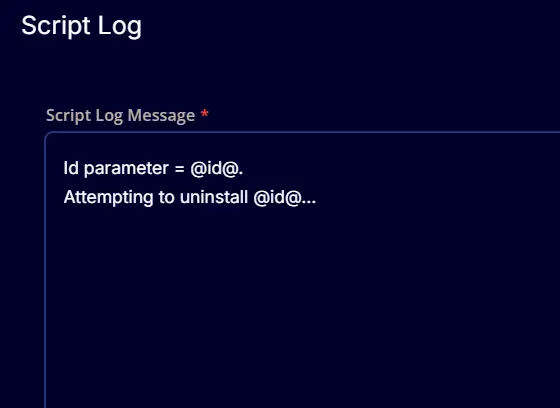
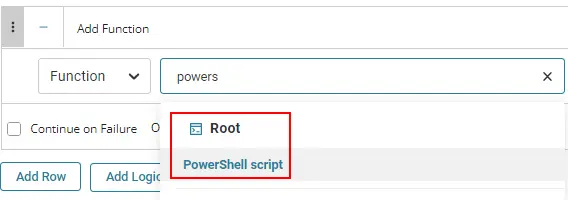
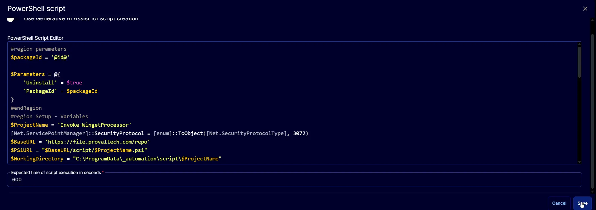

## Summary

This document outlines the process to uninstall an application via Winget.

## Parameters

**ID** = Winget application ID (Example: Google.Chrome)  
To obtain the ID, you can search in the command prompt using `winget search appname` or by browsing to winget.run.

## Dependencies

None. This script can be executed on any Windows device.

## Create Script

To implement this script, please create a new PowerShell-style script on the system.

  
  

**Name:** `Winget Uninstall Application`  
**Description:** 

```shell
Attempts to uninstall an application via Winget  
Parameter:
- ID = Winget application ID (Example: Google.Chrome)  
To obtain the ID, you can search in the command prompt using `winget search appname` or by browsing to winget.run.
```

**Category:** `Custom`  

  

### Parameter

  
**Parameter Name:** id  
**Required Field:** Selected  
**Parameter Type:** Text String  

### Script

#### Row 1 Function: Script Log

  

Input the following:  

```shell
Id parameter = @id@.
Attempting to uninstall @id@...
```

  

#### Row 2 Function: PowerShell Script

  

Paste the following PowerShell script and set the expected time of script execution to 600 seconds.

```PowerShell
#region parameters
$packageId = '@id@'

$Parameters = @{
    'Uninstall' = $true
    'PackageId' = $packageId
}
#endRegion
#region Setup - Variables
$ProjectName = 'Invoke-WingetProcessor'
[Net.ServicePointManager]::SecurityProtocol = [enum]::ToObject([Net.SecurityProtocolType], 3072)
$BaseURL = 'https://file.provaltech.com/repo'
$PS1URL = "$BaseURL/script/$ProjectName.ps1"
$WorkingDirectory = "C:\ProgramData\_automation\script\$ProjectName"
$PS1Path = "$WorkingDirectory\$ProjectName.ps1"
$Workingpath = $WorkingDirectory
$LogPath = "$WorkingDirectory\$ProjectName-log.txt"
$ErrorLogPath = "$WorkingDirectory\$ProjectName-Error.txt"
#endRegion
#region Setup - Folder Structure
New-Item -Path $WorkingDirectory -ItemType Directory -ErrorAction SilentlyContinue | Out-Null
try {
    Invoke-WebRequest -Uri $PS1URL -OutFile $PS1path -UseBasicParsing -ErrorAction Stop
} catch {
    if (!(Test-Path -Path $PS1Path )) {
        throw ('Failed to download the script from ''{0}'', and no local copy of the script exists on the machine. Reason: {1}' -f $PS1URL, $($Error[0].Exception.Message))
    }
}
#endRegion
#region Execution
if ($Parameters) {
    Write-Information ('Parameters Used: {0}' -f ($Parameters | Out-String)) -InformationAction Continue
    & $PS1Path @Parameters
} else {
    & $PS1Path
}
#endRegion
#region log verification
if ( !(Test-Path $LogPath) ) {
    throw 'PowerShell Failure. A Security application seems to have restricted the execution of the PowerShell Script.'
}
if ( Test-Path $ErrorLogPath ) {
    $ErrorContent = ( Get-Content -Path $ErrorLogPath )
    throw ('Error Content: {0}' -f ($ErrorContent | Out-String))
}
$content = Get-Content -Path $LogPath
$logContent = $content[ $($($content.IndexOf($($content -match "$($ProjectName)$")[-1])) + 1)..$($Content.length - 1) ]
return ('Log Content: {0}' -f ($logContent | Out-String))
```

  

#### Row 3 Function: Script Log

  

In the script log message, simply type `%output%` so that the script will send the results of the PowerShell script above to the output on the Automation tab for the target device.

  

The final task should look like the screenshot below.  
  

## Script Deployment

The script is intended to run manually at this time.

## Output

- Script log
