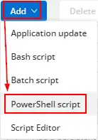
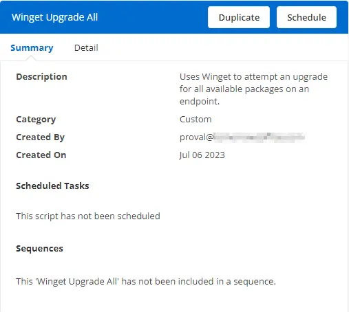
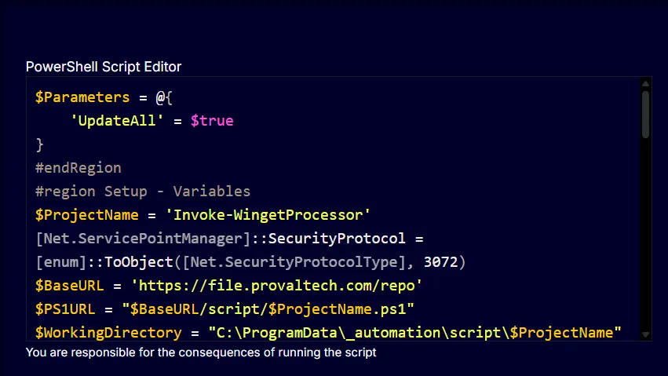
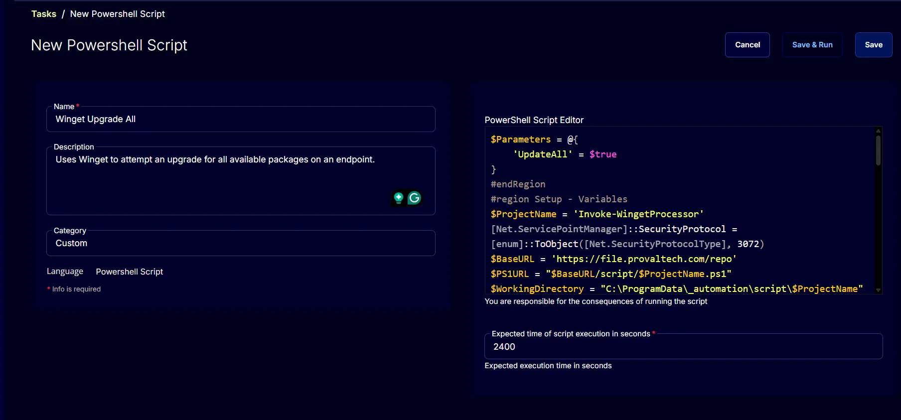

## Summary

This script uses Winget to attempt an upgrade for all available packages on an endpoint and attempts to install an application via Winget.

## Dependencies

None. This script can be run on any Windows device.

## Create Script

To implement this script, please create a new PowerShell-style script in the system.

  
  

- **Name:** `Winget Upgrade All`  
- **Description:** `Uses Winget to attempt an upgrade for all available packages on an endpoint.`  
- **Category:** `Custom`  

  

### Script

  

Paste the PowerShell script below directly into the "Script" field.

```powershell
$Parameters = @{
    'UpdateAll' = $true
}
#endRegion
#region Setup - Variables
$ProjectName = 'Invoke-WingetProcessor'
[Net.ServicePointManager]::SecurityProtocol = [enum]::ToObject([Net.SecurityProtocolType], 3072)
$BaseURL = 'https://file.provaltech.com/repo'
$PS1URL = "$BaseURL/script/$ProjectName.ps1"
$WorkingDirectory = "C:\ProgramData\_automation\script\$ProjectName"
$PS1Path = "$WorkingDirectory\$ProjectName.ps1"
$Workingpath = $WorkingDirectory
$LogPath = "$WorkingDirectory\$ProjectName-log.txt"
$ErrorLogPath = "$WorkingDirectory\$ProjectName-Error.txt"
#endRegion
#region Setup - Folder Structure
New-Item -Path $WorkingDirectory -ItemType Directory -ErrorAction SilentlyContinue | Out-Null
try {
    Invoke-WebRequest -Uri $PS1URL -OutFile $PS1path -UseBasicParsing -ErrorAction Stop
} catch {
    if (!(Test-Path -Path $PS1Path )) {
        throw ('Failed to download the script from ''{0}'', and no local copy of the script exists on the machine. Reason: {1}' -f $PS1URL, $($Error[0].Exception.Message))
    }
}
#endRegion
#region Execution
if ($Parameters) {
    Write-Information ('Parameters Used: {0}' -f ($Parameters | Out-String)) -InformationAction Continue
    & $PS1Path @Parameters
} else {
    & $PS1Path
}
#endRegion
#region log verification
if ( !(Test-Path $LogPath) ) {
    throw 'PowerShell Failure. A Security application seems to have restricted the execution of the PowerShell Script.'
}
if ( Test-Path $ErrorLogPath ) {
    $ErrorContent = ( Get-Content -Path $ErrorLogPath )
    throw ('Error Content: {0}' -f ($ErrorContent | Out-String))
}
$content = Get-Content -Path $LogPath
$logContent = $content[ $($($content.IndexOf($($content -match "$($ProjectName)$")[-1])) + 1)..$($Content.length - 1) ]
return ('Log Content: {0}' -f ($logContent | Out-String))
```

Expected time of script execution in seconds*: 2400

## Completed Task

  

## Output

- Script log
