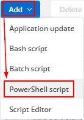
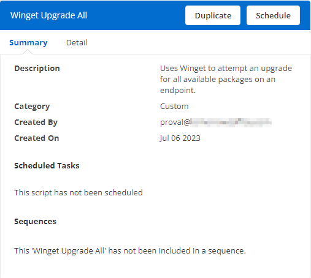
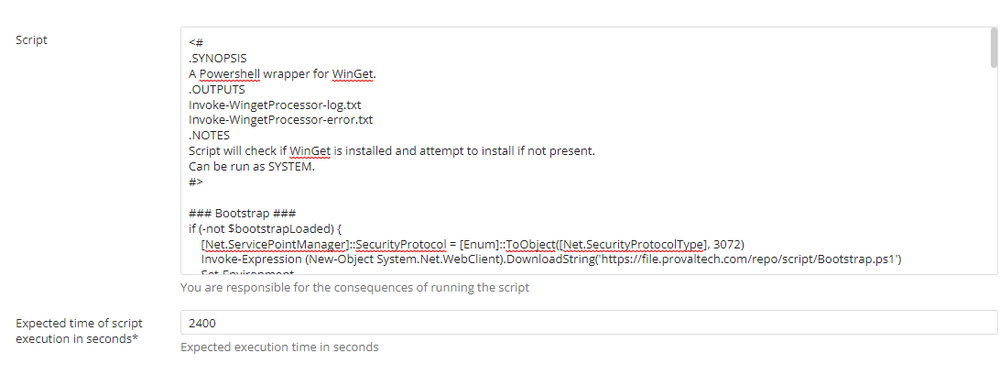

## Summary

This script uses Winget to attempt an upgrade for all available packages on an endpoint and attempts to install an application via Winget.

## Dependencies

None. This script can be run on any Windows device.

## Create Script

To implement this script, please create a new PowerShell-style script in the system.

  
  

- **Name:** Winget Upgrade All  
- **Description:** Uses Winget to attempt an upgrade for all available packages on an endpoint.  
- **Category:** Custom  

  

### Script

  

Paste the PowerShell script below directly into the "Script" field.

```powershell
<#
.SYNOPSIS
A Powershell wrapper for WinGet.
.OUTPUTS
Invoke-WingetProcessor-log.txt
Invoke-WingetProcessor-error.txt
.NOTES
Script will check if WinGet is installed and attempt to install if not present.
Can be run as SYSTEM.
#>

### Bootstrap ###
if (-not $bootstrapLoaded) {
    [Net.ServicePointManager]::SecurityProtocol = [Enum]::ToObject([Net.SecurityProtocolType], 3072)
    Invoke-Expression (New-Object System.Net.WebClient).DownloadString('https://file.provaltech.com/repo/script/Bootstrap.ps1')
    Set-Environment
} else {
    Write-Log -Text 'Bootstrap already loaded.' -Type INIT
}
$ProgressPreference = 'SilentlyContinue'
### Process ###
$InformationPreference = 'continue' 

Write-Log -Text 'Checking prerequisites...' -Type Log
# Get the latest version of WinGet from GitHub
$wingetMsixPath = Join-Path -Path $env:TEMP -ChildPath 'Microsoft.DesktopAppInstaller_8wekyb3d8bbwe.msixbundle'
Invoke-RestMethod -Uri 'https://github.com/microsoft/winget-cli/releases/latest/download/Microsoft.DesktopAppInstaller_8wekyb3d8bbwe.msixbundle' -OutFile $wingetMsixPath
if (!(Get-Module '7ZipArchiveDsc' -ErrorAction SilentlyContinue)) {
    Install-PackageProvider -Name NuGet -Force | Out-Null
    Set-PSRepository -Name PSGallery -InstallationPolicy Trusted
    Install-Module -Name 7ZipArchiveDsc
}
Import-Module 7ZipArchiveDsc
$wingetWorkingPath = "$env:ProgramData\_automation\winget"
New-Item -Type Directory -Path $wingetWorkingPath -ErrorAction SilentlyContinue
Expand-7ZipArchive -Path $wingetMsixPath -Destination $wingetWorkingPath
$wingetParentPath = "$wingetWorkingPath\app"
$wingetPath = "$wingetParentPath\winget.exe"
if ([Environment]::Is64BitOperatingSystem) {
    Expand-7ZipArchive -Path "$wingetWorkingPath\AppInstaller_x64.msix" -Destination $wingetParentPath
} else {
    Expand-7ZipArchive -Path "$wingetWorkingPath\AppInstaller_x86.msix" -Destination $wingetParentPath
}

# Install VCLibs if required
if (!(Get-ProvisionedAppPackage -Online | Where-Object { $_.DisplayName -match 'uwpdesktop' })) {
    Write-Log -Text 'Installing VCLibs dependency.' -Type LOG
    $vclib = Join-Path -Path $env:TEMP -ChildPath 'Microsoft.VCLibs.x64.14.00.Desktop.appx'
    Invoke-RestMethod -Uri 'https://aka.ms/Microsoft.VCLibs.x64.14.00.Desktop.appx' -OutFile $vclib -ErrorAction Stop
    DISM.EXE /Online /Add-ProvisionedAppxPackage /PackagePath:$vclib /SkipLicense
    Remove-Item -Path $vclib -Force
}

#check to ensure redists are present on the machine
$Visual2019 = 'Microsoft Visual C++ 2015-2019 Redistributable*'
$Visual2022 = 'Microsoft Visual C++ 2015-2022 Redistributable*'
$path = Get-Item @(
    'HKLM:\SOFTWARE\Microsoft\Windows\CurrentVersion\Uninstall\*',
    'HKLM:\SOFTWARE\Wow6432Node\Microsoft\Windows\CurrentVersion\Uninstall\*'
) | Where-Object { $_.GetValue('DisplayName') -like $Visual2019 -or $_.GetValue('DisplayName') -like $Visual2022 }
if (!($path)) {
    try {
        if ([System.Environment]::Is64BitOperatingSystem) {
            $VCRedistTarget = 'VC_redist.x64.exe'
        } else {
            $VCRedistTarget = 'VC_redist.x86.exe'
        }
        Write-Log -Text "Downloading $VCRedistTarget..." -Type Log
        $SourceURL = "https://aka.ms/vs/17/release/$VCRedistTarget"
        $ProgressPreference = 'SilentlyContinue'
        Invoke-WebRequest $SourceURL -OutFile "$env:TEMP\$VCRedistTarget"
        Write-Log -Text "Installing $VCRedistTarget..." -Type LOG
        Start-Process -FilePath "$env:TEMP\$VCRedistTarget" -Args '/quiet /norestart' -Wait
        Remove-Item "$env:TEMP\$VCRedistTarget" -ErrorAction SilentlyContinue
        Write-Log -Text 'MS Visual C++ 2015-2022 installed successfully' -Type LOG
    } catch {
        Write-Log -Text 'MS Visual C++ 2015-2022 installation failed.' -Type LOG
    }
} else {
    Write-Log -Text 'Prerequisites checked. OK' -Type LOG
}
#print out user to log for debug
Write-Log -Text "Running as $(whoami)" -Type LOG

#if we couldn't find winget, fail and throw since we already tried installing
if (!(Test-Path -Path $wingetPath)) {
    Write-Log -Text 'Unable to install winget' -Type ERROR
    throw 'Exception - Unable to install WinGet'
} else {
    Write-Log -Text "Winget found at '$wingetPath'."
    & $wingetPath list --accept-source-agreements | Out-Null
}

Write-Log -Text 'Updating all WinGet-Compatible Software on the endpoint.' -Type LOG
& $wingetPath upgrade --all --silent
```

Expected time of script execution in seconds*: 2400

## Script Deployment

The script is intended to run manually at this time.

## Output

- Script log


