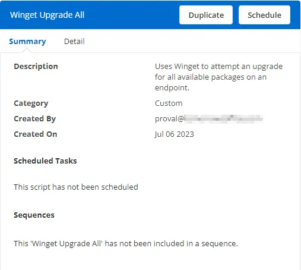
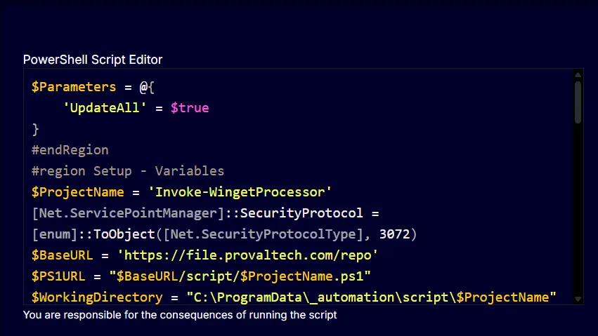
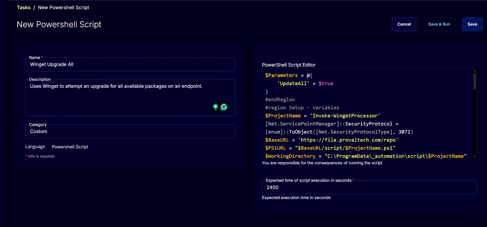

---
id: 'f4ce0265-0066-42ca-a1d5-c8897cb393f4'
slug: /f4ce0265-0066-42ca-a1d5-c8897cb393f4
title: 'Winget Upgrade All'
title_meta: 'Winget Upgrade All'
keywords: ['winget', 'upgrade', 'windows', 'packages', 'installation']
description: 'This document outlines a PowerShell script that utilizes Winget to upgrade all available packages on a Windows endpoint. It checks for prerequisites, installs Winget if necessary, and executes the upgrade process in a silent manner, ensuring all compatible software is updated efficiently.'
tags: ['installation', 'performance', 'software', 'update', 'windows']
draft: false
unlisted: false
last_update:
  date: 2025-11-27
---

## Summary

This script uses Winget to attempt an upgrade for all available packages on an endpoint and attempts to install an application via Winget.

## Dependencies

None. This script can be run on any Windows device.

## Create Script

To implement this script, please create a new PowerShell-style script in the system.

  
  

- **Name:** `Winget Upgrade All`  
- **Description:** `Uses Winget to attempt an upgrade for all available packages on an endpoint.`  
- **Category:** `Custom`  

  

### Script

  

Paste the PowerShell script below directly into the "Script" field.

[PowerShell Script](https://github.com/ProVal-Tech/cw-rmm/blob/main/tasks/winget-upgrade-all/script.ps1)

Expected time of script execution in seconds*: 2400

## Completed Task

  

## Output

- Script log

## Changelog

### 2025-04-10

- Initial version of the document

