## Summary

This document outlines the process for scheduling a forced reboot of workstations on specific days based on the approved window check.

## Sample Run

Select the device and search for 'Workstation Re' in the search box, then click.

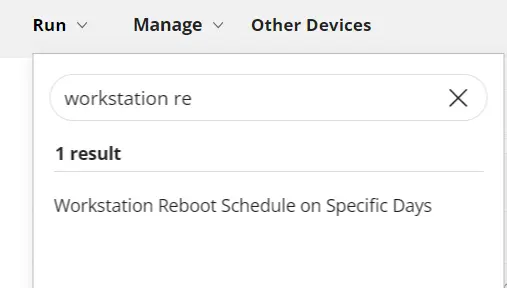

Provide the user parameter value as per the requirement and then click 'Continue to scheduling'.

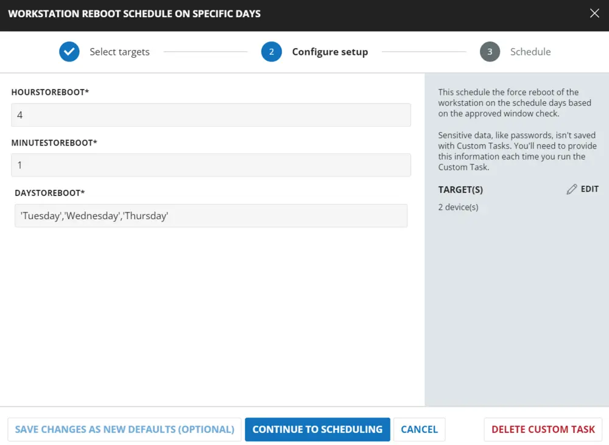

Click 'Run task' to schedule the task immediately.

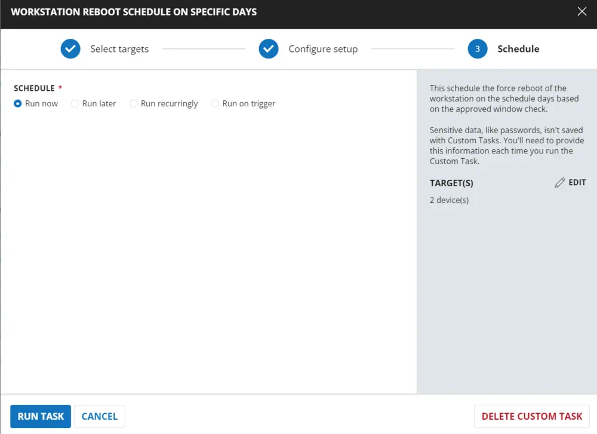

## User Parameters

| Name                | Example                              | Required | Description                                                                                                                                               |
|---------------------|--------------------------------------|----------|-----------------------------------------------------------------------------------------------------------------------------------------------------------|
| HoursToReboot       | 4                                    | True     | The hour of the day to reboot in a 24-hour format. Example: 13 = 1:00 PM                                                                               |
| MinutesToReboot     | 0                                    | True     | The minute of the hour to reboot. Supports values from 0 - 59                                                                                         |
| DaysToReboot        | 'Tuesday','Wednesday','Thursday'    | True     | Must be a comma-separated list of strings in single quotes with the names of the days of the week to reboot. Example: 'Tuesday','Wednesday','Thursday' |

## Dependencies

[CW RMM - Custom Fields - Reboot Trigger/Schedule](/docs/c0aece55-4e18-4914-9e43-965c8c9e23a6)

## Implementation

### Create Task

To implement this script, please create a new "Script Editor" style script in the system.


- **Name**: Workstation Reboot Schedule on Specific Days
- **Description**: This schedule forces the reboot of the workstation on the scheduled days based on the approved window check.
- **Category**: Maintenance

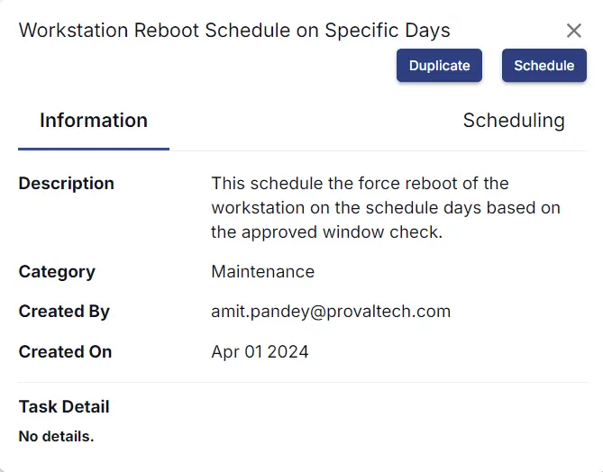

### Script

Start by making three separate rows. You can do this by clicking the "Add Row" button at the bottom of the script page.


### Row 1: Function: Script Log


Paste the highlighted text: `Checking OS`


### Row 2: Function: PowerShell Script


Paste in the following PowerShell script and set the expected time of script execution to 600 seconds.

```
$os = Get-CimInstance -ClassName Win32_OperatingSystem
if ($os.ProductType -eq 1) {
    return 'Workstation'
} elseif ($os.ProductType -eq 2 -or $os.ProductType -eq 3) {
    return 'Server'
} else {
    return 'Unknown OS Type'
}
```

### Row 3: Function: Script Log

In the script log message, simply type `%output%` so that the script will send the results of the PowerShell script above to the output on the Automation tab for the target device.

### Row 4: Logic: If/Then


### Row 4a: Condition: Output Contains

In the IF part, enter `Workstation` in the right box of the "Output Does Not Contain" part.


### Row 4b: Function: Script Log

In the script log message, type `The OS detected is confirmed not a Workstation. Please try the script 'Force Reboot Server with Reboot Windows Verification'. Exiting script without any action.`

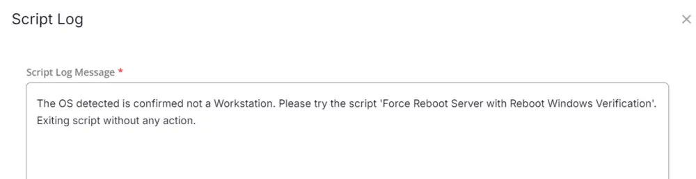

### Row 4c: Function: Script Exit

Add a new row by clicking on the Add row button. In the script exit message, leave it blank.

### Row 5: Logic: If/Then


### Row 5a: Condition: Custom Field Equals

In the IF part, enter `true` in the right box of the "Custom Field Equals" part.

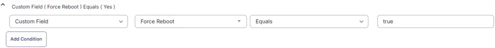

### Row 5b: Function: Script Log

In the script log message, type `Force Reboot is approved on the endpoint via Reboot Scripts. Proceeding for reboot schedule without reboot window validation.`

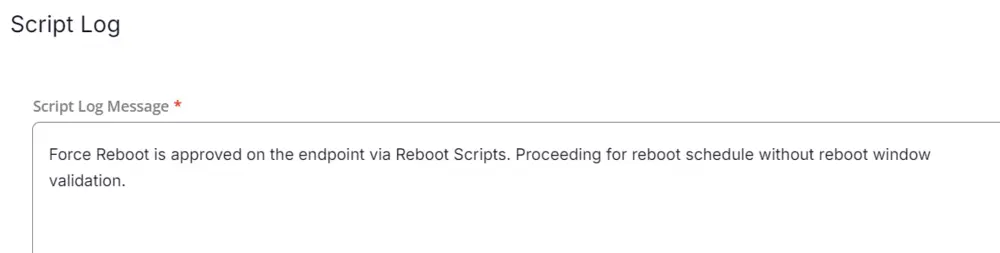

### Row 5c: Function: PowerShell Script

Paste in the following PowerShell script and set the expected time of script execution to 900 seconds.

```
function Restart-ComputerOnSchedule {
    [CmdletBinding()]
    param (
        [Parameter(Mandatory)][string[]]$Days,
        [Parameter(Mandatory)][int]$Hour,
        [Parameter(Mandatory)][int]$Minute,
        [switch]$Test
    )
    if(-not [bool]$Days) {
        Write-Output "ERROR: No days specified to reboot."
        return
    }
    $INCORRECT_DAYS = $Days | Where-Object {$_ -notmatch "^(Sunday|Monday|Tuesday|Wednesday|Thursday|Friday|Saturday)$"}
    if([bool]$INCORRECT_DAYS) {
        Write-Output "ERROR: Specified days are incorrect: $($INCORRECT_DAYS -join ',')"
        return
    }
    if((0..23) -notcontains $Hour) {
        Write-Output "ERROR: Specified hour is incorrect: $Hour"
        return
    }
    if((0..59) -notcontains $Minute) {
        Write-Output "ERROR: Specified minute is incorrect: $Minute"
        return
    }
    $currentDate = Get-Date
    $rebootDate = $(Get-Date -Hour $Hour -Minute $Minute).AddDays(1)
    $failsafe = 0
    while($Days -notcontains $rebootDate.DayOfWeek) {
        if($failsafe -gt 7) {break}
        $rebootDate = $rebootDate.AddDays(1)
        $failsafe++
    }
    if($failsafe -gt 7) {
        Write-Output "ERROR: Something went wrong and the reboot date could not be determined."
        return
    }
    $rebootDelay = [Math]::Round($($rebootDate - $currentDate).TotalSeconds)
    $rebootComment = "Server is being rebooted automatically at: $($rebootDate.tostring())"
    $rebootArgs = @("/r", "/t", $rebootDelay, "/c", $rebootComment)
    if(-not $Test) {
        & shutdown /a 2>&1 | Out-Null
        & shutdown $rebootArgs 2>&1 | Out-Null
    }
    
    Write-Output "RebootDateTime=$($rebootDate.tostring("yyyy-MM-dd hh:mm:ss"))"
}

Restart-ComputerOnSchedule -Days (@DaysToReboot@) -Hour @HoursToReboot@ -Minute @MinutesToReboot@
```

### Row 5d: Function: Script Log

In the script log message, simply type `%output%`.

### Row 5e: Logic: If/Then


### Row 5e.1: Condition: Output Does Not Contain

In the IF part, enter `RebootDateTime` in the right box of the "Output Does Not Contain" part.

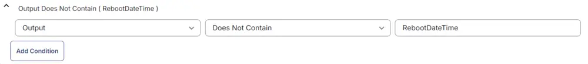

### Row 5e.2: Function: Script Exit

In the script exit message, type `Reboot Schedule Failed with an error %output%.` This will end the task with failure.

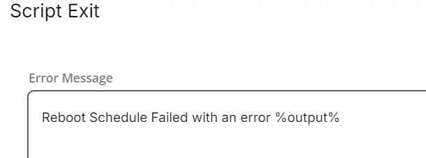

### Row 5f: Function: Script Log

In the script log message, type `Reboot successfully scheduled on %output%.`

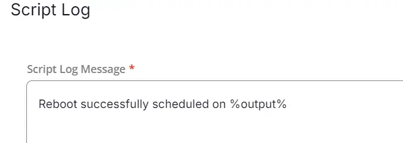

### Row 5g: Function: Script Exit

Add a new row by clicking on the Add row button. In the script exit message, leave it blank.

### Row 6: Function: Set Pre-defined Variable

Select the custom field 'WorkstationRebootWindowStart' and set the variable 'RebootWindowStart'.


### Row 7: Function: Set Pre-defined Variable

Select the custom field 'WorkstationRebootWindowEnd' and set the variable 'RebootWindowEnd'.

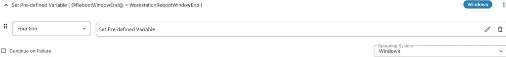

### Row 8: Function: Set Pre-defined Variable

Select the custom field 'WorkstationRebootWindowDay' and set the variable 'RebootWindowDay'.

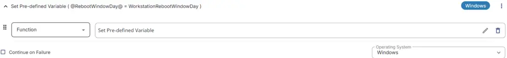

### Row 9: Logic: If/Then


### Row 9a: Condition: Custom Field Equals

In the IF part, enter `true` in the right box of the "Custom Field Equals" part.


### Row 9b: Function: Script Log

In the script log message, type `This endpoint has 'Exclude Reboot' flag checked. Exiting script without any action.`

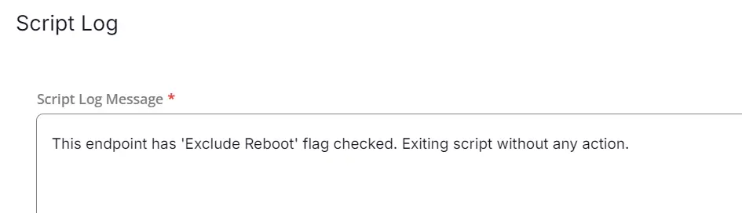

### Row 9c: Function: Script Exit

Add a new row by clicking on the Add row button. In the script exit message, leave it blank.

### Row 10: Function: Script Log

In the script log message, type `Verifying that machine is in approved window between @RebootWindowStart@ and @RebootWindowEnd@ (Note: 0=12:00 AM, 23=11:00 PM) and Day @RebootWindowDay@.`

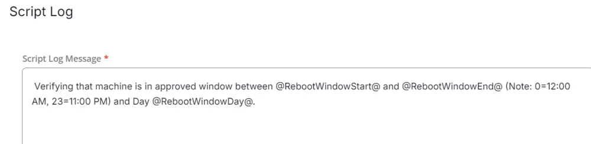

### Row 11: Function: PowerShell Script

Paste in the following PowerShell script and set the expected time of script execution to 600 seconds.

```
$hour = [int](get-date -Format "HH");
$currentDay = (get-date).DayOfWeek
$Day = @RebootWindowDay@
$minHour = @RebootWindowStart@
$maxHour = @RebootWindowEnd@

if ($Day -contains $currentDay) {
    if (($hour -ge $minHour) -and ($hour -lt $maxHour)) {
        return 'Machine is in reboot window'
    } else {
        return 'Time is not in approved window'
    }
} else {
    return 'Day is not in approved window'
}
```

### Row 12: Function: Script Log

In the script log message, simply type `%output%`.

### Row 13: Logic: If/Then


### Row 13a: Condition: Output Contains

In the IF part, enter `Machine is in reboot window` in the right box of the "Output Does Not Contain" part.

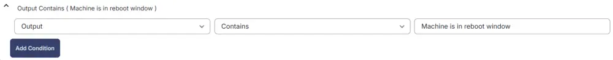

### Row 13b: Function: Script Log

In the script log message, type `Scheduling the reboot as the reboot schedule falls under the reboot window set on the company level.`

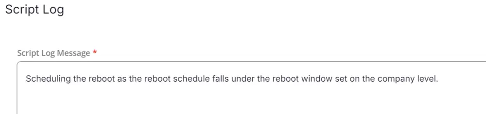

### Row 13c: Function: PowerShell Script

Paste in the following PowerShell script and set the expected time of script execution to 900 seconds.

```
function Restart-ComputerOnSchedule {
    [CmdletBinding()]
    param (
        [Parameter(Mandatory)][string[]]$Days,
        [Parameter(Mandatory)][int]$Hour,
        [Parameter(Mandatory)][int]$Minute,
        [switch]$Test
    )
    if(-not [bool]$Days) {
        Write-Output "ERROR: No days specified to reboot."
        return
    }
    $INCORRECT_DAYS = $Days | Where-Object {$_ -notmatch "^(Sunday|Monday|Tuesday|Wednesday|Thursday|Friday|Saturday)$"}
    if([bool]$INCORRECT_DAYS) {
        Write-Output "ERROR: Specified days are incorrect: $($INCORRECT_DAYS -join ',')"
        return
    }
    if((0..23) -notcontains $Hour) {
        Write-Output "ERROR: Specified hour is incorrect: $Hour"
        return
    }
    if((0..59) -notcontains $Minute) {
        Write-Output "ERROR: Specified minute is incorrect: $Minute"
        return
    }
    $currentDate = Get-Date
    $rebootDate = $(Get-Date -Hour $Hour -Minute $Minute).AddDays(1)
    $failsafe = 0
    while($Days -notcontains $rebootDate.DayOfWeek) {
        if($failsafe -gt 7) {break}
        $rebootDate = $rebootDate.AddDays(1)
        $failsafe++
    }
    if($failsafe -gt 7) {
        Write-Output "ERROR: Something went wrong and the reboot date could not be determined."
        return
    }
    $rebootDelay = [Math]::Round($($rebootDate - $currentDate).TotalSeconds)
    $rebootComment = "Server is being rebooted automatically at: $($rebootDate.tostring())"
    $rebootArgs = @("/r", "/t", $rebootDelay, "/c", $rebootComment)
    if(-not $Test) {
        & shutdown /a 2>&1 | Out-Null
        & shutdown $rebootArgs 2>&1 | Out-Null
    }
    
    Write-Output "RebootDateTime=$($rebootDate.tostring("yyyy-MM-dd hh:mm:ss"))"
}

Restart-ComputerOnSchedule -Days (@DaysToReboot@) -Hour @HoursToReboot@ -Minute @MinutesToReboot@
```

### Row 13d: Function: Script Log

In the script log message, simply type `%output%`.

### Row 13e: Function: Script Log


### Row 13e.1: Condition: Output Contains

In the IF part, enter `RebootDateTime` in the right box of the "Output Contains" part.

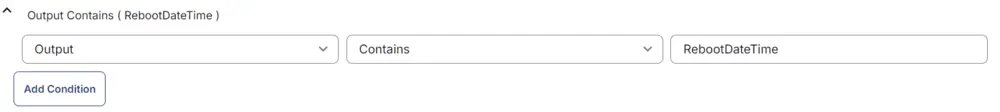

### Row 13e.2: Function: Script Log

In the script log message, type `Reboot successfully scheduled on %output%.`


### Row 13e.3: Function: Script Exit

Add a new row by clicking on the Add row button. In the script exit message, leave it blank.

### Row 13f: Function: Script Exit

In the script exit message, type `Reboot Schedule Failed with an error %output%.` This will end the task with failure.

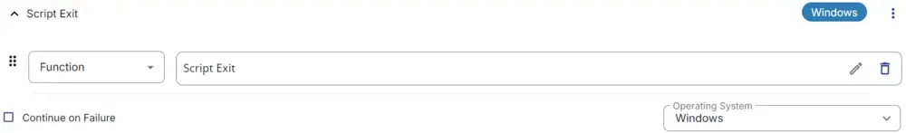

### Row 14: Complete

The complete script looks as shown below:

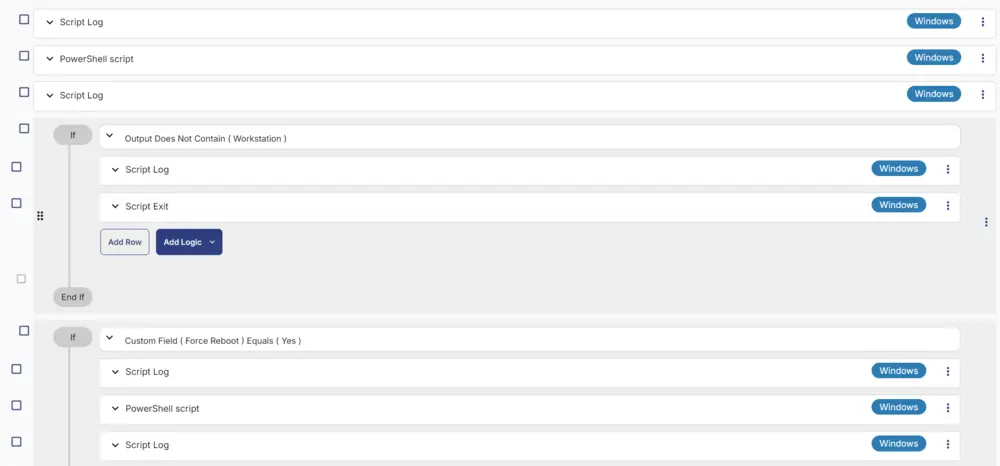


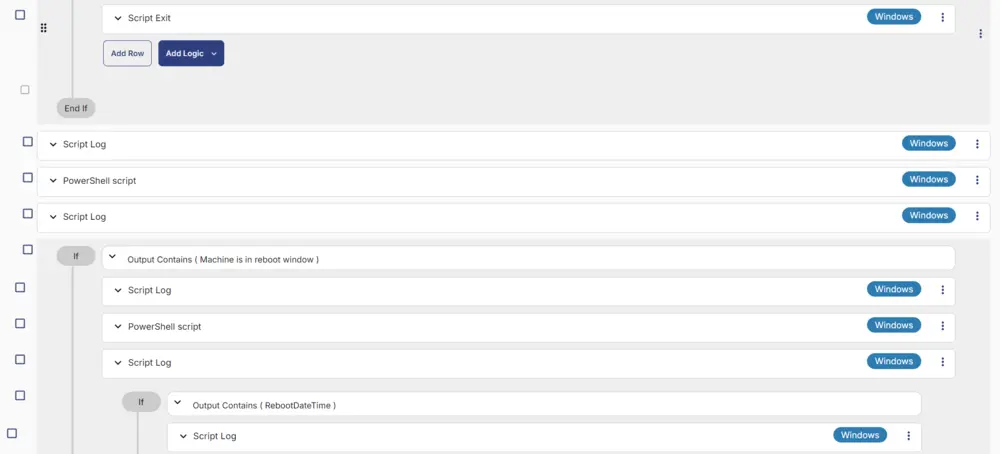

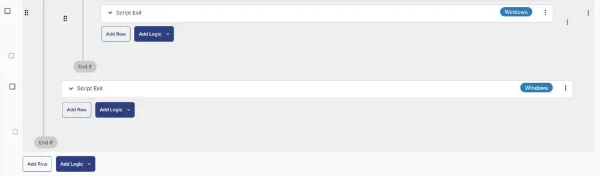

## Deployment

This task can be run manually or in a group. It will only reboot endpoints if the reboot falls under the reboot window provided in the company-level custom fields.

[CW RMM - Custom Fields - Reboot Trigger/Schedule](/docs/c0aece55-4e18-4914-9e43-965c8c9e23a6)

- Go to `Automation` > `Tasks`.
- Search for `Workstation Reboot Schedule on Specific Days` Task.
- Select the concerned task.
- Click on the `Schedule` button to schedule the task/script.

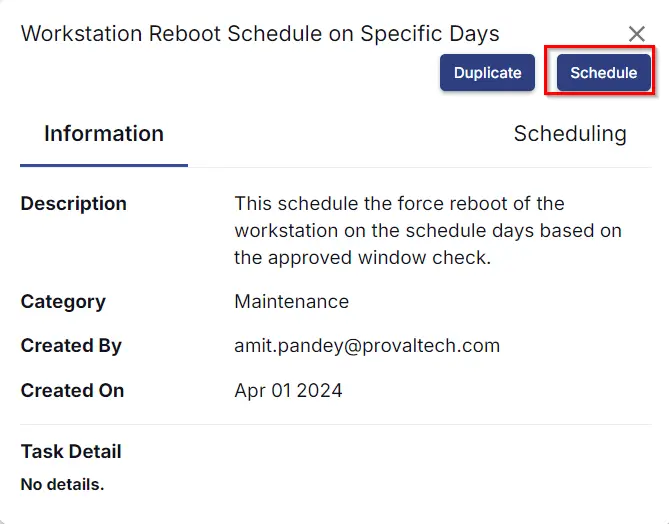

This screen will appear.


- Select the relevant time to run the script and click the 'Do not repeat' button.


- Select the target to schedule the 'Workstation Reboot Schedule on Specific Days'.


- Now click the `Run` button once all customization is set to initiate the task.

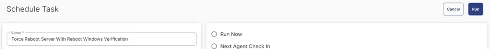

- The task will start appearing in the Scheduled Tasks.

## Output

- Task & Sequences Log
