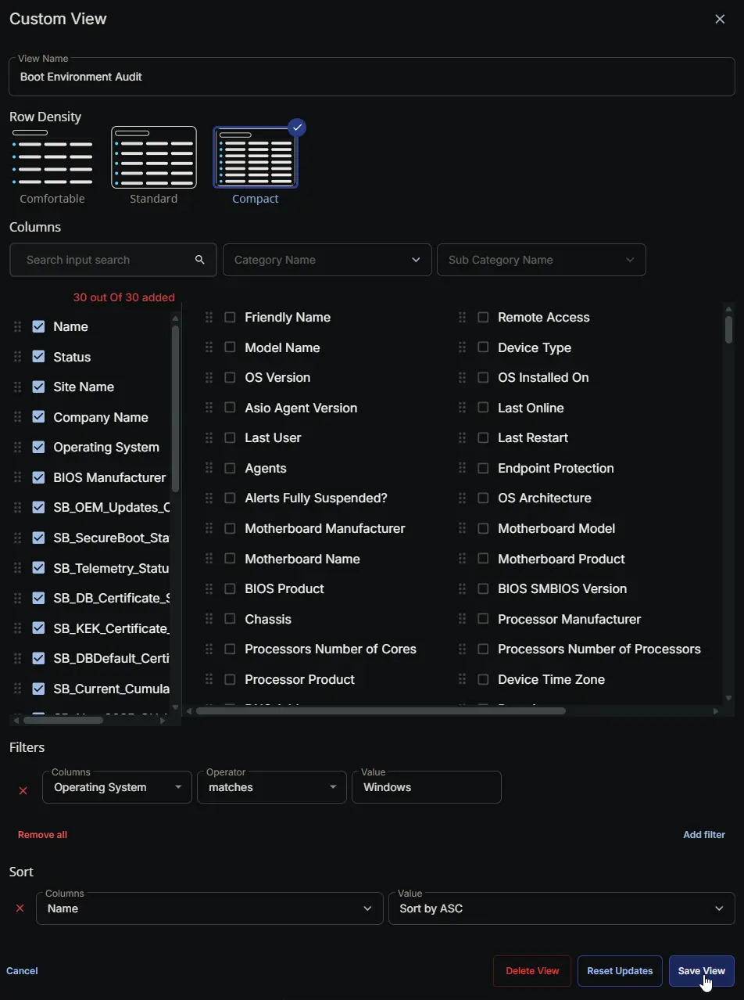

## Summary

This view provides a centralized, single-pane-of-glass dashboard for monitoring the boot environment and security posture of all your Windows endpoints. By aggregating the data collected during the Boot Environment Audit, this view allows technicians to quickly identify systems that are missing critical OEM driver updates, lack proper Secure Boot configurations, or need BIOS firmware upgrades to support modern security standards (like the CA 2023 certificates). It also highlights endpoints with active network boot (PXE) configurations, alternative operating systems (Dual-Boot), or disabled recovery environments, making it simple to spot misconfigurations and vulnerabilities across your entire managed fleet.

> **Note:** Views are user-specific and cannot be shared. Each user must create their own view.

## Details

| Field Name | Description |
| --- | --- |
| Name | The name of the endpoint. |
| Status | The current online or offline status of the endpoint. |
| Site Name | The site location to which the endpoint is assigned. |
| Company Name | The company or client associated with the endpoint. |
| Operating System | The current operating system installed on the endpoint. |
| BIOS Manufacturer | The manufacturer of the device's BIOS/firmware (e.g., Dell, HP, Lenovo). |
| SB_OEM_Updates_Count | Number of available driver updates from the OEM (Dell Command Update, HP Image Assistant, Lenovo Updates, or Windows Update). |
| SB_SecureBoot_Status | Current Secure Boot state: Enabled, Disabled, or Unknown. |
| SB_Telemetry_Status | Windows telemetry setting: Enabled or Disabled (based on registry and DiagTrack service). |
| SB_DB_Certificate_Status | UEFI db certificate status: Updated (CA 2023), Out of date, or Not present. |
| SB_KEK_Certificate_Status | UEFI KEK certificate status: Updated (Microsoft KEK 2K CA 2023), Out of date, or Not present. |
| SB_DBDefault_Certificate_Status | Default db certificate status: Updated (CA 2023), Out of date, or Not present. |
| SB_Current_Cumulative_Update | Latest installed Windows cumulative update identifier (e.g., KB5012345). |
| SB_Nov_2025_CU_Installed | True if the November 2025 or newer cumulative update is installed; False otherwise. |
| SB_BiosVersion | BIOS/firmware version string collected from the system. |
| SB_CA2023_Supported_BIOS_Version | Minimum BIOS version required for CA 2023 Secure Boot support per the OEM; 'Not listed' if the model is not found in the lookup. |
| SB_PXE_Present | True if firmware boot entries include PXE/network boot options; False otherwise. |
| SB_DualBoot_Or_NonWindowsEFI | True if non-Windows EFI boot entries are detected (Ubuntu, Debian, GRUB, rEFInd, etc.); False otherwise. |
| SB_WinRE_Enabled | True if the Windows Recovery Environment is enabled; False otherwise. |
| SB_Present_Conditions | Comma-separated summary of detected boot conditions (e.g., 'PXE, DualBoot/NonWindowsEFI, WinREEnabled'). |
| SB_PXE_Evidence | Detailed boot firmware entries indicating PXE/network boot (extracted from bcdedit output). |
| SB_DualBoot_Evidence | Detailed boot firmware entries indicating non-Windows EFI loaders (extracted from bcdedit output). |
| SB_Available_Updates | Secure Boot registry value for available UEFI updates; 'Not exist' if the key is not present. |
| SB_UEFICA2023_Status | Secure Boot servicing registry value indicating CA 2023 enrollment status; 'Not exist' if the key is not present. |
| SB_UEFICA2023_Error | Secure Boot servicing registry value showing CA 2023 enrollment errors; 'Not exist' if the key is not present. |
| SB_WindowsUEFICA2023_Capable | Secure Boot servicing registry value indicating device hardware CA 2023 capability; 'Not exist' if the key is not present. |
| SB_Confidence_Level | Secure Boot servicing registry confidence level for CA 2023 enrollment; 'Not exist' if the key is not present. |
| SB_Confidence_Update_Type | Secure Boot servicing registry update type for CA 2023; 'Not exist' if the key is not present. |
| SB_BucketHash | Secure Boot servicing registry bucket hash for troubleshooting; 'Not exist' if the key is not present. |
| SB_Data_Collection_Time | Timestamp (yyyy-MM-dd HH:mm:ss) when the data was collected. |

## Dependencies

- [Custom Field: SB_OEM_Updates_Count](/docs/ba17eb18-3c95-4c40-b1d9-669cb94ef1c2)
- [Custom Field: SB_SecureBoot_Status](/docs/bca82718-a8c8-4a9d-ac87-1920130978b6)
- [Custom Field: SB_Telemetry_Status](/docs/c67af38c-feaa-4c74-8f22-914fc8d17402)
- [Custom Field: SB_DB_Certificate_Status](/docs/233d7b73-c65a-4eb9-bff1-90d91f3ab7e1)
- [Custom Field: SB_KEK_Certificate_Status](/docs/f066b102-af22-4257-bc1d-8a4b9a66e7e2)
- [Custom Field: SB_DBDefault_Certificate_Status](/docs/cac79d06-1f5e-49f8-96c2-8660d5c1e162)
- [Custom Field: SB_Current_Cumulative_Update](/docs/d4de84fc-f158-466b-a7cf-57534445f0e9)
- [Custom Field: SB_Nov_2025_CU_Installed](/docs/e6d3c7d9-9fa8-4e0c-a1d1-8c9d52428e41)
- [Custom Field: SB_BiosVersion](/docs/061ac707-7f78-40c9-984c-1327793ce6a3)
- [Custom Field: SB_CA2023_Supported_BIOS_Version](/docs/641a1d5b-1ee1-4c24-a90e-809c308af495)
- [Custom Field: SB_PXE_Present](/docs/325c627e-961b-476b-b78f-80d2d94c4125)
- [Custom Field: SB_DualBoot_Or_NonWindowsEFI](/docs/592365ee-556a-4d9a-9785-7846833e4d87)
- [Custom Field: SB_WinRE_Enabled](/docs/24259337-1a3f-4c79-bbdd-67faef9347a9)
- [Custom Field: SB_Present_Conditions](/docs/2657a33b-4fbc-496e-aa89-143f033b0443)
- [Custom Field: SB_PXE_Evidence](/docs/1cd8967a-820e-44da-b3b8-6edd38c578e7)
- [Custom Field: SB_DualBoot_Evidence](/docs/4f28adde-7af1-4215-995e-83885b81149a)
- [Custom Field: SB_Available_Updates](/docs/b6d34e3b-ad95-447c-ad3f-192e217bbffe)
- [Custom Field: SB_UEFICA2023_Status](/docs/ce98365e-b160-4bb7-89ad-b2025cbc9c68)
- [Custom Field: SB_UEFICA2023_Error](/docs/1b2647ad-2479-47be-b424-d1846aef2325)
- [Custom Field: SB_WindowsUEFICA2023_Capable](/docs/3f72d333-4c7c-4232-a127-e8f6b535d4f5)
- [Custom Field: SB_Confidence_Level](/docs/0c21d197-28c0-4dc1-81a9-a8981b0d75a5)
- [Custom Field: SB_Confidence_Update_Type](/docs/319e3d2f-d26b-4833-8000-3d05724c47aa)
- [Custom Field: SB_BucketHash](/docs/d50206c9-70e5-4bcf-8e47-b5ad8343795d)
- [Custom Field: SB_Data_Collection_Time](/docs/7ec97bea-bba8-4ce7-88c9-1c3dd9b2c3df)
- [Custom Field: Boot Environment Audit](/docs/1fd6dff7-dd6e-4d0f-921a-e9a62ebb6e47)
- [Task: Boot Environment Audit](/docs/75123aea-cc54-4b38-bac1-8cefac78f66d)
- [Solution: Boot Environment Audit](/docs/1cd2e351-ffd3-4afe-966d-0f58c6dc4c49)

## View Setup Path

- **Tasks Path:** `ENDPOINTS` ➞ `Devices (Preview)`  

## View Creation

### Instructions

[Devices (Preview) Page - Custom View](https://docs.connectwise.com/ConnectWise_RMM/Devices_Page/Devices_(Preview)_Page/Devices_(Preview)_Page_-_Custom_View)

### View Name

- `Boot Environment Audit`

### Row Density

- `Compact`

### Columns

- Name
- Status
- Site Name
- Company Name
- Operating System
- BIOS Manufacturer
- SB_OEM_Updates_Count
- SB_SecureBoot_Status
- SB_Telemetry_Status
- SB_DB_Certificate_Status
- SB_KEK_Certificate_Status
- SB_DBDefault_Certificate_Status
- SB_Current_Cumulative_Update
- SB_Nov_2025_CU_Installed
- SB_BiosVersion
- SB_CA2023_Supported_BIOS_Version
- SB_PXE_Present
- SB_DualBoot_Or_NonWindowsEFI
- SB_WinRE_Enabled
- SB_Present_Conditions
- SB_PXE_Evidence
- SB_DualBoot_Evidence
- SB_Available_Updates
- SB_UEFICA2023_Status
- SB_UEFICA2023_Error
- SB_WindowsUEFICA2023_Capable
- SB_Confidence_Level
- SB_Confidence_Update_Type
- SB_BucketHash
- SB_Data_Collection_Time

### Filters

| Columns | Operator | Value |
| ------- | -------- | ----- |
| Operating System | matches | Windows |

### Sort

| Columns | Value |
| ------- | ----- |
| Name    | Sort by ASC |

## Completed Screenshot

## Changelog

### 2026-05-14

- Initial version of the document
