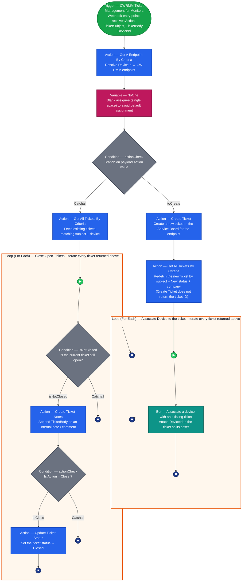

## Summary

The **CWRMM Ticket Management for Monitors** workflow automates the lifecycle of ConnectWise tickets based on JSON payloads received from a custom webhook trigger. Designed to work in tandem with advanced RMM monitoring scripts (such as Enhanced Drive Space, CPU, or Memory monitors), this workflow processes three primary actions: `Create`, `Close`, and `Comment`.

**How it works:**

1. A monitor script evaluates device telemetry and maintains a local state file.
2. If a threshold is breached or recovered, the script sends an HTTP POST request to the webhook URL containing the `Action`, `TicketSubject`, `TicketBody`, and `DeviceId`.
3. This workflow catches the webhook, looks up the endpoint, and executes the requested ticketing action.
4. On the `Create` path, the newly created ticket is re-fetched and the alerting device is attached to it by a custom bot.

**Device Association:** A native CW RMM workflow cannot associate a device with a ticket, and the **Create Ticket** action does not return the ID of the ticket it just created. The workflow therefore re-fetches the ticket by subject, `New` status and company, then loops over the result and calls the [Bots: Associate a device with an existing ticket](/docs/b98f159a-f34a-4c4c-8ff3-b89a0d003219) bot for each match. The bot accepts the ticket ID and the device ID and attaches the device as the ticket's asset.

**Duplicate Ticket Prevention:** This workflow does not verify if an open ticket already exists before creating a new one. The RMM monitor script calling the workflow is solely responsible for intelligently managing state and firing the `Create` action only once per incident to prevent duplicate tickets.

## Details

| Name | Description | Category tags | Trigger |
| ---- | ----------- | ------------- | ------- |
| CWRMM Ticket Management for Monitors | Automates ticket creation, device association, closure, and commenting for CW RMM monitors via webhook. | Ticketing | [CWRMM Ticket Management for Monitors](/docs/05c811e6-c6d0-4652-b4b6-2aa83f9605c7) |

## Dependencies

- [Triggers: CWRMM Ticket Management for Monitors](/docs/05c811e6-c6d0-4652-b4b6-2aa83f9605c7)
- [Custom Field: Ticket_Mgmt_Webhook_Url](/docs/8e55deb6-bef8-4501-9e64-7b25e7fcd1ab)
- [Bots: Associate a device with an existing ticket](/docs/b98f159a-f34a-4c4c-8ff3-b89a0d003219)
- [Forms: Associate a device with an existing ticket](/docs/45135ca2-b3f8-4d0e-9331-ef89768b487b)

The bot and its form must be installed and published before this workflow is imported. A workflow referencing a bot that does not exist in the environment cannot be saved.

## Workflow Setup Path

- **Tasks Path:** `Automation` ➞ `Workflows` ➞ `All Workflows`

## Usage Example

```PowerShell
$webhookUrl = 'https://webhook.xyz.net/sampleUrl'

$action = 'Create'
$ticketSubject = 'A Sample Ticket for {0}' -f $env:ComputerName
$ticketBody = 'This ticket is created to test the functionality of the trigger'

$deviceId = (Get-ItemProperty -Path 'HKLM:\SOFTWARE\WOW6432Node\ITSPlatform').privateendpointid

$payload = [ordered]@{
    Action        = $action
    TicketSubject = $ticketSubject
    TicketBody    = $ticketBody
    DeviceId      = $deviceId
}
$jsonPayload = $payload | ConvertTo-Json -Depth 2

Invoke-RestMethod -Uri $webhookUrl -Method Post -Body $jsonPayload -ContentType 'application/json'
```

## Component Used

*This workflow utilizes native ConnectWise RMM workflow actions, including:*

- **Webhook Trigger:** Catches incoming JSON payloads.
- **Get a Endpoint by Criteria:** Resolves the `$deviceId` to an endpoint.
- **Set Variable:** Used to define a blank assignee variable (`NoOne`).
- **Condition:** Branches logic based on the `$action` payload value.
- **Create Ticket:** Generates a new ticket on the specified Service Board.
- **Get All Tickets By Criteria:** Fetches existing tickets matching the subject and device. Used twice — once on the `Create` path to retrieve the ticket that was just created, and once on the `Close`/`Comment` path to find the tickets to act on.
- **Loop:** Iterates through fetched tickets to associate the device, or to apply notes or status updates.
- **Bot:** Calls the [Associate a device with an existing ticket](/docs/b98f159a-f34a-4c4c-8ff3-b89a0d003219) custom bot, which performs the one operation a native workflow action cannot.
- **Create Ticket Notes:** Appends the `$ticketBody` to an existing ticket.
- **Update Ticket Status:** Closes the ticket if the action is `Close`.

## Diagram

*End‑to‑end flow of the workflow. Every shape is annotated with what that node actually does, the arrows show execution order, and the edge labels (`toCreate`, `Catchall`, `isNotClosed`, `toClose`) mirror the configured condition branches. Colour coding matches the workflow builder (green = trigger, blue = action, teal = bot, magenta = variable, grey = condition, orange = loop container, green circle = start event, blue circle = branch/iteration stop).*



### Legend

- 🟩 **Trigger** – the webhook that catches the monitor payload (entry point).
- 🟦 **Action** – an API/operation step (endpoint lookup, ticket create, get tickets, add note, update status).
- 🟦 **Bot** (teal) – a custom RPA bot step; here it performs the device association a native action cannot.
- 🟪 **Variable** – sets a value used later (`NoOne` blank assignee).
- ◆ **Condition** (grey diamond) – a branch point; outgoing arrows are labelled with the branch taken.
- 🟧 **Loop (For Each)** – orange container; the steps inside repeat once per ticket returned by the preceding *Get All Tickets By Criteria*.
- 🟢 **Start event** (▶) – beginning of a loop iteration.
- 🔵 **Stop** (■) – end of a branch or of the current loop iteration (the loop then advances to the next ticket).

### How to read the two paths

- **`Action = Create`** → `actionCheck` takes the **toCreate** branch → *Create Ticket* → *Get All Tickets By Criteria* → enter the **Associate Device to the ticket** loop. For each ticket returned, the *Associate a device with an existing ticket* bot attaches the alerting device, then the iteration ends. (No duplicate check is performed here; the calling monitor script is responsible for firing `Create` only once per incident.)
- **`Action = Close` or `Comment`** → `actionCheck` takes the **Catchall** branch → *Get All Tickets By Criteria* → enter the **Close Open Tickets** loop. For each ticket: if it is already closed, the iteration ends (`isNotClosed` → Catchall); if it is open, *Create Ticket Notes* appends the body, then the inner `actionCheck` either closes it (*Update Ticket Status*, when `Action = Close`) or simply ends the iteration (when `Action = Comment`, the note alone is the desired outcome).

### Node Descriptions

1. **Trigger (CWRMM Ticket Management for Monitors):** The entry point. A webhook instance must be created here to generate the URL used by the monitoring scripts.
2. **Get A Endpoint By Criteria:** Retrieves the endpoint details in CW RMM using the `$deviceId` provided in the webhook payload.
3. **NoOne (Set Variable):** Sets a blank variable (a single space). This is passed to the "Assigned To" field in the Create Ticket action to prevent the ticket from defaulting to the workflow creator or any specific user.
4. **actionCheck (Condition):** Evaluates the `$action` payload property.
    - **If Action is 'Create':** Routes to the **Create Ticket** action. This generates a new ticket for the `$deviceId` using the `$ticketSubject` and `$ticketBody`.
    - **Catchall (Close/Comment):** Routes to the **Get All Tickets By Criteria** action to fetch existing tickets for the device matching the `$ticketSubject`.
5. **Get All Tickets By Criteria (Create path):** Re-fetches the ticket that was just created, filtered by the `$ticketSubject`, a status of `New`, and the company of the endpoint. This step exists because the **Create Ticket** action does not return the ID of the ticket it created, and the bot needs that ID.
6. **Associate Device to the ticket (Loop):** Iterates through the tickets returned by the previous action. In normal operation this is a single ticket.
7. **Associate a device with an existing ticket (Bot):** Calls the custom bot with the current ticket's ID and the `$deviceId` from the payload. The bot attaches the device to the ticket. It is safe if the same device is already associated — the run reports success and changes nothing.
8. **Close Open Tickets (Loop):** Iterates through all tickets returned by the Catchall branch.
9. **isNotClosed (Condition inside Loop):** Checks the status of the current ticket.
    - **If Closed/Resolved:** The loop skips to the next ticket.
    - **If Open:** Routes to **Create Ticket Notes**.
10. **Create Ticket Notes:** Adds the `$ticketBody` as an internal note or comment to the ticket.
11. **Check Action (Condition inside Loop):** Evaluates if `$action` equals 'Close'.
    - **If 'Close':** Routes to **Update Ticket Status**, which changes the ticket status to Closed.
    - **If 'Comment':** The loop moves to the next ticket, as the note has already been added.

## Sample Ticket

**Ticket Subject:**  
Enhanced Drive Space Monitoring - C - SERVER01 - 10 Percent

**Ticket Body:**  
Drive C has breached the free space threshold.

Total Space: 100 GB
Used Space: 90 %
Free Space: 10 %
Threshold: 10 %

>*(If the action is Close, the body will append: "Drive space has recovered and is now above the threshold. The ticket can be closed.")*

## Workflow Creation

Install the workflow from the `ProVal - Content` Community. The [Bots: Associate a device with an existing ticket](/docs/b98f159a-f34a-4c4c-8ff3-b89a0d003219) bot and its form must already be installed and published, otherwise the bot step cannot resolve. After installation, you must perform the following mandatory configuration steps:


### 1. Create the Webhook Instance

Webhook instances are environment-specific and cannot be migrated. You must create a new instance inside the trigger.


1. Open the workflow and click on the **Trigger** node.
2. Under **Webhook Trigger**, click **New Webhook Instance +**.
3. Name it `CWRMM Ticket Management for Monitors`.
4. **Copy the URL** generated for this instance.
5. **Mandatory:** Take this URL and set it as the default value for the [Ticket_Mgmt_Webhook_Url](/docs/8e55deb6-bef8-4501-9e64-7b25e7fcd1ab) custom field in CW RMM. Without this, your monitor scripts will not know where to send their payloads.

### 2. Configure the Create Ticket Action

The workflow installs with default options for ticket creation. You must update these to match your environment's Service Board and assignment rules.


1. Open the **Create Ticket** action node.
2. Update the **Service Board** to the correct board for your alerts.
3. Update the **Assigned To** field as required by your environment (by default, it passes the `NoOne` variable to leave it unassigned).
4. Save the workflow.

### 3. Verify the Device Association Steps

The `Create` branch retrieves the ticket it just created and then hands it to the bot. Both steps should be confirmed after import.

1. Open the **Get All Tickets By Criteria** action on the `toCreate` branch and confirm the criteria filter on the `$ticketSubject`, a status of `New`, and the company of the endpoint returned by *Get A Endpoint By Criteria*.
2. Open the **Associate a device with an existing ticket** bot node inside the *Associate Device to the ticket* loop and confirm the inputs are mapped:
    - **TicketId** ➞ the ID of the ticket in the current loop iteration.
    - **DeviceId** ➞ the `$deviceId` from the webhook payload.
3. Save the workflow.

**Primary Note: User Permissions**  
The workflow runs under the context of the user account that created it. Therefore, **the workflow must be created by a user account with access to all devices in the environment.**

If the creating user does not have permission to a specific machine, the workflow will fail to create or update tickets for that device, and monitoring will silently fail for that endpoint.

**Primary Note: Subject Uniqueness on the Create Path**  
The device is associated to every ticket returned by the **Get All Tickets By Criteria** step on the `Create` path. The `New` status and company filters normally narrow this to the single ticket just created, but if an earlier ticket with the same subject is still sitting in a `New` status for the same company, the device will be attached to that one as well. Keeping monitor subjects specific to the device and the condition, as in the [Sample Ticket](#sample-ticket) above, avoids this.

## Completed Screenshot


## Changelog

### 2026-09-03

- Added the device association steps to the `Create` branch: a **Get All Tickets By Criteria** action to retrieve the newly created ticket, and an **Associate Device to the ticket** loop that calls the *Associate a device with an existing ticket* bot for each match
- Added the bot and its form to the dependencies
- Updated the diagram, legend and node descriptions to cover the new branch

### 2025-07-23

- Initial version of the document
