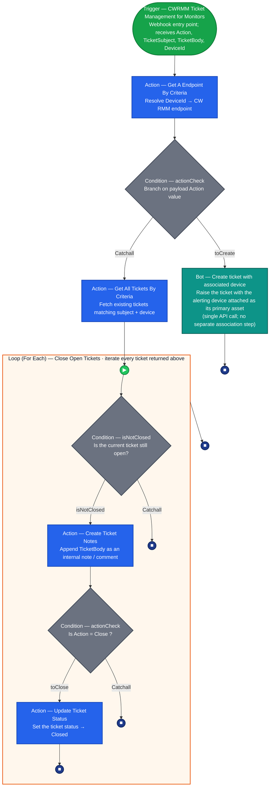

## Summary

The **CWRMM Ticket Management for Monitors** workflow automates the lifecycle of ConnectWise tickets based on JSON payloads received from a custom webhook trigger. Designed to work in tandem with advanced RMM monitoring scripts (such as Enhanced Drive Space, CPU, or Memory monitors), this workflow processes three primary actions: `Create`, `Close`, and `Comment`.

**How it works:**

1. A monitor script evaluates device telemetry and maintains a local state file.
2. If a threshold is breached or recovered, the script sends an HTTP POST request to the webhook URL containing the `Action`, `TicketSubject`, `TicketBody`, and `DeviceId`.
3. This workflow catches the webhook, looks up the endpoint, and executes the requested ticketing action.
4. On the `Create` path, a custom bot creates the ticket with the alerting device already attached, in a single API call.

**Device Association:** A native CW RMM workflow cannot associate a device with a ticket. The `Create` path therefore calls the [Bots: Create ticket with associated device](/docs/cf8a2c3d-456c-4567-8039-97e89f894ac5) bot in place of the native **Create Ticket** action, so the device travels in the same API call that raises the ticket. This matters beyond convenience: a device attached to a ticket by a separate follow-up call does not carry through to the configuration on the ticket once it syncs to CW Manage, while a device supplied in the original create call does.

Because the bot creates the ticket, the service board, team and priority for new tickets are set on the bot node rather than in a **Create Ticket** action — see [Configure the Bot Action](#2-configure-the-bot-action).

**Duplicate Ticket Prevention:** This workflow does not verify if an open ticket already exists before creating a new one. The RMM monitor script calling the workflow is solely responsible for intelligently managing state and firing the `Create` action only once per incident to prevent duplicate tickets.

## Details

| Name | Description | Category tags | Trigger |
| ---- | ----------- | ------------- | ------- |
| CWRMM Ticket Management for Monitors | Automates ticket creation, device association, closure, and commenting for CW RMM monitors via webhook. | Ticketing | [CWRMM Ticket Management for Monitors](/docs/05c811e6-c6d0-4652-b4b6-2aa83f9605c7) |

## Dependencies

- [Triggers: CWRMM Ticket Management for Monitors](/docs/05c811e6-c6d0-4652-b4b6-2aa83f9605c7)
- [Custom Field: Ticket_Mgmt_Webhook_Url](/docs/8e55deb6-bef8-4501-9e64-7b25e7fcd1ab)
- [Bots: Create ticket with associated device](/docs/cf8a2c3d-456c-4567-8039-97e89f894ac5)
- [Forms: Create ticket with associated device](/docs/8d147440-f887-4c21-8fc8-fb93c0d54c29)

The bot and its form must be installed and published before this workflow is imported. A workflow referencing a bot that does not exist in the environment cannot be saved. Importing the bot brings its form in with it, already attached.

## Workflow Setup Path

- **Tasks Path:** `Automation` ➞ `Workflows` ➞ `All Workflows`

## Usage Example

```PowerShell
$webhookUrl = 'https://webhook.xyz.net/sampleUrl'

$action = 'Create'
$ticketSubject = 'A Sample Ticket for {0}' -f $env:ComputerName
$ticketBody = 'This ticket is created to test the functionality of the trigger'

$deviceId = (Get-ItemProperty -Path 'HKLM:\SOFTWARE\WOW6432Node\ITSPlatform').privateendpointid

$payload = [ordered]@{
    Action        = $action
    TicketSubject = $ticketSubject
    TicketBody    = $ticketBody
    DeviceId      = $deviceId
}
$jsonPayload = $payload | ConvertTo-Json -Depth 2

Invoke-RestMethod -Uri $webhookUrl -Method Post -Body $jsonPayload -ContentType 'application/json'
```

## Component Used

*This workflow utilizes native ConnectWise RMM workflow actions, including:*

- **Webhook Trigger:** Catches incoming JSON payloads.
- **Get a Endpoint by Criteria:** Resolves the `$deviceId` to an endpoint.
- **Condition:** Branches logic based on the `$action` payload value.
- **Bot:** Calls the [Create ticket with associated device](/docs/cf8a2c3d-456c-4567-8039-97e89f894ac5) custom bot, which raises the ticket with the device attached. This replaces the native **Create Ticket** action, which cannot attach a device.
- **Get All Tickets By Criteria:** Fetches existing tickets matching the subject and device, on the `Close` / `Comment` path.
- **Loop:** Iterates through fetched tickets to apply notes or status updates.
- **Create Ticket Notes:** Appends the `$ticketBody` to an existing ticket.
- **Update Ticket Status:** Closes the ticket if the action is `Close`.

## Diagram

*End‑to‑end flow of the workflow. Every shape is annotated with what that node actually does, the arrows show execution order, and the edge labels (`toCreate`, `Catchall`, `isNotClosed`, `toClose`) mirror the configured condition branches. Colour coding matches the workflow builder (green = trigger, blue = action, teal = bot, grey = condition, orange = loop container, green circle = start event, blue circle = branch/iteration stop).*



### Legend

- 🟩 **Trigger** – the webhook that catches the monitor payload (entry point).
- 🟦 **Action** – an API/operation step (endpoint lookup, get tickets, add note, update status).
- 🟦 **Bot** (teal) – a custom RPA bot step; here it creates the ticket with the device attached, which no native action can do.
- ◆ **Condition** (grey diamond) – a branch point; outgoing arrows are labelled with the branch taken.
- 🟧 **Loop (For Each)** – orange container; the steps inside repeat once per ticket returned by *Get All Tickets By Criteria*.
- 🟢 **Start event** (▶) – beginning of a loop iteration.
- 🔵 **Stop** (■) – end of a branch or of the current loop iteration (the loop then advances to the next ticket).

### How to read the two paths

- **`Action = Create`** → `actionCheck` takes the **toCreate** branch → the *Create ticket with associated device* bot raises the ticket with the device attached → stop. (No duplicate check is performed here; the calling monitor script is responsible for firing `Create` only once per incident.)
- **`Action = Close` or `Comment`** → `actionCheck` takes the **Catchall** branch → *Get All Tickets By Criteria* → enter the **loop**. For each ticket: if it is already closed, the iteration ends (`isNotClosed` → Catchall); if it is open, *Create Ticket Notes* appends the body, then the inner `actionCheck` either closes it (*Update Ticket Status*, when `Action = Close`) or simply ends the iteration (when `Action = Comment`, the note alone is the desired outcome).

### Node Descriptions

1. **Trigger (CWRMM Ticket Management for Monitors):** The entry point. A webhook instance must be created here to generate the URL used by the monitoring scripts.
2. **Get A Endpoint By Criteria:** Retrieves the endpoint details in CW RMM using the `$deviceId` provided in the webhook payload. The company and site of that endpoint are passed to the bot on the `Create` path.
3. **actionCheck (Condition):** Evaluates the `$action` payload property.
    - **If Action is 'Create':** Routes to the **Create ticket with associated device** bot.
    - **Catchall (Close/Comment):** Routes to the **Get All Tickets By Criteria** action to fetch existing tickets for the device matching the `$ticketSubject`.
4. **Create ticket with associated device (Bot):** Creates the ticket using the `$ticketSubject` and `$ticketBody` from the payload, the company and site of the resolved endpoint, and the service board, team and priority configured on the node. The alerting device is attached as the ticket's primary asset in the same call. The bot returns the ticket ID and ticket number as result data.
5. **Close Open Tickets (Loop):** Iterates through all tickets returned by the Catchall branch.
6. **isNotClosed (Condition inside Loop):** Checks the status of the current ticket.
    - **If Closed/Resolved:** The loop skips to the next ticket.
    - **If Open:** Routes to **Create Ticket Notes**.
7. **Create Ticket Notes:** Adds the `$ticketBody` as an internal note or comment to the ticket.
8. **Check Action (Condition inside Loop):** Evaluates if `$action` equals 'Close'.
    - **If 'Close':** Routes to **Update Ticket Status**, which changes the ticket status to Closed.
    - **If 'Comment':** The loop moves to the next ticket, as the note has already been added.

## Sample Ticket

**Ticket Subject:**  
Enhanced Drive Space Monitoring - C - SERVER01 - 10 Percent

**Ticket Body:**  
Drive C has breached the free space threshold.

Total Space: 100 GB
Used Space: 90 %
Free Space: 10 %
Threshold: 10 %

>*(If the action is Close, the body will append: "Drive space has recovered and is now above the threshold. The ticket can be closed.")*

## Workflow Creation

Install the workflow from the `ProVal - Content` Community. The [Bots: Create ticket with associated device](/docs/cf8a2c3d-456c-4567-8039-97e89f894ac5) bot and its form must already be installed and published, otherwise the bot step cannot resolve. After installation, you must perform the following mandatory configuration steps:


### 1. Create the Webhook Instance

Webhook instances are environment-specific and cannot be migrated. You must create a new instance inside the trigger.


1. Open the workflow and click on the **Trigger** node.
2. Under **Webhook Trigger**, click **New Webhook Instance +**.
3. Name it `CWRMM Ticket Management for Monitors`.
4. **Copy the URL** generated for this instance.
5. **Mandatory:** Take this URL and set it as the default value for the [Ticket_Mgmt_Webhook_Url](/docs/8e55deb6-bef8-4501-9e64-7b25e7fcd1ab) custom field in CW RMM. Without this, your monitor scripts will not know where to send their payloads.

### 2. Configure the Bot Action

The bot creates the ticket, so the board, team and priority for new tickets are set on the bot node. The workflow installs with placeholder values that you must update to match your environment.


1. Open the **Bot** node on the `toCreate` branch and confirm the selected bot is **Create ticket with associated device**.
2. Set **ServiceBoard** to the board your alert tickets should be raised on. This field is required, and the value is the board name exactly as it appears in CW RMM.
3. Set **Priority** to the priority new alert tickets should carry. This field is also required, and again the value is the priority name.
4. Set **Team** to the team the ticket should be assigned to, or clear it to create the ticket with no assigned team. This field is optional.
5. Leave **DeviceId**, **CompanyId**, **SiteId**, **TicketSubject** and **TicketBody** as installed. They are already mapped to the webhook payload and the endpoint returned by *Get A Endpoint By Criteria*.
6. Leave **Allow Failure** unchecked, so a failed ticket creation surfaces as a workflow failure rather than passing silently.
7. Save the workflow.

> **Optional — bot activity logging:** The **CW PSA Ticket Id** field on the bot node writes the bot's own run activity to that ticket's internal notes and attachments. It is useful while validating the workflow, because it puts the bot's resolution steps and any failure detail somewhere readable. Leave it empty in normal operation.

**Primary Note: User Permissions**  
The workflow runs under the context of the user account that created it. Therefore, **the workflow must be created by a user account with access to all devices in the environment.**

If the creating user does not have permission to a specific machine, the workflow will fail to create or update tickets for that device, and monitoring will silently fail for that endpoint.

**Primary Note: Board, Team and Priority Names**  
The bot resolves the board, team and priority from the names entered on the node, so a name that does not match an active record in CW RMM fails the run. The failure message lists every valid name for that lookup, so a single failed run identifies the correct value. Teams are scoped to a service board, so the team must belong to the board configured above.

## Completed Screenshot


## Changelog

### 2026-09-07

- **Device Association:** The `Create` path now calls the [Bots: Create ticket with associated device](/docs/cf8a2c3d-456c-4567-8039-97e89f894ac5) bot in place of the native **Create Ticket** action, so the alerting device is attached in the same API call that raises the ticket. A device attached by a separate follow-up call does not carry through to the configuration on the CW Manage synced ticket, while a device supplied at creation does.
- **Removed Components:** The native **Create Ticket** action and the `NoOne` assignee variable are no longer part of the workflow.
- **Configuration Moved:** The service board, team and priority for new tickets are now set on the bot node instead of a **Create Ticket** action. See [Configure the Bot Action](#2-configure-the-bot-action).
- **New Dependencies:** Added the bot and its form, both of which must be installed and published before this workflow is imported.
- Updated the diagram, legend and node descriptions to match the new `Create` path.

### 2025-07-23

- Initial version of the document
