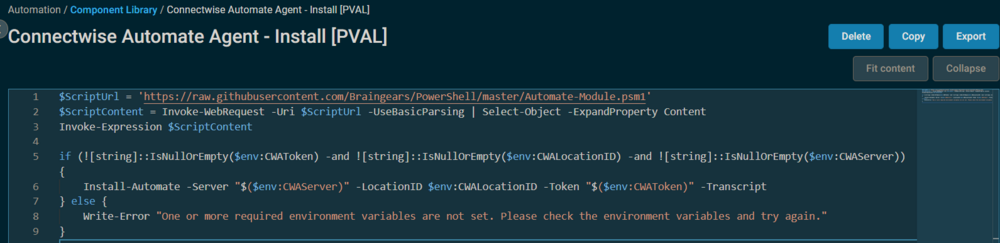
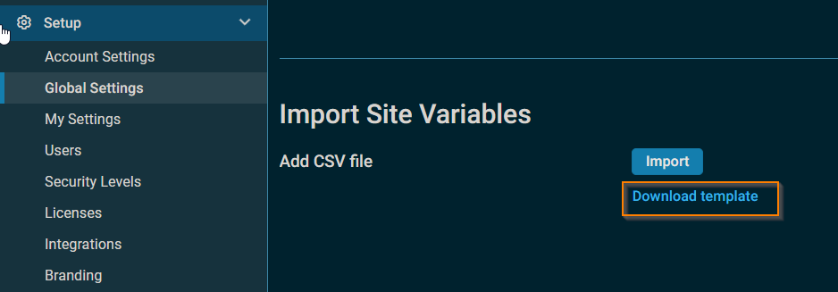

# Overview
This document describes how to install the Connectwise Automate agent based on site variables with configured settings.

# Implementation
Import the Connectwise Automate Agent - Install PVAL.cpt into the environment.

This component does not require any modifications, but it does require three site variables to function. If these variables are not present, the component will error out and log the error.



# Datto Site Variables

| Variable Name     | Example                           | Required | Description                                                                                       |
|-------------------|-----------------------------------|----------|---------------------------------------------------------------------------------------------------|
| `CWALocationID`   | `1659`                            | `True`   | `Use LocationID to install the Automate Agent directly to the appropriate client's location/site.` |
| `CWAToken`        | `4fe5d1e9fd571cedecaa8f988d75787d` | `True`   | `Use Token to install the Automate Agent directly to the appropriate client's location/site.`     |
| `CWAServer`       | `cwa.provaltech.com`             | `True`   | `URL to the Automate server. Do not include https://`                                           |

These settings must be configured for every required site.

# Bulk Import
Datto offers a solution for importing site variables in bulk to simplify the process.

[Datto RMM Global Settings](https://rmm.datto.com/help/de/Content/3NEWUI/Setup/GlobalSettings.htm)

One or more of the managed sites' existing variables can be modified, or new variables can be added by uploading the CSV template.

> **NOTE:** Sites with OnDemand devices cannot be updated with variables.



Use the pre-populated CSV template from the partner's Datto RMM portal. This template contains every site in the Datto RMM account. It is useful for quickly adding a single variable or for adding multiple variables at once to any number of sites. Complete the following steps to download, edit, and upload the site variables CSV template:

1. Click **Download Template**.
2. Open the CSV file you downloaded and add the following information:

| Field               | Description                                                                                                                        |
|---------------------|------------------------------------------------------------------------------------------------------------------------------------|
| Site ID             | The Site ID (site identifier) is hard-coded and cannot be changed or updated.                                                    |
| Site Name           | The name of your site. The name cannot be updated through the CSV file; however, it can be changed in [Site Settings - Legacy UI](https://rmm.datto.com/help/de/Content/4WEBPORTAL/Sites/SiteSettings.htm) in the legacy UI and in [Site Settings](https://rmm.datto.com/help/de/Content/3NEWUI/Sites/CreateASite.htm#Site_Settings) in the New UI. |
| Site Description    | The description of your site. The description cannot be updated through the CSV file; however, it can be changed in [Site Settings - Legacy UI](https://rmm.datto.com/help/de/Content/4WEBPORTAL/Sites/SiteSettings.htm) in the legacy UI and in [Site Settings](https://rmm.datto.com/help/de/Content/3NEWUI/Sites/CreateASite.htm#Site_Settings) in the New UI. |
| Variable Name       | Enter the name of the site variable. It can be a new variable or an already existing one. **NOTE:** This field is mandatory.     |
| Variable Value      | Enter the value of the variable. It can be a new value or an already existing one. Variable value limit: 20,000 characters. **NOTE:** This field is mandatory. |
| Variable is Hidden  | If you would like to mask the variable value, enter 1. If you would not like to mask the variable value, enter 0. **NOTE:** When adding a new variable and leaving this field blank, the variable value will not be masked. |

**NOTE:** The **variable_name** and **variable_value** fields in the CSV file are both mandatory for a site variable to be successfully imported.

3. Save the file in CSV format.
4. Click **Import**, and select the file you have just saved.
5. Click **Upload**, and you will see a message that the site variables uploaded successfully. Or, click **Cancel** to remove any selected file.

**NOTE:** The **Upload** button is grayed out until a valid CSV file is imported.

The variables will appear in the [Variables](https://rmm.datto.com/help/de/Content/3NEWUI/Sites/CreateASite.htm#Variables) section in [Site Settings](https://rmm.datto.com/help/de/Content/3NEWUI/Sites/CreateASite.htm#Site_Settings).

# Output
stdOut & stdError

Example:
```
.EXAMPLE
Transcript started, output file is C:/WINDOWS/Temp/Automate_Deploy.txt
Removing Existing Automate Agent...
The Automate Agent Uninstalled Successfully
Automate is NOT Installed
Installing Automate Agent to [https://cwa.provaltech.com](https://cwa.provaltech.com)
The Automate Agent Has Been Successfully Installed

ComputerName  : DEV-WIN11-1
ServerAddress : [https://cwa.provaltech.com|193.102.179.192](https://cwa.provaltech.com|193.102.179.192)
ComputerID    : 43998
ClientID      : 802
LocationID    : 1859
Version       : 240.146
InstFolder    : True
InstRegistry  : True
Installed     : True
Service       : Running
Online        : True
LastStatus    : 7

Transcript stopped, output file is C:/WINDOWS/Temp/Automate_Deploy.txt
```

