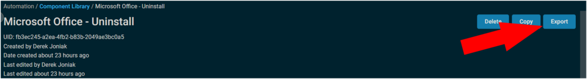
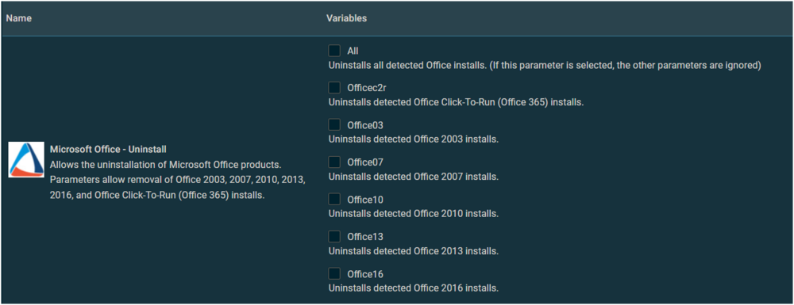

## Summary

This component will run the Office Scrub utility and remove all or specified Microsoft Office products.

## Dependencies

- [Invoke-Offscrub](https://proval.itglue.com/5078775/docs/7593306)

## Implementation

Export the component from ProVal's Datto RMM instance  
**Name:** Microsoft Office - Uninstall  
  
The export will download the necessary component (cpt) file.  
  
Import this component file into the partner's Datto RMM instance  
  

Proval Plug & Play: This component requires no configuration once imported.

## Usage

The component will prompt with several options during a job.  
Select the versions you wish to uninstall.  
  

## Output

A job status of Success is expected.  
  

A job status of expired may also occur. If expired is displayed, verification will be required to determine if the uninstall was successful.  

**StdOut**  
StdOut is not expected  

**StdErr**  
StdErr is not expected  

