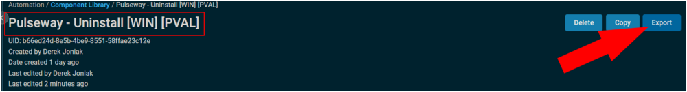
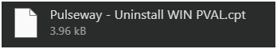
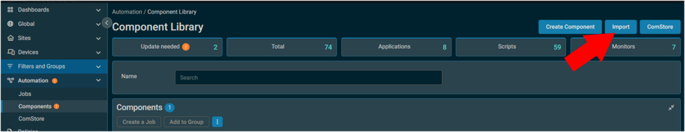

## Summary

Performs an automated uninstallation of Pulseway, with additional cleanup steps.

## Implementation

Export the component from ProVal's Datto RMM instance  
**Name:** Pulseway - Uninstall [WIN] [PVAL]  
  
The export will download the necessary component (cpt) file.  
  
Import this component file into the partner's Datto RMM instance  
  

Proval Plug & Play: This component requires no configuration once imported.

## Output

A job status of Success is expected.  
  

**StdOut**  
  

**StdErr**  
StdErr is not expected.

