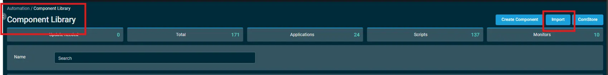
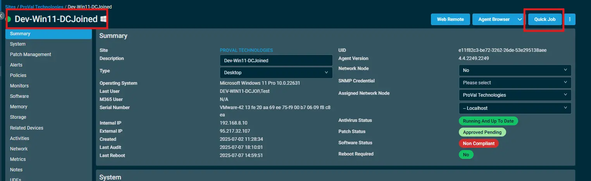
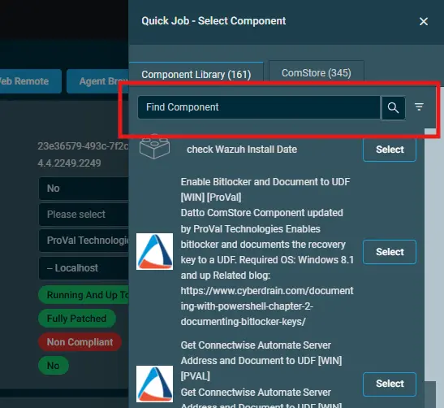

# Overview

# Dependencies

# Implementation  

1. Download the component `<Component name with the link to download it.>` from the attachments.

2. After downloading the attached file, click on the `Import` button
3. Select the component just downloaded and add it to the Datto RMM interface.  
  

## Sample Run

To execute the `component` over a specific machine, follow these steps:  

1. Select the machine you want to run the `component` on from the Datto RMM.  

2. Click on the `Quick Job` button.  
  

3. Search the component `<Name of the Component>` and click on `Select`
 

4. `<Screenshot of Sample run with variable details and example>`

# Datto Variables

| Variable Name | Type | Default | Description |
| ------------- | ---- | ------- | ----------- |

# Output

# Attachments