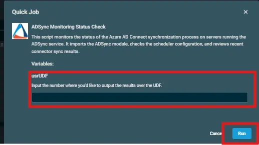

## Overview  
This script monitors the status of the Azure AD Connect synchronization process on servers running the ADSync service. It imports the ADSync module, checks the scheduler configuration, and reviews recent connector sync results.

## Implementation  

1. Download the `component` [ADSync Monitoring Status Check](../../../static/attachments/ADSync%20Monitoring%20Status%20Check.cpt) from the attachment.

2. After downloading the attached file, click on the `Import` button
3. Select the component just downloaded and add it to the Datto RMM interface.  
  

## Sample Run

To execute the `component` over a specific machine, follow these steps:  

1. Select the machine you want to run the `component` on from the Datto RMM.  

2. Click on the `Quick Job` button.  
  

3. Search the component `ADSync Monitoring Status Check` and click on `Select`
 

4. After selecting the `component`, you will notice a below pop-up to define a UDF.  
5. Input the `ID of the UDF` to populate the data upon, and then click on `Run`.  

## Datto Variables

| Variable Name | Type | Default | Description |
| ------------- | ---- | ------- | ----------- |
|usrUDF|String||Input the number where you'd like to output the results over the UDF.|
## Output  
- stdOut  
- stdError  

## Attachments  

[ADSync Monitoring Status Check](../../../static/attachments/ADSync%20Monitoring%20Status%20Check.cpt)