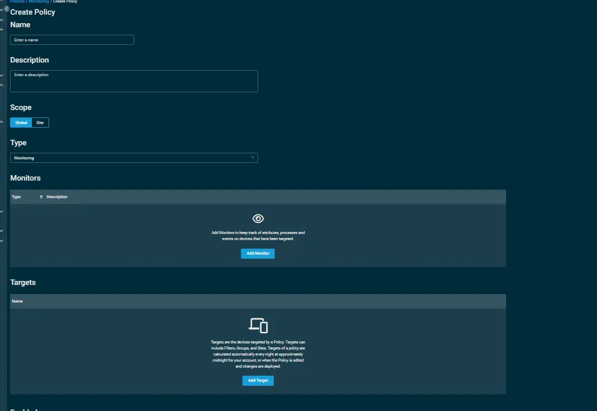
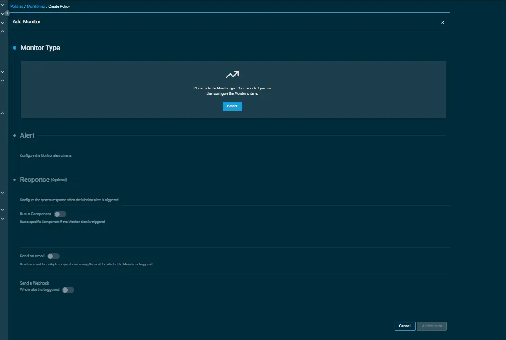
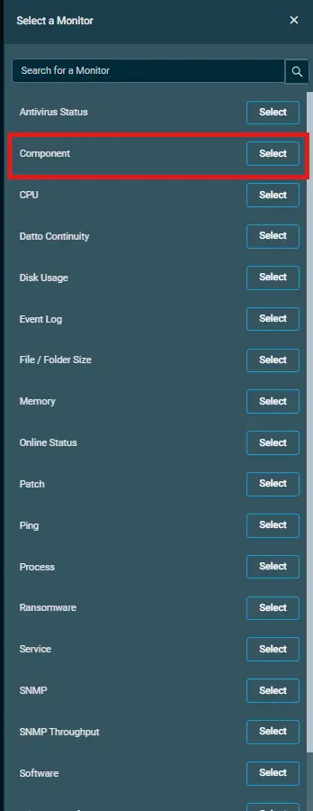
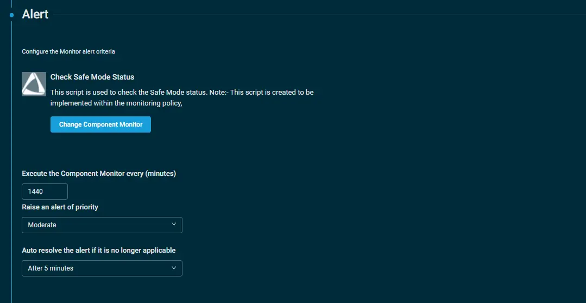
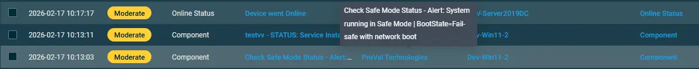

## Overview  
This script is designed to monitor and detect whether the system is currently running in Safe Mode. It evaluates the system boot state and generates an alert if Safe Mode is detected.

**Note:** This script is specifically developed for implementation within a monitoring policy.

## Implementation  

1. Download the component [Check Safe Mode Status](../../../static/attachments/Check%20Safe%20Mode%20Status.cpt) from the attachments.

2. After downloading the attached file, click on the `Import` button
3. Select the component just downloaded and add it to the Datto RMM interface.  
  

## Sample Run

To implement the `component` over a policy, follow these steps:  
1. Under the `Policies` > `Monitoring` section, click on create policy.  

    - State the name of the policy `Check Safe Mode Status` 
    - Provide the description.  
    -  State the Scope of the policy.  
      

     - Within the Monitors section, click on `Add Monitor`.  
         

    - Under the `Monitor Type`, click on `Select` and then select the `Component`option.  
.  

    -  Inorder to configure your `component` via alerting, follow the below steps:  
        - Click on `Select a Component Monitor` and then select  
           the component `Check Safe Mode Status` from the search bar.  
        -  Set the interval to `execute the component monitor`.  
        - Select the `priority to raise an alert`.  
        - Select the time to `auto resolve the alert`.
            

3. Click on `Add Target` to provide the targeted machines.  
4. Click on `Save and Deploy Now` to save the policy.

## Output  

`stdOut`  
Once the monitoring is configured and the machine is in safe mode then you'll recieve the alerts in the following state over the `Global` > `Alerts` section.  

`stdError`  
StdErr is not expected.

## Attachments  

[Check Safe Mode Status](../../../static/attachments/Check%20Safe%20Mode%20Status.cpt)

## Changelog

### 2026-02-18

- Initial version of the document
