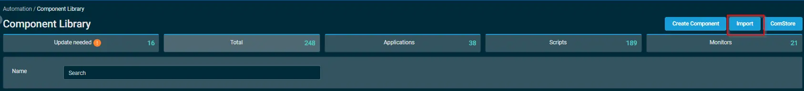
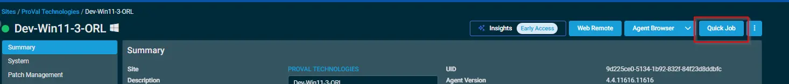
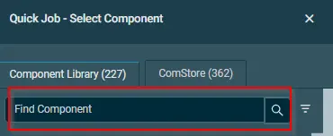
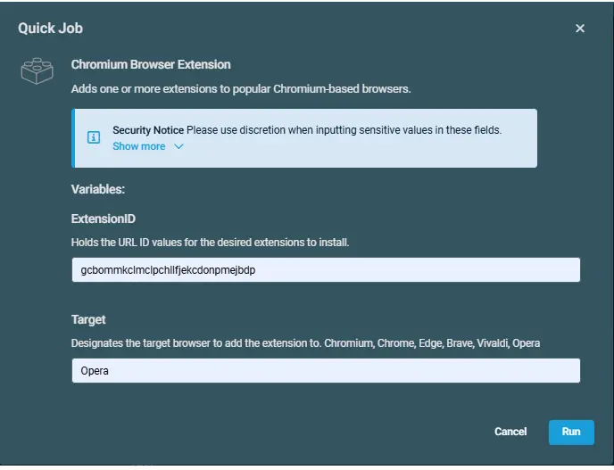

## Overview

This script is used to register and install Chromium-based browser extensions. It supports the following browsers: Google Chrome, Microsoft Edge, Chromium, Brave, Vivaldi, and Opera.

## Dependencies

- [Agnostic Script - Register-ChromiumExtension](/docs/481992c0-adcd-4275-bd5c-aa59fd4a7b17)

## Implementation  

1. Download the component `Chromium Browser Extension` from the attachments.

2. After downloading the attached file, click on the `Import` button
3. Select the component just downloaded and add it to the Datto RMM interface.  
  

## Sample Run

To execute the `Chromium Browser Extension` over a specific machine, follow these steps:  

1. Select the machine you want to run the `Chromium Browser Extension` on from the Datto RMM.  

2. Click on the `Quick Job` button.  
  

3. Search the component `Chromium Browser Extension` and click on `Select`
 

4. 

## Datto Variables

| Variable Name | Type | Default | Description |
| ------------- | ---- | ------- | ----------- |
| ExtensionID | String | -- | Holds the URL ID values for the desired extensions to install. |
| Target | String | -- | Designates the target browser to add the extension to. Chromium, Chrome, Edge, Brave, Vivaldi, Opera |

## Output

Activity log

## Attachments  

[Chromium Browser Extension](../../../static/attachments/chromiumbrowserextension.cpt)

## Changelog
 
### 2026-06-19
 
- Initial version of the document.
