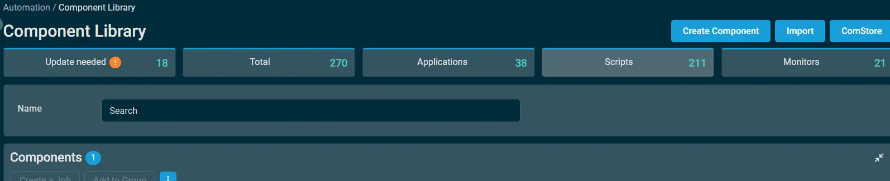
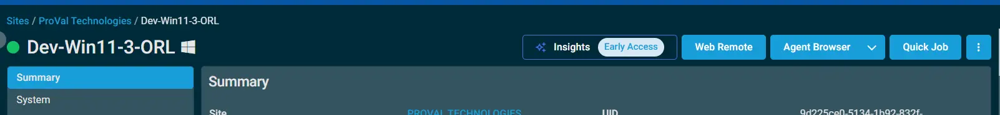
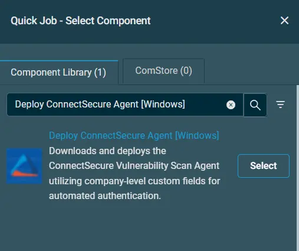
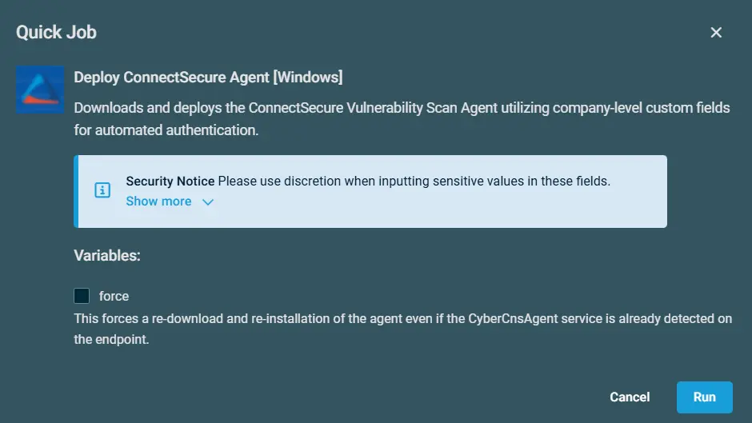

## Overview

The script performs an installation of the ConnectSecure Vulnerability Scan Agent by securely retrieving the latest installer, executing a silent installation, and registering the endpoint using the provided authentication parameters. It then validates the installation to ensure the agent has been successfully deployed.

The implementation is designed for automated deployment, supports secure content delivery through code-signature validation, and helps ensure endpoints are onboarded to the ConnectSecure platform for continuous vulnerability assessment and security monitoring.

## Implementation

1. Download the component `Deploy ConnectSecure Agent [Windows]` from the attachments.

2. After downloading the attached file, click on the `Import` button
3. Select the component just downloaded and add it to the Datto RMM interface.  
  

## Sample Run

To execute the `Deploy ConnectSecure Agent [Windows]` over a specific machine, follow these steps:  

1. Select the machine you want to run the `Deploy ConnectSecure Agent [Windows]` on from the Datto RMM.  

2. Click on the `Quick Job` button.   
  

3. Search the component `Deploy ConnectSecure Agent [Windows]`  
 

4. Click on `Select` and then `Run`  
 

## Site Variables

| Name | Value |
| ---- | ------- |
| cpvalConnectSecureCompanyId | e.g,`123456` |
| cpvalConnectSecureTenantId | e.g, `1234567890` |
| cpvalConnectSecureUserSecret | e.g, `uiohwfnuhfwfwf15fwfg5fereerfrger56545` |

## Datto Variables

| Variable Name | Type | Default | Description |
| ------------- | ---- | ------- | ----------- |
| Force | Boolean |`False`| This forces a re-download and re-installation of the agent even if the CyberCnsAgent service is already detected on the endpoint. |

## Output

- Activity log

## Attachments  

[deploy-connectsecure-agent-windows](../../../static/attachments/deploy-connectsecure-agent-windows.cpt)

## Changelog
 
### 2026-07-02
 
- Initial version of the document
